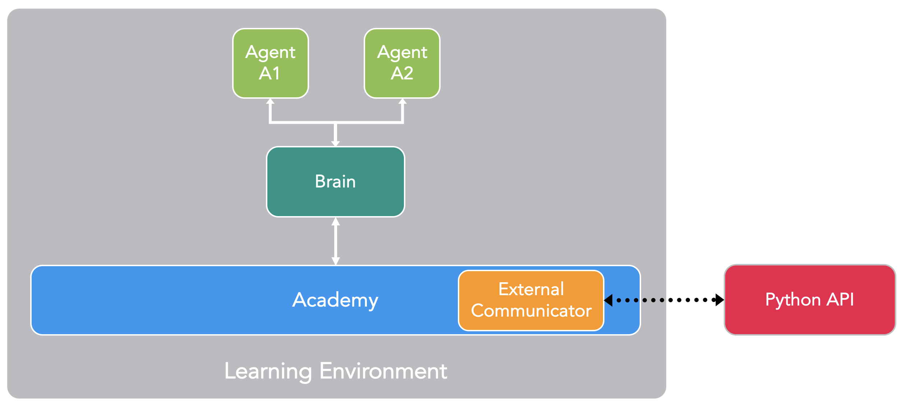
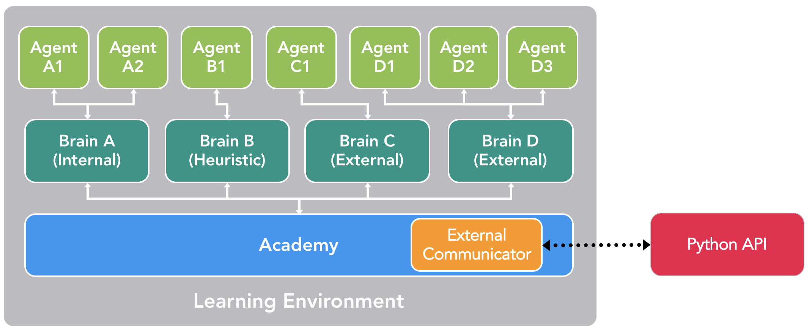

# ML-Agents 概述

**Unity Machine Learning Agents** (ML-Agents) 是一款开源的 Unity 插件，使我们得以在游戏和其它模拟环境中训练智能的 agent。您可以使用 reinforcement learning（强化学习）、
imitation learning（模仿学习）、neuroevolution（神经进化）或其他机器学习方法
通过简单易用的 Python API 对 Agent 进行训练。我们还提供最先进算法的实现方式（基于
TensorFlow），让游戏开发者和业余爱好者能够轻松地
训练用于 2D、3D 和 VR/AR 游戏的智能 agent。
这些经过训练的 agent 可用于多种目的，
包括控制 NPC 行为（采用各种设置，
例如多个 agent 和对抗）、对游戏内部版本进行自动化测试
以及评估不同游戏设计决策的预发布版本。ML-Agents 对于游戏开发者和 AI 研究人员双方
都有利，因为它提供了一个集中的平台，
可以在 Unity 的丰富环境中评估 AI 的进步情况，
然后提供给更广泛的研究和游戏开发者社区。

根据您的背景（如研究人员、游戏开发人员、业余爱好者），
您现在可能在脑海中会有非常不同的问题。
为了让您更轻松地过渡到 ML-Agents，
我们提供了多个后台页面，其中包括有关
[Unity 引擎](/docs/Background-Unity.md)、
[机器学习](/docs/Background-Machine-Learning.md)和
[TensorFlow](/docs/Background-TensorFlow.md) 的概述和有用资源。如果您不熟悉 Unity 场景，不了解基本的机器学习概念，或者以前没有听说过 TensorFlow，**强烈**建议您浏览相关的背景知识页面。

此页面的其余部分深入介绍了 ML-Agents、包括其重要组件、
支持的不同的训练模式以及这些训练模式对应的应用场景。读完后
您应该对 ML-Agents 的_功能_有一个很好的了解。随后的文档页面
提供了 ML-Agents _用法_的示例。

## 运行示例：训练 NPC 行为

为了帮助解释此页面中的材料和术语，我们将通篇使用一个
虚构的运行示例。我们将探讨
在游戏中训练非玩家角色 (NPC) 行为的问题。
（NPC 是一个永远不受人类玩家控制的游戏角色，
其行为由游戏开发者预先定义。）更具体地说，
我们假设我们正在开发一个由玩家控制士兵的多玩家战争主题
游戏。在此游戏中，我们有一名担任军医的 NPC，他会负责寻找
和恢复受伤的玩家。最后，我们假设有两支军队，
每支军队有五名队员和一名 NPC 军医。

军医的行为相当复杂。此角色首先需要避免受伤，
因此需要检测何时处于危险之中并转移至安全
位置。其次，此角色需要了解其队员中哪些人受伤
而需要帮助。如果多人受伤，则需要评估受伤程度
并决定首先帮助哪个伤者。最后，
一名优秀的军医总能把自己置于一个可以快速帮助队员的
位置。符合所有这些特征意味着军医需要在任何情况下
测量环境的若干属性（例如，队员位置、
敌人位置、哪一名队员受伤以及受伤程度），
然后决定采取的行动（例如，躲避敌人的火力、
前往帮助其队员之一）。鉴于环境中存在有大量的可变参数
以及军医可以采取的大量可能的行动，
手工定义和实现此类复杂的行为极具挑战性，
并且很容易出错。

凭借 ML-Agents，您可以使用各种方法来_训练_这类 NPC
（称为 **agent**）的行为。基本理念很简单。
我们需要在游戏（称为**环境**）的每个时刻定义
三个实体：
- **观测** - 军医对环境的感知。
观测可以是数字和/或视觉形式。数字观测会从 agent 的角度
测量环境的属性。对于
我们的军医来说，这将是军医可以看到的战场属性。
根据游戏和 agent 的不同，数字观测的数据可以是_离散_的
或_连续_的形式。对于大多数有趣的环境，agent 将需要若干连续的
数字观测，而对于具有少量独特配置的简单环境，
离散观测就足够了。
另一方面，视觉观测是附加到 agent 的摄像头
所生成的图像，代表着 agent 在该时间点看到的
内容。我们通常会将 agent 的观测与环境（或游戏）的
**状态**混淆。环境状态表示包含所有游戏角色的
整个场景的相关信息。但是，agent 观测
仅包含 agent 了解的信息，通常是
环境状态的一个子集。例如，军医观测不能包括
军医不知道的隐身敌人的信息。
- **动作** - 军医可采取的动作。与观测
类似，根据环境和 agent 的复杂性，
动作可以是连续的或离散的。就军医而言，
如果环境是一个只是基于位置的简单网格世界，
那么采用四个值（东、西、南、北）之一的离散动作
就足够了。但是，如果环境更加复杂并且军医可以
自由移动，那么使用两个连续动作（一个对应于方向，
另一个对应于速度）更合适。
- **奖励信号** - 一个表示军医行为的标量值。
请注意，不需要在每个时刻都提供奖励信号，
只有在军医执行好的或坏的动作时
才提供。例如，军医在死亡时会得到很大的负奖励，
每当恢复受伤的队员时会得到适度的正奖励，
而在受伤队员因缺乏救助而死亡时
会得到适度的负奖励。请注意，奖励信号表示如何将任务的目标
传达给 agent，所以采用的设置方式需要确保当获得的奖励达到最大值时，agent能够产生我们最期望的行为。

在定义这三个实体（**reinforcement learning（强化学习）任务**
的模块）之后，我们现在可以
_训练_军医的行为了。为此需要通过许多试验来
模拟环境，随着时间的推移，通过最大化未来奖励，
使军医能够针对每次的观测学会采取
最佳的动作。关键在于，军医学习能够使奖励得到最大值的动作的过程，
便是在学习使自己成为一名优秀军医（即拯救最多生命的
军医）的过程。在 **reinforcement learning（强化学习）**
技术中，所学习的行为称为 **policy**，
我们想学习的 policy 本质上是一个从每个可能的观测到该观测下最优动作的映射。请注意，
通过运行模拟来学习 policy 的过程被称为
**训练阶段**，而让 NPC 使用其学习到的 policy
玩游戏的过程被称为**预测阶段**。

ML-Agents 提供了所有必要工具，从而使我们得以利用 Unity 作为
模拟引擎来学习 Unity 环境中不同对象的 policy。
在接下来的几节中，我们将讨论 ML-Agents 如何实现这一目的以及
它所提供的功能有什么。

## 主要组件

ML-Agents 是一个 Unity 插件，它包含三个高级组件：
* **学习环境** - 其中包含 Unity 场景和所有游戏
角色。
* **Python API** - 其中包含用于训练（学习某个行为或 policy）的
所有机器学习算法。请注意，
与学习环境不同，Python API 不是 Unity 的一部分，而是位于外部
并通过 External Communicator 与 Unity 进行通信。
* **External Communicator** - 它将 Unity 环境与 Python API
连接起来。它位于 Unity 环境中。

    

_ML-Agents 的简化框图。_

学习环境包含三个可帮助组织 Unity 场景的
附加组件：
* **Agent** - 它可以被附加到一个 Unity 游戏对象上（场景中的
任何角色），负责生成它的观测结果、执行它接收的动作
并适时分配奖励（正/负）。
每个 Agent 只与一个 Brain 相关联。
* **Brain** - 它封装了 Agent 的决策逻辑。
实质上，Brain 中保存着每个 Agent 的 policy，
决定了 Agent 在每种情况下应采取的动作。更具体地说，
它是从 Agent 接收观测结果和奖励并返回动作的
组件。
* **Academy** - 它指挥 agent 的观测和决策过程。
在 Academy 内，可以指定若干环境参数，
例如渲染质量和环境运行速度参数。
External Communicator 位于 Academy 内。

每个学习环境都会有一个全局的 Academy ，与每一个游戏角色一一对应的多个 Agent。虽然每个 Agent 必须与一个 Brain 相连，
但具有相似观测和动作的多个 Agent 可关联到
同一个 Brain。在我们的示例游戏中，我们有两个各自拥有
自己军医的军队。因此，在我们的学习环境中将有两个 Agent，
每名军医对应一个 Agent，但这两个军医都可以关联到同一个 Brain。
请注意，这两个军医与同一个 Brain 相连的原因是，他们的观测和动作_空间_
是相似的。这并不意味着在每种情况下
他们都会有相同的观测和动作_值_。换句话说，
Brain 定义了所有可能的观测和动作的空间，
而与之相连的 Agent（在本示例中是指军医）可以各自拥有
自己独特的观测和动作值。如果我们将游戏
扩展到包含坦克驾驶员 NPC，那么附加到这些角色的
Agent 不能与连接到军医的 Agent 共享一个 Brain（军医和驾驶员
有不同的动作）。

    

_示例游戏的 ML-Agents 的示例框图。_

我们尚未讨论 ML-Agents 如何训练行为以及 Python API 和
External Communicator 的作用。在我们深入了解这些细节之前，
让我们总结一下先前的组件。每个游戏角色上附有一个 Agent，
而每个 Agent 都连接到一个 Brain。Brain 从 Agent 处接收观测结果和奖励并返回动作。Academy 除了能够控制环境参数之外，还可确保所有 Agent 和 Brain 都处于同步状态。那么，Brain 如何控制 Agent 的动作呢？

实际上，我们有四种不同类型的 Brain，它们可以实现广泛的训练和预测情形：
* **External** - 使用 Python API 进行决策。这种情况下，
Brain 收集的观测结果和奖励通过 External Communicator
转发给 Python API。Python API 随后返回 Agent 需要采取的相应动作。
* **Internal** - 使用嵌入式
[TensorFlow](/docs/Background-TensorFlow.md) 模型进行决策。
嵌入式 TensorFlow 模型包含了学到的 policy，Brain 直接使用
此模型来确定每个 Agent 的动作。
* **Player** - 使用键盘或控制器的实际输入进行
决策。这种情况下，人类玩家负责控制 Agent，由 Brain 收集的
观测结果和奖励不用于控制 Agent。
* **Heuristic** - 使用写死的逻辑行为进行决策，目前市面上大多数游戏角色行为都是这么定义的。这种类型有助于调试
具有写死逻辑行为的 Agent。也有助于把这种由写死逻辑指挥的 Agent 与
训练好的 Agent 进行比较。在我们的示例中，一旦我们
为军医训练了 Brain，我们便可以为一个军队的军医分配
经过训练的 Brain，而为另一个军队的军医分配具有写死逻辑行为的
Heuristic Brain。然后，我们可以评估哪个军医的效率更高。

根据目前所述，External Communicator 和 Python API 似乎
只能由 External Brain 所用。实际并非如此。
我们可以配置 Internal、Player 和 Heuristic 类型的 Brain，
使它们也能通过 External Communicator（一种称为 _broadcasting_ 的功能）
将观测结果、奖励和动作发送给 Python API。我们很快就会
看到，这样可以实现其他的训练模式。

    

_一个包含多个 Agent 和 Brain 的场景的
可能配置示例。_

## 训练模式

鉴于 ML-Agents 的灵活性，我们可以通过多种方式进行训练
和预测。

### 内置的训练和预测

如前所述，ML-Agents 附带了多种用于训练智能 agent 的
最先进算法的实现。在此模式下，
Brain 类型在训练期间设置为 External，在预测期间设置为 Internal。
更具体地说，在训练期间，场景中的所有军医
通过 External Communicator 将他们的观测结果发送到 Python API
（这是采用 External Brain 时的行为）。Python API 会处理这些观测结果并发回
每个军医要采取的动作。在训练期间，这些动作大多是
探索性的，旨在帮助 Python API 学习每位军医的
最佳 policy。训练结束后，便可导出每个军医
所学的 policy。由于我们所有的实现都基于 TensorFlow，
因此所学的 policy 只是一个 TensorFlow 模型文件。然后在预测阶段，
我们将 Brain 类型切换为 Internal，并加入从训练阶段
生成的 TensorFlow 模型。现在，在预测阶段，军医
仍然继续生成他们的观测结果，但不再将结果发送到
Python API，而是送入他们的嵌入了的 TensorFlow 模型，
以便生成每个军医在每个时间点上要采取的_最佳_动作。

总结一下：我们的实现是基于 TensorFlow 的，因此，
在训练期间，Python API 使用收到的观测结果来学习
TensorFlow 模型。然后在预测过程中该模型将嵌入到
Internal Brain 中，以便为连接到该 Brain 的所有 Agent 生成
最佳动作。**请注意，我们的 Internal Brain 目前是实验性的，
因为它仅限于 TensorFlow 模型并会利用第三方
[TensorFlowSharp](https://github.com/migueldeicaza/TensorFlowSharp)
 库。**

[3D Balance Ball 示例入门](Getting-Started-with-Balance-Ball.md)
教程使用 **3D Balance Ball** 示例环境介绍了此训练模式。

### 自定义训练和预测

先前的模式中使用 External Brain 类型进行训练，
从而生成 Internal Brain 类型可以理解和使用的 TensorFlow
模型。然而，ML-Agents 的任何用户都可以利用自己的算法
进行训练和预测。在这种情况下，训练阶段和预测阶段
的 Brain 类型都会设置为 External，并且场景中所有 Agent 的行为
都将在 Python 中接受控制。

我们目前没有教程介绍这种模式，但您可以在[这里](/docs/Python-API.md)
了解有关 Python API 的更多信息。

### Curriculum Learning（课程学习）

此模式是_内置训练和预测_的扩展，
在训练复杂环境中的复杂行为时特别
有用。Curriculum learning（课程学习）是一种训练机器学习模型
的方式，这种训练方式会逐渐引入问题较难理解的方面，
使该模型总是受到最佳挑战。这种思路已经存在了
很长一段时间，这也是我们人类通常学习的方式。比如
任何童年时期的初等教育，课程和主题都会
进行排序。例如，先教算术，再教代数。
同样，先教代数，再教微积分。前期课程中学到的技能和知识为
后期的课程提供了基础。机器学习
也是同样的道理，对较简单任务的训练可以为将来
较难的任务提供基础。

    

_数学课程的示例。从简单主题到复杂主题的课程进度安排，
后一个课程基于前一个课程。_

当我们考虑 reinforcement learning（强化学习）的实际原理时，
学习信号是在整个训练过程中偶尔收到的奖励。
训练 agent 完成此任务时的起点将是一个
随机 policy。该起始 policy 将使 agent 随意转圈，
这样的行为在复杂环境中可能永远不会获得奖励或极少
获得奖励。因此，通过在训练开始时简化环境，
我们可让 agent 将随机 policy 快速更新为更有意义的 policy，
即，随着环境逐渐复杂化，policy 也会不断
改进。在我们的示例中，我们可以考虑当每个队只包含一个
玩家时，首先训练军医，然后再反复增加玩家人数
（即环境复杂度）。ML-Agents 支持在
Academy 内设置自定义环境参数。因此，
可以根据训练进度动态调整与难度或复杂性相关的
环境要素（比如游戏对象）。

[使用 Curriculum Learning（课程学习）进行训练](/docs/Training-Curriculum-Learning.md)
教程使用 **Wall Area** 示例环境介绍了此训练模式。

### Imitation Learning（模仿学习）

简单地展示我们希望 agent 执行的行为，
而不是试图通过试错法来让它学习，这种方式
通常会更直观。例如，这种模式不是通过
设置奖励功能来训练军医，而是通过游戏控制器提供军医
应该如何表现的示例。更具体地说，
在这种模式下，训练期间的 Brain 类型设置为 Player，
并且所有使用控制器执行的动作（不仅包括 agent 观测）
都将被记录并发送到 Python API。imitation learning（模仿学习）
算法随后将会使用这些来自人类玩家的观测结果以及他们对应的动作来
学习 policy。

[使用 Imitation Learning（模仿学习）进行训练](/docs/Training-Imitation-Learning.md)教程
使用 **Banana Collector** 示例环境介绍了此训练模式。

## 灵活的训练方案

虽然迄今为止的讨论都主要集中在使用 ML-Agents 对单个 agent 进行训练
方面，但同时实现多种训练方案也是可能的。
我们很高兴看到社区创建了许多新奇而有趣的
环境。刚开始训练智能 agent 的新用户可以参考以下一些示例
来获得灵感：
* 单 Agent。与单个 Brain 相连的单个 Agent，拥有自己的奖励
信号。这是传统的 agent 训练方式。一个示例是
任何单人游戏，比如 Chicken。
[视频链接](https://www.youtube.com/watch?v=fiQsmdwEGT8&feature=youtu.be)。
* 同步单 Agent。与单个 Brain 相连的多个独立 Agent，
具有独立奖励信号。传统训练方案的
并行版本，这可以加速和稳定训练
过程。当您在一个环境中拥有同一角色的多个版本
而这些角色版本应该学习类似行为时，这很有用。一个可能的示例是训练
十二个机械臂同时打开一扇门。
[视频链接](https://www.youtube.com/watch?v=fq0JBaiCYNA)。
* 对抗性自我模拟。与单个 Brain 相连的两个相互作用的 Agent，
具有反向奖励信号。在双人游戏中，对抗性自我模拟
可以让 agent 变得越来越熟练，同时始终拥有完美匹配的
对手：自身。这是训练 AlphaGo 时采用的策略，
最近被 OpenAI 用于训练一种人类对战的 1 比 1 Dota 2 agent。
* 协作性多 Agent。与单个或多个不同 Brain 相连的多个相互作用的 Agent，具有共享的奖励信号。在此方案中，所有 agent 必须共同完成一项不能单独完成的任务。示例包括这样的环境：每个 agent 只能访问部分信息，并且需要共享这些信息才能完成任务或协作解决难题。
* 竞争性多 Agent。与单个或多个不同 Brain 相连的多个
相互作用的 Agent，具有反向奖励信号。在此
方案中，agent 必须相互竞争才能赢得比赛，
或获得一些有限的资源。所有的团队运动都属于
这种情况。
* 生态系统。与单个或多个不同 Brain 相连的多个
相互作用的 Agent，具有独立奖励信号。这种方案可以
看成是创造一个小世界，在这个小世界中，拥有不同目标的动物
都可以相互影响，比如可能有斑马、大象和长颈鹿的稀树草原，
或者城市环境中的自动驾驶模拟。

## 其他功能

除了提供灵活的训练方案外，ML-Agents 还
包含其他功能，可用于提高训练过程的灵活性和
解释能力。

* **按需决策** - 使用 ML-Agents 可以让 agent 仅在需要时
才请求决策，而不是在环境的每一步都
请求决策。这种方案可用于训练基于回合的游戏、
agent 必须对事件作出反应的游戏，
或 agent 可以采取持续时间不同的动作
的游戏。在每一步决策与按需决策之间切换
只需点击一下按钮即可实现。您可以在
[此处](/docs/Learning-Environment-Design-Agents.md#on-demand-decision-making)了解更多关于按需决策功能的
信息。

* **记忆增强 Agent** - 在某些情况下，
agent 必须学会记住过去才能做出
最好的决策。当 agent 只能部分观测环境时，
跟踪过去的观测结果可以帮助 agent 学习。我们在
教练中提供了一种_长短期记忆_
([LSTM](https://en.wikipedia.org/wiki/Long_short-term_memory))
 的实现，使 agent 能够存储要在未来步骤中
使用的记忆。您可以在
[此处](/docs/Feature-Memory.md)了解有关在训练中启用 LSTM 的更多信息。

* **监控 Agent 的决策过程** - 由于 ML-Agents 中的通信
是双向通道通信，因此我们在 Unity 中提供了一个 agent Monitor 类，
这个类可以显示经过训练的 agent 的各个方面，
例如 agent 对自己在 Unity 环境中的表现（称为**价值估算**）
的感知。通过利用作为可视化工具的 Unity 并实时提供
这些输出，研究人员和开发人员可以更轻松地
调试 agent 的行为。您可以在
[此处](/docs/Feature-Monitor.md)了解更多关于使用 Monitor 类的信息。

* **复杂的视觉观测** - 在其他平台中，agent 的观测可能
仅限于单个向量或图像，与之不同的是，ML-Agents 允许
每个 agent 使用多个摄像机进行观测。因此，agent 可以
学习整合来自多个视觉流的信息。这在多种情况下
都会很有用，例如训练需要多个摄像头且摄像头具有
不同视角的自动驾驶车辆，或可能需要整合空中视觉和
第一人称视觉的导航 agent。您可以在
[此处](/docs/Learning-Environment-Design-Agents.md#multiple-visual-observations)了解更多关于向 agent 添加视觉观测的
信息。

* **Broadcasting** - 如前所述，默认情况下，External Brain 会将
其所有 Agent 的观测结果发送到 Python API。这对
训练或预测很有帮助。Broadcasting 是一种可以为
其他三种模式（Player、Internal、Heuristic）启用的功能，
这种情况下的 Agent 观测和动作也会发送到 Python API
（尽管 Agent **不**受 Python API 控制）。Imitation Learning（模仿学习）
会利用这一功能，此情况下会使用 Player Brain 的观测和动作
来通过示范的方式学习 agent 的 policy。
不过，这对 Heuristic 和 Internal Brain 也有帮助，
特别是在调试 agent 行为时。您可以在
[此处](/docs/Learning-Environment-Design-Brains.md#using-the-broadcast-feature)了解更多关于使用 broadcasting 功能的
信息。

* **Docker 设置（测试功能）** - 为了便于在不直接安装
Python 或 TensorFlow 的情况下设置 ML-Agents，
我们提供了关于如何创建和运行 Docker 容器的
[指南](/docs/Using-Docker.md)。由于渲染视觉观测的限制，
该功能被标记为测试功能。

* **AWS 上的云训练** - 为了便于在 Amazon Web Services (AWS)
机器上使用 ML-Agents，我们提供了一份
[指南](/docs/Training-on-Amazon-Web-Service.md)
让您了解如何设置 EC2 实例以及公共的预配置 Amazon
Machine Image (AMI)。

* **Microsoft Azure 上的云训练** - 为了便于在 Microsoft Azure
机器上使用 ML-Agents，我们提供了一份
[指南](/docs/Training-on-Microsoft-Azure.md)
让您了解如何设置 virtual machine instance 实例以及公共的预配置 Data Science VM。

* **Cloud Training on Microsoft Azure** - To facilitate using ML-Agents on
Azure machines, we provide a
[guide](Training-on-Microsoft-Azure.md)
on how to set-up virtual machine instances in addition to a pre-configured data science image.

## 总结和后续步骤

简要总结一下：ML-Agents 使 Unity 中构建的游戏和模拟环境
可以成为训练智能 agent 的平台。它旨在
使研究人员和开发人员可以在 Unity 中采用多种训练模式和方案，应用
机器学习技术，推动机器学习技术的发展。

为了帮助您使用 ML-Agents，我们制作了几个
关于[安装 ML-Agents](Installation.md)、
3D Balance Ball 环境
[入门](Getting-Started-with-Balance-Ball.md)（这是我们众多
[示例环境](Learning-Environment-Examples.md)之一）以及
[创建您自己的环境](Learning-Environment-Create-New.md)的深入教程。

