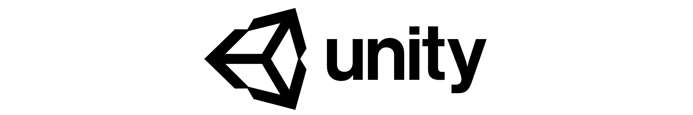

# Unity ML - Agents (Beta)

**Unity Machine Learning Agents** allows researchers and developers to
create games and simulations using the Unity Editor which serve as
environments where intelligent agents can be trained using
reinforcement learning, neuroevolution, or other machine learning
methods through a simple-to-use Python API. For more information, see
the [documentation page](docs).

For a walkthrough on how to train an agent in one of the provided
example environments, start
[here](docs/Getting-Started-with-Balance-Ball.md).

## Features
* Unity Engine flexibility and simplicity
* Multiple observations (cameras)
* Flexible Multi-agent support
* Discrete and continuous action spaces
* Python (2 and 3) control interface
* Visualizing network outputs in environment
* Easily definable Curriculum Learning scenarios
* Broadcasting of Agent behavior for supervised learning
* Tensorflow Sharp Agent Embedding _[Experimental]_

## Creating an Environment

The _Agents SDK_, including example environment scenes is located in
`unity-environment` folder. For requirements, instructions, and other
information, see the contained Readme and the relevant
[documentation](docs/Making-a-new-Unity-Environment.md).

## Training your Agents

Once you've built a Unity Environment, example Reinforcement Learning
algorithms and the Python API are available in the `python`
folder. For requirements, instructions, and other information, see the
contained Readme and the relevant
[documentation](docs/Unity-Agents---Python-API.md).
