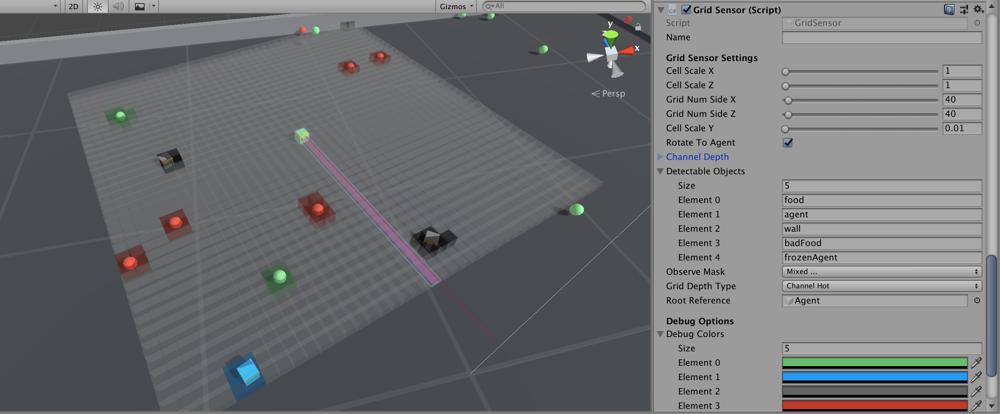
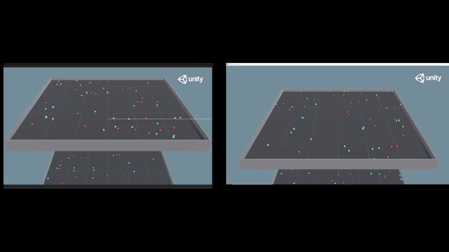
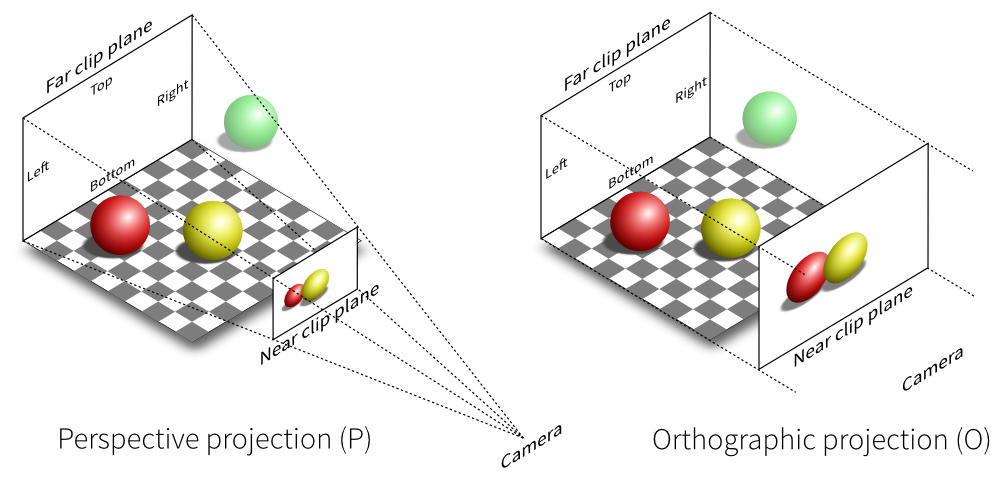
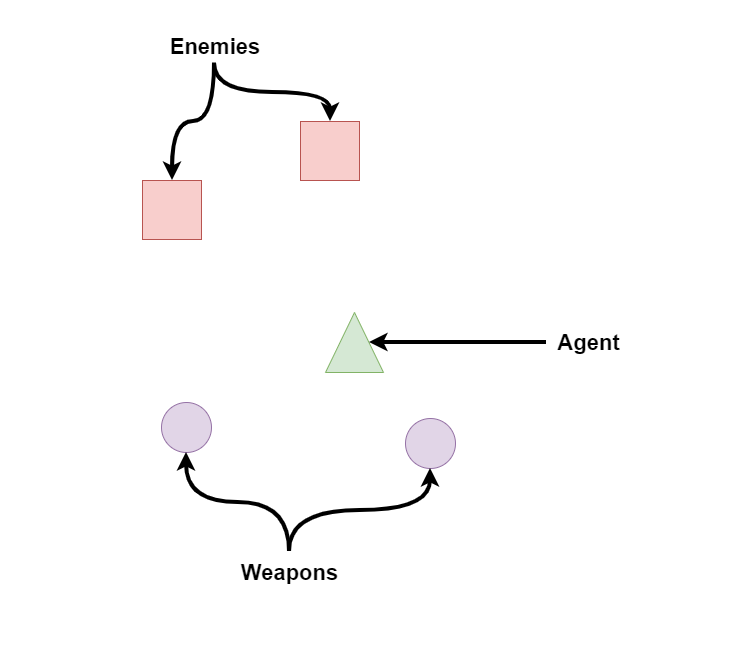
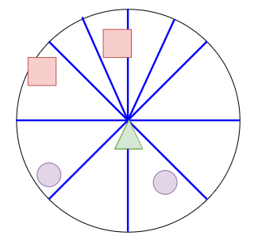
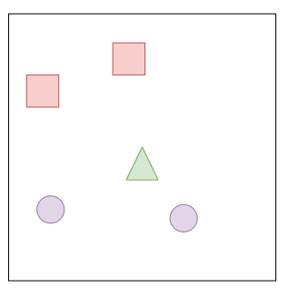
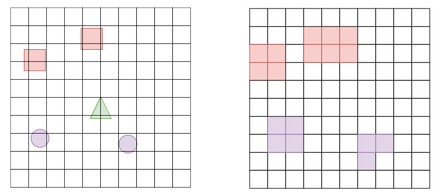

# Summary

The Grid Sensor is an alternative method for collecting observations which combines the generality of data extraction from Raycasts with the image processing power of Convolutional Neural Networks. The Grid Sensor can be used to collect data in the general form of a "Width x Height x Channel" matrix which can be used for training agent policies or for data analysis.



# Motivation

In ML-Agents there are two main sensors for observing information that is "physically" around the agent.

**Raycasts**

Raycasts provide the agent the ability to see things along prespecified lines of sight, similar to LIDAR. The kind of data it can extract is open to the developer from things like:

* The type of an object (enemy, npc, etc)
* The health of a unit
* the damage-per-second of a weapon on the ground

Raycasts are simple to implement and provides enough information for most simple games. When few are used, they are also computationally lightweight. However, there are multiple limiting factors:

* The rays need to be at the same height as the things the agent should observe.
* Objects can remain hidden by line of sight and if the knowledge of those objects is crucial to the success of the agent, then this limitation must be compensated for by the agents networks capacity (i.e., need a bigger brain with memory).
* The order of the raycasts (one raycast being to the left/right of another) is thrown away at the model level and must be learned by the agent which extends training time. Multiple raycasts exacerbates this issue.
* Typically, the length of the raycasts is limited because the agent need not know about objects that are at the other side of the level. Combined with few raycasts for computational efficiency, this means that an agent may not observe objects that fall between these rays and the issue becomes worse as the objects reduce in size.

**Camera**

The Camera provides the agent with either a grayscale or an RGB image of the game environment. In many cases, what we want to extract from a set of pixels is invariant to the location of those pixels in the image. It is this intuition that helps form the basis of Convolutional Neural Networks (CNNs) and established the literature of designing networks that take advantage of these relationships between pixels. Following this established literature of CNNs on image based data, the ML-Agent's Camera Sensor provides a means by which the agent can include high dimensional inputs (images) into its observation stream.
However the Camera Sensor has its own drawbacks as well.

* It requires rendering the scene and thus is computationally slower than alternatives that do not use rendering.
* If the textures of the important objects in the game are updated, the agent needs to be retrained.
* The RGB of the camera only provides a maximum of three channels to the agent.

These limitations provided the motivation towards the development of the Grid Sensor and Grid Observations as described below.

# Contribution

An image can be thought of as a matrix of a predefined width (W) and a height (H) and each pixel can be thought of as simply an array of length 3 (in the case of RGB), `[Red, Green, Blue]` holding the different channel information of the color (channel) intensities at that pixel location. Thus an image is just a 3 dimensional matrix of size WxHx3. A Grid Observation can be thought of as a generalization of this setup where in place of a pixel there is a "cell" which is an array of length N representing different channel intensities at that cell position. From a Convolutional Neural Network point of view, the introduction of multiple channels in an "image" isn't a new concept. One such example is using an RGB-Depth image which is used in several robotics applications. The distinction of Grid Observations is what the data within the channels represents. Instead of limiting the channels to color intensities, the channels within a cell of a Grid Observation generalize to any data that can be represented by a single number (float or int).

Before jumping into the details of the Grid Sensor, an important thing to note is the agent performance and qualitatively different behavior over raycasts. Unity MLAgent's comes with a suite of example environments. One in particular, the [Food Collector](https://github.com/Unity-Technologies/ml-agents/tree/release_15_docs/docs/Learning-Environment-Examples.md#food-collector), has been the focus of the Grid Sensor development.

The Food Collector environment can be described as:
* Set-up: A multi-agent environment where agents compete to collect food.
* Goal: The agents must learn to collect as many green food spheres as possible while avoiding red spheres.
* Agents: The environment contains 5 agents with same Behavior Parameters.

When applying the Grid Sensor to this environment, in place of the Raycast Vector Sensor or the Camera Sensor, a Mean Reward of 40-50 is observed. This performance is on par with what is seen by agents trained with RayCasts but the side-by-side comparison of trained agents, shows a qualitative difference in behavior. A deeper study and interpretation of the qualitative differences between agents trained with Raycasts and Vector Sensors verses Grid Sensors is left to future studies.



## Overview

There are three main phases to the observation process of the Grid Sensor:

1. **Collection** - data is extracted from observed objects
2. **Encoding** - the extracted data is encoded into a grid observation
3. **Communication** - the grid observation is sent to python or used by a trained model

These phases are described in the following sections.

## Collection

A Grid Sensor is the Grid Observation analog of a Unity Camera but with some notable differences. The sensor is made up of a grid of identical Box Colliders which designate the "cells" of the grid. The Grid Sensor also has a list of "detectable objects" in the form of Unity GameObject tags. When an object that is tagged as a detectable object is present within a cell's Box Collider, that cell is "activated" and a method on the Grid Sensor extracts data from said object and associates that data with the position of the activated cell. Thus the Grid Sensor is always orthographic:


<cite><a href="https://www.geofx.com/graphics/nehe-three-js/lessons17-24/lesson21/lesson21.html">geofx.com</a></cite>

In practice it has been useful to center the Grid Sensor on the agent in such a way that it is equivalent to having a "top-down" orthographic view of the agent.

Just like the Raycasts mentioned earlier, the Grid Sensor can extract any kind of data from a detected object, and just like the Camera, the Grid Sensor maintains the spacial relationship between nearby cells that allows one to take advantage of the computational properties of CNNs. Thus the Grid Sensor tries to take the best of both sensors and combines them to something that is more expressive.

### Example of Grid Observations
A Grid Observation is best described using an example and a side by side comparison with the Raycasts and the Camera.

Let's imagine a scenario where an agent is faced with two enemies and there are two "equipable" weapons somewhat behind the agent. It would be helpful for the agent to know the location and properties of both the enemies as well as the equippable items. For simplicity, let's assume enemies represent their health as a percentage (0-100%). Also assume that enemies and weapons are the only two kinds of objects that the agent would see in the entire game.



#### Raycasts
If a raycast hits an object, not only could we get the distance (normalized by the maximum raycast distance) we would be able to extract its type (enemy vs weapon) and any attribute associate with it (e.g. an enemy's health).

There are many ways in which one could encode this information but one reasonable encoding is this:
```
raycastData = [isWeapon, isEnemy, health, normalizedDistance]
```

For example, if the raycast hit nothing then this would be represented by `[0, 0, 0, 1]`.
If instead the raycast hit an enemy with 60% health that is 50% of the maximum raycast distance, the data would be represented by `[0, 1, .6, .5]`.

The limitations of raycasts which were presented above are easy to visualize in the below image. The agent is unable to see where the weapons are and only sees one of the enemies. Typically in the ML-Agents examples, this situation is mitigated by including previous frames of data so that the agent observes changes through time. However, in more complex games, it is not difficult to imagine scenarios where an agent might miss important information using only Raycasts.



#### Camera

Instead, if we used a camera, the agent would be able to see around itself. It would be able to see both enemies and weapons (assuming its field of view was wide enough) and this could be processed by a CNN to encode this information. However, ignoring the obvious limitation that the game would have to be rendered, the agent would not have immediate access to the health value of the enemies. Perhaps textures are added to include "visible damage" to the enemies or there may be health bars above the enemies heads but both of these additions are subject to change, especially in a game that is in development. By using the camera only, it forces the agent to learn a different behavior as it is not able to access what would otherwise be accessible data.



#### Grid Sensor

The data extraction method of the Grid Sensor is as open-ended as using the Raycasts to collect data. The `GetObjectData` method on the Grid Sensor can be overridden to collect whatever information is deemed useful for the performance of the agent. By default, only the tag is used.

```csharp
    protected virtual float[] GetObjectData(GameObject currentColliderGo, float typeIndex, float normalizedDistance)
```

Following the same data extraction method presented in the section on raycasts, if a Grid Sensor was used instead of Raycasts or a Camera, then not only would the agent be able to extract the health value of the enemies but it would also be able to encode the relative positions of those objects as is done with Camera. Additionally, as the texture of the objects is not used, this data can be collected without rendering the scene.

In our example, we can collect data in the form of [objectType, health] by overriding `GetObjectData` as the following:
```csharp
    protected override float[] GetObjectData(GameObject currentColliderGo, float type_index, float normalized_distance)
    {
        float[] channelValues = new float[ChannelDepth.Length]; // ChannelDepth.Length = 2 in this example
        channelValues[0] = type_index; // this is the observation collected in default implementation
        if (currentColliderGo.tag == "enemy")
        {
            var enemy = currentColliderGo.GetComponent<EnemyClass>();
            channelValues[1] = enemy.health; // the value may have to be normalized depends on the type of GridSensor encoding you use (see sections below)
        }
        return channelValues;
    }
```



At the end of the Collection phase, each cell with an object inside of it has `GetObjectData` called and the returned values is then processed in the Encoding phase which is described in the next section.

#### CountingGridSensor

The CountingGridSensor builds on the GridSensor to perform the specific job of counting the number of object types that are based on the different detectable object tags. The encoding is meant to exploit a key feature of the GridSensor. In original GridSensor, only the closest detectable object, in relation to the agent, that lies within a cell is used for encoding the value for that cell. In the CountingGridSensor, the number of each type of object is recorded and then normalized according to a max count.

An example of the CountingGridSensor can be found below.


## Encoding

In order to support different ways of representing the data extracted from an object, multiple "depth types" were implemented. Each has pros and cons and, depending on the use-case of the Grid Sensor, one may be more beneficial than the others.

The stored data that is extracted during the *Collection* phase may come from different sources, and thus be of a different nature. For instance, going back to the Enemy/Weapon example in the previous section, an enemy's health is continuous whereas the object type (enemy or weapon) is categorical data. This distinction is important as categorical data requires a different encoding mechanism than continuous data.

The GridSensor handles this distinction with two user defined properties that define how this data is to be encoded:

* DepthType - Enum signifying the encoding mode: Channel, ChannelHot
* ChannelDepth - `int[]` describing the range of each data and is used differently with different DepthType

How categorical and continuous data is treated is different between the different DepthTypes as will be explored in the sections below. The sections will use an on-going example similar to the example mentioned earlier where, within a cell, the sensor observes: `an enemy with 60% health`. Thus the cell contains two kinds of data: categorical data (object type) and the continuous data (health). Additionally, the order of the observed tags is important as it allows one to encode the tag of the observed object by its index within the list of observed tags. Note that in the example, the observed tags is defined as ["weapon", "enemy"].

### Channel Based

The Channel Based Grid Observations is perhaps the simplest in terms of usability and similarity with other machine learning applications. Each grid is of size WxHxC where C is the number of channels. To distinguish between categorical and continuous data, one would use the ChannelDepth array to signify the ranges that the values in the `channelValues` array could take. If one sets ChannelDepth[i] to be 1, it is assumed that the value of `channelValues[i]` is already normalized. Else ChannelDepth[i] represents the total number of possible values that `channelValues[i]` can take.

For continuous data, you should specify `ChannelDepth[i]` to 1 and the collected data should be already normalized by its min/max range. For discrete data, you should specify `ChannelDepth[i]` to be the total number of possible values, and the collected data should be an integer value within range of `ChannelDepth[i]`.

Using the example described earlier, if one was using Channel Based Grid Observations, they would have a ChannelDepth = {2, 1} to describe that there are two possible values for the first channel (ObjectType) and the 1 represents that the second channel (EnemyHealth) is continuous and should be already normalized.

As the "enemy" is in the second position of the observed tags, its value can be normalized by:
For ObjectType, "weapon", "enemy" will be represented respectively as:
```
weapon = DetectableObjects.IndexOfTag("weapon")/ChannelDepth[0] = 1/2 = 0.5;
enemy = DetectableObjects.IndexOfTag("enemy")/ChannelDepth[0] = 2/2 = 1;
```

By using this formula, if there wasn't an object within the cell then the value would be 0.

As the ChannelDepth for the second channel is defined as 1, the collected health value (60% = 0.6) can be encoded directly. Thus the encoded data at this cell is:
`[1, .6]`. If the health in the game is not represented in a normalized form, for example if the health is represented in an integer ranging from -100 to 100, you'll need to manully nomalize it during collection. That is, If you get value 50, you need to normalize it by `50/(100- (-100))=0.25` and collect 0.25 instead of 50.

At the end of the Encoding phase, the resulting Grid Observation would be a WxHx2 matrix.

### Channel Hot

The Channel Hot DepthType generalizes the classic OneHot encoding to differentiate combinations of different data. Rather than normalizing the data like in the Channel Based section, each element of `channelValues` is represented by an encoding based on the ChannelDepth. If ChannelDepth[i] = 1, then this represents that `channelValues[i]` is already normalized (between 0-1) and will be used directly within the encoding which is same as with Channel Based. However if ChannelDepth[i] is an integer greater than 1, then the value in `channelValues[i]` will be converted into a OneHot encoding based on the following:

```
float[] arr = new float[ChannelDepth[i] + 1];
int index = (int) channelValues[i] + 1;
arr[index] = 1;
return arr;
```

The `+ 1` allows the first index of `arr` to be reserved for encoding "empty".

The encoding of each channel is then concatenated together. Clearly using this setup allows the developer to be able to encode values using the classic OneHot encoding. Below are some different variations of the ChannelDepth which create different encodings of the example:

##### ChannelDepth = {3, 1}
The first element, 3, signifies that there are three possibilities for the first channel and as the "enemy" is 2nd in the detected objects list, the "enemy" in the example is encoded as `[0, 0, 1]` where the first index represents "no object". The second element, 1, signifies that the health is already normalized and, following the table, is used directly. The resulting encoding is thus:
```
[0, 0, 1, 0.6]
```

##### ChannelDepth = {3, 5}

Like in the previous example, the "enemy" in the example is encoded as `[0, 0, 1]`. For the "health" however, the 5 signifies that the health should be represented by a OneHot encoding of 5 possible values, and in this case that encoding is `round(.6*5) = round(3) = 3 => [0, 0, 0, 1, 0]`.

This encoding would then be concatenated together with the "enemy" encoding resulting in:
```
enemy encoding => [0, 0, 1]
health encoding => [0, 0, 0, 1, 0]
final encoding => [0, 0, 1, 0, 0, 0, 1, 0]
```

The table below describes how other values of health would be mapped to OneHot encoding representations:

| Range            | OneHot Encoding |
|------------------|-----------------|
| health = 0       | [1, 0, 0, 0, 0] |
| 0 < health < .3  | [0, 1, 0, 0, 0] |
| .3 < health < .5 | [0, 0, 1, 0, 0] |
| .5 < health < .7 | [0, 0, 0, 1, 0] |
| .7 < health <= 1 | [0, 0, 0, 0, 1] |


##### ChannelDepth = {1, 1}
This setting of ChannelDepth would throw an error as there is not enough information to encode the categorical data of the object type.


### CountingGridSensor

As mentioned above, the CountingGridSensor inherits from the GridSensor for the sole purpose of counting the different objects that lay within a cell. In order to normalize the counts so that the grid can be properly encoded as PNG, the ChannelDepth is used to represent the "maximum count" of each type. For the working example, if the ChannelDepth is set as {50, 10}, which represents that the maximum count for objects with the "weapon" and "enemy" tag is 50 and 10, respectively, then the resulting data would be:
```
encoding = [0 weapons/ 50 weapons, 1 enemy / 10 enemies] = [0, .1]
```

## Communication

At the end of the Encoding phase, all the Grid Observations will be sent to either the python side for training or to be used by a trained model within Unity. Since the data format is similar to images collected by Camera Sensors, Grid Observations also have the CompressionType option to specify whether to send the data directly or send in PNG compressed form for better communication efficiency.

Once the bytes are sent to Python, they are then decoded and provided as a tensor of the correct shape.
