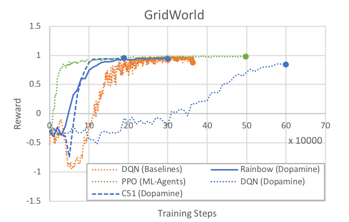

# Unity ML-Agents Gym Wrapper

A common way in which machine learning researchers interact with simulation environments is via a wrapper provided by the Farama Foundation called `gymnasium` (formerly known as OpenAI `gym`). For more information on the gymnasium interface, visit the [Gymnasium Documentation](https://gymnasium.farama.org/index.html), and the [Gymnasium Github repository](https://github.com/Farama-Foundation/Gymnasium).

The ML Agents package provides a gym wrapper and instructions for using it with existing machine learning algorithms which utilize gymnasium. This wrapper provides interfaces on top of the `UnityEnvironment` class, which is the default way of interfacing with a Unity environment via Python.

## Installation

The gym wrapper is part of the `mlagents_envs` package. Please refer to the [mlagents_envs installation instructions](https://github.com/Unity-Technologies/ml-agents/blob/release/4.1.0/ml-agents-envs/README.md).


## Using the Gym Wrapper

The gym interface is available from `mlagents_envs.envs.unity_gym_env`. To launch an environment from the root of the project repository use:

```python
from mlagents_envs.envs.unity_gym_env import UnityToGymWrapper

env = UnityToGymWrapper(unity_env, uint8_visual, flatten_branched, allow_multiple_obs)
```

- `unity_env` refers to the Unity environment to be wrapped.

- `uint8_visual` refers to whether to output visual observations as `uint8` values (0-255). Many common Gym environments (e.g. Atari) do this. By default, they will be floats (0.0-1.0). Defaults to `False`.

- `flatten_branched` will flatten a branched discrete action space into a gymnasium `Discrete` space. Otherwise, it will be converted into a `MultiDiscrete`. Defaults to `False`.

- `allow_multiple_obs` will return a list of observations. The first elements contain the visual observations and the last element contains the array of vector observations. If False the environment returns a single array (containing a single visual observations, if present, otherwise the vector observation). Defaults to `False`.

- `action_space_seed` is the optional seed for action sampling. If non-None, will be used to set the random seed on created gym.Space instances.

The returned environment `env` will function as a gymnasium environment.

## Limitations

- It is only possible to use an environment with a **single** Agent.
- By default, the first visual observation is provided as the `observation`, if present. Otherwise, vector observations are provided. You can receive all visual and vector observations by using the `allow_multiple_obs=True` option in the gym parameters. If set to `True`, you will receive a list of `observation` instead of only one.
- The `TerminalSteps` or `DecisionSteps` output from the environment can still be accessed from the `info` provided by `env.step(action)`.
- Stacked vector observations are not supported.
- Environment registration for use with `gym.make()` is currently not supported.
- Calling env.render() will not render a new frame of the environment. It will return the latest visual observation if using visual observations.

## Training with Stable-Baselines3

[Stable-Baselines3](https://github.com/DLR-RM/stable-baselines3) (SB3) is a set of reliable, actively maintained implementations of reinforcement learning algorithms in PyTorch. It is the community successor to OpenAI Baselines and, like this wrapper, is built on the Farama Foundation `gymnasium` API, so you can train ML-Agents environments with it directly.

Install SB3 with:

```sh
pip install stable-baselines3
```

### Example - PPO

To train an agent with PPO on a single-agent environment, create a file called `train_unity.py` with the following code. Then create an `/envs/` directory and build the environment to that directory. For more information on building Unity environments, refer to [Using an Environment Executable](Learning-Environment-Executable.md).

```python
from stable_baselines3 import PPO

from mlagents_envs.environment import UnityEnvironment
from mlagents_envs.envs.unity_gym_env import UnityToGymWrapper


def main():
    unity_env = UnityEnvironment(<path-to-environment>)
    env = UnityToGymWrapper(unity_env)
    model = PPO("MlpPolicy", env, verbose=1)
    model.learn(total_timesteps=100000)
    print("Saving model to unity_model.zip")
    model.save("unity_model")


if __name__ == "__main__":
    main()
```

To start the training process, run the following from the directory containing `train_unity.py`:

```sh
python train_unity.py
```

Use the `MlpPolicy` for environments with vector observations, and the `CnnPolicy` for environments with visual (image) observations.

### Example - DQN

DQN requires a discrete action space. For an environment with a single visual observation and branched discrete actions, enable `uint8_visual` (to output `uint8` image observations) and `flatten_branched` (to collapse the branched action space into a single `Discrete` space):

```python
from stable_baselines3 import DQN

from mlagents_envs.environment import UnityEnvironment
from mlagents_envs.envs.unity_gym_env import UnityToGymWrapper


def main():
    unity_env = UnityEnvironment(<path-to-environment>)
    env = UnityToGymWrapper(unity_env, uint8_visual=True, flatten_branched=True)
    model = DQN(
        "CnnPolicy",
        env,
        learning_rate=2.5e-4,
        buffer_size=50000,
        learning_starts=20000,
        target_update_interval=50,
        gamma=0.99,
        verbose=1,
    )
    model.learn(total_timesteps=1000000)
    print("Saving model to unity_model.zip")
    model.save("unity_model")


if __name__ == "__main__":
    main()
```

### Training on multiple environments in parallel

SB3 can train on several environment instances at once using a vectorized environment. Each Unity instance must use a distinct `base_port` so the instances don't conflict:

```python
from stable_baselines3 import PPO
from stable_baselines3.common.vec_env import SubprocVecEnv

from mlagents_envs.environment import UnityEnvironment
from mlagents_envs.envs.unity_gym_env import UnityToGymWrapper


def make_unity_env(env_directory, num_env, start_index=0):
    """Create a wrapped, vectorized Unity environment."""

    def make_env(rank):
        def _thunk():
            unity_env = UnityEnvironment(env_directory, base_port=5000 + rank)
            return UnityToGymWrapper(unity_env)

        return _thunk

    return SubprocVecEnv([make_env(i + start_index) for i in range(num_env)])


def main():
    env = make_unity_env(<path-to-environment>, 4)
    model = PPO("MlpPolicy", env, verbose=1)
    model.learn(total_timesteps=100000)


if __name__ == "__main__":
    main()
```

## Run Google Dopamine Algorithms

> [!NOTE] The following walkthrough was written for an older, OpenAI `gym`-based release of Dopamine. This wrapper now follows the Farama Foundation `gymnasium` API: `reset()` returns `(observation, info)` and `step()` returns `(observation, reward, terminated, truncated, info)`. Recent versions of Dopamine target `gymnasium` and are compatible with the wrapper, but the exact file names, module paths, and configuration steps described here may differ from the version you install. Treat this section as a general guide rather than a step-by-step recipe.

Google provides a framework [Dopamine](https://github.com/google/dopamine), and implementations of algorithms, e.g. DQN, Rainbow, and the C51 variant of Rainbow. Using the Gym wrapper, you can run Unity environments using Dopamine.

First, after installing the Gym wrapper, clone the Dopamine repository.

```
git clone https://github.com/google/dopamine
```

Then, follow the appropriate install instructions as specified on [Dopamine's homepage](https://github.com/google/dopamine). Note that the Dopamine guide specifies using a virtualenv. If you choose to do so, make sure your unity_env package is also installed within the same virtualenv as Dopamine.

### Adapting Dopamine's Scripts

First, open `dopamine/atari/run_experiment.py`. Alternatively, copy the entire `atari` folder, and name it something else (e.g. `unity`). If you choose the  copy approach, be sure to change the package names in the import statements in `train.py` to your new directory.

Within `run_experiment.py`, you need to make changes to which environment is instantiated, just as in the Stable-Baselines3 examples in the previous section. At the top of the file, insert

```python
from mlagents_envs.environment import UnityEnvironment
from mlagents_envs.envs.unity_gym_env import UnityToGymWrapper
```

to import the Gym Wrapper. Navigate to the `create_atari_environment` method in the same file, and switch to instantiating a Unity environment by replacing the method with the following code.

```python
    game_version = 'v0' if sticky_actions else 'v4'
    full_game_name = '{}NoFrameskip-{}'.format(game_name, game_version)
    unity_env = UnityEnvironment(<path-to-environment>)
    env = UnityToGymWrapper(unity_env, uint8_visual=True)
    return env
```

`<path-to-environment>` is the path to your built Unity executable. For more information on building Unity environments, refer to [Using an Environment Executable](Learning-Environment-Executable.md), and note the Limitations section below.

Note that the script is not using the preprocessor from Dopamine, as it uses many Atari-specific calls. Furthermore, frame-skipping can be done from within Unity, rather than on the Python side.

### Limitations

Since Dopamine is designed around variants of DQN, it is only compatible with discrete action spaces, and specifically the `Discrete` gymnasium space. For environments that use branched discrete action spaces, you can enable the `flatten_branched` parameter in `UnityToGymWrapper`, which treats each combination of branched actions as separate actions.

Furthermore, when building your environments, ensure that your Agent is using visual observations with greyscale enabled, and that the dimensions of the visual observations is 84 by 84 (matches the parameter found in `dqn_agent.py` and `rainbow_agent.py`). Dopamine's agents currently do not automatically adapt to the observation dimensions or number of channels.

### Hyperparameters

The hyperparameters provided by Dopamine are tailored to the Atari games, and you will likely need to adjust them for ML-Agents environments. Here is a sample `dopamine/agents/rainbow/configs/rainbow.gin` file that is known to work with a simple GridWorld.

```python
import dopamine.agents.rainbow.rainbow_agent
import dopamine.unity.run_experiment
import dopamine.replay_memory.prioritized_replay_buffer
import gin.tf.external_configurables

RainbowAgent.num_atoms = 51
RainbowAgent.stack_size = 1
RainbowAgent.vmax = 10.
RainbowAgent.gamma = 0.99
RainbowAgent.update_horizon = 3
RainbowAgent.min_replay_history = 20000  # agent steps
RainbowAgent.update_period = 5
RainbowAgent.target_update_period = 50  # agent steps
RainbowAgent.epsilon_train = 0.1
RainbowAgent.epsilon_eval = 0.01
RainbowAgent.epsilon_decay_period = 50000  # agent steps
RainbowAgent.replay_scheme = 'prioritized'
RainbowAgent.tf_device = '/cpu:0'  # use '/cpu:*' for non-GPU version
RainbowAgent.optimizer = @tf.train.AdamOptimizer()

tf.train.AdamOptimizer.learning_rate = 0.00025
tf.train.AdamOptimizer.epsilon = 0.0003125

Runner.game_name = "Unity" # any name can be used here
Runner.sticky_actions = False
Runner.num_iterations = 200
Runner.training_steps = 10000  # agent steps
Runner.evaluation_steps = 500  # agent steps
Runner.max_steps_per_episode = 27000  # agent steps

WrappedPrioritizedReplayBuffer.replay_capacity = 1000000
WrappedPrioritizedReplayBuffer.batch_size = 32
```

This example assumed you copied `atari` to a separate folder named `unity`. Replace `unity` in `import dopamine.unity.run_experiment` with the folder you copied your `run_experiment.py` and `trainer.py` files to. If you directly modified the existing files, then use `atari` here.

### Starting a Run

You can now run Dopamine as you would normally:

```
python -um dopamine.unity.train \
  --agent_name=rainbow \
  --base_dir=/tmp/dopamine \
  --gin_files='dopamine/agents/rainbow/configs/rainbow.gin'
```

Again, ensure to copy `atari` into a separate folder. Remember to replace `unity` with the directory you copied your files into. If you edited the Atari files directly, this should be `atari`.

### Example: GridWorld

As a baseline, here are rewards over time for the three algorithms provided with Dopamine as run on the GridWorld example environment. All Dopamine (DQN, Rainbow, C51) runs were done with the same epsilon, epsilon decay, replay history, training steps, and buffer settings as specified above. Note that the first 20000 steps are used to pre-fill the training buffer, and no learning happens.

We provide results from our PPO implementation and the DQN from Baselines as reference. Note that all runs used the same greyscale GridWorld as Dopamine. For PPO, `num_layers` was set to 2, and all other hyperparameters are the default for GridWorld in `config/ppo/GridWorld.yaml`. For Baselines DQN, the provided hyperparameters in the previous section are used. Note that Baselines implements certain features (e.g. dueling-Q) that are not enabled in Dopamine DQN.



