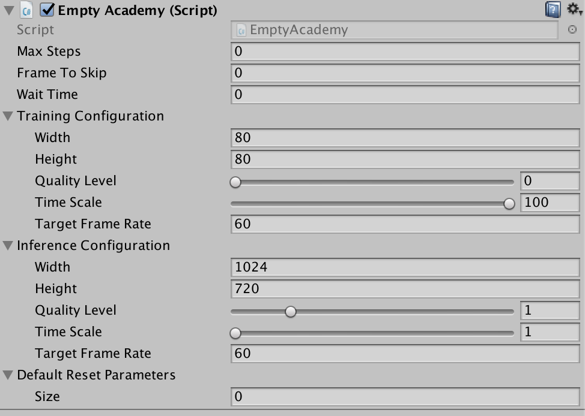
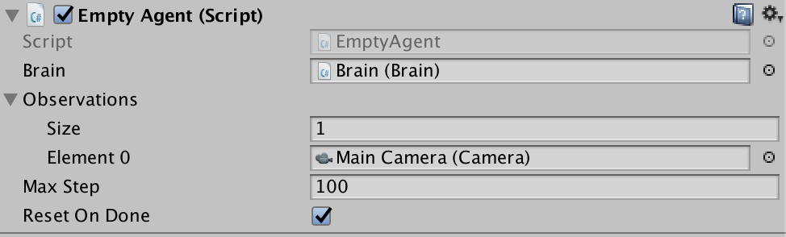

# ML Agents Editor Interface

This page contains an explanation of the use of each of the inspector panels relating to the `Academy`, `Brain`, and `Agent` objects.

## Academy

* `Max Steps` - Total number of steps per-episode. `0` corresponds to episodes without a maximum number
of steps. Once the step counter reaches maximum, the environment will reset.
* `Frames To Skip` - How many steps of the environment to skip before asking Brains for decisions.
* `Wait Time` - How many seconds to wait between steps when running in `Inference`.
* `Configuration` - The engine-level settings which correspond to rendering quality and engine speed.
    * `Width` - Width of the environment window in pixels.
    * `Height` - Width of the environment window in pixels.
    * `Quality Level` - Rendering quality of environment. (Higher is better)
    * `Time Scale` - Speed at which environment is run. (Higher is faster)
    * `Target Frame Rate` - FPS engine attempts to maintain. 
* `Default Reset Parameters` - List of custom parameters that can be changed in the environment on reset.

## Brain

* `Brain Parameters` - Define state, observation, and action spaces for the Brain.
    * `State Size` - Length of state vector for brain (In _Continuous_ state space). Or number of possible
values (in _Discrete_ state space).
    * `Action Size` - Length of action vector for brain (In _Continuous_ state space). Or number of possible
values (in _Discrete_ action space).
    * `Memory Size` - Length of memory vector for brain. Used with Recurrent networks and frame-stacking CNNs.
    * `Camera Resolution` - Describes height, width, and whether to greyscale visual observations for the Brain.
    * `Action Descriptions` - A list of strings used to name the available actions for the Brain.
* `State Space Type` - Corresponds to whether state vector contains a single integer (Discrete) or a series of real-valued floats (Continuous).
* `Action Space Type` - Corresponds to whether action vector contains a single integer (Discrete) or a series of real-valued floats (Continuous).
* `Type of Brain` - Describes how the Brain will decide actions.
    * `External` - Actions are decided using Python API.
    * `Internal` - Actions are decided using internal TensorflowSharp model.
    * `Player` - Actions are decided using Player input mappings.
    * `Heuristic` - Actions are decided using custom `Decision` script, which should be attached to the Brain game object.

### Internal Brain

   *  `Graph Model` : This must be the `bytes` file corresponding to the pretrained Tensorflow graph. (You must first drag this file into your Resources folder and then from the Resources folder into the inspector)
   *  `Graph Scope` : If you set a scope while training your tensorflow model, all your placeholder name will have a prefix. You must specify that prefix here.
   *  `Batch Size Node Name` : If the batch size is one of the inputs of your graph, you must specify the name if the placeholder here. The brain will make the batch size equal to the number of agents connected to the brain automatically.
   *  `State Node Name` : If your graph uses the state as an input, you must specify the name if the placeholder here.
   *  `Recurrent Input Node Name` : If your graph uses a recurrent input / memory as input and outputs new recurrent input / memory, you must specify the name if the input placeholder here.
   *  `Recurrent Output Node Name` : If your graph uses a recurrent input / memory as input and outputs new recurrent input / memory, you must specify the name if the output placeholder here.
   * `Observation Placeholder Name` : If your graph uses observations as input, you must specify it here. Note that the number of observations is equal to the length of `Camera Resolutions` in the brain parameters.
   * `Action Node Name` : Specify the name of the placeholder corresponding to the actions of the brain in your graph. If the action space type is continuous, the output must be a one dimensional tensor of float of length `Action Space Size`, if the action space type is discrete, the output must be a one dimensional tensor of int of length 1.
   * `Graph Placeholder` : If your graph takes additional inputs that are fixed (example: noise level) you can specify them here. Note that in your graph, these must correspond to one dimensional tensors of int or float of size 1.
     * `Name` : Corresponds to the name of the placeholdder.
     * `Value Type` : Either Integer or Floating Point.
     * `Min Value` and `Max Value` : Specify the range of the value here. The value will be sampled from the uniform distribution ranging from `Min Value` to `Max Value` inclusive.

### Player Brain

If the action space is discrete, you must map input keys to their corresponding integer values. If the action space is continuous, you must map input keys to their corresponding indices and float values.

## Agent

* `Brain` - The brain to register this agent to. Can be dragged into the inspector using the Editor.
* `Observations` - A list of `Cameras` which will be used to generate observations.
* `Max Step` - The per-agent maximum number of steps. Once this number is reached, the agent will be reset if `Reset On Done` is checked.
