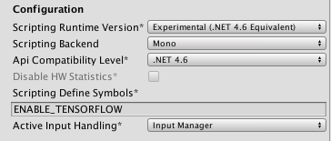
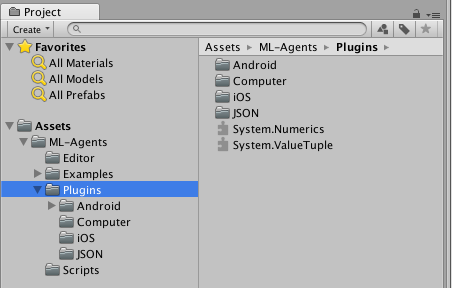
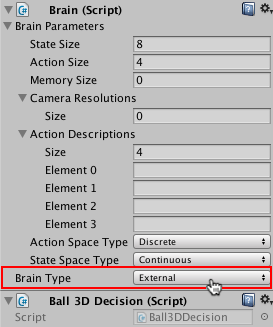
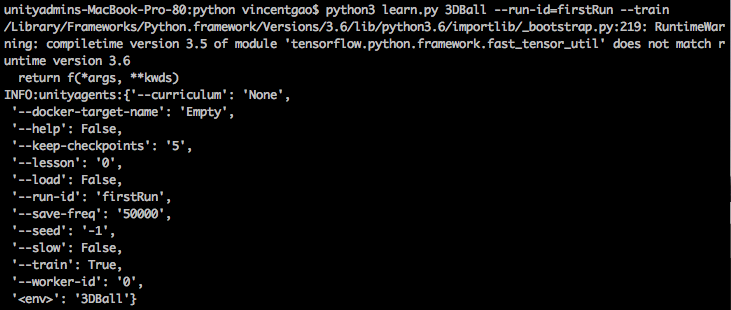
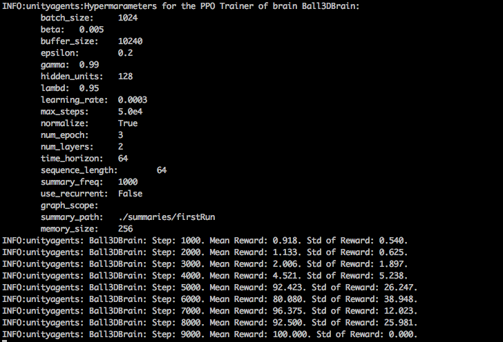

# Basic Guide

This guide will show you how to use a pretrained model in an example Unity environment, and show you how to train the model yourself.

If you are not familiar with the [Unity Engine](https://unity3d.com/unity),
we highly recommend the [Roll-a-ball tutorial](https://unity3d.com/learn/tutorials/s/roll-ball-tutorial) to learn all the basic concepts of Unity. 

## Setting up the ML-Agents Toolkit within Unity

In order to use the ML-Agents toolkit within Unity, you need to change some Unity settings first. Also [TensorFlowSharp plugin](https://s3.amazonaws.com/unity-ml-agents/0.4/TFSharpPlugin.unitypackage) is needed for you to use pretrained model within Unity, which is based on the [TensorFlowSharp repo](https://github.com/migueldeicaza/TensorFlowSharp). 

1. Launch Unity
2. On the Projects dialog, choose the **Open** option at the top of the window.
3. Using the file dialog that opens, locate the `unity-environment` folder within the the ML-Agents toolkit project and click **Open**.
4. Go to **Edit** > **Project Settings** > **Player**
5. For **each** of the platforms you target 
(**PC, Mac and Linux Standalone**, **iOS** or **Android**):
    1. Option the **Other Settings** section.
    2. Select **Scripting Runtime Version** to 
    **Experimental (.NET 4.6 Equivalent or .NET 4.x Equivalent)**
    3. In **Scripting Defined Symbols**, add the flag `ENABLE_TENSORFLOW`. 
    After typing in the flag name, press Enter.
6. Go to **File** > **Save Project**

[Download](https://s3.amazonaws.com/unity-ml-agents/0.4/TFSharpPlugin.unitypackage) the TensorFlowSharp plugin. Then import it into Unity by double clicking the downloaded file.  You can check if it was successfully imported by checking the TensorFlow files in the Project window under **Assets** > **ML-Agents** > **Plugins** > **Computer**. 

**Note**: If you don't see anything under **Assets**, drag the `ml-agents/unity-environment/Assets/ML-Agents` folder under **Assets** within Project window.

## Running a Pre-trained Model

1. In the **Project** window, go to `Assets/ML-Agents/Examples/3DBall` folder and open the `3DBall` scene file. 
2. In the **Hierarchy** window, select the **Ball3DBrain** child under the **Ball3DAcademy** GameObject to view its properties in the Inspector window.
3. On the **Ball3DBrain** object's **Brain** component, change the **Brain Type** to **Internal**.
4. In the **Project** window, locate the `Assets/ML-Agents/Examples/3DBall/TFModels` folder.
5. Drag the `3DBall` model file from the `TFModels` folder to the **Graph Model** field of the **Ball3DBrain** object's **Brain** component.
5. Click the **Play** button and you will see the platforms balance the balls using the pretrained model.

## Using the Basics Jupyter Notebook

The `python/Basics` [Jupyter notebook](Background-Jupyter.md) contains a 
simple walkthrough of the functionality of the Python 
API. It can also serve as a simple test that your environment is configured
correctly. Within `Basics`, be sure to set `env_name` to the name of the 
Unity executable if you want to [use an executable](Learning-Environment-Executable.md) or to `None` if you want to interact with the current scene in the Unity Editor.

More information and documentation is provided in the 
[Python API](Python-API.md) page.

## Training the Brain with Reinforcement Learning
### Setting the Brain to External
Since we are going to build this environment to conduct training, we need to 
set the brain used by the agents to **External**. This allows the agents to 
communicate with the external training process when making their decisions.

1. In the **Scene** window, click the triangle icon next to the Ball3DAcademy 
object.
2. Select its child object **Ball3DBrain**.
3. In the Inspector window, set **Brain Type** to **External**.

### Training the environment
1. Open a command or terminal window. 
2. Nagivate to the folder where you installed the ML-Agents toolkit. 
3. Change to the `python` directory. 
4. Run `python3 learn.py --run-id=<run-identifier> --train`
Where:
- `<run-identifier>` is a string used to separate the results of different training runs
- And the `--train` tells learn.py to run a training session (rather than inference)
5. When the message _"Start training by pressing the Play button in the Unity Editor"_ is displayed on the screen, you can press the :arrow_forward: button in Unity to start training in the Editor.

**Note**: Alternatively, you can use an executable rather than the Editor to perform training. Please refer to [this page](Learning-Environment-Executable.md) for instructions on how to build and use an executable.

**Note**: If you're using Anaconda, don't forget to activate the ml-agents environment first.

If the learn.py runs correctly and starts training, you should see something like this:

### After training
You can press Ctrl+C to stop the training, and your trained model will be at `ml-agents/python/models/<run-identifier>/editor_<academy_name>_<run-identifier>.bytes` where `<academy_name>` is the name of the Academy GameObject in the current scene. This file corresponds to your model's latest checkpoint. You can now embed this trained model into your internal brain by following the steps below, which is similar to the steps described [above](#play-an-example-environment-using-pretrained-model).  

1. Move your model file into 
`unity-environment/Assets/ML-Agents/Examples/3DBall/TFModels/`.
2. Open the Unity Editor, and select the **3DBall** scene as described above.
3. Select the **Ball3DBrain** object from the Scene hierarchy.
4. Change the **Type of Brain** to **Internal**.
5. Drag the `<env_name>_<run-identifier>.bytes` file from the Project window of the Editor
to the **Graph Model** placeholder in the **Ball3DBrain** inspector window.
6. Press the :arrow_forward: button at the top of the Editor.

## Next Steps

* For more information on the ML-Agents toolkit, in addition to helpful background, check out the [ML-Agents Toolkit Overview](ML-Agents-Overview.md) page.
* For a more detailed walk-through of our 3D Balance Ball environment, check out the [Getting Started](Getting-Started-with-Balance-Ball.md) page.
* For a "Hello World" introduction to creating your own learning environment, check out the [Making a New Learning Environment](Learning-Environment-Create-New.md) page.
* For a series of Youtube video tutorials, checkout the [Machine Learning Agents PlayList](https://www.youtube.com/playlist?list=PLX2vGYjWbI0R08eWQkO7nQkGiicHAX7IX) page. 
