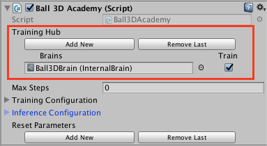

# Basic Guide

This guide will show you how to use a pre-trained model in an example Unity
environment (3D Ball) and show you how to train the model yourself.

If you are not familiar with the [Unity Engine](https://unity3d.com/unity), we
highly recommend the [Roll-a-ball
tutorial](https://unity3d.com/learn/tutorials/s/roll-ball-tutorial) to learn all
the basic concepts of Unity.

## Setting up the ML-Agents Toolkit within Unity

In order to use the ML-Agents toolkit within Unity, you first need to change a few
Unity settings. 

1. Launch Unity
2. On the Projects dialog, choose the **Open** option at the top of the window.
3. Using the file dialog that opens, locate the `UnitySDK` folder
   within the the ML-Agents toolkit project and click **Open**.
4. Go to **Edit** > **Project Settings** > **Player**
5. For **each** of the platforms you target (**PC, Mac and Linux Standalone**,
   **iOS** or **Android**):
    1. Expand the **Other Settings** section.
    2. Select **Scripting Runtime Version** to **Experimental (.NET 4.6
       Equivalent or .NET 4.x Equivalent)**
6. Go to **File** > **Save Project**

## Running a Pre-trained Model

We include pre-trained models for our agents (`.nn` files) and we use the 
[Unity Inference Engine](Unity-Inference-Engine.md) to run these models 
inside Unity. In this section, we will use the pre-trained model for the 
3D Ball example.

1. In the **Project** window, go to the `Assets/ML-Agents/Examples/3DBall/Scenes` folder
   and open the `3DBall` scene file.
2. In the **Project** window, go to the `Assets/ML-Agents/Examples/3DBall/Prefabs` folder. 
   Expand `Game` and click on the `Platform` prefab.  You should see the `Platform` prefab in the **Inspector** window.
   
   **Note**: The platforms in the `3DBall` scene were created using the `Platform` prefab.  Instead of updating all 12 platforms individually, you can update the `Platform` prefab instead.
   
   
   
3. In the **Project** window, drag the **3DBallLearning** Brain located in 
   `Assets/ML-Agents/Examples/3DBall/Brains` into the `Brain` property under `Ball 3D Agent (Script)` component in the **Inspector** window.
   
   
   
4. You should notice that each `Platform` under each `Game` in the **Hierarchy** windows now contains **3DBallLearning** as `Brain`. __Note__ : You can modify multiple game objects in a scene by selecting them all at 
   once using the search bar in the Scene Hierarchy. 
5. In the **Project** window, click on the **3DBallLearning** Brain located in 
   `Assets/ML-Agents/Examples/3DBall/Brains`.  You should see the properties in the **Inspector** window.
6. In the **Project** window, open the `Assets/ML-Agents/Examples/3DBall/TFModels` 
   folder.
7. Drag the `3DBallLearning` model file from the `Assets/ML-Agents/Examples/3DBall/TFModels` 
   folder to the **Model** field of the **3DBallLearning** Brain in the **Inspector** window. __Note__ : All of the brains should now have `3DBallLearning` as the TensorFlow model in the `Model` property 
8. Select the **InferenceDevice** to use for this model (CPU or GPU). 
   _Note: CPU is faster for the majority of ML-Agents toolkit generated models_
9. Click the **Play** button and you will see the platforms balance the balls
   using the pre-trained model.

   

## Using the Basics Jupyter Notebook

The `notebooks/getting-started.ipynb` [Jupyter notebook](Background-Jupyter.md)
contains a simple walk-through of the functionality of the Python API. It can
also serve as a simple test that your environment is configured correctly.
Within `Basics`, be sure to set `env_name` to the name of the Unity executable
if you want to [use an executable](Learning-Environment-Executable.md) or to
`None` if you want to interact with the current scene in the Unity Editor.

Before building the environment or interacting with it in the editor, select `Ball3DAcademy` in the **Hierarchy** window of the Unity editor and make sure `Control` checkbox is checked under `Ball 3D Academy` component. 

More information and documentation is provided in the
[Python API](Python-API.md) page.

## Training the Brain with Reinforcement Learning

### Setting up the environment for training

To set up the environment for training, you will need to specify which agents are contributing
to the training and which Brain is being trained. You can only perform training with
a `Learning Brain`.

1. Each platform agent needs an assigned `Learning Brain`.  In this example, each platform agent was created using a prefab.  To update all of the brains in each platform agent at once, you only need to update the platform agent prefab.  In the **Project** window, go to the `Assets/ML-Agents/Examples/3DBall/Prefabs` folder. Expand `Game` and click on the `Platform` prefab.  You should see the `Platform` prefab in the **Inspector** window.  In the **Project** window, drag the **3DBallLearning** Brain located in  `Assets/ML-Agents/Examples/3DBall/Brains` into the `Brain` property under `Ball 3D Agent (Script)` component in the **Inspector** window.  

   **Note**: The Unity prefab system will modify all instances of the agent properties in your scene.  If the agent does not synchronize automatically with the prefab, you can hit the Revert button in the top of the **Inspector** window.

2. In the **Hierarchy** window, select `Ball3DAcademy`.
3. In the **Project** window, go to `Assets/ML-Agents/Examples/3DBall/Brains` folder and drag the **3DBallLearning** Brain to the `Brains` property under `Braodcast Hub` in the `Ball3DAcademy` object in the **Inspector** window.  In order to train, make sure the `Control` checkbox is selected.

   **Note:** Assigning a Brain to an agent (dragging a Brain into the `Brain` property of 
the agent) means that the Brain will be making decision for that agent. Whereas dragging
a Brain into the Broadcast Hub means that the Brain will be exposed to the Python process.
The `Control` checkbox means that in addition to being exposed to Python, the Brain will
be controlled by the Python process (required for training).

   

### Training the environment

1. Open a command or terminal window.
2. Navigate to the folder where you cloned the ML-Agents toolkit repository.
   **Note**: If you followed the default [installation](Installation.md), then
   you should be able to run `mlagents-learn` from any directory.
3. Run `mlagents-learn <trainer-config-path> --run-id=<run-identifier> --train`
   where:
    - `<trainer-config-path>` is the relative or absolute filepath of the
      trainer configuration. The defaults used by example environments included
      in `MLAgentsSDK` can be found in `config/trainer_config.yaml`.
    - `<run-identifier>` is a string used to separate the results of different
      training runs
    - `--train` tells `mlagents-learn` to run a training session (rather
      than inference)
4. If you cloned the ML-Agents repo, then you can simply run

      ```sh
      mlagents-learn config/trainer_config.yaml --run-id=firstRun --train
      ```

5. When the message _"Start training by pressing the Play button in the Unity
   Editor"_ is displayed on the screen, you can press the :arrow_forward: button
   in Unity to start training in the Editor.

   **Note**: Alternatively, you can use an executable rather than the Editor to
perform training. Please refer to [this
page](Learning-Environment-Executable.md) for instructions on how to build and
use an executable.

```console
ml-agents$ mlagents-learn config/trainer_config.yaml --run-id=first-run --train


                        ▄▄▄▓▓▓▓
                   ╓▓▓▓▓▓▓█▓▓▓▓▓
              ,▄▄▄m▀▀▀'  ,▓▓▓▀▓▓▄                           ▓▓▓  ▓▓▌
            ▄▓▓▓▀'      ▄▓▓▀  ▓▓▓      ▄▄     ▄▄ ,▄▄ ▄▄▄▄   ,▄▄ ▄▓▓▌▄ ▄▄▄    ,▄▄
          ▄▓▓▓▀        ▄▓▓▀   ▐▓▓▌     ▓▓▌   ▐▓▓ ▐▓▓▓▀▀▀▓▓▌ ▓▓▓ ▀▓▓▌▀ ^▓▓▌  ╒▓▓▌
        ▄▓▓▓▓▓▄▄▄▄▄▄▄▄▓▓▓      ▓▀      ▓▓▌   ▐▓▓ ▐▓▓    ▓▓▓ ▓▓▓  ▓▓▌   ▐▓▓▄ ▓▓▌
        ▀▓▓▓▓▀▀▀▀▀▀▀▀▀▀▓▓▄     ▓▓      ▓▓▌   ▐▓▓ ▐▓▓    ▓▓▓ ▓▓▓  ▓▓▌    ▐▓▓▐▓▓
          ^█▓▓▓        ▀▓▓▄   ▐▓▓▌     ▓▓▓▓▄▓▓▓▓ ▐▓▓    ▓▓▓ ▓▓▓  ▓▓▓▄    ▓▓▓▓`
            '▀▓▓▓▄      ^▓▓▓  ▓▓▓       └▀▀▀▀ ▀▀ ^▀▀    `▀▀ `▀▀   '▀▀    ▐▓▓▌
               ▀▀▀▀▓▄▄▄   ▓▓▓▓▓▓,                                      ▓▓▓▓▀
                   `▀█▓▓▓▓▓▓▓▓▓▌
                        ¬`▀▀▀█▓


INFO:mlagents.learn:{'--curriculum': 'None',
 '--docker-target-name': 'Empty',
 '--env': 'None',
 '--help': False,
 '--keep-checkpoints': '5',
 '--lesson': '0',
 '--load': False,
 '--no-graphics': False,
 '--num-runs': '1',
 '--run-id': 'first-run',
 '--save-freq': '50000',
 '--seed': '-1',
 '--slow': False,
 '--train': True,
 '--worker-id': '0',
 '<trainer-config-path>': 'config/trainer_config.yaml'}
INFO:mlagents.envs:Start training by pressing the Play button in the Unity Editor.
 ```

**Note**: If you're using Anaconda, don't forget to activate the ml-agents
environment first.

If `mlagents-learn` runs correctly and starts training, you should see something
like this:

```console
INFO:mlagents.envs:
'Ball3DAcademy' started successfully!
Unity Academy name: Ball3DAcademy
        Number of Brains: 1
        Number of Training Brains : 1
        Reset Parameters :

Unity brain name: 3DBallLearning
        Number of Visual Observations (per agent): 0
        Vector Observation space size (per agent): 8
        Number of stacked Vector Observation: 1
        Vector Action space type: continuous
        Vector Action space size (per agent): [2]
        Vector Action descriptions: ,
INFO:mlagents.envs:Hyperparameters for the PPO Trainer of brain 3DBallLearning:
        batch_size:          64
        beta:                0.001
        buffer_size:         12000
        epsilon:             0.2
        gamma:               0.995
        hidden_units:        128
        lambd:               0.99
        learning_rate:       0.0003
        max_steps:           5.0e4
        normalize:           True
        num_epoch:           3
        num_layers:          2
        time_horizon:        1000
        sequence_length:     64
        summary_freq:        1000
        use_recurrent:       False
        summary_path:        ./summaries/first-run-0
        memory_size:         256
        use_curiosity:       False
        curiosity_strength:  0.01
        curiosity_enc_size:  128
        model_path:	./models/first-run-0/3DBallLearning
INFO:mlagents.trainers: first-run-0: 3DBallLearning: Step: 1000. Mean Reward: 1.242. Std of Reward: 0.746. Training.
INFO:mlagents.trainers: first-run-0: 3DBallLearning: Step: 2000. Mean Reward: 1.319. Std of Reward: 0.693. Training.
INFO:mlagents.trainers: first-run-0: 3DBallLearning: Step: 3000. Mean Reward: 1.804. Std of Reward: 1.056. Training.
INFO:mlagents.trainers: first-run-0: 3DBallLearning: Step: 4000. Mean Reward: 2.151. Std of Reward: 1.432. Training.
INFO:mlagents.trainers: first-run-0: 3DBallLearning: Step: 5000. Mean Reward: 3.175. Std of Reward: 2.250. Training.
INFO:mlagents.trainers: first-run-0: 3DBallLearning: Step: 6000. Mean Reward: 4.898. Std of Reward: 4.019. Training.
INFO:mlagents.trainers: first-run-0: 3DBallLearning: Step: 7000. Mean Reward: 6.716. Std of Reward: 5.125. Training.
INFO:mlagents.trainers: first-run-0: 3DBallLearning: Step: 8000. Mean Reward: 12.124. Std of Reward: 11.929. Training.
INFO:mlagents.trainers: first-run-0: 3DBallLearning: Step: 9000. Mean Reward: 18.151. Std of Reward: 16.871. Training.
INFO:mlagents.trainers: first-run-0: 3DBallLearning: Step: 10000. Mean Reward: 27.284. Std of Reward: 28.667. Training.
```

### After training

You can press Ctrl+C to stop the training, and your trained model will be at
`models/<run-identifier>/<brain_name>.nn` where
`<brain_name>` is the name of the Brain corresponding to the model.
(**Note:** There is a known bug on Windows that causes the saving of the model to
fail when you early terminate the training, it's recommended to wait until Step
has reached the max_steps parameter you set in trainer_config.yaml.) This file
corresponds to your model's latest checkpoint. You can now embed this trained
model into your Learning Brain by following the steps below, which is similar to
the steps described
[above](#running-a-pre-trained-model).

1. Move your model file into
   `UnitySDK/Assets/ML-Agents/Examples/3DBall/TFModels/`.
2. Open the Unity Editor, and select the **3DBall** scene as described above.
3. Select the  **3DBallLearning** Learning Brain from the Scene hierarchy.
5. Drag the `<brain_name>.nn` file from the Project window of
   the Editor to the **Model** placeholder in the **3DBallLearning**
   inspector window.
6. Press the :arrow_forward: button at the top of the Editor.

## Next Steps

- For more information on the ML-Agents toolkit, in addition to helpful
  background, check out the [ML-Agents Toolkit Overview](ML-Agents-Overview.md)
  page.
- For a more detailed walk-through of our 3D Balance Ball environment, check out
  the [Getting Started](Getting-Started-with-Balance-Ball.md) page.
- For a "Hello World" introduction to creating your own Learning Environment,
  check out the [Making a New Learning
  Environment](Learning-Environment-Create-New.md) page.
- For a series of YouTube video tutorials, checkout the
  [Machine Learning Agents PlayList](https://www.youtube.com/playlist?list=PLX2vGYjWbI0R08eWQkO7nQkGiicHAX7IX)
  page.
