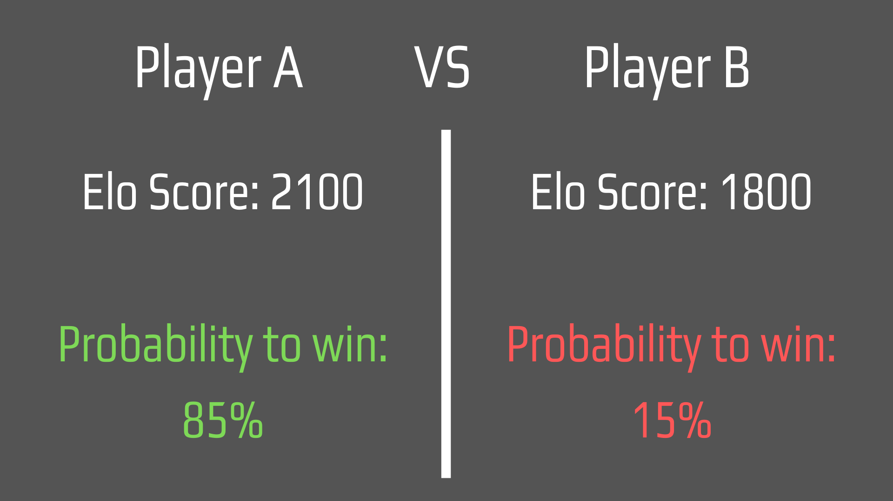
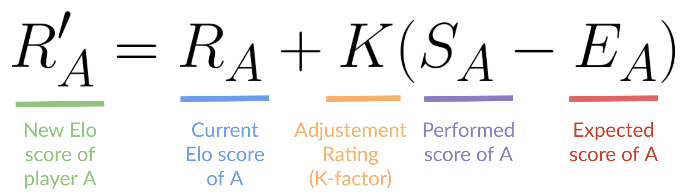

# ELO Rating System
In adversarial games, the cumulative environment reward may **not be a meaningful metric** by which to track
learning progress.

This is because the cumulative reward is **entirely dependent on the skill of the opponent**.

An agent at a particular skill level will get more or less reward against a worse or better agent,
respectively.

Instead, it's better to use ELO rating system, a method to calculate **the relative skill level between two players in a zero-sum game**.

If the training performs correctly, **this value should steadily increase**.

## What is a zero-sum game?
A zero-sum game is a game where **each player's gain or loss of utility is exactly balanced by the gain or loss of the utility of the opponent**.

Simply explained, we face a zero-sum game **when one agent gets +1.0, its opponent gets -1.0 reward**.

For instance, Tennis is a zero-sum game: if you win the point you get +1.0 and your opponent gets -1.0 reward.

## How works the ELO Rating System
- Each player **has an initial ELO score**. It's defined in the `initial_elo` trainer config hyperparameter.

- The **difference in rating between the two players** serves as the predictor of the outcomes of a match.

*For instance, if player A has an Elo score of 2100 and player B has an ELO score of 1800 the chance that player A wins is 85% against 15% for player b.*

- We calculate the **expected score of each player** using this formula:

- At the end of the game, based on the outcome **we update the player’s actual Elo score**, we use a linear adjustment proportional to the amount by which the player over-performed or under-performed.
The winning player takes points from the losing one:
  - If the *higher-rated player wins* → **a few points** will be taken from the lower-rated player.
  - If the *lower-rated player wins* → **a lot of points** will be taken from the high-rated player.
  - If it’s *a draw* → the lower-rated player gains **a few points** from higher.

- We update players rating using this formula:

### The Tennis example

- We start to train our agents.
- Both of them have the same skills. So ELO score for each of them that we defined using parameter `initial_elo = 1200.0`.

We calculate the expected score E:
Ea = 0.5
Eb = 0.5

So it means that each player has 50% chances of winning the point.

If A wins, the new rating R would be:

Ra = 1200 + 16 * (1 - 0.5) → 1208

Rb = 1200 + 16 * (0 - 0.5) → 1192

Player A has now an ELO score of 1208 and Player B an ELO score of 1192. Therefore, Player A is now a little bit **better than Player B**.
