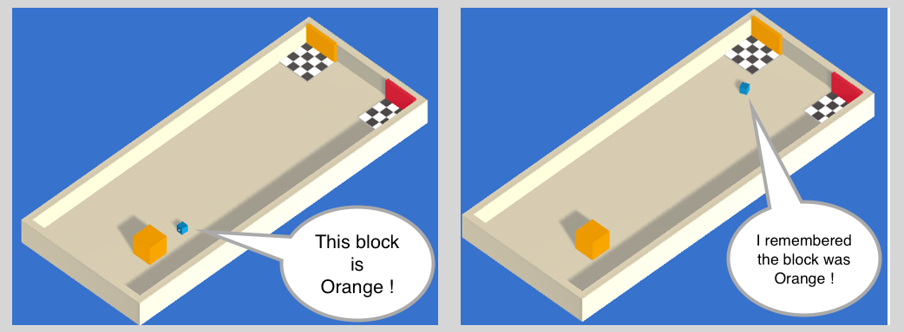

# Memory-enhanced agents using Recurrent Neural Networks

## What are memories used for?

Have you ever entered a room to get something and immediately forgot what you
were looking for? Don't let that happen to your agents.

It is now possible to give memories to your agents. When training, the agents
will be able to store a vector of floats to be used next time they need to make
a decision.



Deciding what the agents should remember in order to solve a task is not easy to
do by hand, but our training algorithms can learn to keep track of what is
important to remember with
[LSTM](https://en.wikipedia.org/wiki/Long_short-term_memory).

## How to use

When configuring the trainer parameters in the `config/trainer_config.yaml`
file, add the following parameters to the Behavior you want to use.

```json
use_recurrent: true
sequence_length: 64
memory_size: 256
```

* `use_recurrent` is a flag that notifies the  trainer that you want to use a
  Recurrent Neural Network.
* `sequence_length` defines how long the sequences of experiences must be while
  training. In order to use a LSTM, training requires a sequence of experiences
  instead of single experiences.
* `memory_size` corresponds to the size of the memory the agent must keep. Note
  that if this number is too small, the agent will not be able to remember a lot
  of things. If this number is too large, the neural network will take longer to
  train.

## Limitations

* LSTM does not work well with continuous vector action space. Please use
  discrete vector action space for better results.
* Since the memories must be sent back and forth between Python and Unity, using
  too large `memory_size` will slow down training.
* Adding a recurrent layer increases the complexity of the neural network, it is
  recommended to decrease `num_layers` when using recurrent.
* It is required that `memory_size` be divisible by 4.
