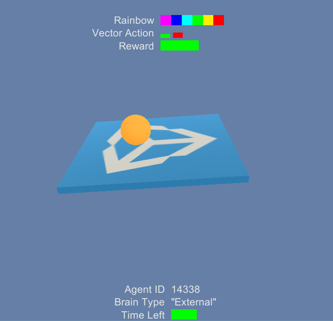

# Using the Monitor



The monitor allows visualizing information related to the agents or training process within a Unity scene. 

You can track many different things both related and unrelated to the agents themselves. To use the Monitor, call the Log function anywhere in your code :

```csharp
Monitor.Log(key, value, target)
```

 * *`key`* is the name of the information you want to display.
 * *`value`* is the information you want to display. *`value`* can have different types : 
   * *`string`* - The Monitor will display the string next to the key. It can be useful for displaying error messages.
   * *`float`* - The Monitor will display a slider. Note that the values must be between -1 and 1. If the value is positive, the slider will be green, if the value is negative, the slider will be red.
   * *`float[]`* - The Monitor Log call can take an additional argument called `displayType` that can be either `INDEPENDENT` (default) or `PROPORTIONAL` :
   		* *`INDEPENDENT`* is used to display multiple independent floats as a histogram. The histogram will be a sequence of vertical sliders.
   		* *`PROPORTION`* is used to see the proportions between numbers. For each float in values, a rectangle of width of value divided by the sum of all values will be show. It is best for visualizing values that sum to 1.
 * *`target`* is the transform to which you want to attach information. If the transform is `null` the information will be attached to the global monitor.
