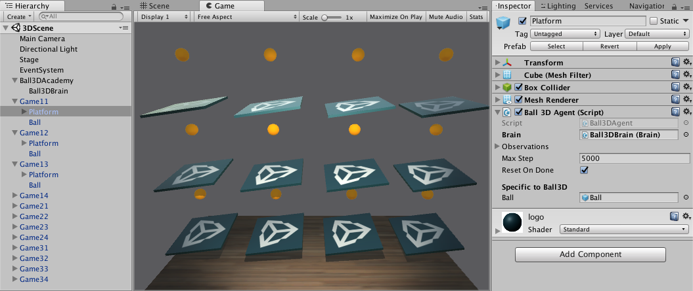
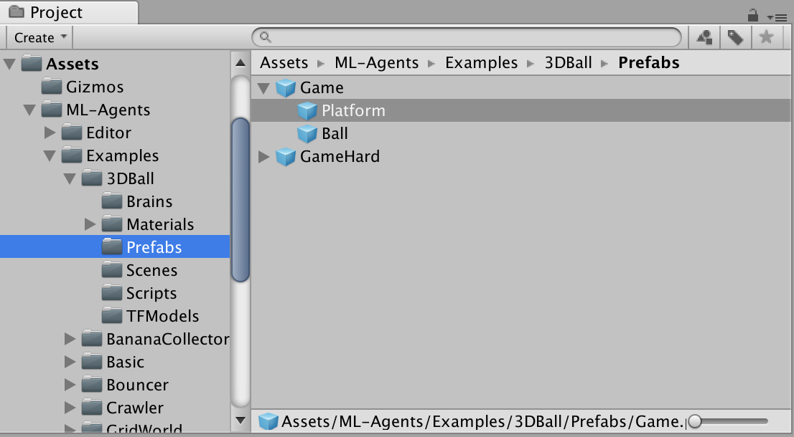
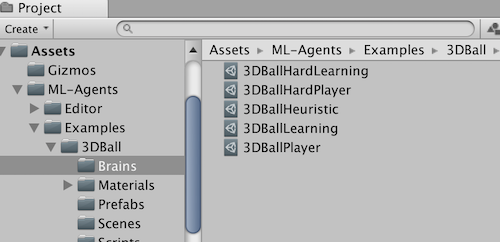
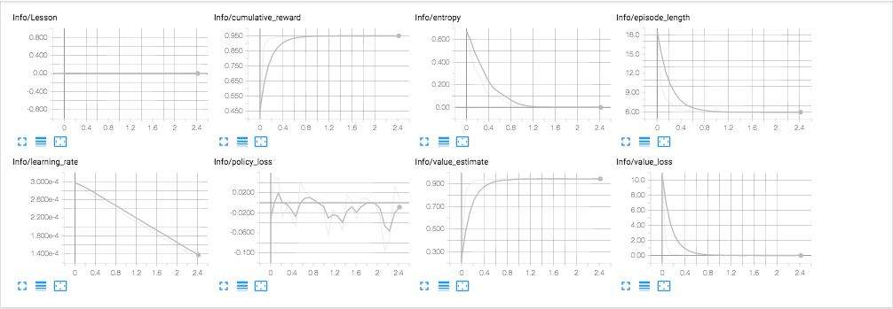

# Getting Started Guide

This guide walks through the end-to-end process of opening one of our
[example environments](Learning-Environment-Examples.md) in Unity, training an
Agent in it, and embedding the trained model into the Unity environment. After
reading this tutorial, you should be able to train any of the example
environments. If you are not familiar with the
[Unity Engine](https://unity3d.com/unity), view our
[Background: Unity](Background-Unity.md) page for helpful pointers.
Additionally, if you're not familiar with machine learning, view our
[Background: Machine Learning](Background-Machine-Learning.md) page for a brief
overview and helpful pointers.


For this guide, we'll use the **3D Balance Ball** environment which contains a
number of agent cubes and balls (which are all copies of each other). Each agent
cube tries to keep its ball from falling by rotating either horizontally or
vertically. In this environment, an agent cube is an **Agent** that receives a
reward for every step that it balances the ball. An agent is also penalized with
a negative reward for dropping the ball. The goal of the training process is to
have the agents learn to balance the ball on their head.

Let's get started!

## Installation

If you haven't already, follow the [installation instructions](Installation.md).
Afterwards, open the Unity Project that contains all the example environments:

1. Launch Unity Hub
1. On the Projects dialog, choose the **Add** option at the top of the window.
1. Using the file dialog that opens, locate the `Project` folder within the
   ML-Agents Toolkit and click **Open**.
1. In the **Project** window, go to the
   `Assets/ML-Agents/Examples/3DBall/Scenes` folder and open the `3DBall` scene
   file.

## Understanding a Unity Environment

An agent is an autonomous actor that observes and interacts with an
_environment_. In the context of Unity, an environment is a scene containing one
or more Agent objects, and, of course, the other entities that an agent
interacts with.



**Note:** In Unity, the base object of everything in a scene is the
_GameObject_. The GameObject is essentially a container for everything else,
including behaviors, graphics, physics, etc. To see the components that make up
a GameObject, select the GameObject in the Scene window, and open the Inspector
window. The Inspector shows every component on a GameObject.

The first thing you may notice after opening the 3D Balance Ball scene is that
it contains not one, but several agent cubes. Each agent cube in the scene is an
independent agent, but they all share the same Behavior. 3D Balance Ball does
this to speed up training since all twelve agents contribute to training in
parallel.

### Agent

The Agent is the actor that observes and takes actions in the environment. In
the 3D Balance Ball environment, the Agent components are placed on the twelve
"Agent" GameObjects. The base Agent object has a few properties that affect its
behavior:

- **Behavior Parameters** — Every Agent must have a Behavior. The Behavior
  determines how an Agent makes decisions.
- **Max Step** — Defines how many simulation steps can occur before the Agent's
  episode ends. In 3D Balance Ball, an Agent restarts after 5000 steps.

#### Behavior Parameters : Vector Observation Space

Before making a decision, an agent collects its observation about its state in
the world. The vector observation is a vector of floating point numbers which
contain relevant information for the agent to make decisions.

The Behavior Parameters of the 3D Balance Ball example uses a `Space Size` of 8.
This means that the feature vector containing the Agent's observations contains
eight elements: the `x` and `z` components of the agent cube's rotation and the
`x`, `y`, and `z` components of the ball's relative position and velocity.

#### Behavior Parameters : Vector Action Space

An Agent is given instructions in the form of a float array of _actions_.
ML-Agents Toolkit classifies actions into two types: continuous and discrete.
The 3D Balance Ball example is programmed to use continuous action space which
is a a vector of numbers that can vary continuously. More specifically, it uses
a `Space Size` of 2 to control the amount of `x` and `z` rotations to apply to
itself to keep the ball balanced on its head.

## Running a pre-trained model

We include pre-trained models for our agents (`.nn` files) and we use the
[Unity Inference Engine](Unity-Inference-Engine.md) to run these models inside
Unity. In this section, we will use the pre-trained model for the 3D Ball
example.

1. In the **Project** window, go to the
   `Assets/ML-Agents/Examples/3DBall/Prefabs` folder. Expand `3DBall` and click
   on the `Agent` prefab. You should see the `Agent` prefab in the **Inspector**
   window.

   **Note**: The platforms in the `3DBall` scene were created using the `3DBall`
   prefab. Instead of updating all 12 platforms individually, you can update the
   `3DBall` prefab instead.

   

1. In the **Project** window, drag the **3DBall** Model located in
   `Assets/ML-Agents/Examples/3DBall/TFModels` into the `Model` property under
   `Behavior Parameters (Script)` component in the Agent GameObject
   **Inspector** window.

   

1. You should notice that each `Agent` under each `3DBall` in the **Hierarchy**
   windows now contains **3DBall** as `Model` on the `Behavior Parameters`.
   **Note** : You can modify multiple game objects in a scene by selecting them
   all at once using the search bar in the Scene Hierarchy.
1. Set the **Inference Device** to use for this model as `CPU`.
1. Click the **Play** button in the Unity Editor and you will see the platforms
   balance the balls using the pre-trained model.

## Training a new model with Reinforcement Learning

While we provide pre-trained `.nn` files for the agents in this environment, any
environment you make yourself will require training agents from scratch to
generate a new model file. In this section we will demonstrate how to use the
reinforcement learning algorithms that are part of the ML-Agents Python package
to accomplish this. We have provided a convenient command `mlagents-learn` which
accepts arguments used to configure both training and inference phases.

### Training the environment

1. Open a command or terminal window.
1. Navigate to the folder where you cloned the `ml-agents` repository. **Note**:
   If you followed the default [installation](Installation.md), then you should
   be able to run `mlagents-learn` from any directory.
1. Run `mlagents-learn config/ppo/3DBall.yaml --run-id=first3DBallRun`.
   - `config/ppo/3DBall.yaml` is the path to a default training
     configuration file that we provide. The `config/ppo` folder includes training configuration
     files for all our example environments, including 3DBall.
   - `run-id` is a unique name for this training session.
1. When the message _"Start training by pressing the Play button in the Unity
   Editor"_ is displayed on the screen, you can press the **Play** button in
   Unity to start training in the Editor.

If `mlagents-learn` runs correctly and starts training, you should see something
like this:

```console
INFO:mlagents_envs:
'Ball3DAcademy' started successfully!
Unity Academy name: Ball3DAcademy

INFO:mlagents_envs:Connected new brain:
Unity brain name: 3DBallLearning
        Number of Visual Observations (per agent): 0
        Vector Observation space size (per agent): 8
        Number of stacked Vector Observation: 1
        Vector Action space type: continuous
        Vector Action space size (per agent): [2]
        Vector Action descriptions: ,
INFO:mlagents_envs:Hyperparameters for the PPO Trainer of brain 3DBallLearning:
        batch_size:          64
        beta:                0.001
        buffer_size:         12000
        epsilon:             0.2
        gamma:               0.995
        hidden_units:        128
        lambd:               0.99
        learning_rate:       0.0003
        max_steps:           5.0e4
        normalize:           True
        num_epoch:           3
        num_layers:          2
        time_horizon:        1000
        sequence_length:     64
        summary_freq:        1000
        use_recurrent:       False
        memory_size:         256
        use_curiosity:       False
        curiosity_strength:  0.01
        curiosity_enc_size:  128
        output_path: ./results/first3DBallRun/3DBallLearning
INFO:mlagents.trainers: first3DBallRun: 3DBallLearning: Step: 1000. Mean Reward: 1.242. Std of Reward: 0.746. Training.
INFO:mlagents.trainers: first3DBallRun: 3DBallLearning: Step: 2000. Mean Reward: 1.319. Std of Reward: 0.693. Training.
INFO:mlagents.trainers: first3DBallRun: 3DBallLearning: Step: 3000. Mean Reward: 1.804. Std of Reward: 1.056. Training.
INFO:mlagents.trainers: first3DBallRun: 3DBallLearning: Step: 4000. Mean Reward: 2.151. Std of Reward: 1.432. Training.
INFO:mlagents.trainers: first3DBallRun: 3DBallLearning: Step: 5000. Mean Reward: 3.175. Std of Reward: 2.250. Training.
INFO:mlagents.trainers: first3DBallRun: 3DBallLearning: Step: 6000. Mean Reward: 4.898. Std of Reward: 4.019. Training.
INFO:mlagents.trainers: first3DBallRun: 3DBallLearning: Step: 7000. Mean Reward: 6.716. Std of Reward: 5.125. Training.
INFO:mlagents.trainers: first3DBallRun: 3DBallLearning: Step: 8000. Mean Reward: 12.124. Std of Reward: 11.929. Training.
INFO:mlagents.trainers: first3DBallRun: 3DBallLearning: Step: 9000. Mean Reward: 18.151. Std of Reward: 16.871. Training.
INFO:mlagents.trainers: first3DBallRun: 3DBallLearning: Step: 10000. Mean Reward: 27.284. Std of Reward: 28.667. Training.
```

Note how the `Mean Reward` value printed to the screen increases as training
progresses. This is a positive sign that training is succeeding.

**Note**: You can train using an executable rather than the Editor. To do so,
follow the instructions in
[Using an Executable](Learning-Environment-Executable.md).

### Observing Training Progress

Once you start training using `mlagents-learn` in the way described in the
previous section, the `ml-agents` directory will contain a `summaries`
directory. In order to observe the training process in more detail, you can use
TensorBoard. From the command line run:

```sh
tensorboard --logdir=summaries
```

Then navigate to `localhost:6006` in your browser to view the TensorBoard
summary statistics as shown below. For the purposes of this section, the most
important statistic is `Environment/Cumulative Reward` which should increase
throughout training, eventually converging close to `100` which is the maximum
reward the agent can accumulate.



## Embedding the model into the Unity Environment

Once the training process completes, and the training process saves the model
(denoted by the `Saved Model` message) you can add it to the Unity project and
use it with compatible Agents (the Agents that generated the model). **Note:**
Do not just close the Unity Window once the `Saved Model` message appears.
Either wait for the training process to close the window or press `Ctrl+C` at
the command-line prompt. If you close the window manually, the `.nn` file
containing the trained model is not exported into the ml-agents folder.

If you've quit the training early using `Ctrl+C` and want to resume training,
run the same command again, appending the `--resume` flag:

```sh
mlagents-learn config/ppo/3DBall.yaml --run-id=firstRun --resume
```

Your trained model will be at `results/<run-identifier>/<behavior_name>.nn` where
`<behavior_name>` is the name of the `Behavior Name` of the agents corresponding
to the model. This file corresponds to your model's latest checkpoint. You can
now embed this trained model into your Agents by following the steps below,
which is similar to the steps described [above](#running-a-pre-trained-model).

1. Move your model file into
   `Project/Assets/ML-Agents/Examples/3DBall/TFModels/`.
1. Open the Unity Editor, and select the **3DBall** scene as described above.
1. Select the **3DBall** prefab Agent object.
1. Drag the `<behavior_name>.nn` file from the Project window of the Editor to
   the **Model** placeholder in the **Ball3DAgent** inspector window.
1. Press the **Play** button at the top of the Editor.

## Next Steps

- For more information on the ML-Agents Toolkit, in addition to helpful
  background, check out the [ML-Agents Toolkit Overview](ML-Agents-Overview.md)
  page.
- For a "Hello World" introduction to creating your own Learning Environment,
  check out the
  [Making a New Learning Environment](Learning-Environment-Create-New.md) page.
- For an overview on the more complex example environments that are provided in
  this toolkit, check out the
  [Example Environments](Learning-Environment-Examples.md) page.
- For more information on the various training options available, check out the
  [Training ML-Agents](Training-ML-Agents.md) page.
