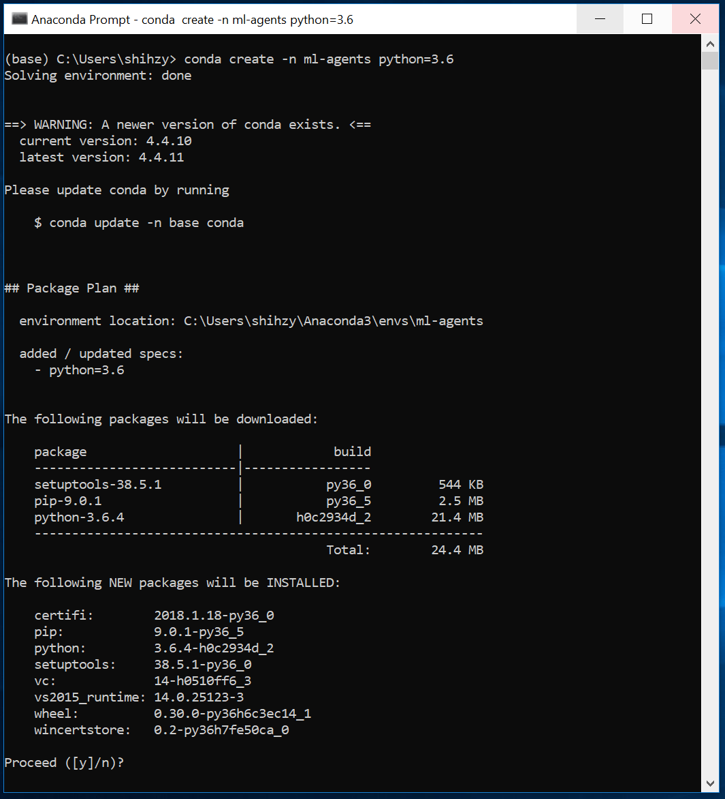
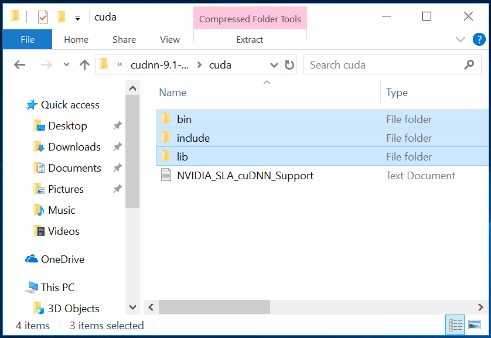
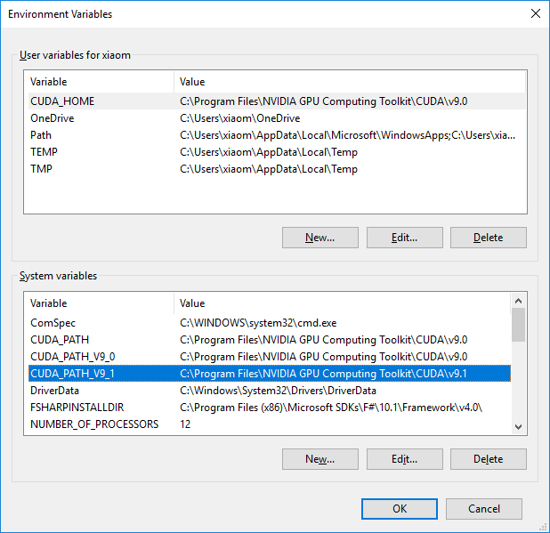
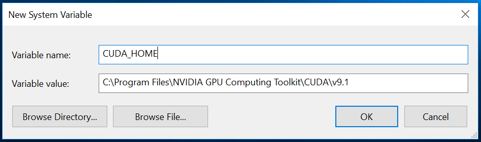
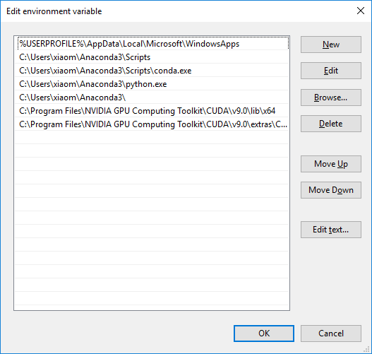

# Installing ML-Agents for Windows

ML-Agents supports Windows 10. While it might be possible to run ML-Agents using other versions of Windows, it has not been tested on other versions. Furthermore, ML-Agents has not been tested on a Windows VM such as Bootcamp or Parallels.

To use ML-Agents, you install Python and the required Python packages as outlined below. This guide also covers how set up GPU-based training (for advanced users). GPU-based training is not required for the v0.3 release of ML-Agents. However, training on a GPU might be required by future versions and features.

## Step 1: Install Python via Anaconda

[Download](https://www.anaconda.com/download/#windows) and install Anaconda for Windows. By using Anaconda, you can manage separate environments for different distributions of Python. Python 3 is required as we no longer support Python 2. In this guide, we are using Python version 3.6 and Anaconda version 5.1 ([64-bit](https://repo.continuum.io/archive/Anaconda3-5.1.0-Windows-x86_64.exe) or [32-bit](https://repo.continuum.io/archive/Anaconda3-5.1.0-Windows-x86.exe) direct links).

<p align="center">
    
</p>

We recommend the default _advanced installation options_. However, select the options appropriate for your specific situation.

<p align="center">
    
</p>

After installation, you must open __Anaconda Navigator__ to finish the setup. From the Windows search bar, type _anaconda navigator_. You can close Anaconda Navigator after it opens.

## Step 2: Setup and Activate a New Conda Environment

You will create a new [Conda environment](https://conda.io/docs/) to be used with ML-Agents. This means that all the packages that you install are localized to just this environment. It will not affect any other installation of Python or other environments. Whenever you want to run ML-Agents, you will need activate this Conda environment.

To create a new Conda environment, open a new Anaconda Prompt (_Anaconda Prompt_ in the search bar) and type in the following command:

```
conda create -n ml-agents python=3.6
```

You may be asked to install new packages. Type `y` and press enter _(make sure you are connected to the internet)_. You must install these required packages. The new Conda environment is called ml-agents and uses Python version 3.6.

<p align="center">
    
</p>

To use this environment, you must activate it. _(To use this environment In the future, you can run the same command)_. In the same Anaconda Prompt, type in the following command:

```
conda activate ml-agents
```

You should see `(ml-agents)` prepended on the last line.

Next, install `tensorflow`. Install this package using `pip` - which is a package management system used to install Python packages. In the same Anaconda Prompt, type in the following command _(make sure you are connected to the internet)_:

```
pip install tensorflow
```

## Step 3: Install Required Python Packages

ML-Agents depends on a number of Python packages. Use `pip` to install these Python dependencies.

If you haven't already, clone the ML-Agents Github repository to your local computer. You can do this using Git ([download here](https://git-scm.com/download/win)) and running the following commands in an Anaconda Prompt _(if you open a new prompt, be sure to activate the ml-agents Conda environment by typing `activate ml-agents`)_:

```
git clone git@github.com:Unity-Technologies/ml-agents.git
```

If you don't want to use Git, you can always directly download all the files [here](https://github.com/Unity-Technologies/ml-agents/archive/master.zip).

In our example, the files are located in `C:\Downloads`. After you have either cloned or downloaded the files, from the Anaconda Prompt, change to the python directory inside the ML-agents directory:

```
cd C:\Downloads\ml-agents\python
```

Make sure you are connected to the internet and then type in the Anaconda Prompt:

```
pip install .
```

This will complete the installation of all the required Python packages to run ML-Agents. 

## (Optional) Step 4: GPU Training using ML-Agents 

Not required to use v0.3 for ML-Agents. This is a guide for advanced users who want to train using GPUs. Additionally, you will need to check if your GPU is CUDA compatible. Please check Nvidia's page [here](https://developer.nvidia.com/cuda-gpus).

As of ML-Agents v0.3, only CUDA 8 and cuDNN 6 is supported.

### Install Nvidia CUDA toolkit

[Download](https://developer.nvidia.com/cuda-toolkit-archive) and install the CUDA toolkit from Nvidia's archive. The toolkit includes GPU-accelerated libraries, debugging and optimization tools, a C/C++ compiler and a runtime library and is needed to run ML-Agents. In this guide, we are using version 8.0.61 ([direct link](https://developer.nvidia.com/compute/cuda/8.0/Prod2/network_installers/cuda_8.0.61_win10_network-exe)). 

Before installing, please make sure you __close any running instances of Unity or Visual Studio__.

Run the installer and select the Express option. Note the directory where you installed the CUDA toolkit. In this guide, we installed in the directory `C:\Program Files\NVIDIA GPU Computing Toolkit\CUDA\v8.0`

### Install Nvidia cuDNN library

[Download](https://developer.nvidia.com/cudnn) and install the cuDNN library from Nvidia. cuDNN is is a GPU-accelerated library of primitives for deep neural networks. Before you can download, you will need to sign up for free to the Nvidia Developer Program.

<p align="center">
    
</p>

Once you've signed up, go back to the cuDNN [downloads page](https://developer.nvidia.com/cudnn). You may or may not be asked to fill out a short survey. When you get to the list cuDNN releases, __make sure you are downloading the right version for the CUDA toolkit you installed in Step 1.__  In this guide, we are using version 6.0 for CUDA toolkit version 8.0 ([direct link](https://developer.nvidia.com/compute/machine-learning/cudnn/secure/v6/prod/8.0_20170307/cudnn-8.0-windows10-x64-v6.0-zip)).

After you have downloaded the cuDNN files, you will need to extract the files into the CUDA toolkit directory. In the cuDNN zip file, there are three folders called `bin`, `include`, and `lib`. 

<p align="center">
    
</p>

Copy these three folders into the CUDA toolkit directory. The CUDA toolkit directory is located at `C:\Program Files\NVIDIA GPU Computing Toolkit\CUDA\v8.0`

<p align="center">
    
</p>

### Set Environment Variables

You will need to add one environment variable and two path variables.

To set the environment variable, type `environment variables` in the search bar (this can be reached by hitting the Windows key or the bottom left Windows button). You should see an option called __Edit the system environment variables__. 

<p align="center">
    
</p>

From here, click the __Environment Variables__ button. Click __New__ to add a new system variable _(make sure you do this under __System variables__ and not User variables_. 

<p align="center">
    
</p>

For __Variable Name__, enter `CUDA_HOME`. For the variable value, put the directory location for the CUDA toolkit. In this guide, the directory location is `C:\Program Files\NVIDIA GPU Computing Toolkit\CUDA\v8.0`. Press __OK__ once.

<p align="center">
    
</p>

To set the two path variables, inside the same __Environment Variables__ window and under the second box called __System Variables__, find a variable called `PATH` and click __Edit__. You will add two directories to the list. For this guide, the two entries would look like:

    C:\Program Files\NVIDIA GPU Computing Toolkit\CUDA\v8.0\lib\x64
    C:\Program Files\NVIDIA GPU Computing Toolkit\CUDA\v8.0\extras\CUPTI\libx64

Make sure to replace the relevant directory location with the one you have installed. _Please note that case sensitivity matters_.

<p align="center">
    
</p>

### Install TensorFlow GPU
Next, install `tensorflow-gpu` using `pip`. In an Anaconda Prompt with the Conda environment ml-agents activated, type in the following command _(make sure you are connected to the internet)_:

```
pip install tensorflow-gpu
```

Lastly, you should test to see if everything installed properly and that TensorFlow can identify your GPU. In the same Anaconda Prompt, type in the following command:

```python
import tensorflow as tf

sess = tf.Session(config=tf.ConfigProto(log_device_placement=True))
```

You should see something similar to:

```
Found device 0 with properties ...
```

## Acknowledgements

We would like to thank [Jason Weimann](https://unity3d.college/2017/10/25/machine-learning-in-unity3d-setting-up-the-environment-tensorflow-for-agentml-on-windows-10/) and [Nitish S. Mutha](http://blog.nitishmutha.com/tensorflow/2017/01/22/TensorFlow-with-gpu-for-windows.html) for writing the original articles which were used to create this guide.
