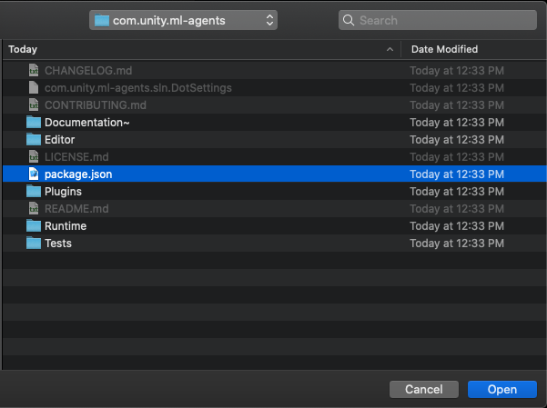

# Installation

The ML-Agents Toolkit contains several components:

- Unity package ([`com.unity.ml-agents`](../com.unity.ml-agents/)) contains the
  Unity C# SDK that will be integrated into your Unity project.  This package contains
  a sample to help you get started with ML-Agents.
- Unity package
  ([`com.unity.ml-agents.extensions`](../com.unity.ml-agents.extensions/))
  contains experimental C#/Unity components that are not yet ready to be part
  of the base `com.unity.ml-agents` package. `com.unity.ml-agents.extensions`
  has a direct dependency on `com.unity.ml-agents`.
- Three Python packages:
  - [`mlagents`](../ml-agents/) contains the machine learning algorithms that
    enables you to train behaviors in your Unity scene. Most users of ML-Agents
    will only need to directly install `mlagents`.
  - [`mlagents_envs`](../ml-agents-envs/) contains a Python API to interact with
    a Unity scene. It is a foundational layer that facilitates data messaging
    between Unity scene and the Python machine learning algorithms.
    Consequently, `mlagents` depends on `mlagents_envs`.
  - [`gym_unity`](../gym-unity/) provides a Python-wrapper for your Unity scene
    that supports the OpenAI Gym interface.
- Unity [Project](../Project/) that contains several
  [example environments](Learning-Environment-Examples.md) that highlight the
  various features of the toolkit to help you get started.

Consequently, to install and use the ML-Agents Toolkit you will need to:

- Install Unity (2020.3 or later)
- Install Python (3.6.1 or higher)
- Clone this repository (Optional)
  - __Note:__ If you do not clone the repository, then you will not be
  able to access the example environments and training configurations or the
  `com.unity.ml-agents.extensions` package. Additionally, the
  [Getting Started Guide](Getting-Started.md) assumes that you have cloned the
  repository.
- Install the `com.unity.ml-agents` Unity package
- Install the `com.unity.ml-agents.extensions` Unity package (Optional)
- Install the `mlagents` Python package

### Install **Unity 2020.3** or Later

[Download](https://unity3d.com/get-unity/download) and install Unity. We
strongly recommend that you install Unity through the Unity Hub as it will
enable you to manage multiple Unity versions.

### Install **Python 3.6.1** or Higher

We recommend [installing](https://www.python.org/downloads/) Python 3.6 or 3.7.
If you are using Windows, please install the x86-64 version and not x86.
If your Python environment doesn't include `pip3`, see these
[instructions](https://packaging.python.org/guides/installing-using-linux-tools/#installing-pip-setuptools-wheel-with-linux-package-managers)
on installing it.

### Clone the ML-Agents Toolkit Repository (Optional)

Now that you have installed Unity and Python, you can now install the Unity and
Python packages. You do not need to clone the repository to install those
packages, but you may choose to clone the repository if you'd like download our
example environments and training configurations to experiment with them (some
of our tutorials / guides assume you have access to our example environments).

**NOTE:** There are samples shipped with the Unity Package.  You only need to clone
the repository if you would like to explore more examples.

```sh
git clone --branch release_19 https://github.com/Unity-Technologies/ml-agents.git
```

The `--branch release_19` option will switch to the tag of the latest stable
release. Omitting that will get the `main` branch which is potentially unstable.

#### Advanced: Local Installation for Development

You will need to clone the repository if you plan to modify or extend the
ML-Agents Toolkit for your purposes. If you plan to contribute those changes
back, make sure to clone the `main` branch (by omitting `--branch release_19`
from the command above). See our
[Contributions Guidelines](../com.unity.ml-agents/CONTRIBUTING.md) for more
information on contributing to the ML-Agents Toolkit.

### Install the `com.unity.ml-agents` Unity package

The Unity ML-Agents C# SDK is a Unity Package. You can install the
`com.unity.ml-agents` package
[directly from the Package Manager registry](https://docs.unity3d.com/Manual/upm-ui-install.html).
Please make sure you enable 'Preview Packages' in the 'Advanced' dropdown in
order to find the latest Preview release of the package.

**NOTE:** If you do not see the ML-Agents package listed in the Package Manager
please follow the [advanced installation instructions](#advanced-local-installation-for-development) below.

#### Advanced: Local Installation for Development

You can [add the local](https://docs.unity3d.com/Manual/upm-ui-local.html)
`com.unity.ml-agents` package (from the repository that you just cloned) to your
project by:

1. navigating to the menu `Window` -> `Package Manager`.
1. In the package manager window click on the `+` button on the top left of the packages list).
1. Select `Add package from disk...`
1. Navigate into the `com.unity.ml-agents` folder.
1. Select the `package.json` file.

<p align="center">
  
  
</p>

If you are going to follow the examples from our documentation, you can open the
`Project` folder in Unity and start tinkering immediately.

### Install the `com.unity.ml-agents.extensions` Unity package (Optional)

To install the `com.unity.ml-agents.extensions` package, you need to first
clone the repo and then complete a local installation similar to what was
outlined in the previous
[Advanced: Local Installation for Development](#advanced-local-installation-for-development-1)
section. Complete installation steps can be found in the
[package documentation](../com.unity.ml-agents.extensions/Documentation~/com.unity.ml-agents.extensions.md#installation).

### Install the `mlagents` Python package

Installing the `mlagents` Python package involves installing other Python
packages that `mlagents` depends on. So you may run into installation issues if
your machine has older versions of any of those dependencies already installed.
Consequently, our supported path for installing `mlagents` is to leverage Python
Virtual Environments. Virtual Environments provide a mechanism for isolating the
dependencies for each project and are supported on Mac / Windows / Linux. We
offer a dedicated [guide on Virtual Environments](Using-Virtual-Environment.md).

#### (Windows) Installing PyTorch

On Windows, you'll have to install the PyTorch package separately prior to
installing ML-Agents. Activate your virtual environment and run from the command line:

```sh
pip3 install torch~=1.7.1 -f https://download.pytorch.org/whl/torch_stable.html
```

Note that on Windows, you may also need Microsoft's
[Visual C++ Redistributable](https://support.microsoft.com/en-us/help/2977003/the-latest-supported-visual-c-downloads)
if you don't have it already. See the [PyTorch installation guide](https://pytorch.org/get-started/locally/)
for more installation options and versions.

#### Installing `mlagents`

To install the `mlagents` Python package, activate your virtual environment and
run from the command line:

```sh
python -m pip install mlagents==0.28.0
```

Note that this will install `mlagents` from PyPi, _not_ from the cloned
repository. If you installed this correctly, you should be able to run
`mlagents-learn --help`, after which you will see the command
line parameters you can use with `mlagents-learn`.

By installing the `mlagents` package, the dependencies listed in the
[setup.py file](../ml-agents/setup.py) are also installed. These include
[PyTorch](Background-PyTorch.md) (Requires a CPU w/ AVX support).

#### Advanced: Local Installation for Development

If you intend to make modifications to `mlagents` or `mlagents_envs`, you should
install the packages from the cloned repository rather than from PyPi. To do
this, you will need to install `mlagents` and `mlagents_envs` separately. From
the repository's root directory, run:

```sh
pip3 install torch -f https://download.pytorch.org/whl/torch_stable.html
pip3 install -e ./ml-agents-envs
pip3 install -e ./ml-agents
```

Running pip with the `-e` flag will let you make changes to the Python files
directly and have those reflected when you run `mlagents-learn`. It is important
to install these packages in this order as the `mlagents` package depends on
`mlagents_envs`, and installing it in the other order will download
`mlagents_envs` from PyPi.

## Next Steps

The [Getting Started](Getting-Started.md) guide contains several short tutorials
on setting up the ML-Agents Toolkit within Unity, running a pre-trained model,
in addition to building and training environments.

## Help

If you run into any problems regarding ML-Agents, refer to our [FAQ](FAQ.md) and
our [Limitations](Limitations.md) pages. If you can't find anything please
[submit an issue](https://github.com/Unity-Technologies/ml-agents/issues) and
make sure to cite relevant information on OS, Python version, and exact error
message (whenever possible).
