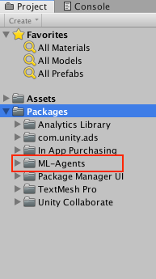
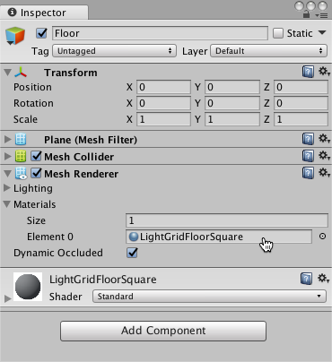
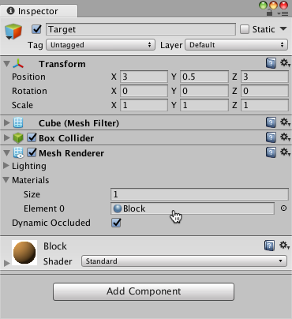
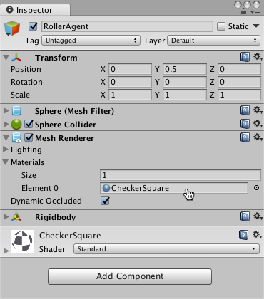
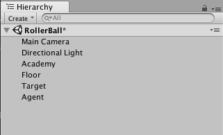
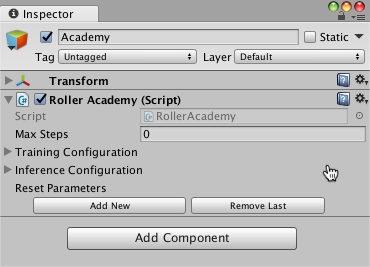

# Making a New Learning Environment

This tutorial walks through the process of creating a Unity Environment. A Unity
Environment is an application built using the Unity Engine which can be used to
train Reinforcement Learning Agents.


In this example, we will train a ball to roll to a randomly placed cube. The
ball also learns to avoid falling off the platform.

## Overview

Using the ML-Agents toolkit in a Unity project involves the following basic
steps:

1. Create an environment for your agents to live in. An environment can range
    from a simple physical simulation containing a few objects to an entire game
    or ecosystem.
2. Implement an Academy subclass and add it to a GameObject in the Unity scene
    containing the environment. Your Academy class can implement a few optional
    methods to update the scene independently of any agents. For example, you can
    add, move, or delete agents and other entities in the environment.
3. Implement your Agent subclasses. An Agent subclass defines the code an Agent
    uses to observe its environment, to carry out assigned actions, and to
    calculate the rewards used for reinforcement training. You can also implement
    optional methods to reset the Agent when it has finished or failed its task.
4. Add your Agent subclasses to appropriate GameObjects, typically, the object
    in the scene that represents the Agent in the simulation.

**Note:** If you are unfamiliar with Unity, refer to
[Learning the interface](https://docs.unity3d.com/Manual/LearningtheInterface.html)
in the Unity Manual if an Editor task isn't explained sufficiently in this
tutorial.

If you haven't already, follow the [installation instructions](Installation.md).

## Set Up the Unity Project

The first task to accomplish is simply creating a new Unity project and
importing the ML-Agents assets into it:

1. Launch the Unity Editor and create a new project named "RollerBall".
2. Make sure that the Scripting Runtime Version for the project is set to use
    **.NET 4.x Equivalent** (This is an experimental option in Unity 2017,
    but is the default as of 2018.3.)
3. In a file system window, navigate to the folder containing your cloned
    ML-Agents repository.
4. Drag the `ML-Agents` folder from `UnitySDK/Assets` to the Unity
    Editor Project window.

Your Unity **Project** window should contain the following assets:



## Create the Environment

Next, we will create a very simple scene to act as our ML-Agents environment.
The "physical" components of the environment include a Plane to act as the floor
for the Agent to move around on, a Cube to act as the goal or target for the
agent to seek, and a Sphere to represent the Agent itself.

### Create the Floor Plane

1. Right click in Hierarchy window, select 3D Object > Plane.
2. Name the GameObject "Floor."
3. Select the Floor Plane to view its properties in the Inspector window.
4. Set Transform to Position = (0, 0, 0), Rotation = (0, 0, 0), Scale = (1, 1, 1).
5. On the Plane's Mesh Renderer, expand the Materials property and change the
    default-material to *LightGridFloorSquare* (or any suitable material of your choice).

(To set a new material, click the small circle icon next to the current material
name. This opens the **Object Picker** dialog so that you can choose a
different material from the list of all materials currently in the project.)



### Add the Target Cube

1. Right click in Hierarchy window, select 3D Object > Cube.
2. Name the GameObject "Target"
3. Select the Target Cube to view its properties in the Inspector window.
4. Set Transform to Position = (3, 0.5, 3), Rotation = (0, 0, 0), Scale = (1, 1, 1).
5. On the Cube's Mesh Renderer, expand the Materials property and change the
    default-material to *Block*.



### Add the Agent Sphere

1. Right click in Hierarchy window, select 3D Object > Sphere.
2. Name the GameObject "RollerAgent"
3. Select the RollerAgent Sphere to view its properties in the Inspector window.
4. Set Transform to Position = (0, 0.5, 0), Rotation = (0, 0, 0), Scale = (1, 1, 1).
5. On the Sphere's Mesh Renderer, expand the Materials property and change the
    default-material to *CheckerSquare*.
6. Click **Add Component**.
7. Add the Physics/Rigidbody component to the Sphere.



Note that we will create an Agent subclass to add to this GameObject as a
component later in the tutorial.

### Add an Empty GameObject to Hold the Academy

1. Right click in Hierarchy window, select Create Empty.
2. Name the GameObject "Academy"



You can adjust the camera angles to give a better view of the scene at runtime.
The next steps will be to create and add the ML-Agent components.

## Implement an Academy

The Academy object coordinates the ML-Agents in the scene and drives the
decision-making portion of the simulation loop. Every ML-Agent scene needs one
Academy instance. Since the base Academy class is abstract, you must make your
own subclass even if you don't need to use any of the methods for a particular
environment.

First, add a New Script component to the Academy GameObject created earlier:

1. Select the Academy GameObject to view it in the Inspector window.
2. Click **Add Component**.
3. Click **New Script** in the list of components (at the bottom).
4. Name the script "RollerAcademy".
5. Click **Create and Add**.

Next, edit the new `RollerAcademy` script:

1. In the Unity Project window, double-click the `RollerAcademy` script to open
    it in your code editor. (By default new scripts are placed directly in the
    **Assets** folder.)
2. In the code editor, add the statement, `using MLAgents;`.
3. Change the base class from `MonoBehaviour` to `Academy`.
4. Delete the `Start()` and `Update()` methods that were added by default.

In such a basic scene, we don't need the Academy to initialize, reset, or
otherwise control any objects in the environment so we have the simplest
possible Academy implementation:

```csharp
using MLAgents;

public class RollerAcademy : Academy { }
```

The default settings for the Academy properties are also fine for this
environment, so we don't need to change anything for the RollerAcademy component
in the Inspector window.



## Implement an Agent

To create the Agent:

1. Select the RollerAgent GameObject to view it in the Inspector window.
2. Click **Add Component**.
3. Click **New Script** in the list of components (at the bottom).
4. Name the script "RollerAgent".
5. Click **Create and Add**.

Then, edit the new `RollerAgent` script:

1. In the Unity Project window, double-click the `RollerAgent` script to open it
   in your code editor.
2. In the editor, add the `using MLAgents;` statement and then change the base
    class from `MonoBehaviour` to `Agent`.
3. Delete the `Update()` method, but we will use the `Start()` function, so
    leave it alone for now.

So far, these are the basic steps that you would use to add ML-Agents to any
Unity project. Next, we will add the logic that will let our Agent learn to roll
to the cube using reinforcement learning.

In this simple scenario, we don't use the Academy object to control the
environment. If we wanted to change the environment, for example change the size
of the floor or add or remove agents or other objects before or during the
simulation, we could implement the appropriate methods in the Academy. Instead,
we will have the Agent do all the work of resetting itself and the target when
it succeeds or falls trying.

### Initialization and Resetting the Agent

When the Agent reaches its target, it marks itself done and its Agent reset
function moves the target to a random location. In addition, if the Agent rolls
off the platform, the reset function puts it back onto the floor.

To move the target GameObject, we need a reference to its Transform (which
stores a GameObject's position, orientation and scale in the 3D world). To get
this reference, add a public field of type `Transform` to the RollerAgent class.
Public fields of a component in Unity get displayed in the Inspector window,
allowing you to choose which GameObject to use as the target in the Unity
Editor.

To reset the Agent's velocity (and later to apply force to move the
agent) we need a reference to the Rigidbody component. A
[Rigidbody](https://docs.unity3d.com/ScriptReference/Rigidbody.html) is Unity's
primary element for physics simulation. (See
[Physics](https://docs.unity3d.com/Manual/PhysicsSection.html) for full
documentation of Unity physics.) Since the Rigidbody component is on the same
GameObject as our Agent script, the best way to get this reference is using
`GameObject.GetComponent<T>()`, which we can call in our script's `Start()`
method.

So far, our RollerAgent script looks like:

```csharp
using System.Collections.Generic;
using UnityEngine;
using MLAgents;

public class RollerAgent : Agent
{
    Rigidbody rBody;
    void Start () {
        rBody = GetComponent<Rigidbody>();
    }

    public Transform Target;
    public override void AgentReset()
    {
        if (this.transform.position.y < 0)
        {
            // If the Agent fell, zero its momentum
            this.rBody.angularVelocity = Vector3.zero;
            this.rBody.velocity = Vector3.zero;
            this.transform.position = new Vector3( 0, 0.5f, 0);
        }

        // Move the target to a new spot
        Target.position = new Vector3(Random.value * 8 - 4,
                                      0.5f,
                                      Random.value * 8 - 4);
    }
}
```

Next, let's implement the `Agent.CollectObservations()` method.

### Observing the Environment

The Agent sends the information we collect to the Brain, which uses it to make a
decision. When you train the Agent (or use a trained model), the data is fed
into a neural network as a feature vector. For an Agent to successfully learn a
task, we need to provide the correct information. A good rule of thumb for
deciding what information to collect is to consider what you would need to
calculate an analytical solution to the problem.

In our case, the information our Agent collects includes:

* Position of the target.

```csharp
AddVectorObs(Target.position);
```

* Position of the Agent itself.

```csharp
AddVectorObs(this.transform.position);
```

* The velocity of the Agent. This helps the Agent learn to control its speed so
    it doesn't overshoot the target and roll off the platform.

```csharp
// Agent velocity
AddVectorObs(rBody.velocity.x);
AddVectorObs(rBody.velocity.z);
```

In total, the state observation contains 8 values and we need to use the
continuous state space when we get around to setting the Brain properties:

```csharp
public override void CollectObservations()
{
    // Target and Agent positions
    AddVectorObs(Target.position);
    AddVectorObs(this.transform.position);

    // Agent velocity
    AddVectorObs(rBody.velocity.x);
    AddVectorObs(rBody.velocity.z);
}
```

The final part of the Agent code is the `Agent.AgentAction()` method, which
receives the decision from the Brain and assigns the reward.

### Actions

The decision of the Brain comes in the form of an action array passed to the
`AgentAction()` function. The number of elements in this array is determined by
the `Vector Action` `Space Type` and `Space Size` settings of the
agent's Brain. The RollerAgent uses the continuous vector action space and needs
two continuous control signals from the Brain. Thus, we will set the Brain
`Space Size` to 2. The first element,`action[0]` determines the force
applied along the x axis; `action[1]` determines the force applied along the z
axis. (If we allowed the Agent to move in three dimensions, then we would need
to set `Vector Action Size` to 3.) Note that the Brain really has no idea what the values in
the action array mean. The training process just adjusts the action values in
response to the observation input and then sees what kind of rewards it gets as
a result.

The RollerAgent applies the values from the `action[]` array to its Rigidbody
component, `rBody`, using the `Rigidbody.AddForce` function:

```csharp
Vector3 controlSignal = Vector3.zero;
controlSignal.x = action[0];
controlSignal.z = action[1];
rBody.AddForce(controlSignal * speed);
```

### Rewards

Reinforcement learning requires rewards. Assign rewards in the `AgentAction()`
function. The learning algorithm uses the rewards assigned to the Agent during
the simulation and learning process to determine whether it is giving
the Agent the optimal actions. You want to reward an Agent for completing the
assigned task. In this case, the Agent is given a reward of 1.0 for reaching the
Target cube.

The RollerAgent calculates the distance to detect when it reaches the target.
When it does, the code calls the `Agent.SetReward()` method to assign a
reward of 1.0 and marks the agent as finished by calling the `Done()` method
on the Agent.

```csharp
float distanceToTarget = Vector3.Distance(this.transform.position,
                                          Target.position);
// Reached target
if (distanceToTarget < 1.42f)
{
    SetReward(1.0f);
    Done();
}
```

**Note:** When you mark an Agent as done, it stops its activity until it is
reset. You can have the Agent reset immediately, by setting the
Agent.ResetOnDone property to true in the inspector or you can wait for the
Academy to reset the environment. This RollerBall environment relies on the
`ResetOnDone` mechanism and doesn't set a `Max Steps` limit for the Academy (so
it never resets the environment).

Finally, if the Agent falls off the platform,  set the Agent to done so that it can reset itself:

```csharp
// Fell off platform
if (this.transform.position.y < 0)
{
    Done();
}
```

### AgentAction()

With the action and reward logic outlined above, the final version of the
`AgentAction()` function looks like:

```csharp
public float speed = 10;
public override void AgentAction(float[] vectorAction)
{
    // Actions, size = 2
    Vector3 controlSignal = Vector3.zero;
    controlSignal.x = vectorAction[0];
    controlSignal.z = vectorAction[1];
    rBody.AddForce(controlSignal * speed);

    // Rewards
    float distanceToTarget = Vector3.Distance(this.transform.position,
                                              Target.position);

    // Reached target
    if (distanceToTarget < 1.42f)
    {
        SetReward(1.0f);
        Done();
    }

    // Fell off platform
    if (this.transform.position.y < 0)
    {
        Done();
    }

}
```

Note the `speed` class variable defined before the
function. Since `speed` is public, you can set the value from the Inspector
window.

## Final Editor Setup

Now, that all the GameObjects and ML-Agent components are in place, it is time
to connect everything together in the Unity Editor. This involves
changing some of the Agent Component's properties so that they are compatible
with our Agent code.

1. Select the **RollerAgent** GameObject to show its properties in the Inspector
    window.
2. Change **Decision Interval** from `1` to `10`.
3. Drag the Target GameObject from the Hierarchy window to the RollerAgent
    Target field.
4. Add the Behavior Parameters script with the Add Component button from the RollerAgent Inspector.
5. Modify the Behavior Parameters of the Agent :
  * `Behavior Name` to *RollerBallBrain*
  * `Vector Observation` `Space Size` = 8
  * `Vector Action` `Space Type` = **Continuous**
  * `Vector Action` `Space Size` = 2

Now you are ready to test the environment before training.

## Testing the Environment

It is always a good idea to test your environment manually before embarking on
an extended training run. To do so, you will need to implement the `Heuristic()`
method on the RollerAgent class. This will allow you control the Agent using
direct keyboard control.

The `Heuristic()` method will look like this :

```csharp
    public override float[] Heuristic()
    {
        var action = new float[2];
        action[0] = Input.GetAxis("Horizontal");
        action[1] = Input.GetAxis("Vertical");
        return action;
    }
```

What this code means is that the heuristic will generate an action corresponding
to the values of the "Horizontal" and "Vertical" input axis (which correspond to
the keyboard arrow keys).

In order for the Agent to use the Heuristic, You will need to check the `Use Heuristic`
checkbox in the `Behavior Parameters` of the RollerAgent.


Press **Play** to run the scene and use the arrows keys to move the Agent around
the platform. Make sure that there are no errors displayed in the Unity editor
Console window and that the Agent resets when it reaches its target or falls
from the platform. Note that for more involved debugging, the ML-Agents SDK
includes a convenient Monitor class that you can use to easily display Agent
status information in the Game window.

One additional test you can perform is to first ensure that your environment and
the Python API work as expected using the `notebooks/getting-started.ipynb`
[Jupyter notebook](Background-Jupyter.md). Within the notebook, be sure to set
`env_name` to the name of the environment file you specify when building this
environment.

## Training the Environment

The process is
the same as described in [Training ML-Agents](Training-ML-Agents.md). Note that the
models will be created in the original ml-agents project folder, `ml-agents/models`.

The hyperparameters for training are specified in the configuration file that you
pass to the `mlagents-learn` program. Using the default settings specified
in the original `ml-agents/config/trainer_config.yaml` file, the
RollerAgent takes about 300,000 steps to train. However, you can change the
following hyperparameters  to speed up training considerably (to under 20,000 steps):

    batch_size: 10
    buffer_size: 100

Since this example creates a very simple training environment with only a few inputs
and outputs, using small batch and buffer sizes speeds up the training considerably.
However, if you add more complexity to the environment or change the reward or
observation functions, you might also find that training performs better with different
hyperparameter values.

**Note:** In addition to setting these hyperparameter values, the Agent
**DecisionFrequency** parameter has a large effect on training time and success.
A larger value reduces the number of decisions the training algorithm has to consider and,
in this simple environment, speeds up training.

To train in the editor, run the following Python command from a Terminal or Console
window before pressing play:

    mlagents-learn config/config.yaml --run-id=RollerBall-1 --train

(where `config.yaml` is a copy of `trainer_config.yaml` that you have edited
to change the `batch_size` and `buffer_size` hyperparameters for your trainer.)

**Note:** If you get a `command not found` error when running this command,  make sure
that you have followed the *Install Python and mlagents Package* section of the
ML-Agents [Installation](Installation.md) instructions.

To monitor the statistics of Agent performance during training, use
[TensorBoard](Using-Tensorboard.md).


In particular, the *cumulative_reward* and *value_estimate* statistics show how
well the Agent is achieving the task. In this example, the maximum reward an
Agent can earn is 1.0, so these statistics approach that value when the Agent
has successfully *solved* the problem.

**Note:** If you use TensorBoard, always increment or change the `run-id`
you pass to the `mlagents-learn` command for each training run. If you use
the same id value, the statistics for multiple runs are combined and become
difficult to interpret.

## Optional: Multiple Training Areas within the Same Scene

In many of the [example environments](Learning-Environment-Examples.md), many copies of
the training area are instantiated in the scene. This generally speeds up training,
allowing the environment to gather many experiences in parallel. This can be achieved
simply by instantiating many Agents which share the `Behavior Parameters`. Use the following steps to
parallelize your RollerBall environment.

### Instantiating Multiple Training Areas

1. Right-click on your Project Hierarchy and create a new empty GameObject.
   Name it TrainingArea.
2. Reset the TrainingArea’s Transform so that it is at (0,0,0) with Rotation (0,0,0)
   and Scale (1,1,1).
3. Drag the Floor, Target, and RollerAgent GameObjects in the Hierarchy into the
   TrainingArea GameObject.
4. Drag the TrainingArea GameObject, along with its attached GameObjects, into your
   Assets browser, turning it into a prefab.
5. You can now instantiate copies of the TrainingArea prefab. Drag them into your scene,
   positioning them so that they do not overlap.

### Editing the Scripts

You will notice that in the previous section, we wrote our scripts assuming that our
TrainingArea was at (0,0,0), performing checks such as `this.transform.position.y < 0`
to determine whether our agent has fallen off the platform. We will need to change
this if we are to use multiple TrainingAreas throughout the scene.

A quick way to adapt our current code is to use
localPosition rather than position, so that our position reference is in reference
to the prefab TrainingArea's location, and not global coordinates.

1. Replace all references of `this.transform.position` in RollerAgent.cs with `this.transform.localPosition`.
2. Replace all references of `Target.position` in RollerAgent.cs with `Target.localPosition`.

This is only one way to achieve this objective. Refer to the
[example environments](Learning-Environment-Examples.md) for other ways we can achieve relative positioning.

## Review: Scene Layout

This section briefly reviews how to organize your scene when using Agents in
your Unity environment.

There are two kinds of game objects you need to include in your scene in order
to use Unity ML-Agents: an Academy and one or more Agents.

Keep in mind:

* There can only be one Academy game object in a scene.
* If you are using multiple training areas, make sure all the Agents have the same `Behavior Name`
and `Behavior Parameters`


