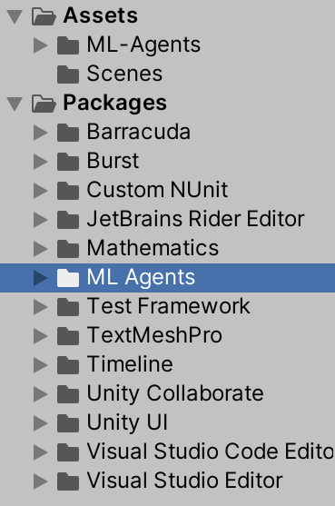
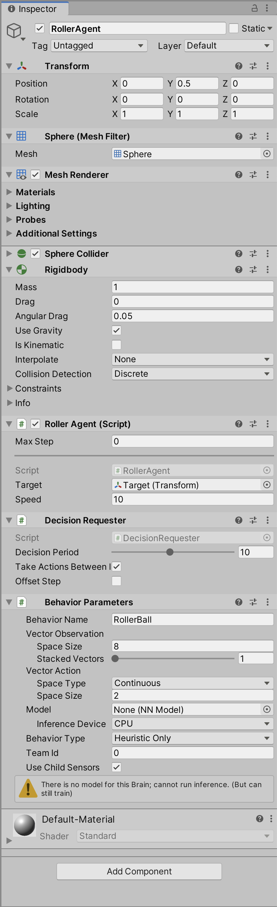
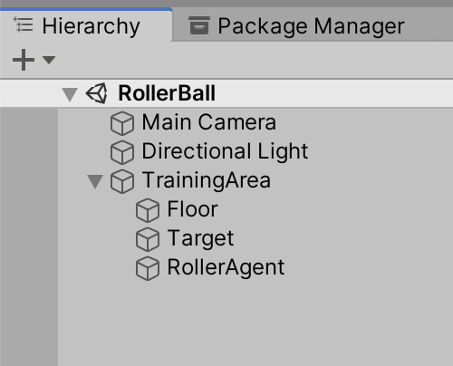

# Making a New Learning Environment

This tutorial walks through the process of creating a Unity Environment from
scratch. We recommend first reading the [Getting Started](Getting-Started.md)
guide to understand the concepts presented here first in an already-built
environment.


In this example, we will create an agent capable of controlling a ball on a
platform. We will then train the agent to roll the ball toward the cube while
avoiding falling off the platform.

## Overview

Using the ML-Agents Toolkit in a Unity project involves the following basic
steps:

1. Create an environment for your agents to live in. An environment can range
   from a simple physical simulation containing a few objects to an entire game
   or ecosystem.
1. Implement your Agent subclasses. An Agent subclass defines the code an Agent
   uses to observe its environment, to carry out assigned actions, and to
   calculate the rewards used for reinforcement training. You can also implement
   optional methods to reset the Agent when it has finished or failed its task.
1. Add your Agent subclasses to appropriate GameObjects, typically, the object
   in the scene that represents the Agent in the simulation.

**Note:** If you are unfamiliar with Unity, refer to
[Learning the interface](https://docs.unity3d.com/Manual/LearningtheInterface.html)
in the Unity Manual if an Editor task isn't explained sufficiently in this
tutorial.

If you haven't already, follow the [installation instructions](Installation.md).

## Set Up the Unity Project

The first task to accomplish is simply creating a new Unity project and
importing the ML-Agents assets into it:

1. Launch Unity Hub and create a new 3D project named "RollerBall".
1. [Add the ML-Agents Unity package](Installation.md#install-the-comunityml-agents-unity-package)
   to your project.

Your Unity **Project** window should contain the following assets:

<p align="left">
  
</p>

## Create the Environment

Next, we will create a very simple scene to act as our learning environment. The
"physical" components of the environment include a Plane to act as the floor for
the Agent to move around on, a Cube to act as the goal or target for the agent
to seek, and a Sphere to represent the Agent itself.

### Create the Floor Plane

1. Right click in Hierarchy window, select 3D Object > Plane.
1. Name the GameObject "Floor."
1. Select the Floor Plane to view its properties in the Inspector window.
1. Set Transform to Position = `(0, 0, 0)`, Rotation = `(0, 0, 0)`, Scale =
   `(1, 1, 1)`.

<p align="left">
  
</p>

### Add the Target Cube

1. Right click in Hierarchy window, select 3D Object > Cube.
1. Name the GameObject "Target"
1. Select the Target Cube to view its properties in the Inspector window.
1. Set Transform to Position = `3, 0.5, 3)`, Rotation = `(0, 0, 0)`, Scale =
   `(1, 1, 1)`.

<p align="left">
  
</p>

### Add the Agent Sphere

1. Right click in Hierarchy window, select 3D Object > Sphere.
1. Name the GameObject "RollerAgent"
1. Select the RollerAgent Sphere to view its properties in the Inspector window.
1. Set Transform to Position = `(0, 0.5, 0)`, Rotation = `(0, 0, 0)`, Scale =
   `(1, 1, 1)`.
1. Click **Add Component**.
1. Add the `Rigidbody` component to the Sphere.

<p align="left">
  
</p>

Note that the screenshot above includes the `Roller Agent` script, which we will
create in the next section. However, before we do that, we'll first group the
floor, target and agent under a single, empty, GameObject. This will simplify
some of our subsequent steps.

<p align="left">
  
</p>

To do so:

1. Right-click on your Project Hierarchy and create a new empty GameObject. Name
   it TrainingArea.
1. Reset the TrainingArea’s Transform so that it is at `(0,0,0)` with Rotation
   `(0,0,0)` and Scale `(1,1,1)`.
1. Drag the Floor, Target, and RollerAgent GameObjects in the Hierarchy into the
   TrainingArea GameObject.

## Implement an Agent

To create the Agent:

1. Select the RollerAgent GameObject to view it in the Inspector window.
1. Click **Add Component**.
1. Click **New Script** in the list of components (at the bottom).
1. Name the script "RollerAgent".
1. Click **Create and Add**.

Then, edit the new `RollerAgent` script:

1. In the Unity Project window, double-click the `RollerAgent` script to open it
   in your code editor.
1. In the editor, add the `using Unity.MLAgents;` and
   `using Unity.MLAgents.Sensors` statements and then change the base class from
   `MonoBehaviour` to `Agent`.
1. Delete the `Update()` method, but we will use the `Start()` function, so
   leave it alone for now.

So far, these are the basic steps that you would use to add ML-Agents to any
Unity project. Next, we will add the logic that will let our Agent learn to roll
to the cube using reinforcement learning. More specifically, we will need to
extend three methods from the `Agent` base class:

- `OnEpisodeBegin()`
- `CollectObservations(VectorSensor sensor)`
- `OnActionReceived(float[] vectorAction)`

We overview each of these in more detail in the dedicated subsections below.

### Initialization and Resetting the Agent

The process of training in the ML-Agents Toolkit involves running episodes where
the Agent (Sphere) attempts to solve the task. Each episode lasts until the
Agents solves the task (i.e. reaches the cube), fails (rolls off the platform)
or times out (takes too long to solve or fail at the task). At the start of each
episode, the `OnEpisodeBegin()` method is called to set-up the environment for a
new episode. Typically the scene is initialized in a random manner to enable the
agent to learn to solve the task under a variety of conditions.

In this example, each time the Agent (Sphere) reaches its target (Cube), its
episode ends and the method moves the target (Cube) to a new random location. In
addition, if the Agent rolls off the platform, the `OnEpisodeBegin()` method
puts it back onto the floor.

To move the target (Cube), we need a reference to its Transform (which stores a
GameObject's position, orientation and scale in the 3D world). To get this
reference, add a public field of type `Transform` to the RollerAgent class.
Public fields of a component in Unity get displayed in the Inspector window,
allowing you to choose which GameObject to use as the target in the Unity
Editor.

To reset the Agent's velocity (and later to apply force to move the agent) we
need a reference to the Rigidbody component. A
[Rigidbody](https://docs.unity3d.com/ScriptReference/Rigidbody.html) is Unity's
primary element for physics simulation. (See
[Physics](https://docs.unity3d.com/Manual/PhysicsSection.html) for full
documentation of Unity physics.) Since the Rigidbody component is on the same
GameObject as our Agent script, the best way to get this reference is using
`GameObject.GetComponent<T>()`, which we can call in our script's `Start()`
method.

So far, our RollerAgent script looks like:

```csharp
using System.Collections.Generic;
using UnityEngine;
using Unity.MLAgents;
using Unity.MLAgents.Sensors;

public class RollerAgent : Agent
{
    Rigidbody rBody;
    void Start () {
        rBody = GetComponent<Rigidbody>();
    }

    public Transform Target;
    public override void OnEpisodeBegin()
    {
        if (this.transform.localPosition.y < 0)
        {
            // If the Agent fell, zero its momentum
            this.rBody.angularVelocity = Vector3.zero;
            this.rBody.velocity = Vector3.zero;
            this.transform.localPosition = new Vector3( 0, 0.5f, 0);
        }

        // Move the target to a new spot
        Target.localPosition = new Vector3(Random.value * 8 - 4,
                                           0.5f,
                                           Random.value * 8 - 4);
    }
}
```

Next, let's implement the `Agent.CollectObservations(VectorSensor sensor)`
method.

### Observing the Environment

The Agent sends the information we collect to the Brain, which uses it to make a
decision. When you train the Agent (or use a trained model), the data is fed
into a neural network as a feature vector. For an Agent to successfully learn a
task, we need to provide the correct information. A good rule of thumb for
deciding what information to collect is to consider what you would need to
calculate an analytical solution to the problem.

In our case, the information our Agent collects includes the position of the
target, the position of the agent itself, and the velocity of the agent. This
helps the Agent learn to control its speed so it doesn't overshoot the target
and roll off the platform. In total, the agent observation contains 8 values as
implemented below:

```csharp
public override void CollectObservations(VectorSensor sensor)
{
    // Target and Agent positions
    sensor.AddObservation(Target.localPosition);
    sensor.AddObservation(this.transform.localPosition);

    // Agent velocity
    sensor.AddObservation(rBody.velocity.x);
    sensor.AddObservation(rBody.velocity.z);
}
```

### Taking Actions and Assigning Rewards

The final part of the Agent code is the `Agent.OnActionReceived()` method, which
receives actions and assigns the reward.

#### Actions

To solve the task of moving towards the target, the Agent (Sphere) needs to be
able to move in the `x` and `z` directions. As such, we will provide 2 actions
to the agent. The first determines the force applied along the x-axis; the
second determines the force applied along the z-axis. (If we allowed the Agent
to move in three dimensions, then we would need a third action.

The RollerAgent applies the values from the `action[]` array to its Rigidbody
component, `rBody`, using the `Rigidbody.AddForce` function:

```csharp
Vector3 controlSignal = Vector3.zero;
controlSignal.x = action[0];
controlSignal.z = action[1];
rBody.AddForce(controlSignal * speed);
```

#### Rewards

Reinforcement learning requires rewards. Assign rewards in the
`OnActionReceived()` function. The learning algorithm uses the rewards assigned
to the Agent during the simulation and learning process to determine whether it
is giving the Agent the optimal actions. You want to reward an Agent for
completing the assigned task. In this case, the Agent is given a reward of 1.0
for reaching the Target cube.

The RollerAgent calculates the distance to detect when it reaches the target.
When it does, the code calls the `Agent.SetReward()` method to assign a reward
of 1.0 and marks the agent as finished by calling the `EndEpisode()` method on
the Agent.

```csharp
float distanceToTarget = Vector3.Distance(this.transform.localPosition, Target.localPosition);
// Reached target
if (distanceToTarget < 1.42f)
{
    SetReward(1.0f);
    EndEpisode();
}
```

Finally, if the Agent falls off the platform, end the episode so that it can
reset itself:

```csharp
// Fell off platform
if (this.transform.localPosition.y < 0)
{
    EndEpisode();
}
```

#### OnActionReceived()

With the action and reward logic outlined above, the final version of the
`OnActionReceived()` function looks like:

```csharp
public float speed = 10;
public override void OnActionReceived(float[] vectorAction)
{
    // Actions, size = 2
    Vector3 controlSignal = Vector3.zero;
    controlSignal.x = vectorAction[0];
    controlSignal.z = vectorAction[1];
    rBody.AddForce(controlSignal * speed);

    // Rewards
    float distanceToTarget = Vector3.Distance(this.transform.localPosition, Target.localPosition);

    // Reached target
    if (distanceToTarget < 1.42f)
    {
        SetReward(1.0f);
        EndEpisode();
    }

    // Fell off platform
    if (this.transform.localPosition.y < 0)
    {
        EndEpisode();
    }
}
```

Note the `speed` class variable is defined before the function. Since `speed` is
public, you can set the value from the Inspector window.

## Final Editor Setup

Now, that all the GameObjects and ML-Agent components are in place, it is time
to connect everything together in the Unity Editor. This involves changing some
of the Agent Component's properties so that they are compatible with our Agent
code.

1. Select the **RollerAgent** GameObject to show its properties in the Inspector
   window.
1. Add the `Decision Requester` script with the Add Component button from the
   RollerAgent Inspector.
1. Change **Decision Period** to `10`.
1. Drag the Target GameObject from the Hierarchy window to the RollerAgent
   Target field.
1. Add the `Behavior Parameters` script with the Add Component button from the
   RollerAgent Inspector.
1. Modify the Behavior Parameters of the Agent :
   - `Behavior Name` to _RollerBall_
   - `Vector Observation` > `Space Size` = 8
   - `Vector Action` > `Space Type` = **Continuous**
   - `Vector Action` > `Space Size` = 2

Now you are ready to test the environment before training.

## Testing the Environment

It is always a good idea to first test your environment by controlling the Agent
using the keyboard. To do so, you will need to extend the `Heuristic()` method
in the `RollerAgent` class. For our example, the heuristic will generate an
action corresponding to the values of the "Horizontal" and "Vertical" input axis
(which correspond to the keyboard arrow keys):

```csharp
public override void Heuristic(float[] actionsOut)
{
    actionsOut[0] = Input.GetAxis("Horizontal");
    actionsOut[1] = Input.GetAxis("Vertical");
}
```

In order for the Agent to use the Heuristic, You will need to set the
`Behavior Type` to `Heuristic Only` in the `Behavior Parameters` of the
RollerAgent.

Press **Play** to run the scene and use the arrows keys to move the Agent around
the platform. Make sure that there are no errors displayed in the Unity Editor
Console window and that the Agent resets when it reaches its target or falls
from the platform.

## Training the Environment

The process is the same as described in the
[Getting Started Guide](Getting-Started.md).

The hyperparameters for training are specified in a configuration file that you
pass to the `mlagents-learn` program. Create a new `rollerball_config.yaml` file
and include the following hyperparameter values:

```yml
behaviors:
  RollerBall:
    trainer_type: ppo
    hyperparameters:
      batch_size: 10
      buffer_size: 100
      learning_rate: 3.0e-4
      beta: 5.0e-4
      epsilon: 0.2
      lambd: 0.99
      num_epoch: 3
      learning_rate_schedule: linear
    network_settings:
      normalize: false
      hidden_units: 128
      num_layers: 2
    reward_signals:
      extrinsic:
        gamma: 0.99
        strength: 1.0
    max_steps: 500000
    time_horizon: 64
    summary_freq: 10000
```

Since this example creates a very simple training environment with only a few
inputs and outputs, using small batch and buffer sizes speeds up the training
considerably. However, if you add more complexity to the environment or change
the reward or observation functions, you might also find that training performs
better with different hyperparameter values. In addition to setting these
hyperparameter values, the Agent **DecisionFrequency** parameter has a large
effect on training time and success. A larger value reduces the number of
decisions the training algorithm has to consider and, in this simple
environment, speeds up training.

To train your agent, run the following command before pressing **Play** in the
Editor:

    mlagents-learn config/rollerball_config.yaml --run-id=RollerBall

To monitor the statistics of Agent performance during training, use
[TensorBoard](Using-Tensorboard.md).


In particular, the _cumulative_reward_ and _value_estimate_ statistics show how
well the Agent is achieving the task. In this example, the maximum reward an
Agent can earn is 1.0, so these statistics approach that value when the Agent
has successfully _solved_ the problem.

## Optional: Multiple Training Areas within the Same Scene

In many of the [example environments](Learning-Environment-Examples.md), many
copies of the training area are instantiated in the scene. This generally speeds
up training, allowing the environment to gather many experiences in parallel.
This can be achieved simply by instantiating many Agents with the same
`Behavior Name`. Note that we've already simplified our transition to using
multiple areas by creating the `TrainingArea` GameObject and relying on local
positions in `RollerAgent.cs`. Use the following steps to parallelize your
RollerBall environment:

1. Drag the TrainingArea GameObject, along with its attached GameObjects, into
   your Assets browser, turning it into a prefab.
1. You can now instantiate copies of the TrainingArea prefab. Drag them into
   your scene, positioning them so that they do not overlap.
