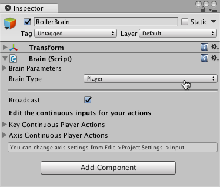
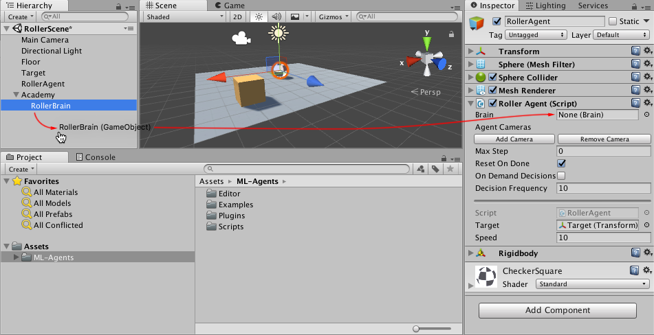

# Making a New Learning Environment

This tutorial walks through the process of creating a Unity Environment. A Unity Environment is an application built using the Unity Engine which can be used to train Reinforcement Learning agents.


In this example, we will train a ball to roll to a randomly placed cube. The ball also learns to avoid falling off the platform.

## Overview

Using the ML-Agents toolkit in a Unity project involves the following basic steps:

1. Create an environment for your agents to live in. An environment can range from a simple physical simulation containing a few objects to an entire game or ecosystem.
2. Implement an Academy subclass and add it to a GameObject in the Unity scene containing the environment. This GameObject will serve as the parent for any Brain objects in the scene. Your Academy class can implement a few optional methods to update the scene independently of any agents. For example, you can add, move, or delete agents and other entities in the environment.
3. Add one or more Brain objects to the scene as children of the Academy.
4. Implement your Agent subclasses. An Agent subclass defines the code an agent uses to observe its environment, to carry out assigned actions, and to calculate the rewards used for reinforcement training. You can also implement optional methods to reset the agent when it has finished or failed its task.
5. Add your Agent subclasses to appropriate GameObjects, typically, the object in the scene that represents the agent in the simulation. Each Agent object must be assigned a Brain object.
6. If training, set the Brain type to External and [run the training process](Training-ML-Agents.md).  

**Note:** If you are unfamiliar with Unity, refer to [Learning the interface](https://docs.unity3d.com/Manual/LearningtheInterface.html) in the Unity Manual if an Editor task isn't explained sufficiently in this tutorial.

If you haven't already, follow the [installation instructions](Installation.md).

## Set Up the Unity Project

The first task to accomplish is simply creating a new Unity project and importing the ML-Agents assets into it:

1. Launch the Unity Editor and create a new project named "RollerBall".

2. In a file system window, navigate to the folder containing your cloned ML-Agents repository. 

3. Drag the `ML-Agents` folder from `unity-environments/Assets` to the Unity Editor Project window.

Your Unity **Project** window should contain the following assets:


## Create the Environment:

Next, we will create a very simple scene to act as our ML-Agents environment. The "physical" components of the environment include a Plane to act as the floor for the agent to move around on, a Cube to act as the goal or target for the agent to seek, and a Sphere to represent the agent itself. 

**Create the floor plane:**

1. Right click in Hierarchy window, select 3D Object > Plane.
2. Name the GameObject "Floor."
3. Select Plane to view its properties in the Inspector window.
4. Set Transform to Position = (0,0,0), Rotation = (0,0,0), Scale = (1,1,1).
5. On the Plane's Mesh Renderer, expand the Materials property and change the default-material to *floor*.

(To set a new material, click the small circle icon next to the current material name. This opens the **Object Picker** dialog so that you can choose the a different material from the list of all materials currently in the project.)


**Add the Target Cube**

1. Right click in Hierarchy window, select 3D Object > Cube.
2. Name the GameObject "Target"
3. Select Target to view its properties in the Inspector window.
4. Set Transform to Position = (3,0.5,3), Rotation = (0,0,0), Scale = (1,1,1).
5. On the Cube's Mesh Renderer, expand the Materials property and change the default-material to *Block*.


**Add the Agent Sphere**

1. Right click in Hierarchy window, select 3D Object > Sphere.
2. Name the GameObject "RollerAgent"
3. Select Target to view its properties in the Inspector window.
4. Set Transform to Position = (0,0.5,0), Rotation = (0,0,0), Scale = (1,1,1).
5. On the Sphere's Mesh Renderer, expand the Materials property and change the default-material to *checker 1*.
6. Click **Add Component**.
7. Add the Physics/Rigidbody component to the Sphere. (Adding a Rigidbody ) 


Note that we will create an Agent subclass to add to this GameObject as a component later in the tutorial.

**Add Empty GameObjects to Hold the Academy and Brain**

1. Right click in Hierarchy window, select Create Empty.
2. Name the GameObject "Academy"
3. Right-click on the Academy GameObject and select Create Empty.
4. Name this child of the Academy, "Brain".


You can adjust the camera angles to give a better view of the scene at runtime. The next steps will be to create and add the ML-Agent components.

## Implement an Academy

The Academy object coordinates the ML-Agents in the scene and drives the decision-making portion of the simulation loop. Every ML-Agent scene needs one Academy instance. Since the base Academy class is abstract, you must make your own subclass even if you don't need to use any of the methods for a particular environment.

First, add a New Script component to the Academy GameObject created earlier: 

1. Select the Academy GameObject to view it in the Inspector window.
2. Click **Add Component**.
3. Click **New Script** in the list of components (at the bottom).
4. Name the script "RollerAcademy".
5. Click **Create and Add**.

Next, edit the new `RollerAcademy` script:

1. In the Unity Project window, double-click the `RollerAcademy` script to open it in your code editor. (By default new scripts are placed directly in the **Assets** folder.)
2. In the editor, change the base class from `MonoBehaviour` to `Academy`.
3. Delete the `Start()` and `Update()` methods that were added by default.

In such a basic scene, we don't need the Academy to initialize, reset, or otherwise control any objects in the environment so we have the simplest possible Academy implementation:

```csharp
using MLAgents;

public class RollerAcademy : Academy { }
```

The default settings for the Academy properties are also fine for this environment, so we don't need to change anything for the RollerAcademy component in the Inspector window.


## Add a Brain

The Brain object encapsulates the decision making process. An Agent sends its observations to its Brain and expects a decision in return. The Brain Type setting determines how the Brain makes decisions. Unlike the Academy and Agent classes, you don't make your own Brain subclasses. 

To create the Brain:

1. Select the Brain GameObject created earlier to show its properties in the Inspector window.
2. Click **Add Component**.
3. Select the **Scripts/Brain** component to add it to the GameObject.

We will come back to the Brain properties later, but leave the Brain Type as **Player** for now.



## Implement an Agent

To create the Agent:

1. Select the RollerAgent GameObject to view it in the Inspector window.
2. Click **Add Component**.
3. Click **New Script** in the list of components (at the bottom).
4. Name the script "RollerAgent".
5. Click **Create and Add**.

Then, edit the new `RollerAgent` script:

1. In the Unity Project window, double-click the `RollerAgent` script to open it in your code editor. 
2. In the editor, change the base class from `MonoBehaviour` to `Agent`.
3. Delete the `Update()` method, but we will use the `Start()` function, so leave it alone for now.

So far, these are the basic steps that you would use to add ML-Agents to any Unity project. Next, we will add the logic that will let our agent learn to roll to the cube using reinforcement learning.

In this simple scenario, we don't use the Academy object to control the environment. If we wanted to change the environment, for example change the size of the floor or add or remove agents or other objects before or during the simulation, we could implement the appropriate methods in the Academy. Instead, we will have the Agent do all the work of resetting itself and the target when it succeeds or falls trying. 

**Initialization and Resetting the Agent**

When the agent reaches its target, it marks itself done and its agent reset function moves the target to a random location. In addition, if the agent rolls off the platform, the reset function puts it back onto the floor.

To move the target GameObject, we need a reference to its Transform (which stores a GameObject's position, orientation and scale in the 3D world). To get this reference, add a public field of type `Transform` to the RollerAgent class.  Public fields of a component in Unity get displayed in the Inspector window, allowing you to choose which GameObject to use as the target in the Unity Editor. To reset the agent's velocity (and later to apply force to move the agent) we need a reference to the Rigidbody component. A [Rigidbody](https://docs.unity3d.com/ScriptReference/Rigidbody.html) is Unity's primary element for physics simulation. (See [Physics](https://docs.unity3d.com/Manual/PhysicsSection.html) for full documentation of Unity physics.) Since the Rigidbody component is on the same GameObject as our Agent script, the best way to get this reference is using `GameObject.GetComponent<T>()`, which we can call in our script's `Start()` method.

So far, our RollerAgent script looks like: 

```csharp
using System.Collections.Generic;
using UnityEngine;
using MLAgents;

public class RollerAgent : Agent 
{
    Rigidbody rBody;
    void Start () {
        rBody = GetComponent<Rigidbody>();
    }

    public Transform Target;
    public override void AgentReset()
    {
        if (this.transform.position.y < -1.0)
        {  
            // The agent fell
            this.transform.position = Vector3.zero;
            this.rBody.angularVelocity = Vector3.zero;
            this.rBody.velocity = Vector3.zero;
        }
        else
        { 
            // Move the target to a new spot
            Target.position = new Vector3(Random.value * 8 - 4,
                                          0.5f,
                                          Random.value * 8 - 4);
        }
    }
}
```

Next, let's implement the Agent.CollectObservations() function. 

**Observing the Environment**

The Agent sends the information we collect to the Brain, which uses it to make a decision. When you train the agent (or use a trained model), the data is fed into a neural network as a feature vector. For an agent to successfully learn a task, we need to provide the correct information. A good rule of thumb for deciding what information to collect is to consider what you would need to calculate an analytical solution to the problem. 

In our case, the information our agent collects includes:

* Position of the target. In general, it is better to use the relative position of other objects rather than the absolute position for more generalizable training. Note that the agent only collects the x and z coordinates since the floor is aligned with the x-z plane and the y component of the target's position never changes.

```csharp
// Calculate relative position
Vector3 relativePosition = Target.position - this.transform.position;

// Relative position
AddVectorObs(relativePosition.x / 5);
AddVectorObs(relativePosition.z / 5);
```

* Position of the agent itself within the confines of the floor. This data is collected as the agent's distance from each edge of the floor.

```csharp
// Distance to edges of platform
AddVectorObs((this.transform.position.x + 5) / 5);
AddVectorObs((this.transform.position.x - 5) / 5);
AddVectorObs((this.transform.position.z + 5) / 5);
AddVectorObs((this.transform.position.z - 5) / 5);
```

* The velocity of the agent. This helps the agent learn to control its speed so it doesn't overshoot the target and roll off the platform.

```csharp
// Agent velocity
AddVectorObs(rBody.velocity.x / 5);
AddVectorObs(rBody.velocity.z / 5);
```

All the values are divided by 5 to normalize the inputs to the neural network to the range [-1,1]. (The number five is used because the platform is 10 units across.)

In total, the state observation contains 8 values and we need to use the continuous state space when we get around to setting the Brain properties:

```csharp
public override void CollectObservations()
{
    // Calculate relative position
    Vector3 relativePosition = Target.position - this.transform.position;
    
    // Relative position
    AddVectorObs(relativePosition.x/5);
    AddVectorObs(relativePosition.z/5);
    
    // Distance to edges of platform
    AddVectorObs((this.transform.position.x + 5)/5);
    AddVectorObs((this.transform.position.x - 5)/5);
    AddVectorObs((this.transform.position.z + 5)/5);
    AddVectorObs((this.transform.position.z - 5)/5);
    
    // Agent velocity
    AddVectorObs(rBody.velocity.x/5);
    AddVectorObs(rBody.velocity.z/5);
}
```

The final part of the Agent code is the Agent.AgentAction() function, which receives the decision from the Brain.

**Actions**

The decision of the Brain comes in the form of an action array passed to the `AgentAction()` function. The number of elements in this array is determined by the `Vector Action Space Type` and `Vector Action Space Size` settings of the agent's Brain. The RollerAgent uses the continuous vector action space and needs two continuous control signals from the brain. Thus, we will set the Brain `Vector Action Size` to 2. The first element,`action[0]` determines the force applied along the x axis; `action[1]` determines the force applied along the z axis. (If we allowed the agent to move in three dimensions, then we would need to set `Vector Action Size` to 3. Each of these values returned by the network are between `-1` and `1.` Note the Brain really has no idea what the values in the action array mean. The training process just adjusts the action values in response to the observation input and then sees what kind of rewards it gets as a result. 

The RollerAgent applies the values from the action[] array to its Rigidbody component, `rBody`, using the `Rigidbody.AddForce` function:

```csharp
Vector3 controlSignal = Vector3.zero;
controlSignal.x = action[0];
controlSignal.z = action[1];
rBody.AddForce(controlSignal * speed);
```

**Rewards**

Reinforcement learning requires rewards. Assign rewards in the `AgentAction()` function. The learning algorithm uses the rewards assigned to the agent at each step in the simulation and learning process to determine whether it is giving the agent the optimal actions. You want to reward an agent for completing the assigned task (reaching the Target cube, in this case) and punish the agent if it irrevocably fails (falls off the platform). You can sometimes speed up training with sub-rewards that encourage behavior that helps the agent complete the task. For example, the RollerAgent reward system provides a small reward if the agent moves closer to the target in a step and a small negative reward at each step which encourages the agent to complete its task quickly. 

The RollerAgent calculates the distance to detect when it reaches the target. When it does, the code increments the Agent.reward variable by 1.0 and marks the agent as finished by setting the agent to done. 

```csharp
float distanceToTarget = Vector3.Distance(this.transform.position,
                                          Target.position);
// Reached target
if (distanceToTarget < 1.42f)
{
    AddReward(1.0f);
    Done();
}
```

**Note:** When you mark an agent as done, it stops its activity until it is reset. You can have the agent reset immediately, by setting the Agent.ResetOnDone property to true in the inspector or you can wait for the Academy to reset the environment. This RollerBall environment relies on the `ResetOnDone` mechanism and doesn't set a `Max Steps` limit for the Academy (so it never resets the environment).

To encourage the agent along, we also reward it for getting closer to the target (saving the previous distance measurement between steps):

```csharp
// Getting closer
if (distanceToTarget < previousDistance)
{
    AddReward(0.1f);
}
```

It can also encourage an agent to finish a task more quickly to assign a negative reward at each step:

```csharp
// Time penalty
AddReward(-0.05f);
```

Finally, to punish the agent for falling off the platform, assign a large negative reward and, of course, set the agent to done so that it resets itself in the next step:

```csharp
// Fell off platform
if (this.transform.position.y < -1.0)
{
    AddReward(-1.0f);
    Done();
}
```

**AgentAction()**
 
With the action and reward logic outlined above, the final version of the `AgentAction()` function looks like:

```csharp
public float speed = 10;
private float previousDistance = float.MaxValue;

public override void AgentAction(float[] vectorAction, string textAction)
{
    // Rewards
    float distanceToTarget = Vector3.Distance(this.transform.position, 
                                              Target.position);
    
    // Reached target
    if (distanceToTarget < 1.42f)
    {
        AddReward(1.0f);
        Done();
    }
    
    // Getting closer
    if (distanceToTarget < previousDistance)
    {
        AddReward(0.1f);
    }

    // Time penalty
    AddReward(-0.05f);

    // Fell off platform
    if (this.transform.position.y < -1.0)
    {
        AddReward(-1.0f);
        Done();
    }
    previousDistance = distanceToTarget;

    // Actions, size = 2
    Vector3 controlSignal = Vector3.zero;
    controlSignal.x = vectorAction[0];
    controlSignal.z = vectorAction[1];
    rBody.AddForce(controlSignal * speed);
 }
```

Note the `speed` and `previousDistance` class variables defined before the function. Since `speed` is public, you can set the value from the Inspector window.

## Final Editor Setup

Now, that all the GameObjects and ML-Agent components are in place, it is time to connect everything together in the Unity Editor. This involves assigning the Brain object to the Agent and setting the Brain properties so that they are compatible with our agent code. 

1. Expand the Academy GameObject in the Hierarchy window, so that the Brain object is visible.
2. Select the RollerAgent GameObject to show its properties in the Inspector window.
3. Drag the Brain object from the Hierarchy window to the RollerAgent Brain field.



Also, drag the Target GameObject from the Hierarchy window to the RollerAgent Target field.

Finally, select the Brain GameObject so that you can see its properties in the Inspector window. Set the following properties:

* `Vector Observation Space Type` = **Continuous**
* `Vector Observation Space Size` = 8
* `Vector Action Space Type` = **Continuous**
* `Vector Action Space Size` = 2
* `Brain Type` = **Player**

Now you are ready to test the environment before training.

## Testing the Environment

It is always a good idea to test your environment manually before embarking on an extended training run. The reason we have left the Brain set to the **Player** type is so that we can control the agent using direct keyboard control. But first, you need to define the keyboard to action mapping. Although the RollerAgent only has an `Action Size` of two, we will use one key to specify positive values and one to specify negative values for each action, for a total of four keys.

1. Select the Brain GameObject to view its properties in the Inspector.
2. Set **Brain Type** to **Player**.
3. Expand the **Continuous Player Actions** dictionary (only visible when using the **Player* brain).
4. Set **Size** to 4.
5. Set the following mappings:

| Element   | Key | Index | Value |
| :------------ | :---: | :------: | :------: |
| Element 0 | D   | 0        | 1        |
| Element 1 | A    | 0        | -1       |
| Element 2 | W  | 1        | 1        |
| Element 3 | S   | 1        | -1       |

The **Index** value corresponds to the index of the action array passed to `AgentAction()` function. **Value** is assigned to action[Index] when **Key** is pressed.

Press **Play** to run the scene and use the WASD keys to move the agent around the platform. Make sure that there are no errors displayed in the Unity editor Console window and that the agent resets when it reaches its target or falls from the platform. Note that for more involved debugging, the ML-Agents SDK includes a convenient Monitor class that you can use to easily display agent status information in the Game window.

One additional test you can perform is to first ensure that your environment 
and the Python API work as expected using the `python/Basics` 
[Jupyter notebook](Background-Jupyter.md). Within `Basics`, be sure to set 
`env_name` to the name of the environment file you specify when building
this environment.

Now you can train the Agent. To get ready for training, you must first to change the **Brain Type** from **Player** to **External**. From there, the process is the same as described in [Training ML-Agents](Training-ML-Agents.md). 

## Review: Scene Layout

This section briefly reviews how to organize your scene when using 
Agents in your Unity environment.

There are three kinds of game objects you need to include in your scene in order to use Unity ML-Agents:
 * Academy  
 * Brain  
 * Agents  

Keep in mind:
 * There can only be one Academy game object in a scene.   
 * You can have multiple Brain game objects but they must be child of the Academy game object.  

Here is an example of what your scene hierarchy should look like:


