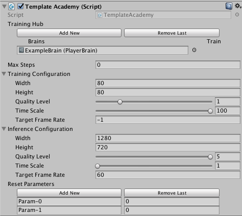

# Creating an Academy

An Academy orchestrates all the Agent and Brain objects in a Unity scene. Every
scene containing Agents must contain a single Academy. To use an Academy, you
must create your own subclass. However, all the methods you can override are
optional.

Use the Academy methods to:

* Initialize the environment after the scene loads
* Reset the environment
* Change things in the environment at each simulation step

See [Reinforcement Learning in Unity](Learning-Environment-Design.md) for a
description of the timing of these method calls during a simulation.

## Initializing an Academy

Initialization is performed once in an Academy object's lifecycle. Use the
`InitializeAcademy()` method for any logic you would normally perform in the
standard Unity `Start()` or `Awake()` methods.

**Note:** Because the base Academy implements a `Awake()` function, you must not
implement your own. Because of the way the Unity MonoBehaviour class is defined,
implementing your own `Awake()` function hides the base class version and Unity
will call yours instead. Likewise, do not implement a `FixedUpdate()` function
in your Academy subclass.

## Resetting an Environment

Implement an `AcademyReset()` function to alter the environment at the start of
each episode. For example, you might want to reset an Agent to its starting
position or move a goal to a random position. An environment resets when the
Academy `Max Steps` count is reached.

When you reset an environment, consider the factors that should change so that
training is generalizable to different conditions. For example, if you were
training a maze-solving agent, you would probably want to change the maze itself
for each training episode. Otherwise, the agent would probably on learn to solve
one, particular maze, not mazes in general.

## Controlling an Environment

The `AcademyStep()` function is called at every step in the simulation before
any Agents are updated. Use this function to update objects in the environment
at every step or during the episode between environment resets. For example, if
you want to add elements to the environment at random intervals, you can put the
logic for creating them in the `AcademyStep()` function.

## Academy Properties

* `Broadcast Hub` - Gathers the Brains that will communicate with the external 
  process. Any Brain added to the Broadcast Hub will be visible from the external
  process. In addition, if the checkbox `Control` is checked, the Brain will be 
  controllable from the external process and will thus be trainable.
* `Max Steps` - Total number of steps per-episode. `0` corresponds to episodes
  without a maximum number of steps. Once the step counter reaches maximum, the
  environment will reset.
* `Configuration` - The engine-level settings which correspond to rendering
  quality and engine speed.
  * `Width` - Width of the environment window in pixels.
  * `Height` - Width of the environment window in pixels.
  * `Quality Level` - Rendering quality of environment. (Higher is better)
  * `Time Scale` - Speed at which environment is run. (Higher is faster)
  * `Target Frame Rate` - FPS engine attempts to maintain.
* `Reset Parameters` - List of custom parameters that can be changed in the
  environment on reset.
