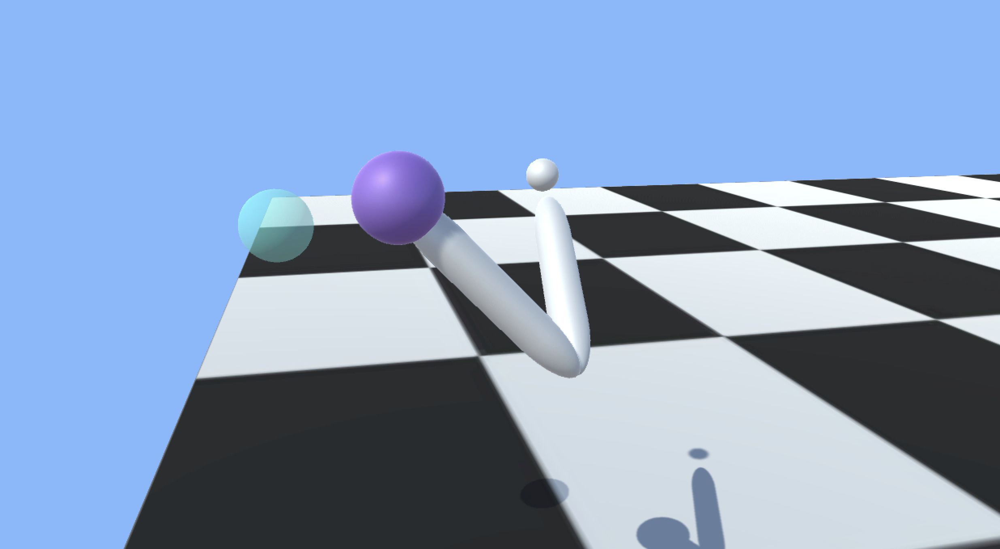
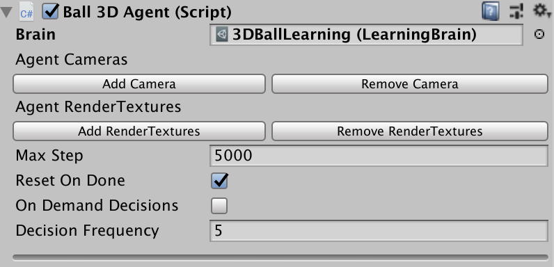

# Agents

An agent is an actor that can observe its environment and decide on the best course of action using those observations. Create agents in Unity by extending the Agent class. The most important aspects of creating agents that can successfully learn are the observations the agent collects and, for reinforcement learning, the reward you assign to estimate the value of the agent's current state toward accomplishing its tasks.

An agent passes its observations to its brain. The brain, then, makes a decision and passes the chosen action back to the agent. Your agent code must execute the action, for example, move the agent in one direction or another. In order to [train an agent using reinforcement learning](Learning-Environment-Design.md), your agent must calculate a reward value at each action. The reward is used to discover the optimal decision-making policy. (A reward is not used by already trained agents or for imitation learning.) 

The Brain class abstracts out the decision making logic from the agent itself so that you can use the same brain in multiple agents. 
How a brain makes its decisions depends on the type of brain it is. An **External** brain simply passes the observations from its agents to an external process and then passes the decisions made externally back to the agents. An **Internal** brain uses the trained policy parameters to make decisions (and no longer adjusts the parameters in search of a better decision). The other types of brains do not directly involve training, but you might find them useful as part of a training project. See [Brains](Learning-Environment-Design-Brains.md).
  
## Decisions

The observation-decision-action-reward cycle repeats after a configurable number of simulation steps (the frequency defaults to once-per-step). You can also set up an agent to request decisions on demand. Making decisions at regular step intervals is generally most appropriate for physics-based simulations. Making decisions on demand is generally appropriate for situations where agents only respond to specific events or take actions of variable duration. For example, an agent in a robotic simulator that must provide fine-control of joint torques should make its decisions every step of the simulation. On the other hand, an agent that only needs to make decisions when certain game or simulation events occur, should use on-demand decision making.  

To control the frequency of step-based decision making, set the **Decision Frequency** value for the Agent object in the Unity Inspector window. Agents using the same Brain instance can use a different frequency. During simulation steps in which no decision is requested, the agent receives the same action chosen by the previous decision.

### On Demand Decision Making

On demand decision making allows agents to request decisions from their 
brains only when needed instead of receiving decisions at a fixed 
frequency. This is useful when the agents commit to an action for a 
variable number of steps or when the agents cannot make decisions 
at the same time. This typically the case for turn based games, games 
where agents must react to events or games where agents can take 
actions of variable duration.

When you turn on **On Demand Decisions** for an agent, your agent code must call the `Agent.RequestDecision()` function. This function call starts one iteration of the observation-decision-action-reward cycle. The Brain invokes the agent's `CollectObservations()` method, makes a decision and returns it by calling the `AgentAction()` method. The Brain waits for the agent to request the next decision before starting another iteration.

## Observations

To make decisions, an agent must observe its environment to determine its current state. A state observation can take the following forms:

* **Continuous Vector** — a feature vector consisting of an array of numbers. 
* **Discrete Vector** — an index into a state table (typically only useful for the simplest of environments).
* **Visual Observations** — one or more camera images.

When you use the **Continuous** or **Discrete** vector observation space for an agent, implement the `Agent.CollectObservations()` method to create the feature vector or state index. When you use **Visual Observations**, you only need to identify which Unity Camera objects will provide images and the base Agent class handles the rest. You do not need to implement the `CollectObservations()` method when your agent uses visual observations (unless it also uses vector observations).

### Continuous Vector Observation Space: Feature Vectors

For agents using a continuous state space, you create a feature vector to represent the agent's observation at each step of the simulation. The Brain class calls the `CollectObservations()` method of each of its agents. Your implementation of this function must call `AddVectorObs` to add vector observations. 

The observation must include all the information an agent needs to accomplish its task. Without sufficient and relevant information, an agent may learn poorly or may not learn at all. A reasonable approach for determining what information should be included is to consider what you would need to calculate an analytical solution to the problem. 

For examples of various state observation functions, you can look at the [example environments](Learning-Environment-Examples.md) included in the ML-Agents SDK.  For instance, the 3DBall example uses the rotation of the platform, the relative position of the ball, and the velocity of the ball as its state observation. As an experiment, you can remove the velocity components from the observation and retrain the 3DBall agent. While it will learn to balance the ball reasonably well, the performance of the agent without using velocity is noticeably worse.

```csharp
public GameObject ball;

private List<float> state = new List<float>();
public override void CollectObservations()
{
    AddVectorObs(gameObject.transform.rotation.z);
    AddVectorObs(gameObject.transform.rotation.x);
    AddVectorObs((ball.transform.position.x - gameObject.transform.position.x));
    AddVectorObs((ball.transform.position.y - gameObject.transform.position.y));
    AddVectorObs((ball.transform.position.z - gameObject.transform.position.z));
    AddVectorObs(ball.transform.GetComponent<Rigidbody>().velocity.x);
    AddVectorObs(ball.transform.GetComponent<Rigidbody>().velocity.y);
    AddVectorObs(ball.transform.GetComponent<Rigidbody>().velocity.z);
}
```

The feature vector must always contain the same number of elements and observations must always be in the same position within the list. If the number of observed entities in an environment can vary you can pad the feature vector with zeros for any missing entities in a specific observation or you can limit an agent's observations to a fixed subset. For example, instead of observing every enemy agent in an environment, you could only observe the closest five. 

When you set up an Agent's brain in the Unity Editor, set the following properties to use a continuous vector observation:

**Space Size** — The state size must match the length of your feature vector.
**Space Type** — Set to **Continuous**.
**Brain Type** — Set to **External** during training; set to **Internal** to use the trained model.

The observation feature vector is a list of floating point numbers, which means you must convert any other data types to a float or a list of floats. 

Integers can be be added directly to the observation vector. You must explicitly convert Boolean values to a number:

```csharp
AddVectorObs(isTrueOrFalse ? 1 : 0);
```

For entities like positions and rotations, you can add their components to the feature list individually.  For example:

```csharp
Vector3 speed = ball.transform.GetComponent<Rigidbody>().velocity;
AddVectorObs(speed.x);
AddVectorObs(speed.y);
AddVectorObs(speed.z);
```

Type enumerations should be encoded in the _one-hot_ style. That is, add an element to the feature vector for each element of enumeration, setting the element representing the observed member to one and set the rest to zero. For example, if your enumeration contains \[Sword, Shield, Bow\] and the agent observes that the current item is a Bow, you would add the elements: 0, 0, 1 to the feature vector. The following code example illustrates how to add 

```csharp
enum CarriedItems { Sword, Shield, Bow, LastItem }
private List<float> state = new List<float>();
public override void CollectObservations()
{
    for (int ci = 0; ci < (int)CarriedItems.LastItem; ci++)
    {
        AddVectorObs((int)currentItem == ci ? 1.0f : 0.0f);            
    }
}
```

#### Normalization

For the best results when training, you should normalize the components of your feature vector to the range [-1, +1] or [0, 1]. When you normalize the values, the PPO neural network can often converge to a solution faster. Note that it isn't always necessary to normalize to these recommended ranges, but it is considered a best practice when using neural networks. The greater the variation in ranges between the components of your observation, the more likely that training will be affected.

To normalize a value to [0, 1], you can use the following formula:

```csharp
normalizedValue = (currentValue - minValue)/(maxValue - minValue)
```

Rotations and angles should also be normalized. For angles between 0 and 360 degrees, you can use the following formulas:

```csharp
Quaternion rotation = transform.rotation;
Vector3 normalized = rotation.eulerAngles / 180.0f - Vector3.one;  // [-1,1]
Vector3 normalized = rotation.eulerAngles / 360.0f;  // [0,1]
```

For angles that can be outside the range [0,360], you can either reduce the angle, or, if the number of turns is significant, increase the maximum value used in your normalization formula.
 
### Multiple Visual Observations

Camera observations use rendered textures from one or more cameras in a scene. The brain vectorizes the textures into a 3D Tensor which can be fed into a convolutional neural network (CNN). For more information on CNNs, see [this guide](http://cs231n.github.io/convolutional-networks/). You can use camera observations and either continuous feature vector or discrete state observations at the same time.
 
Agents using camera images can capture state of arbitrary complexity and are useful when the state is difficult to describe numerically. However, they are also typically less efficient and slower to train, and sometimes don't succeed at all.  

To add a visual observation to an agent, click on the `Add Camera` button in the Agent inspector. Then drag the camera you want to add to the `Camera` field. You can have more than one camera attached to an agent.

 

In addition, make sure that the Agent's Brain expects a visual observation. In the Brain inspector, under **Brain Parameters** > **Visual Observations**, specify the number of Cameras the agent is using for its visual observations. For each visual observation, set the width and height of the image (in pixels) and whether or not the observation is color or grayscale (when `Black And White` is checked).
 
### Discrete Vector Observation Space: Table Lookup

You can use the discrete vector observation space when an agent only has a limited number of possible states and those states can be enumerated by a single number. For instance, the [Basic example environment](Learning-Environment-Examples.md#basic) in the ML-Agents toolkit defines an agent with a discrete vector observation space. The states of this agent are the integer steps between two linear goals. In the Basic example, the agent learns to move to the goal that provides the greatest reward.

More generally, the discrete vector observation identifier could be an index into a table of the possible states. However, tables quickly become unwieldy as the environment becomes more complex. For example, even a simple game like [tic-tac-toe has 765 possible states](https://en.wikipedia.org/wiki/Game_complexity) (far more if you don't reduce the number of observations by combining those that are rotations or reflections of each other).

To implement a discrete state observation, implement the `CollectObservations()` method of your Agent subclass and return a `List` containing a single number representing the state:

```csharp
public override void CollectObservations()
{
    AddVectorObs(stateIndex);  // stateIndex is the state identifier
}
```

## Vector Actions

An action is an instruction from the brain that the agent carries out. The action is passed to the agent as a parameter when the Academy invokes the agent's `AgentAction()` function. When you specify that the vector action space is **Continuous**, the action parameter passed to the agent is an array of control signals with length equal to the `Vector Action Space Size` property.  When you specify a **Discrete** vector action space type, the action parameter is an array containing only a single value, which is an index into your list or table of commands. In the **Discrete** vector action space type, the `Vector Action Space Size` is the number of elements in your action table. Set the `Vector Action Space Size` and `Vector Action Space Type` properties on the Brain object assigned to the agent (using the Unity Editor Inspector window). 

Neither the Brain nor the training algorithm know anything about what the action values themselves mean. The training algorithm simply tries different values for the action list and observes the affect on the accumulated rewards over time and many training episodes. Thus, the only place actions are defined for an agent is in the `AgentAction()` function. You simply specify the type of vector action space, and, for the continuous vector action space, the number of values, and then apply the received values appropriately (and consistently) in `ActionAct()`.

For example, if you designed an agent to move in two dimensions, you could use either continuous or the discrete vector actions. In the continuous case, you would set the vector action size to two (one for each dimension), and the agent's brain would create an action with two floating point values. In the discrete case, you would set the vector action size to four (one for each direction), and the brain would create an action array containing a single element with a value ranging from zero to four.  

Note that when you are programming actions for an agent, it is often helpful to test your action logic using a **Player** brain, which lets you map keyboard commands to actions. See [Brains](Learning-Environment-Design-Brains.md).

The [3DBall](Learning-Environment-Examples.md#3dball-3d-balance-ball) and [Area](Learning-Environment-Examples.md#push-block) example environments are set up to use either the continuous or the discrete vector action spaces. 

### Continuous Action Space

When an agent uses a brain set to the **Continuous** vector action space, the action parameter passed to the agent's `AgentAction()` function is an array with length equal to the Brain object's `Vector Action Space Size` property value.  The individual values in the array have whatever meanings that you ascribe to them. If you assign an element in the array as the speed of an agent, for example, the training process learns to control the speed of the agent though this parameter. 

The [Reacher example](Learning-Environment-Examples.md#reacher) defines a continuous action space with four control values. 



These control values are applied as torques to the bodies making up the arm :

```csharp
public override void AgentAction(float[] act)
{
    float torque_x = Mathf.Clamp(act[0], -1, 1) * 100f;
    float torque_z = Mathf.Clamp(act[1], -1, 1) * 100f;
    rbA.AddTorque(new Vector3(torque_x, 0f, torque_z));

    torque_x = Mathf.Clamp(act[2], -1, 1) * 100f;
    torque_z = Mathf.Clamp(act[3], -1, 1) * 100f;
    rbB.AddTorque(new Vector3(torque_x, 0f, torque_z));
}
```

By default the output from our provided PPO algorithm pre-clamps the values of `vectorAction` into the [-1, 1] range. It is a best practice to manually clip these as well, if you plan to use a 3rd party algorithm with your environment. As shown above, you can scale the control values as needed after clamping them. 
 
### Discrete Action Space

When an agent uses a brain set to the **Discrete** vector action space, the action parameter passed to the agent's `AgentAction()` function is an array containing a single element. The value is the index of the action to in your table or list of actions. With the discrete vector action space, `Vector Action Space Size` represents the number of actions in your action table.

The [Area example](Learning-Environment-Examples.md#push-block) defines five actions for the discrete vector action space: a jump action and one action for each cardinal direction:

```csharp
// Get the action index
int movement = Mathf.FloorToInt(act[0]); 

// Look up the index in the action list:
if (movement == 1) { directionX = -1; }
if (movement == 2) { directionX = 1; }
if (movement == 3) { directionZ = -1; }
if (movement == 4) { directionZ = 1; }
if (movement == 5 && GetComponent<Rigidbody>().velocity.y <= 0) { directionY = 1; }

// Apply the action results to move the agent
gameObject.GetComponent<Rigidbody>().AddForce(
    new Vector3(
        directionX * 40f, directionY * 300f, directionZ * 40f));
```

Note that the above code example is a simplified extract from the AreaAgent class, which provides alternate implementations for both the discrete and the continuous action spaces.

## Rewards

In reinforcement learning, the reward is a signal that the agent has done something right. The PPO reinforcement learning algorithm works by optimizing the choices an agent makes such that the agent earns the highest cumulative reward over time. The better your reward mechanism, the better your agent will learn.

**Note:** Rewards are not used during inference by a brain using an already trained policy and is also not used during imitation learning.
 
Perhaps the best advice is to start simple and only add complexity as needed. In general, you should reward results rather than actions you think will lead to the desired results. To help develop your rewards, you can use the Monitor class to display the cumulative reward received by an agent. You can even use a Player brain to control the agent while watching how it accumulates rewards.

Allocate rewards to an agent by calling the `AddReward()` method in the `AgentAction()` function. The reward assigned in any step should be in the range [-1,1].  Values outside this range can lead to unstable training. The `reward` value is reset to zero at every step. 

**Examples**

You can examine the `AgentAction()` functions defined in the [example environments](Learning-Environment-Examples.md) to see how those projects allocate rewards.

The `GridAgent` class in the [GridWorld example](Learning-Environment-Examples.md#gridworld) uses a very simple reward system:

```csharp
Collider[] hitObjects = Physics.OverlapBox(trueAgent.transform.position, 
                                           new Vector3(0.3f, 0.3f, 0.3f));
if (hitObjects.Where(col => col.gameObject.tag == "goal").ToArray().Length == 1)
{
    AddReward(1.0f);
    Done();
}
if (hitObjects.Where(col => col.gameObject.tag == "pit").ToArray().Length == 1)
{
    AddReward(-1f);
    Done();
}
```

The agent receives a positive reward when it reaches the goal and a negative reward when it falls into the pit. Otherwise, it gets no rewards. This is an example of a _sparse_ reward system. The agent must explore a lot to find the infrequent reward.

In contrast, the `AreaAgent` in the [Area example](Learning-Environment-Examples.md#push-block) gets a small negative reward every step. In order to get the maximum reward, the agent must finish its task of reaching the goal square as quickly as possible:

```csharp
AddReward( -0.005f);
MoveAgent(act);

if (gameObject.transform.position.y < 0.0f || 
    Mathf.Abs(gameObject.transform.position.x - area.transform.position.x) > 8f || 
    Mathf.Abs(gameObject.transform.position.z + 5 - area.transform.position.z) > 8)
{
    Done();
    AddReward(-1f);
}
```

The agent also gets a larger negative penalty if it falls off the playing surface.

The `Ball3DAgent` in the [3DBall](Learning-Environment-Examples.md#3dball-3d-balance-ball) takes a similar approach, but allocates a small positive reward as long as the agent balances the ball. The agent can maximize its rewards by keeping the ball on the platform:

```csharp
if (IsDone() == false)
{
    SetReward(0.1f);
}

// When ball falls mark agent as done and give a negative penalty
if ((ball.transform.position.y - gameObject.transform.position.y) < -2f ||
    Mathf.Abs(ball.transform.position.x - gameObject.transform.position.x) > 3f ||
    Mathf.Abs(ball.transform.position.z - gameObject.transform.position.z) > 3f)
{
    Done();
    SetReward(-1f);
}
```

The `Ball3DAgent` also assigns a negative penalty when the ball falls off the platform.

## Agent Properties



* `Brain` - The brain to register this agent to. Can be dragged into the inspector using the Editor.
* `Visual Observations` - A list of `Cameras` which will be used to generate observations.
* `Max Step` - The per-agent maximum number of steps. Once this number is reached, the agent will be reset if `Reset On Done` is checked.
* `Reset On Done` - Whether the agent's `AgentReset()` function should be called when the agent reaches its `Max Step` count or is marked as done in code.
* `On Demand Decision` - Whether the agent requests decisions at a fixed step interval or explicitly requests decisions by calling `RequestDecision()`.
     * If not checked, the Agent will request a new 
        decision every `Decision Frequency` steps and 
        perform an action every step. In the example above, 
        `CollectObservations()` will be called every 5 steps and 
        `AgentAction()` will be called at every step. This means that the 
        Agent will reuse the decision the Brain has given it. 
     * If checked, the Agent controls when to receive
        decisions, and take actions. To do so, the Agent may leverage one or two methods:
        * `RequestDecision()` Signals that the Agent is requesting a decision.
            This causes the Agent to collect its observations and ask the Brain for a 
            decision at the next step of the simulation. Note that when an Agent 
            requests a decision, it also request an action. 
            This is to ensure that all decisions lead to an action during training.
        * `RequestAction()` Signals that the Agent is requesting an action. The
            action provided to the Agent in this case is the same action that was
            provided the last time it requested a decision. 
* `Decision Frequency` - The number of steps between decision requests. Not used if `On Demand Decision`, is true. 

## Monitoring Agents

We created a helpful `Monitor` class that enables visualizing variables within
a Unity environment. While this was built for monitoring an Agent's value
function throughout the training process, we imagine it can be more broadly
useful. You can learn more [here](Feature-Monitor.md).

## Instantiating an Agent at Runtime

To add an Agent to an environment at runtime, use the Unity `GameObject.Instantiate()` function. It is typically easiest to instantiate an agent from a [Prefab](https://docs.unity3d.com/Manual/Prefabs.html) (otherwise, you have to instantiate every GameObject and Component that make up your agent individually). In addition, you must assign a Brain instance to the new Agent and initialize it by calling its `AgentReset()` method. For example, the following function creates a new agent given a Prefab, Brain instance, location, and orientation:

```csharp
private void CreateAgent(GameObject agentPrefab, Brain brain, Vector3 position, Quaternion orientation)
{
    GameObject agentObj = Instantiate(agentPrefab, position, orientation);
    Agent agent = agentObj.GetComponent<Agent>();
    agent.GiveBrain(brain);
    agent.AgentReset();
}
```

## Destroying an Agent

Before destroying an Agent GameObject, you must mark it as done (and wait for the next step in the simulation) so that the Brain knows that this agent is no longer active. Thus, the best place to destroy an agent is in the `Agent.AgentOnDone()` function:

```csharp
public override void AgentOnDone()
{
    Destroy(gameObject);
}
```

Note that in order for `AgentOnDone()` to be called, the agent's `ResetOnDone` property must be false. You can set `ResetOnDone` on the agent's Inspector or in code. 
