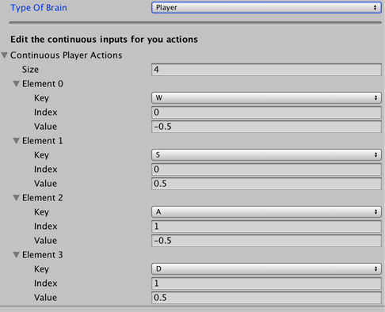

# Player Brain

The **Player Brain** allows you to control an Agent using keyboard
commands. You can use Player Brains to control a "teacher" Agent that trains
other Agents during [imitation learning](Training-Imitation-Learning.md). You
can also use Player Brains to test your Agents and environment before replacing them by **Learning Brains** and running the training process.

## Player Brain properties

The **Player Brain** properties allow you to assign one or more keyboard keys to
each action and a unique value to send when a key is pressed.

Note the differences between the discrete and continuous action spaces. When a
Brain uses the discrete action space, you can send one integer value as the
action per step. In contrast, when a Brain uses the continuous action space you
can send any number of floating point values (up to the **Vector Action Space
Size** setting).

|         **Property**          |                  |                                                                                                              **Description**                                                                                                              |
| :---------------------------- | :--------------- | :---------------------------------------------------------------------------------------------------------------------------------------------------------------------------------------------------------------------------------------- |
| **Continuous Player Actions** |                  | The mapping for the continuous vector action space. Shown when the action space is **Continuous**.                                                                                                                                        |
|                               | **Size**         | The number of key commands defined. You can assign more than one command to the same action index in order to send different values for that action. (If you press both keys at the same time, deterministic results are not guaranteed.) |
|                               | **Element 0–N**  | The mapping of keys to action values.                                                                                                                                                                                                     |
|                               | **Key**          | The key on the keyboard.                                                                                                                                                                                                                  |
|                               | **Index**        | The element of the Agent's action vector to set when this key is pressed. The index value cannot exceed the size of the Action Space (minus 1, since it is an array index).                                                               |
|                               | **Value**        | The value to send to the Agent as its action for the specified index when the mapped key is pressed. All other members of the action vector are set to 0.                                                                                 |
| **Discrete Player Actions**   |                  | The mapping for the discrete vector action space. Shown when the action space is **Discrete**.                                                                                                                                            |
|                               | **Size**         | The number of key commands defined.                                                                                                                                                                                                       |
|                               | **Element 0–N**  | The mapping of keys to action values.                                                                                                                                                                                                     |
|                               | **Key**          | The key on the keyboard.                                                                                                                                                                                                                  |
|                               | **Branch Index** | The element of the Agent's action vector to set when this key is pressed. The index value cannot exceed the size of the Action Space (minus 1, since it is an array index).                                                               |
|                               | **Value**        | The value to send to the Agent as its action when the mapped key is pressed. Cannot exceed the max value for the associated branch (minus 1, since it is an array index). Note that if no key is pressed for that branch, the default action will be 0.                                                                |

For more information about the Unity input system, see
[Input](https://docs.unity3d.com/ScriptReference/Input.html).
