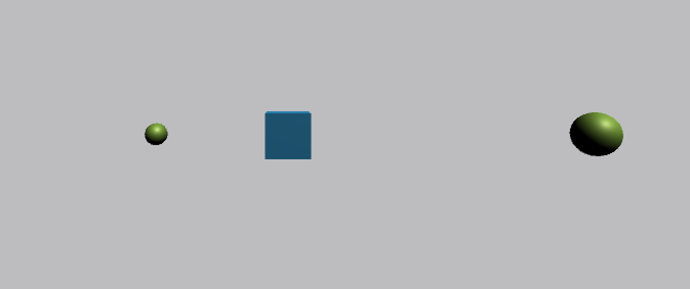
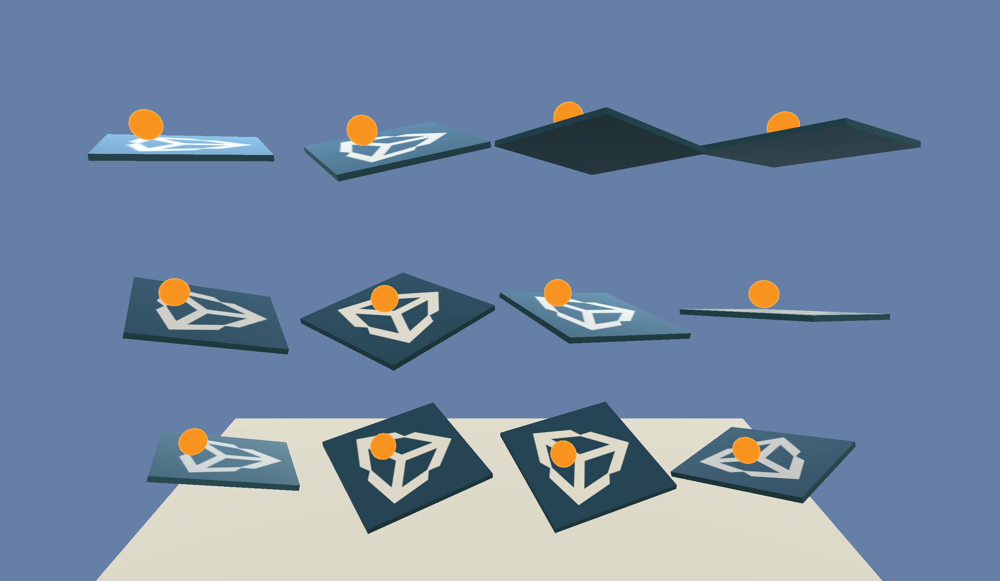
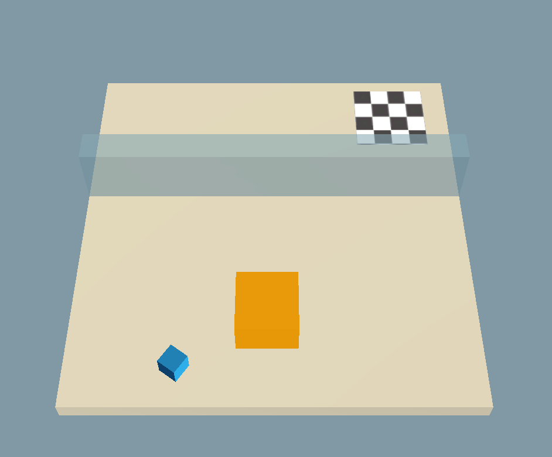
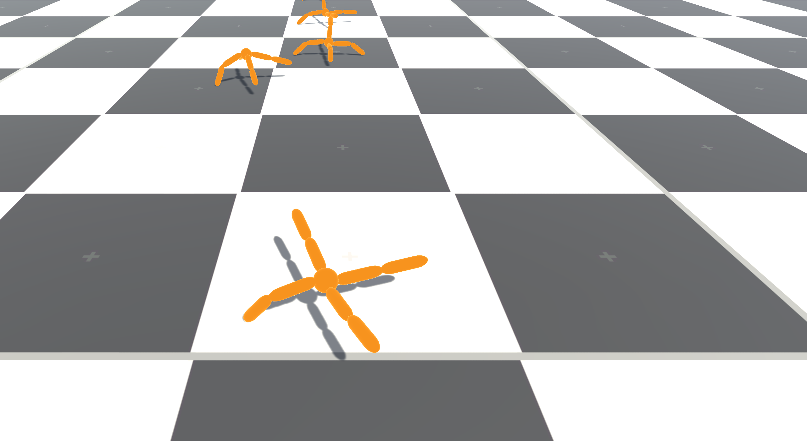
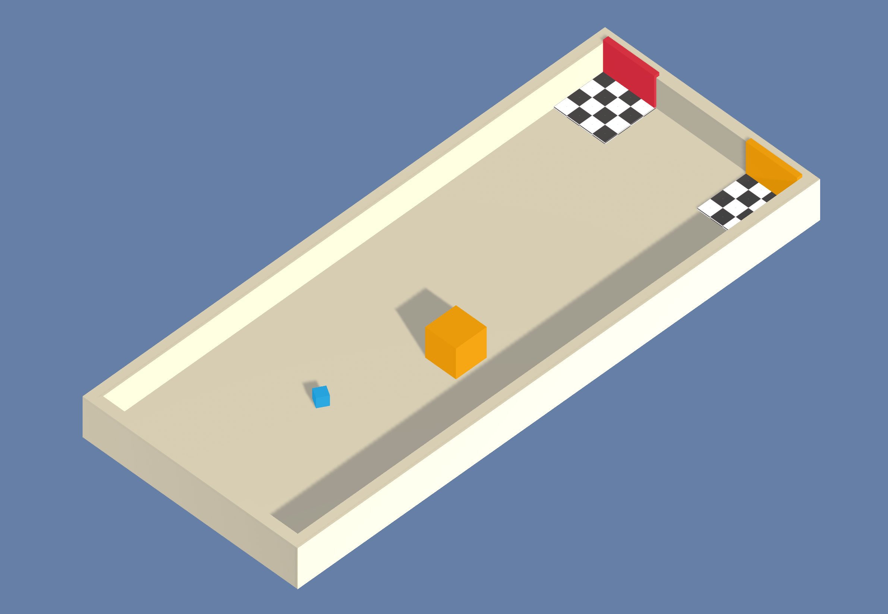
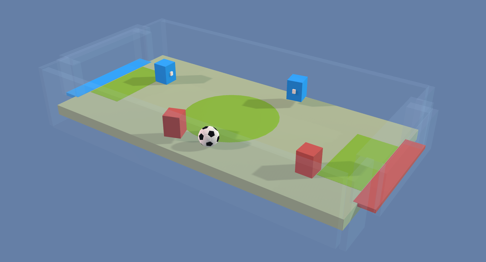
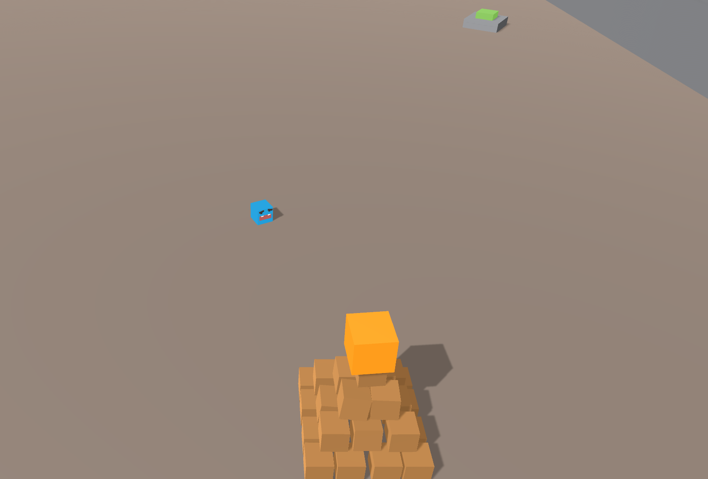
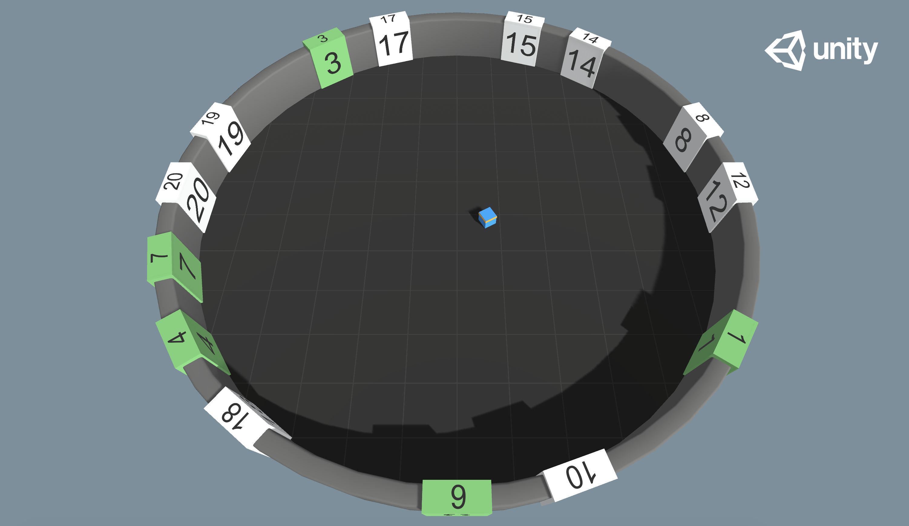
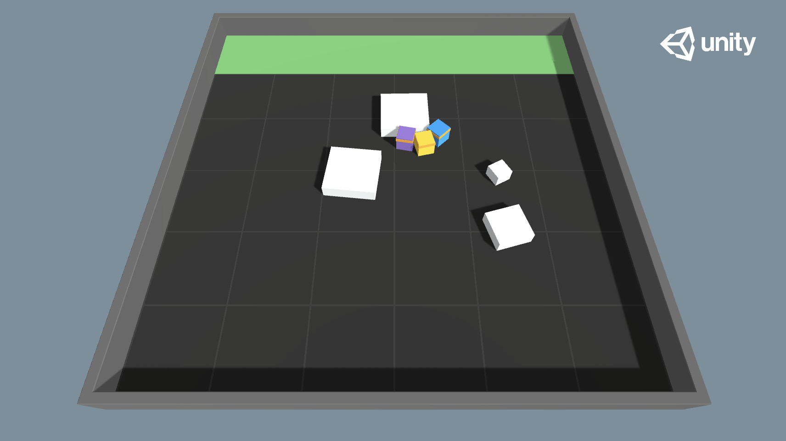
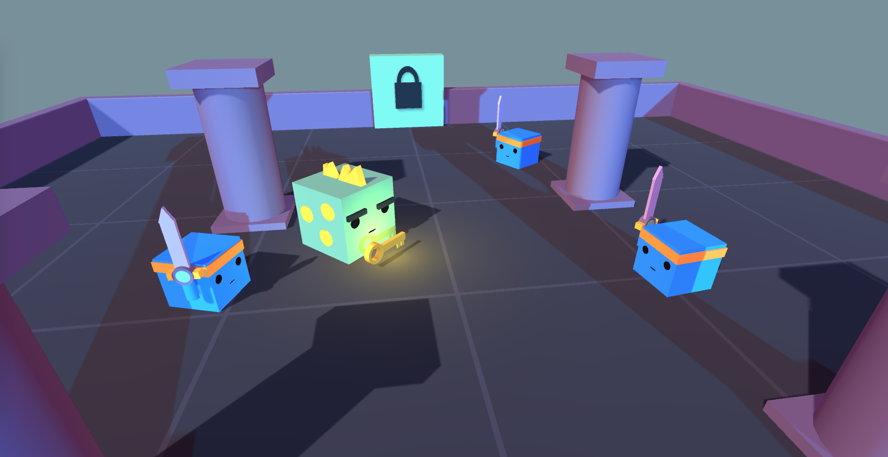

# Example Learning Environments

The Unity ML-Agents Toolkit includes an expanding set of example environments
that highlight the various features of the toolkit. These environments can also
serve as templates for new environments or as ways to test new ML algorithms.
Environments are located in `Project/Assets/ML-Agents/Examples` and summarized
below.

For the environments that highlight specific features of the toolkit, we provide
the pre-trained model files and the training config file that enables you to
train the scene yourself. The environments that are designed to serve as
challenges for researchers do not have accompanying pre-trained model files or
training configs and are marked as _Optional_ below.

This page only overviews the example environments we provide. To learn more on
how to design and build your own environments see our
[Making a New Learning Environment](Learning-Environment-Create-New.md) page. If
you would like to contribute environments, please see our
[contribution guidelines](CONTRIBUTING.md) page.

## Basic

- Set-up: A linear movement task where the agent must move left or right to
  rewarding states.
- Goal: Move to the most reward state.
- Agents: The environment contains one agent.
- Agent Reward Function:
  - -0.01 at each step
  - +0.1 for arriving at suboptimal state.
  - +1.0 for arriving at optimal state.
- Behavior Parameters:
  - Vector Observation space: One variable corresponding to current state.
  - Actions: 1 discrete action branch with 3 actions (Move left, do nothing, move
    right).
  - Visual Observations: None
- Float Properties: None
- Benchmark Mean Reward: 0.93

## 3DBall: 3D Balance Ball

- Set-up: A balance-ball task, where the agent balances the ball on it's head.
- Goal: The agent must balance the ball on it's head for as long as possible.
- Agents: The environment contains 12 agents of the same kind, all using the
  same Behavior Parameters.
- Agent Reward Function:
  - +0.1 for every step the ball remains on it's head.
  - -1.0 if the ball falls off.
- Behavior Parameters:
  - Vector Observation space: 8 variables corresponding to rotation of the agent
    cube, and position and velocity of ball.
  - Vector Observation space (Hard Version): 5 variables corresponding to
    rotation of the agent cube and position of ball.
  - Actions: 2 continuous actions, with one value corresponding to
    X-rotation, and the other to Z-rotation.
  - Visual Observations: Third-person view from the upper-front of the agent. Use
    `Visual3DBall` scene.
- Float Properties: Three
  - scale: Specifies the scale of the ball in the 3 dimensions (equal across the
    three dimensions)
    - Default: 1
    - Recommended Minimum: 0.2
    - Recommended Maximum: 5
  - gravity: Magnitude of gravity
    - Default: 9.81
    - Recommended Minimum: 4
    - Recommended Maximum: 105
  - mass: Specifies mass of the ball
    - Default: 1
    - Recommended Minimum: 0.1
    - Recommended Maximum: 20
- Benchmark Mean Reward: 100

## GridWorld

- Set-up: A multi-goal version of the grid-world task. Scene contains agent, goal,
  and obstacles.
- Goal: The agent must navigate the grid to the appropriate goal while
  avoiding the obstacles.
- Agents: The environment contains nine agents with the same Behavior
  Parameters.
- Agent Reward Function:
  - -0.01 for every step.
  - +1.0 if the agent navigates to the correct goal (episode ends).
  - -1.0 if the agent navigates to an incorrect goal (episode ends).
- Behavior Parameters:
  - Vector Observation space: None
  - Actions: 1 discrete action branch with 5 actions, corresponding to movement in
    cardinal directions or not moving. Note that for this environment,
    [action masking](Learning-Environment-Design-Agents.md#masking-discrete-actions)
    is turned on by default (this option can be toggled using the `Mask Actions`
    checkbox within the `trueAgent` GameObject). The trained model file provided
    was generated with action masking turned on.
  - Visual Observations: One corresponding to top-down view of GridWorld.
  - Goal Signal : A one hot vector corresponding to which color is the correct goal
  for the Agent
- Float Properties: Three, corresponding to grid size, number of green goals, and
  number of red goals.
- Benchmark Mean Reward: 0.8

## Push Block

- Set-up: A platforming environment where the agent can push a block around.
- Goal: The agent must push the block to the goal.
- Agents: The environment contains one agent.
- Agent Reward Function:
  - -0.0025 for every step.
  - +1.0 if the block touches the goal.
- Behavior Parameters:
  - Vector Observation space: (Continuous) 70 variables corresponding to 14
    ray-casts each detecting one of three possible objects (wall, goal, or
    block).
  - Actions: 1 discrete action branch with 7 actions, corresponding to turn clockwise
    and counterclockwise, move along four different face directions, or do nothing.
- Float Properties: Four
  - block_scale: Scale of the block along the x and z dimensions
    - Default: 2
    - Recommended Minimum: 0.5
    - Recommended Maximum: 4
  - dynamic_friction: Coefficient of friction for the ground material acting on
    moving objects
    - Default: 0
    - Recommended Minimum: 0
    - Recommended Maximum: 1
  - static_friction: Coefficient of friction for the ground material acting on
    stationary objects
    - Default: 0
    - Recommended Minimum: 0
    - Recommended Maximum: 1
  - block_drag: Effect of air resistance on block
    - Default: 0.5
    - Recommended Minimum: 0
    - Recommended Maximum: 2000
- Benchmark Mean Reward: 4.5

## Wall Jump

- Set-up: A platforming environment where the agent can jump over a wall.
- Goal: The agent must use the block to scale the wall and reach the goal.
- Agents: The environment contains one agent linked to two different Models. The
  Policy the agent is linked to changes depending on the height of the wall. The
  change of Policy is done in the WallJumpAgent class.
- Agent Reward Function:
  - -0.0005 for every step.
  - +1.0 if the agent touches the goal.
  - -1.0 if the agent falls off the platform.
- Behavior Parameters:
  - Vector Observation space: Size of 74, corresponding to 14 ray casts each
    detecting 4 possible objects. plus the global position of the agent and
    whether or not the agent is grounded.
  - Actions: 4 discrete action branches:
    - Forward Motion (3 possible actions: Forward, Backwards, No Action)
    - Rotation (3 possible actions: Rotate Left, Rotate Right, No Action)
    - Side Motion (3 possible actions: Left, Right, No Action)
    - Jump (2 possible actions: Jump, No Action)
  - Visual Observations: None
- Float Properties: Four
- Benchmark Mean Reward (Big & Small Wall): 0.8

## Crawler

- Set-up: A creature with 4 arms and 4 forearms.
- Goal: The agents must move its body toward the goal direction without falling.
- Agents: The environment contains 10 agents with same Behavior Parameters.
- Agent Reward Function (independent):
  The reward function is now geometric meaning the reward each step is a product
  of all the rewards instead of a sum, this helps the agent try to maximize all
  rewards instead of the easiest rewards.
  - Body velocity matches goal velocity. (normalized between (0,1))
  - Head direction alignment with goal direction. (normalized between (0,1))
- Behavior Parameters:
  - Vector Observation space: 172 variables corresponding to position, rotation,
    velocity, and angular velocities of each limb plus the acceleration and
    angular acceleration of the body.
  - Actions: 20 continuous actions, corresponding to target
    rotations for joints.
  - Visual Observations: None
- Float Properties: None
- Benchmark Mean Reward: 3000

## Worm

- Set-up: A worm with a head and 3 body segments.
- Goal: The agents must move its body toward the goal direction.
- Agents: The environment contains 10 agents with same Behavior Parameters.
- Agent Reward Function (independent):
  The reward function is now geometric meaning the reward each step is a product
  of all the rewards instead of a sum, this helps the agent try to maximize all
  rewards instead of the easiest rewards.
  - Body velocity matches goal velocity. (normalized between (0,1))
  - Body direction alignment with goal direction. (normalized between (0,1))
- Behavior Parameters:
  - Vector Observation space: 64 variables corresponding to position, rotation,
    velocity, and angular velocities of each limb plus the acceleration and
    angular acceleration of the body.
  - Actions: 9 continuous actions, corresponding to target
    rotations for joints.
  - Visual Observations: None
- Float Properties: None
- Benchmark Mean Reward: 800

## Food Collector

- Set-up: A multi-agent environment where agents compete to collect food.
- Goal: The agents must learn to collect as many green food spheres as possible
  while avoiding red spheres.
- Agents: The environment contains 5 agents with same Behavior Parameters.
- Agent Reward Function (independent):
  - +1 for interaction with green spheres
  - -1 for interaction with red spheres
- Behavior Parameters:
  - Vector Observation space: 53 corresponding to velocity of agent (2), whether
    agent is frozen and/or shot its laser (2), plus grid based perception of
    objects around agent's forward direction (40 by 40 with 6 different categories).
  - Actions:
    - 3 continuous actions correspond to Forward Motion, Side Motion and Rotation
    - 1 discrete acion branch for Laser with 2 possible actions corresponding to
      Shoot Laser or No Action
  - Visual Observations (Optional): First-person camera per-agent, plus one vector
    flag representing the frozen state of the agent. This scene uses a combination
    of vector and visual observations and the training will not succeed without
    the frozen vector flag. Use `VisualFoodCollector` scene.
- Float Properties: Two
  - laser_length: Length of the laser used by the agent
    - Default: 1
    - Recommended Minimum: 0.2
    - Recommended Maximum: 7
  - agent_scale: Specifies the scale of the agent in the 3 dimensions (equal
    across the three dimensions)
    - Default: 1
    - Recommended Minimum: 0.5
    - Recommended Maximum: 5
- Benchmark Mean Reward: 10

## Hallway

- Set-up: Environment where the agent needs to find information in a room,
  remember it, and use it to move to the correct goal.
- Goal: Move to the goal which corresponds to the color of the block in the
  room.
- Agents: The environment contains one agent.
- Agent Reward Function (independent):
  - +1 For moving to correct goal.
  - -0.1 For moving to incorrect goal.
  - -0.0003 Existential penalty.
- Behavior Parameters:
  - Vector Observation space: 30 corresponding to local ray-casts detecting
    objects, goals, and walls.
  - Actions: 1 discrete action Branch, with 4 actions corresponding to agent
    rotation and forward/backward movement.
- Float Properties: None
- Benchmark Mean Reward: 0.7
  - To train this environment, you can enable curiosity by adding the `curiosity` reward signal
    in `config/ppo/Hallway.yaml`

## Soccer Twos

- Set-up: Environment where four agents compete in a 2 vs 2 toy soccer game.
- Goal:
  - Get the ball into the opponent's goal while preventing the ball from
    entering own goal.
- Agents: The environment contains two different Multi Agent Groups with two agents in each.
  Parameters : SoccerTwos.
- Agent Reward Function (dependent):
  - (1 - `accumulated time penalty`) When ball enters opponent's goal
    `accumulated time penalty` is incremented by (1 / `MaxStep`) every fixed
    update and is reset to 0 at the beginning of an episode.
  - -1 When ball enters team's goal.
- Behavior Parameters:
  - Vector Observation space: 336 corresponding to 11 ray-casts forward
    distributed over 120 degrees and 3 ray-casts backward distributed over 90
    degrees each detecting 6 possible object types, along with the object's
    distance. The forward ray-casts contribute 264 state dimensions and backward
    72 state dimensions over three observation stacks.
  - Actions: 3 discrete branched actions corresponding to
    forward, backward, sideways movement, as well as rotation.
  - Visual Observations: None
- Float Properties: Two
  - ball_scale: Specifies the scale of the ball in the 3 dimensions (equal
    across the three dimensions)
    - Default: 7.5
    - Recommended minimum: 4
    - Recommended maximum: 10
  - gravity: Magnitude of the gravity
    - Default: 9.81
    - Recommended minimum: 6
    - Recommended maximum: 20

## Strikers Vs. Goalie

- Set-up: Environment where two agents compete in a 2 vs 1 soccer variant.
- Goal:
  - Striker: Get the ball into the opponent's goal.
  - Goalie: Keep the ball out of the goal.
- Agents: The environment contains two different Multi Agent Groups. One with two Strikers and the other one Goalie.
  Behavior Parameters : Striker, Goalie.
- Striker Agent Reward Function (dependent):
  - +1 When ball enters opponent's goal.
  - -0.001 Existential penalty.
- Goalie Agent Reward Function (dependent):
  - -1 When ball enters goal.
  - 0.001 Existential bonus.
- Behavior Parameters:
  - Striker Vector Observation space: 294 corresponding to 11 ray-casts forward
    distributed over 120 degrees and 3 ray-casts backward distributed over 90
    degrees each detecting 5 possible object types, along with the object's
    distance. The forward ray-casts contribute 231 state dimensions and backward
    63 state dimensions over three observation stacks.
  - Striker Actions: 3 discrete branched actions corresponding
    to forward, backward, sideways movement, as well as rotation.
  - Goalie Vector Observation space: 738 corresponding to 41 ray-casts
    distributed over 360 degrees each detecting 4 possible object types, along
    with the object's distance and 3 observation stacks.
  - Goalie Actions: 3 discrete branched actions corresponding
    to forward, backward, sideways movement, as well as rotation.
  - Visual Observations: None
- Float Properties: Two
  - ball_scale: Specifies the scale of the ball in the 3 dimensions (equal
    across the three dimensions)
    - Default: 7.5
    - Recommended minimum: 4
    - Recommended maximum: 10
  - gravity: Magnitude of the gravity
    - Default: 9.81
    - Recommended minimum: 6
    - Recommended maximum: 20

## Walker

- Set-up: Physics-based Humanoid agents with 26 degrees of freedom. These DOFs
  correspond to articulation of the following body-parts: hips, chest, spine,
  head, thighs, shins, feet, arms, forearms and hands.
- Goal: The agents must move its body toward the goal direction without falling.
- Agents: The environment contains 10 independent agents with same Behavior
  Parameters.
- Agent Reward Function (independent):
  The reward function is now geometric meaning the reward each step is a product
  of all the rewards instead of a sum, this helps the agent try to maximize all
  rewards instead of the easiest rewards.
  - Body velocity matches goal velocity. (normalized between (0,1))
  - Head direction alignment with goal direction. (normalized between (0,1))
- Behavior Parameters:
  - Vector Observation space: 243 variables corresponding to position, rotation,
    velocity, and angular velocities of each limb, along with goal direction.
  - Actions: 39 continuous actions, corresponding to target
    rotations and strength applicable to the joints.
  - Visual Observations: None
- Float Properties: Four
  - gravity: Magnitude of gravity
    - Default: 9.81
    - Recommended Minimum:
    - Recommended Maximum:
  - hip_mass: Mass of the hip component of the walker
    - Default: 8
    - Recommended Minimum: 7
    - Recommended Maximum: 28
  - chest_mass: Mass of the chest component of the walker
    - Default: 8
    - Recommended Minimum: 3
    - Recommended Maximum: 20
  - spine_mass: Mass of the spine component of the walker
    - Default: 8
    - Recommended Minimum: 3
    - Recommended Maximum: 20
- Benchmark Mean Reward : 2500

## Pyramids

- Set-up: Environment where the agent needs to press a button to spawn a
  pyramid, then navigate to the pyramid, knock it over, and move to the gold
  brick at the top.
- Goal: Move to the golden brick on top of the spawned pyramid.
- Agents: The environment contains one agent.
- Agent Reward Function (independent):
  - +2 For moving to golden brick (minus 0.001 per step).
- Behavior Parameters:
  - Vector Observation space: 148 corresponding to local ray-casts detecting
    switch, bricks, golden brick, and walls, plus variable indicating switch
    state.
  - Actions: 1 discrete action branch, with 4 actions corresponding to agent rotation and
    forward/backward movement.
- Float Properties: None
- Benchmark Mean Reward: 1.75

## Match 3

- Set-up: Simple match-3 game. Matched pieces are removed, and remaining pieces
drop down. New pieces are spawned randomly at the top, with a chance of being
"special".
- Goal: Maximize score from matching pieces.
- Agents: The environment contains several independent Agents.
- Agent Reward Function (independent):
  - .01 for each normal piece cleared. Special pieces are worth 2x or 3x.
- Behavior Parameters:
  - None
  - Observations and actions are defined with a sensor and actuator respectively.
- Float Properties: None
- Benchmark Mean Reward:
  - 39.5 for visual observations
  - 38.5 for vector observations
  - 34.2 for simple heuristic (pick a random valid move)
  - 37.0 for greedy heuristic (pick the highest-scoring valid move)

## Sorter

 - Set-up: The Agent is in a circular room with numbered tiles. The values of the
 tiles are random between 1 and 20. The tiles present in the room are randomized
 at each episode. When the Agent visits a tile, it turns green.
 - Goal: Visit all the tiles in ascending order.
 - Agents: The environment contains a single Agent
 - Agent Reward Function:
  - -.0002 Existential penalty.
  - +1 For visiting the right tile
  - -1 For visiting the wrong tile
 - BehaviorParameters:
  - Vector Observations : 4 : 2 floats for Position and 2 floats for orientation
  - Variable Length Observations : Between 1 and 20 entities (one for each tile)
  each with 22 observations, the first 20 are one hot encoding of the value of the tile,
  the 21st and 22nd represent the position of the tile relative to the Agent and the 23rd
  is `1` if the tile was visited and `0` otherwise.
  - Actions: 3 discrete branched actions corresponding to forward, backward,
  sideways movement, as well as rotation.
  - Float Properties: One
    - num_tiles: The maximum number of tiles to sample.
      - Default: 2
      - Recommended Minimum: 1
      - Recommended Maximum: 20
  - Benchmark Mean Reward: Depends on the number of tiles.

## Cooperative Push Block

- Set-up: Similar to Push Block, the agents are in an area with blocks that need
to be pushed into a goal. Small blocks can be pushed by one agents and are worth
+1 value, medium blocks require two agents to push in and are worth +2, and large
blocks require all 3 agents to push and are worth +3.
- Goal: Push all blocks into the goal.
- Agents: The environment contains three Agents in a Multi Agent Group.
- Agent Reward Function:
  - -0.0001 Existential penalty, as a group reward.
  - +1, +2, or +3 for pushing in a block, added as a group reward.
- Behavior Parameters:
  - Observation space: A single Grid Sensor with separate tags for each block size,
    the goal, the walls, and other agents.
  - Actions: 1 discrete action branch with 7 actions, corresponding to turn clockwise
    and counterclockwise, move along four different face directions, or do nothing.
- Float Properties: None
- Benchmark Mean Reward: 11 (Group Reward)

## Dungeon Escape

- Set-up: Agents are trapped in a dungeon with a dragon, and must work together to escape.
  To retrieve the key, one of the agents must find and slay the dragon, sacrificing itself
  to do so. The dragon will drop a key for the others to use. The other agents can then pick
  up this key and unlock the dungeon door. If the agents take too long, the dragon will escape
  through a portal and the environment resets.
- Goal: Unlock the dungeon door and leave.
- Agents: The environment contains three Agents in a Multi Agent Group and one Dragon, which
  moves in a predetermined pattern.
- Agent Reward Function:
  - +1 group reward if any agent successfully unlocks the door and leaves the dungeon.
- Behavior Parameters:
  - Observation space: A Ray Perception Sensor with separate tags for the walls, other agents,
    the door, key, the dragon, and the dragon's portal. A single Vector Observation which indicates
    whether the agent is holding a key.
  - Actions: 1 discrete action branch with 7 actions, corresponding to turn clockwise
    and counterclockwise, move along four different face directions, or do nothing.
- Float Properties: None
- Benchmark Mean Reward: 1.0 (Group Reward)
