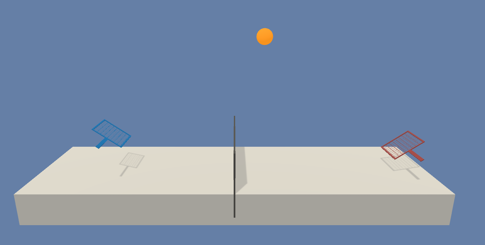
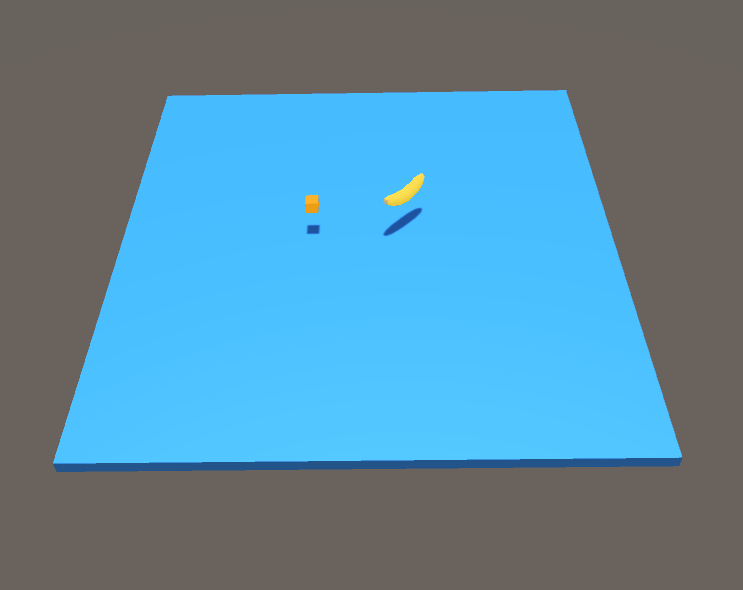

# Example Learning Environments

The Unity ML-Agents Toolkit includes an expanding set of example environments
that highlight the various features of the toolkit. These environments can also
serve as templates for new environments or as ways to test new ML algorithms.
Environments are located in `Project/Assets/ML-Agents/Examples` and summarized
below. Additionally, our
[first ML Challenge](https://connect.unity.com/challenges/ml-agents-1) contains
environments created by the community.

For the environments that highlight specific features of the toolkit, we provide
the pre-trained model files and the training config file that enables you to
train the scene yourself. The environments that are designed to serve as
challenges for researchers do not have accompanying pre-trained model files or
training configs and are marked as _Optional_ below.

This page only overviews the example environments we provide. To learn more on
how to design and build your own environments see our
[Making a New Learning Environment](Learning-Environment-Create-New.md) page. If
you would like to contribute environments, please see our
[contribution guidelines](../com.unity.ml-agents/CONTRIBUTING.md) page.

## Basic

- Set-up: A linear movement task where the agent must move left or right to
  rewarding states.
- Goal: Move to the most reward state.
- Agents: The environment contains one agent.
- Agent Reward Function:
  - -0.01 at each step
  - +0.1 for arriving at suboptimal state.
  - +1.0 for arriving at optimal state.
- Behavior Parameters:
  - Vector Observation space: One variable corresponding to current state.
  - Vector Action space: (Discrete) Two possible actions (Move left, move
    right).
  - Visual Observations: None
- Float Properties: None
- Benchmark Mean Reward: 0.93

## 3DBall: 3D Balance Ball

- Set-up: A balance-ball task, where the agent balances the ball on it's head.
- Goal: The agent must balance the ball on it's head for as long as possible.
- Agents: The environment contains 12 agents of the same kind, all using the
  same Behavior Parameters.
- Agent Reward Function:
  - +0.1 for every step the ball remains on it's head.
  - -1.0 if the ball falls off.
- Behavior Parameters:
  - Vector Observation space: 8 variables corresponding to rotation of the agent
    cube, and position and velocity of ball.
  - Vector Observation space (Hard Version): 5 variables corresponding to
    rotation of the agent cube and position of ball.
  - Vector Action space: (Continuous) Size of 2, with one value corresponding to
    X-rotation, and the other to Z-rotation.
  - Visual Observations: None.
- Float Properties: Three
  - scale: Specifies the scale of the ball in the 3 dimensions (equal across the
    three dimensions)
    - Default: 1
    - Recommended Minimum: 0.2
    - Recommended Maximum: 5
  - gravity: Magnitude of gravity
    - Default: 9.81
    - Recommended Minimum: 4
    - Recommended Maximum: 105
  - mass: Specifies mass of the ball
    - Default: 1
    - Recommended Minimum: 0.1
    - Recommended Maximum: 20
- Benchmark Mean Reward: 100

## GridWorld

- Set-up: A version of the classic grid-world task. Scene contains agent, goal,
  and obstacles.
- Goal: The agent must navigate the grid to the goal while avoiding the
  obstacles.
- Agents: The environment contains nine agents with the same Behavior
  Parameters.
- Agent Reward Function:
  - -0.01 for every step.
  - +1.0 if the agent navigates to the goal position of the grid (episode ends).
  - -1.0 if the agent navigates to an obstacle (episode ends).
- Behavior Parameters:
  - Vector Observation space: None
  - Vector Action space: (Discrete) Size of 4, corresponding to movement in
    cardinal directions. Note that for this environment,
    [action masking](Learning-Environment-Design-Agents.md#masking-discrete-actions)
    is turned on by default (this option can be toggled using the `Mask Actions`
    checkbox within the `trueAgent` GameObject). The trained model file provided
    was generated with action masking turned on.
  - Visual Observations: One corresponding to top-down view of GridWorld.
- Float Properties: Three, corresponding to grid size, number of obstacles, and
  number of goals.
- Benchmark Mean Reward: 0.8

## Tennis

- Set-up: Two-player game where agents control rackets to hit a ball over the
  net.
- Goal: The agents must hit the ball so that the opponent cannot hit a valid
  return.
- Agents: The environment contains two agent with same Behavior Parameters.
  After training you can set the `Behavior Type` to `Heuristic Only` on one of
  the Agent's Behavior Parameters to play against your trained model.
- Agent Reward Function (independent):
  - +1.0 To the agent that wins the point. An agent wins a point by preventing
    the opponent from hitting a valid return.
  - -1.0 To the agent who loses the point.
- Behavior Parameters:
  - Vector Observation space: 9 variables corresponding to position, velocity
    and orientation of ball and racket.
  - Vector Action space: (Continuous) Size of 3, corresponding to movement
    toward net or away from net, jumping and rotation.
  - Visual Observations: None
- Float Properties: Three
  - gravity: Magnitude of gravity
    - Default: 9.81
    - Recommended Minimum: 6
    - Recommended Maximum: 20
  - scale: Specifies the scale of the ball in the 3 dimensions (equal across the
    three dimensions)
    - Default: .5
    - Recommended Minimum: 0.2
    - Recommended Maximum: 5

## Push Block

- Set-up: A platforming environment where the agent can push a block around.
- Goal: The agent must push the block to the goal.
- Agents: The environment contains one agent.
- Agent Reward Function:
  - -0.0025 for every step.
  - +1.0 if the block touches the goal.
- Behavior Parameters:
  - Vector Observation space: (Continuous) 70 variables corresponding to 14
    ray-casts each detecting one of three possible objects (wall, goal, or
    block).
  - Vector Action space: (Discrete) Size of 6, corresponding to turn clockwise
    and counterclockwise and move along four different face directions.
  - Visual Observations (Optional): One first-person camera. Use
    `VisualPushBlock` scene. **The visual observation version of this
    environment does not train with the provided default training parameters.**
- Float Properties: Four
  - block_scale: Scale of the block along the x and z dimensions
    - Default: 2
    - Recommended Minimum: 0.5
    - Recommended Maximum: 4
  - dynamic_friction: Coefficient of friction for the ground material acting on
    moving objects
    - Default: 0
    - Recommended Minimum: 0
    - Recommended Maximum: 1
  - static_friction: Coefficient of friction for the ground material acting on
    stationary objects
    - Default: 0
    - Recommended Minimum: 0
    - Recommended Maximum: 1
  - block_drag: Effect of air resistance on block
    - Default: 0.5
    - Recommended Minimum: 0
    - Recommended Maximum: 2000
- Benchmark Mean Reward: 4.5

## Wall Jump

- Set-up: A platforming environment where the agent can jump over a wall.
- Goal: The agent must use the block to scale the wall and reach the goal.
- Agents: The environment contains one agent linked to two different Models. The
  Policy the agent is linked to changes depending on the height of the wall. The
  change of Policy is done in the WallJumpAgent class.
- Agent Reward Function:
  - -0.0005 for every step.
  - +1.0 if the agent touches the goal.
  - -1.0 if the agent falls off the platform.
- Behavior Parameters:
  - Vector Observation space: Size of 74, corresponding to 14 ray casts each
    detecting 4 possible objects. plus the global position of the agent and
    whether or not the agent is grounded.
  - Vector Action space: (Discrete) 4 Branches:
    - Forward Motion (3 possible actions: Forward, Backwards, No Action)
    - Rotation (3 possible actions: Rotate Left, Rotate Right, No Action)
    - Side Motion (3 possible actions: Left, Right, No Action)
    - Jump (2 possible actions: Jump, No Action)
  - Visual Observations: None
- Float Properties: Four
- Benchmark Mean Reward (Big & Small Wall): 0.8

## Reacher

- Set-up: Double-jointed arm which can move to target locations.
- Goal: The agents must move its hand to the goal location, and keep it there.
- Agents: The environment contains 10 agent with same Behavior Parameters.
- Agent Reward Function (independent):
  - +0.1 Each step agent's hand is in goal location.
- Behavior Parameters:
  - Vector Observation space: 26 variables corresponding to position, rotation,
    velocity, and angular velocities of the two arm rigid bodies.
  - Vector Action space: (Continuous) Size of 4, corresponding to torque
    applicable to two joints.
  - Visual Observations: None.
- Float Properties: Five
  - goal_size: radius of the goal zone
    - Default: 5
    - Recommended Minimum: 1
    - Recommended Maximum: 10
  - goal_speed: speed of the goal zone around the arm (in radians)
    - Default: 1
    - Recommended Minimum: 0.2
    - Recommended Maximum: 4
  - gravity
    - Default: 9.81
    - Recommended Minimum: 4
    - Recommended Maximum: 20
  - deviation: Magnitude of sinusoidal (cosine) deviation of the goal along the
    vertical dimension
    - Default: 0
    - Recommended Minimum: 0
    - Recommended Maximum: 5
  - deviation_freq: Frequency of the cosine deviation of the goal along the
    vertical dimension
    - Default: 0
    - Recommended Minimum: 0
    - Recommended Maximum: 3
- Benchmark Mean Reward: 30

## Crawler

- Set-up: A creature with 4 arms and 4 forearms.
- Goal: The agents must move its body toward the goal direction without falling.
  - `CrawlerDynamicTarget`- Goal direction is randomized.
  - `CrawlerDynamicVariableSpeed`- Goal direction and walking speed are randomized.
  - `CrawlerStaticTarget` - Goal direction is always forward.
  - `CrawlerStaticVariableSpeed`- Goal direction is always forward. Walking speed is randomized
- Agents: The environment contains 10 agents with same Behavior Parameters.
- Agent Reward Function (independent):
  The reward function is now geometric meaning the reward each step is a product
  of all the rewards instead of a sum, this helps the agent try to maximize all
  rewards instead of the easiest rewards.
  - Body velocity matches goal velocity. (normalized between (0,1))
  - Head direction alignment with goal direction. (normalized between (0,1))
- Behavior Parameters:
  - Vector Observation space: 172 variables corresponding to position, rotation,
    velocity, and angular velocities of each limb plus the acceleration and
    angular acceleration of the body.
  - Vector Action space: (Continuous) Size of 20, corresponding to target
    rotations for joints.
  - Visual Observations: None
- Float Properties: None
- Benchmark Mean Reward for `CrawlerDynamicTarget`: 2000
- Benchmark Mean Reward for `CrawlerDynamicVariableSpeed`: 3000
- Benchmark Mean Reward for `CrawlerStaticTarget`: 4000
- Benchmark Mean Reward for `CrawlerStaticVariableSpeed`: 4000

## Worm

- Set-up: A worm with a head and 3 body segments.
- Goal: The agents must move its body toward the goal direction.
  - `WormStaticTarget` - Goal direction is always forward.
  - `WormDynamicTarget`- Goal direction is randomized.
- Agents: The environment contains 10 agents with same Behavior Parameters.
- Agent Reward Function (independent):
  The reward function is now geometric meaning the reward each step is a product
  of all the rewards instead of a sum, this helps the agent try to maximize all
  rewards instead of the easiest rewards.
  - Body velocity matches goal velocity. (normalized between (0,1))
  - Body direction alignment with goal direction. (normalized between (0,1))
- Behavior Parameters:
  - Vector Observation space: 64 variables corresponding to position, rotation,
    velocity, and angular velocities of each limb plus the acceleration and
    angular acceleration of the body.
  - Vector Action space: (Continuous) Size of 9, corresponding to target
    rotations for joints.
  - Visual Observations: None
- Float Properties: None
- Benchmark Mean Reward for `WormStaticTarget`: 1200
- Benchmark Mean Reward for `WormDynamicTarget`: 800

## Food Collector

- Set-up: A multi-agent environment where agents compete to collect food.
- Goal: The agents must learn to collect as many green food spheres as possible
  while avoiding red spheres.
- Agents: The environment contains 5 agents with same Behavior Parameters.
- Agent Reward Function (independent):
  - +1 for interaction with green spheres
  - -1 for interaction with red spheres
- Behavior Parameters:
  - Vector Observation space: 53 corresponding to velocity of agent (2), whether
    agent is frozen and/or shot its laser (2), plus ray-based perception of
    objects around agent's forward direction (49; 7 raycast angles with 7
    measurements for each).
  - Vector Action space: (Discrete) 4 Branches:
    - Forward Motion (3 possible actions: Forward, Backwards, No Action)
    - Side Motion (3 possible actions: Left, Right, No Action)
    - Rotation (3 possible actions: Rotate Left, Rotate Right, No Action)
    - Laser (2 possible actions: Laser, No Action)
  - Visual Observations (Optional): First-person camera per-agent. Use
    `VisualFoodCollector` scene. **The visual observation version of this
    environment does not train with the provided default training parameters.**
- Float Properties: Two
  - laser_length: Length of the laser used by the agent
    - Default: 1
    - Recommended Minimum: 0.2
    - Recommended Maximum: 7
  - agent_scale: Specifies the scale of the agent in the 3 dimensions (equal
    across the three dimensions)
    - Default: 1
    - Recommended Minimum: 0.5
    - Recommended Maximum: 5
- Benchmark Mean Reward: 10

## Hallway

- Set-up: Environment where the agent needs to find information in a room,
  remember it, and use it to move to the correct goal.
- Goal: Move to the goal which corresponds to the color of the block in the
  room.
- Agents: The environment contains one agent.
- Agent Reward Function (independent):
  - +1 For moving to correct goal.
  - -0.1 For moving to incorrect goal.
  - -0.0003 Existential penalty.
- Behavior Parameters:
  - Vector Observation space: 30 corresponding to local ray-casts detecting
    objects, goals, and walls.
  - Vector Action space: (Discrete) 1 Branch, 4 actions corresponding to agent
    rotation and forward/backward movement.
  - Visual Observations (Optional): First-person view for the agent. Use
    `VisualHallway` scene. **The visual observation version of this environment
    does not train with the provided default training parameters.**
- Float Properties: None
- Benchmark Mean Reward: 0.7
  - To train this environment, you can enable curiosity by adding the `curiosity` reward signal
    in `config/ppo/Hallway.yaml`

## Bouncer

- Set-up: Environment where the agent needs on-demand decision making. The agent
  must decide how perform its next bounce only when it touches the ground.
- Goal: Catch the floating green cube. Only has a limited number of jumps.
- Agents: The environment contains one agent.
- Agent Reward Function (independent):
  - +1 For catching the green cube.
  - -1 For bouncing out of bounds.
  - -0.05 Times the action squared. Energy expenditure penalty.
- Behavior Parameters:
  - Vector Observation space: 6 corresponding to local position of agent and
    green cube.
  - Vector Action space: (Continuous) 3 corresponding to agent force applied for
    the jump.
  - Visual Observations: None
- Float Properties: Two
  - target_scale: The scale of the green cube in the 3 dimensions
    - Default: 150
    - Recommended Minimum: 50
    - Recommended Maximum: 250
- Benchmark Mean Reward: 10

## Soccer Twos

- Set-up: Environment where four agents compete in a 2 vs 2 toy soccer game.
- Goal:
  - Get the ball into the opponent's goal while preventing the ball from
    entering own goal.
- Agents: The environment contains four agents, with the same Behavior
  Parameters : SoccerTwos.
- Agent Reward Function (dependent):
  - (1 - `accumulated time penalty`) When ball enters opponent's goal
    `accumulated time penalty` is incremented by (1 / `MaxStep`) every fixed
    update and is reset to 0 at the beginning of an episode.
  - -1 When ball enters team's goal.
- Behavior Parameters:
  - Vector Observation space: 336 corresponding to 11 ray-casts forward
    distributed over 120 degrees and 3 ray-casts backward distributed over 90
    degrees each detecting 6 possible object types, along with the object's
    distance. The forward ray-casts contribute 264 state dimensions and backward
    72 state dimensions over three observation stacks.
  - Vector Action space: (Discrete) Three branched actions corresponding to
    forward, backward, sideways movement, as well as rotation.
  - Visual Observations: None
- Float Properties: Two
  - ball_scale: Specifies the scale of the ball in the 3 dimensions (equal
    across the three dimensions)
    - Default: 7.5
    - Recommended minimum: 4
    - Recommended maximum: 10
  - gravity: Magnitude of the gravity
    - Default: 9.81
    - Recommended minimum: 6
    - Recommended maximum: 20

# Strikers Vs. Goalie

- Set-up: Environment where two agents compete in a 2 vs 1 soccer variant.
- Goal:
  - Striker: Get the ball into the opponent's goal.
  - Goalie: Keep the ball out of the goal.
- Agents: The environment contains three agents. Two Strikers and one Goalie.
  Behavior Parameters : Striker, Goalie.
- Striker Agent Reward Function (dependent):
  - +1 When ball enters opponent's goal.
  - -0.001 Existential penalty.
- Goalie Agent Reward Function (dependent):
  - -1 When ball enters goal.
  - 0.001 Existential bonus.
- Behavior Parameters:
  - Striker Vector Observation space: 294 corresponding to 11 ray-casts forward
    distributed over 120 degrees and 3 ray-casts backward distributed over 90
    degrees each detecting 5 possible object types, along with the object's
    distance. The forward ray-casts contribute 231 state dimensions and backward
    63 state dimensions over three observation stacks.
  - Striker Vector Action space: (Discrete) Three branched actions corresponding
    to forward, backward, sideways movement, as well as rotation.
  - Goalie Vector Observation space: 738 corresponding to 41 ray-casts
    distributed over 360 degrees each detecting 4 possible object types, along
    with the object's distance and 3 observation stacks.
  - Goalie Vector Action space: (Discrete) Three branched actions corresponding
    to forward, backward, sideways movement, as well as rotation.
  - Visual Observations: None
- Float Properties: Two
  - ball_scale: Specifies the scale of the ball in the 3 dimensions (equal
    across the three dimensions)
    - Default: 7.5
    - Recommended minimum: 4
    - Recommended maximum: 10
  - gravity: Magnitude of the gravity
    - Default: 9.81
    - Recommended minimum: 6
    - Recommended maximum: 20

## Walker

- Set-up: Physics-based Humanoid agents with 26 degrees of freedom. These DOFs
  correspond to articulation of the following body-parts: hips, chest, spine,
  head, thighs, shins, feet, arms, forearms and hands.
- Goal: The agents must move its body toward the goal direction without falling.
  - `WalkerDynamic`- Goal direction is randomized.
  - `WalkerDynamicVariableSpeed`- Goal direction and walking speed are randomized.
  - `WalkerStatic` - Goal direction is always forward.
  - `WalkerStaticVariableSpeed` - Goal direction is always forward. Walking
     speed is randomized
- Agents: The environment contains 10 independent agents with same Behavior
  Parameters.
- Agent Reward Function (independent):
  The reward function is now geometric meaning the reward each step is a product
  of all the rewards instead of a sum, this helps the agent try to maximize all
  rewards instead of the easiest rewards.
  - Body velocity matches goal velocity. (normalized between (0,1))
  - Head direction alignment with goal direction. (normalized between (0,1))
- Behavior Parameters:
  - Vector Observation space: 243 variables corresponding to position, rotation,
    velocity, and angular velocities of each limb, along with goal direction.
  - Vector Action space: (Continuous) Size of 39, corresponding to target
    rotations and strength applicable to the joints.
  - Visual Observations: None
- Float Properties: Four
  - gravity: Magnitude of gravity
    - Default: 9.81
    - Recommended Minimum:
    - Recommended Maximum:
  - hip_mass: Mass of the hip component of the walker
    - Default: 8
    - Recommended Minimum: 7
    - Recommended Maximum: 28
  - chest_mass: Mass of the chest component of the walker
    - Default: 8
    - Recommended Minimum: 3
    - Recommended Maximum: 20
  - spine_mass: Mass of the spine component of the walker
    - Default: 8
    - Recommended Minimum: 3
    - Recommended Maximum: 20
- Benchmark Mean Reward for `WalkerDynamic`: 2500
- Benchmark Mean Reward for `WalkerDynamicVariableSpeed`: 2500
- Benchmark Mean Reward for `WalkerStatic`: 3500
- Benchmark Mean Reward for `WalkerStaticVariableSpeed`: 3500

## Pyramids

- Set-up: Environment where the agent needs to press a button to spawn a
  pyramid, then navigate to the pyramid, knock it over, and move to the gold
  brick at the top.
- Goal: Move to the golden brick on top of the spawned pyramid.
- Agents: The environment contains one agent.
- Agent Reward Function (independent):
  - +2 For moving to golden brick (minus 0.001 per step).
- Behavior Parameters:
  - Vector Observation space: 148 corresponding to local ray-casts detecting
    switch, bricks, golden brick, and walls, plus variable indicating switch
    state.
  - Vector Action space: (Discrete) 4 corresponding to agent rotation and
    forward/backward movement.
  - Visual Observations (Optional): First-person camera per-agent. Us
    `VisualPyramids` scene. **The visual observation version of this environment
    does not train with the provided default training parameters.**
- Float Properties: None
- Benchmark Mean Reward: 1.75
