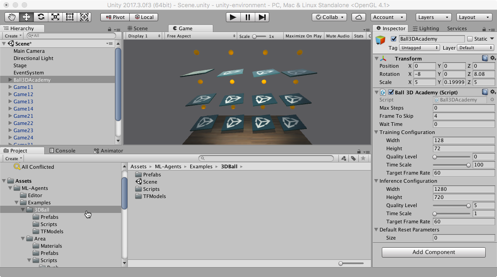

# Using an Environment Executable

This section will help you create and use built environments rather than the
Editor to interact with an environment. Using an executable has some advantages
over using the Editor:

* You can exchange executable with other people without having to share your
  entire repository.
* You can put your executable on a remote machine for faster training.
* You can use `Headless` mode for faster training.
* You can keep using the Unity Editor for other tasks while the agents are
  training.

## Building the 3DBall environment

The first step is to open the Unity scene containing the 3D Balance Ball
environment:

1. Launch Unity.
2. On the Projects dialog, choose the **Open** option at the top of the window.
3. Using the file dialog that opens, locate the `UnitySDK` folder within the
   ML-Agents project and click **Open**.
4. In the **Project** window, navigate to the folder
   `Assets/ML-Agents/Examples/3DBall/`.
5. Double-click the `3DBall` file to load the scene containing the Balance Ball
   environment.



Make sure the Brains in the scene have the right type. For example, if you want
to be able to control your agents from Python, you will need to set the
corresponding Brain to **External**.

1. In the **Scene** window, click the triangle icon next to the Ball3DAcademy
   object.
2. Select its child object **Ball3DBrain**.
3. In the Inspector window, set **Brain Type** to **External**.


Next, we want the set up scene to play correctly when the training process
launches our environment executable. This means:

* The environment application runs in the background.
* No dialogs require interaction.
* The correct scene loads automatically.

1. Open Player Settings (menu: **Edit** > **Project Settings** > **Player**).
2. Under **Resolution and Presentation**:
   * Ensure that **Run in Background** is Checked.
   * Ensure that **Display Resolution Dialog** is set to Disabled.
3. Open the Build Settings window (menu:**File** > **Build Settings**).
4. Choose your target platform.
   * (optional) Select “Development Build” to [log debug
      messages](https://docs.unity3d.com/Manual/LogFiles.html).
5. If any scenes are shown in the **Scenes in Build** list, make sure that the
   3DBall Scene is the only one checked. (If the list is empty, than only the
   current scene is included in the build).
6. Click **Build**:
   * In the File dialog, navigate to your ML-Agents directory.
   * Assign a file name and click **Save**.
   * (For Windows）With Unity 2018.1, it will ask you to select a folder instead
     of a file name. Create a subfolder within the ML-Agents folder and select
     that folder to build. In the following steps you will refer to this
     subfolder's name as `env_name`.


Now that we have a Unity executable containing the simulation environment, we
can interact with it.

## Interacting with the Environment

If you want to use the [Python API](Python-API.md) to interact with your
executable, you can pass the name of the executable with the argument
'file_name' of the `UnityEnvironment`. For instance:

```python
from mlagents.envs import UnityEnvironment
env = UnityEnvironment(file_name=<env_name>)
```

## Training the Environment

1. Open a command or terminal window.
2. Navigate to the folder where you installed the ML-Agents Toolkit. If you
   followed the default [installation](Installation.md), then navigate to the
   `ml-agents/` folder.
3. Run
   `mlagents-learn <trainer-config-file> --env=<env_name> --run-id=<run-identifier> --train`
   Where:
   * `<trainer-config-file>` is the file path of the trainer configuration yaml
   * `<env_name>` is the name and path to the executable you exported from Unity
     (without extension)
   * `<run-identifier>` is a string used to separate the results of different
     training runs
   * And the `--train` tells `mlagents-learn` to run a training session (rather
     than inference)

For example, if you are training with a 3DBall executable you exported to the
the directory where you installed the ML-Agents Toolkit, run:

```sh
mlagents-learn ../config/trainer_config.yaml --env=3DBall --run-id=firstRun --train
```

And you should see something like

```console
ml-agents$ mlagents-learn config/trainer_config.yaml --env=3DBall --run-id=first-run --train


                        ▄▄▄▓▓▓▓
                   ╓▓▓▓▓▓▓█▓▓▓▓▓
              ,▄▄▄m▀▀▀'  ,▓▓▓▀▓▓▄                           ▓▓▓  ▓▓▌
            ▄▓▓▓▀'      ▄▓▓▀  ▓▓▓      ▄▄     ▄▄ ,▄▄ ▄▄▄▄   ,▄▄ ▄▓▓▌▄ ▄▄▄    ,▄▄
          ▄▓▓▓▀        ▄▓▓▀   ▐▓▓▌     ▓▓▌   ▐▓▓ ▐▓▓▓▀▀▀▓▓▌ ▓▓▓ ▀▓▓▌▀ ^▓▓▌  ╒▓▓▌
        ▄▓▓▓▓▓▄▄▄▄▄▄▄▄▓▓▓      ▓▀      ▓▓▌   ▐▓▓ ▐▓▓    ▓▓▓ ▓▓▓  ▓▓▌   ▐▓▓▄ ▓▓▌
        ▀▓▓▓▓▀▀▀▀▀▀▀▀▀▀▓▓▄     ▓▓      ▓▓▌   ▐▓▓ ▐▓▓    ▓▓▓ ▓▓▓  ▓▓▌    ▐▓▓▐▓▓
          ^█▓▓▓        ▀▓▓▄   ▐▓▓▌     ▓▓▓▓▄▓▓▓▓ ▐▓▓    ▓▓▓ ▓▓▓  ▓▓▓▄    ▓▓▓▓`
            '▀▓▓▓▄      ^▓▓▓  ▓▓▓       └▀▀▀▀ ▀▀ ^▀▀    `▀▀ `▀▀   '▀▀    ▐▓▓▌
               ▀▀▀▀▓▄▄▄   ▓▓▓▓▓▓,                                      ▓▓▓▓▀
                   `▀█▓▓▓▓▓▓▓▓▓▌
                        ¬`▀▀▀█▓


INFO:mlagents.learn:{'--curriculum': 'None',
 '--docker-target-name': 'Empty',
 '--env': '3DBall',
 '--help': False,
 '--keep-checkpoints': '5',
 '--lesson': '0',
 '--load': False,
 '--no-graphics': False,
 '--num-runs': '1',
 '--run-id': 'firstRun',
 '--save-freq': '50000',
 '--seed': '-1',
 '--slow': False,
 '--train': True,
 '--worker-id': '0',
 '<trainer-config-path>': 'config/trainer_config.yaml'}
```

**Note**: If you're using Anaconda, don't forget to activate the ml-agents
environment first.

If `mlagents-learn` runs correctly and starts training, you should see something
like this:

```console
CrashReporter: initialized
Mono path[0] = '/Users/dericp/workspace/ml-agents/3DBall.app/Contents/Resources/Data/Managed'
Mono config path = '/Users/dericp/workspace/ml-agents/3DBall.app/Contents/MonoBleedingEdge/etc'
INFO:mlagents.envs:
'Ball3DAcademy' started successfully!
INFO:mlagents.envs:
'Ball3DAcademy' started successfully!
Unity Academy name: Ball3DAcademy
        Number of Brains: 1
        Number of External Brains : 1
        Reset Parameters :

Unity brain name: Ball3DBrain
        Number of Visual Observations (per agent): 0
        Vector Observation space size (per agent): 8
        Number of stacked Vector Observation: 1
        Vector Action space type: continuous
        Vector Action space size (per agent): [2]
        Vector Action descriptions: ,
INFO:mlagents.envs:Hyperparameters for the PPO Trainer of brain Ball3DBrain:
        batch_size:          64
        beta:                0.001
        buffer_size:         12000
        epsilon:             0.2
        gamma:               0.995
        hidden_units:        128
        lambd:               0.99
        learning_rate:       0.0003
        max_steps:           5.0e4
        normalize:           True
        num_epoch:           3
        num_layers:          2
        time_horizon:        1000
        sequence_length:     64
        summary_freq:        1000
        use_recurrent:       False
        graph_scope:
        summary_path:        ./summaries/first-run-0
        memory_size:         256
        use_curiosity:       False
        curiosity_strength:  0.01
        curiosity_enc_size:  128
INFO:mlagents.trainers: first-run-0: Ball3DBrain: Step: 1000. Mean Reward: 1.242. Std of Reward: 0.746. Training.
INFO:mlagents.trainers: first-run-0: Ball3DBrain: Step: 2000. Mean Reward: 1.319. Std of Reward: 0.693. Training.
INFO:mlagents.trainers: first-run-0: Ball3DBrain: Step: 3000. Mean Reward: 1.804. Std of Reward: 1.056. Training.
INFO:mlagents.trainers: first-run-0: Ball3DBrain: Step: 4000. Mean Reward: 2.151. Std of Reward: 1.432. Training.
INFO:mlagents.trainers: first-run-0: Ball3DBrain: Step: 5000. Mean Reward: 3.175. Std of Reward: 2.250. Training.
INFO:mlagents.trainers: first-run-0: Ball3DBrain: Step: 6000. Mean Reward: 4.898. Std of Reward: 4.019. Training.
INFO:mlagents.trainers: first-run-0: Ball3DBrain: Step: 7000. Mean Reward: 6.716. Std of Reward: 5.125. Training.
INFO:mlagents.trainers: first-run-0: Ball3DBrain: Step: 8000. Mean Reward: 12.124. Std of Reward: 11.929. Training.
INFO:mlagents.trainers: first-run-0: Ball3DBrain: Step: 9000. Mean Reward: 18.151. Std of Reward: 16.871. Training.
INFO:mlagents.trainers: first-run-0: Ball3DBrain: Step: 10000. Mean Reward: 27.284. Std of Reward: 28.667. Training.
```

You can press Ctrl+C to stop the training, and your trained model will be at
`models/<run-identifier>/<env_name>_<run-identifier>.bytes`, which corresponds
to your model's latest checkpoint. You can now embed this trained model into
your Internal Brain by following the steps below:

1. Move your model file into
   `UnitySDK/Assets/ML-Agents/Examples/3DBall/TFModels/`.
2. Open the Unity Editor, and select the **3DBall** scene as described above.
3. Select the **Ball3DBrain** object from the Scene hierarchy.
4. Change the **Type of Brain** to **Internal**.
5. Drag the `<env_name>_<run-identifier>.bytes` file from the Project window of
   the Editor to the **Graph Model** placeholder in the **Ball3DBrain**
   inspector window.
6. Press the Play button at the top of the editor.
