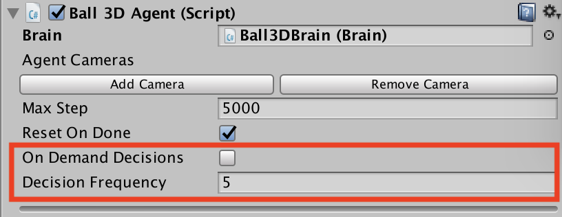

# On Demand Decision Making

## Description
On demand decision making allows agents to request decisions to their 
brains only when needed instead of requesting decisions at a fixed 
frequency. This is useful when the agents commit to an action for a 
variable number of steps or when the agents cannot make decisions 
at the same time.

## How to use

In the agent inspector, there is a new checkbox called 
`On Demand Decision`

 * If `On Demand Decision` is not checked, all the agents will 
 request a new decision every `Decision Frequency` steps and 
 perform an action every step. In the example above, 
 `CollectObservations()` will be called every 5 steps and 
 `AgentAct()` will be called at every step. This means that the 
 agent will reuse the decision the brain has given it. 

 * If `On Demand Decision` is checked, you are in charge of telling 
 the agent when to request a decision and when to request an action. 
 To do so, call the following methods on your agent component.
   * `RequestDecision()` Call this method to signal the agent that it 
   must collect his observations and ask the brain for a decision at 
   the next step of the simulation. Note that when an agent requests 
   a decision, it will also request an action automatically 
   (This is to ensure that all decisions lead to an action during training)
   * `RequestAction()` Call this method to signal the agent that 
   it must reuse his previous action at the next step of the 
   simulation. The Agent will not ask the brain for a new decision, 
   it will just call `AgentAct()` with the same action.
