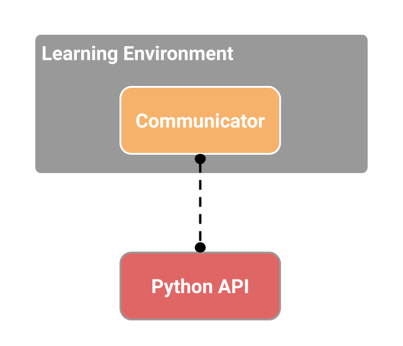
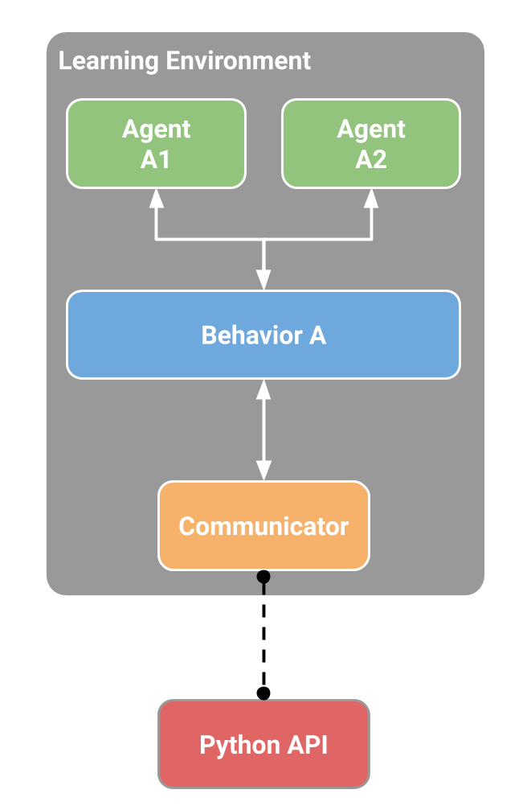

# ML-Agents Toolkit Overview

**The Unity Machine Learning Agents Toolkit** (ML-Agents Toolkit) is an
open-source Unity plugin that enables games and simulations to serve as
environments for training intelligent agents. Agents can be trained using
reinforcement learning, imitation learning, neuroevolution, or other machine
learning methods through a simple-to-use Python API. We also provide
implementations (based on TensorFlow) of state-of-the-art algorithms to enable
game developers and hobbyists to easily train intelligent agents for 2D, 3D and
VR/AR games. These trained agents can be used for multiple purposes, including
controlling NPC behavior (in a variety of settings such as multi-agent and
adversarial), automated testing of game builds and evaluating different game
design decisions pre-release. The ML-Agents toolkit is mutually beneficial for
both game developers and AI researchers as it provides a central platform where
advances in AI can be evaluated on Unity’s rich environments and then made
accessible to the wider research and game developer communities.

Depending on your background (i.e. researcher, game developer, hobbyist), you
may have very different questions on your mind at the moment. To make your
transition to the ML-Agents toolkit easier, we provide several background pages
that include overviews and helpful resources on the [Unity
Engine](Background-Unity.md), [machine learning](Background-Machine-Learning.md)
and [TensorFlow](Background-TensorFlow.md). We **strongly** recommend browsing
the relevant background pages if you're not familiar with a Unity scene, basic
machine learning concepts or have not previously heard of TensorFlow.

The remainder of this page contains a deep dive into ML-Agents, its key
components, different training modes and scenarios. By the end of it, you should
have a good sense of _what_ the ML-Agents toolkit allows you to do. The
subsequent documentation pages provide examples of _how_ to use ML-Agents.

## Running Example: Training NPC Behaviors

To help explain the material and terminology in this page, we'll use a
hypothetical, running example throughout. We will explore the problem of
training the behavior of a non-playable character (NPC) in a game. (An NPC is a
game character that is never controlled by a human player and its behavior is
pre-defined by the game developer.) More specifically, let's assume we're
building a multi-player, war-themed game in which players control the soldiers.
In this game, we have a single NPC who serves as a medic, finding and reviving
wounded players. Lastly, let us assume that there are two teams, each with five
players and one NPC medic.

The behavior of a medic is quite complex. It first needs to avoid getting
injured, which requires detecting when it is in danger and moving to a safe
location. Second, it needs to be aware of which of its team members are injured
and require assistance. In the case of multiple injuries, it needs to assess the
degree of injury and decide who to help first. Lastly, a good medic will always
place itself in a position where it can quickly help its team members. Factoring
in all of these traits means that at every instance, the medic needs to measure
several attributes of the environment (e.g. position of team members, position
of enemies, which of its team members are injured and to what degree) and then
decide on an action (e.g. hide from enemy fire, move to help one of its
members). Given the large number of settings of the environment and the large
number of actions that the medic can take, defining and implementing such
complex behaviors by hand is challenging and prone to errors.

With ML-Agents, it is possible to _train_ the behaviors of such NPCs (called
**agents**) using a variety of methods. The basic idea is quite simple. We need
to define three entities at every moment of the game (called **environment**):

- **Observations** - what the medic perceives about the environment.
  Observations can be numeric and/or visual. Numeric observations measure
  attributes of the environment from the point of view of the agent. For our
  medic this would be attributes of the battlefield that are visible to it. For
  most interesting environments, an agent will require several continuous
  numeric observations. Visual observations, on the other hand, are images
  generated from the cameras attached to the agent and represent what the agent
  is seeing at that point in time. It is common to confuse an agent's
  observation with the environment (or game) **state**. The environment state
  represents information about the entire scene containing all the game
  characters. The agents observation, however, only contains information that
  the agent is aware of and is typically a subset of the environment state. For
  example, the medic observation cannot include information about an enemy in
  hiding that the medic is unaware of.
- **Actions** - what actions the medic can take. Similar to observations,
  actions can either be continuous or discrete depending on the complexity of
  the environment and agent. In the case of the medic, if the environment is a
  simple grid world where only their location matters, then a discrete action
  taking on one of four values (north, south, east, west) suffices. However, if
  the environment is more complex and the medic can move freely then using two
  continuous actions (one for direction and another for speed) is more
  appropriate.
- **Reward signals** - a scalar value indicating how well the medic is doing.
  Note that the reward signal need not be provided at every moment, but only
  when the medic performs an action that is good or bad. For example, it can
  receive a large negative reward if it dies, a modest positive reward whenever
  it revives a wounded team member, and a modest negative reward when a wounded
  team member dies due to lack of assistance. Note that the reward signal is how
  the objectives of the task are communicated to the agent, so they need to be
  set up in a manner where maximizing reward generates the desired optimal
  behavior.

After defining these three entities (the building blocks of a **reinforcement
learning task**), we can now _train_ the medic's behavior. This is achieved by
simulating the environment for many trials where the medic, over time, learns
what is the optimal action to take for every observation it measures by
maximizing its future reward. The key is that by learning the actions that
maximize its reward, the medic is learning the behaviors that make it a good
medic (i.e. one who saves the most number of lives). In **reinforcement
learning** terminology, the behavior that is learned is called a **policy**,
which is essentially a (optimal) mapping from observations to actions. Note that
the process of learning a policy through running simulations is called the
**training phase**, while playing the game with an NPC that is using its learned
policy is called the **inference phase**.

The ML-Agents toolkit provides all the necessary tools for using Unity as the
simulation engine for learning the policies of different objects in a Unity
environment. In the next few sections, we discuss how the ML-Agents toolkit
achieves this and what features it provides.

## Key Components

The ML-Agents toolkit is a Unity plugin that contains three high-level
components:

- **Learning Environment** - which contains the Unity scene and all the game
  characters.
- **Python API** - which contains all the machine learning algorithms that are
  used for training (learning a behavior or policy). Note that, unlike the
  Learning Environment, the Python API is not part of Unity, but lives outside
  and communicates with Unity through the External Communicator.
- **External Communicator** - which connects the Learning Environment with the
  Python API. It lives within the Learning Environment.

  

_Simplified block diagram of ML-Agents._

The Learning Environment contains three additional components that help
organize the Unity scene:

- **Agents** - which is attached to a Unity GameObject (any character within a
  scene) and handles generating its observations, performing the actions it
  receives and assigning a reward (positive / negative) when appropriate. Each
  Agent is linked to exactly one Brain.
- **Brains** - which encapsulates the logic for making decisions for the Agent.
  In essence, the Brain is what holds on to the policy for each Agent and
  determines which actions the Agent should take at each instance. More
  specifically, it is the component that receives the observations and rewards
  from the Agent and returns an action.
- **Academy** - which orchestrates the observation and decision making process.
  Within the Academy, several environment-wide parameters such as the rendering
  quality and the speed at which the environment is run can be specified. The
  External Communicator lives within the Academy.

Every Learning Environment will always have one global Academy and one Agent for
every character in the scene. While each Agent must be linked to a Brain, it is
possible for Agents that have similar observations and actions to be linked to
the same Brain. In our sample game, we have two teams each with their own medic.
Thus we will have two Agents in our Learning Environment, one for each medic,
but both of these medics can be linked to the same Brain. Note that these two
medics are linked to the same Brain because their _space_ of observations and
actions are similar. This does not mean that at each instance they will have
identical observation and action _values_. In other words, the Brain defines the
space of all possible observations and actions, while the Agents connected to it
(in this case the medics) can each have their own, unique observation and action
values. If we expanded our game to include tank driver NPCs, then the Agent
attached to those characters cannot share a Brain with the Agent linked to the
medics (medics and drivers have different actions).

  

_Example block diagram of ML-Agents toolkit for our sample game._

We have yet to discuss how the ML-Agents toolkit trains behaviors, and what role
the Python API and External Communicator play. Before we dive into those
details, let's summarize the earlier components. Each character is attached to
an Agent, and each Agent is linked to a Brain. The Brain receives observations
and rewards from the Agent and returns actions. The Academy ensures that all the
Agents and Brains are in sync in addition to controlling environment-wide
settings. So how does the Brain control what the Agent does?

In practice, we have three different categories of Brains, which enable a wide
range of training and inference scenarios:

- **Learning** - where decisions are made using an embedded
  [TensorFlow](Background-TensorFlow.md) model. The embedded TensorFlow model
  represents a learned policy and the Brain directly uses this model to
  determine the action for each Agent. You can train a **Learning Brain** 
  by dragging it into the Academy's `Broadcast Hub` with the `Control` 
  checkbox checked.
- **Player** - where decisions are made using real input from a keyboard or
  controller. Here, a human player is controlling the Agent and the observations
  and rewards collected by the Brain are not used to control the Agent.
- **Heuristic** - where decisions are made using hard-coded behavior. This
  resembles how most character behaviors are currently defined and can be
  helpful for debugging or comparing how an Agent with hard-coded rules compares
  to an Agent whose behavior has been trained. In our example, once we have
  trained a Brain for the medics we could assign a medic on one team to the
  trained Brain and assign the medic on the other team a Heuristic Brain with
  hard-coded behaviors. We can then evaluate which medic is more effective.

As currently described, it may seem that the External Communicator and Python
API are only leveraged by the Learning Brain. This is not true. It is possible
to configure the Learning, Player and Heuristic Brains to also send the
observations, rewards and actions to the Python API through the External
Communicator (a feature called _broadcasting_). As we will see shortly, this
enables additional training modes.

  

_An example of how a scene containing multiple Agents and Brains might be
configured._

## Training Modes

Given the flexibility of ML-Agents, there are a few ways in which training and
inference can proceed.

### Built-in Training and Inference

As mentioned previously, the ML-Agents toolkit ships with several
implementations of state-of-the-art algorithms for training intelligent agents.
In this mode, the only Brain used is a **Learning Brain**. More 
specifically, during training, all the medics in the
scene send their observations to the Python API through the External
Communicator (this is the behavior with an External Brain). The Python API
processes these observations and sends back actions for each medic to take.
During training these actions are mostly exploratory to help the Python API
learn the best policy for each medic. Once training concludes, the learned
policy for each medic can be exported. Given that all our implementations are
based on TensorFlow, the learned policy is just a TensorFlow model file. Then
during the inference phase, we use the **Learning Brain** in internal mode
and include the
TensorFlow model generated from the training phase. Now during the inference
phase, the medics still  continue to generate their observations, but instead of
being sent to the Python API, they will be fed into their (internal, embedded)
model to generate the _optimal_ action for each medic to take at every point in
time.

To summarize: our built-in implementations are based on TensorFlow, thus, during
training the Python API uses the observations it receives to learn a TensorFlow
model. This model is then embedded within the Learning Brain during inference to
generate the optimal actions for all Agents linked to that Brain. 

**Note that our Learning Brain is currently experimental as it is limited to TensorFlow
models and leverages the third-party
[TensorFlowSharp](https://github.com/migueldeicaza/TensorFlowSharp) library.**

The
[Getting Started with the 3D Balance Ball Example](Getting-Started-with-Balance-Ball.md)
tutorial covers this training mode with the **3D Balance Ball** sample environment.

### Custom Training and Inference

In the previous mode, the Learning Brain was used for training to generate
a TensorFlow model that the Learning Brain can later use. However,
any user of the ML-Agents toolkit can leverage their own algorithms for
training. In this case, the Brain type would be set to Learning and be linked 
to the BroadcastHub (with checked `Control` checkbox)
and the behaviors of all the Agents in the scene will be controlled within Python.
You can even turn your environment into a [gym.](../gym-unity/README.md)

We do not currently have a tutorial highlighting this mode, but you can
learn more about the Python API [here](Python-API.md).

### Curriculum Learning

This mode is an extension of _Built-in Training and Inference_, and is
particularly helpful when training intricate behaviors for complex environments.
Curriculum learning is a way of training a machine learning model where more
difficult aspects of a problem are gradually introduced in such a way that the
model is always optimally challenged. This idea has been around for a long time,
and it is how we humans typically learn. If you imagine any childhood primary
school education, there is an ordering of classes and topics. Arithmetic is
taught before algebra, for example. Likewise, algebra is taught before calculus.
The skills and knowledge learned in the earlier subjects provide a scaffolding
for later lessons. The same principle can be applied to machine learning, where
training on easier tasks can provide a scaffolding for harder tasks in the
future.

  

_Example of a mathematics curriculum. Lessons progress from simpler topics to
more complex ones, with each building on the last._

When we think about how reinforcement learning actually works, the learning reward
signal is received occasionally throughout training. The starting point
when training an agent to accomplish this task will be a random policy. That
starting policy will have the agent running in circles, and will likely never,
or very rarely achieve the reward for complex environments. Thus by simplifying
the environment at the beginning of training, we allow the agent to quickly
update the random policy to a more meaningful one that is successively improved
as the environment gradually increases in complexity. In our example, we can
imagine first training the medic when each team only contains one player, and
then iteratively increasing the number of players (i.e. the environment
complexity). The ML-Agents toolkit supports setting custom environment
parameters within the Academy. This allows elements of the environment related
to difficulty or complexity to be dynamically adjusted based on training
progress.

The [Training with Curriculum Learning](Training-Curriculum-Learning.md)
tutorial covers this training mode with the **Wall Area** sample environment.

### Imitation Learning

It is often more intuitive to simply demonstrate the behavior we want an agent
to perform, rather than attempting to have it learn via trial-and-error methods.
For example, instead of training the medic by setting up its reward function,
this mode allows providing real examples from a game controller on how the medic
should behave. More specifically, in this mode, the Brain type during training
is set to Player and all the actions performed with the controller (in addition
to the agent observations) will be recorded and sent to the Python API. The
imitation learning algorithm will then use these pairs of observations and
actions from the human player to learn a policy. [Video
Link](https://youtu.be/kpb8ZkMBFYs).

The [Training with Imitation Learning](Training-Imitation-Learning.md) tutorial
covers this training mode with the **Banana Collector** sample environment.

## Flexible Training Scenarios

While the discussion so-far has mostly focused on training a single agent, with
ML-Agents, several training scenarios are possible. We are excited to see what
kinds of novel and fun environments the community creates. For those new to
training intelligent agents, below are a few examples that can serve as
inspiration:

- Single-Agent. A single agent linked to a single Brain, with its own reward
  signal. The traditional way of training an agent. An example is any
  single-player game, such as Chicken. [Video
  Link](https://www.youtube.com/watch?v=fiQsmdwEGT8&feature=youtu.be).
- Simultaneous Single-Agent. Multiple independent agents with independent reward
  signals linked to a single Brain. A parallelized version of the traditional
  training scenario, which can speed-up and stabilize the training process.
  Helpful when you have multiple versions of the same character in an
  environment who should learn similar behaviors. An example might be training a
  dozen robot-arms to each open a door simultaneously. [Video
  Link](https://www.youtube.com/watch?v=fq0JBaiCYNA).
- Adversarial Self-Play. Two interacting agents with inverse reward signals
  linked to a single Brain. In two-player games, adversarial self-play can allow
  an agent to become increasingly more skilled, while always having the
  perfectly matched opponent: itself. This was the strategy employed when
  training AlphaGo, and more recently used by OpenAI to train a human-beating
  1-vs-1 Dota 2 agent.
- Cooperative Multi-Agent. Multiple interacting agents with a shared reward
  signal linked to either a single or multiple different Brains. In this
  scenario, all agents must work together to accomplish a task that cannot be
  done alone. Examples include environments where each agent only has access to
  partial information, which needs to be shared in order to accomplish the task
  or collaboratively solve a puzzle.
- Competitive Multi-Agent. Multiple interacting agents with inverse reward
  signals linked to either a single or multiple different Brains. In this
  scenario, agents must compete with one another to either win a competition, or
  obtain some limited set of resources. All team sports fall into this scenario.
- Ecosystem. Multiple interacting agents with independent reward signals linked
  to either a single or multiple different Brains. This scenario can be thought
  of as creating a small world in which animals with different goals all
  interact, such as a savanna in which there might be zebras, elephants and
  giraffes, or an autonomous driving simulation within an urban environment.

## Additional Features

Beyond the flexible training scenarios available, the ML-Agents toolkit includes
additional features which improve the flexibility and interpretability of the
training process.

- **On Demand Decision Making** - With the ML-Agents toolkit it is possible to
  have agents request decisions only when needed as opposed to requesting
  decisions at every step of the environment. This enables training of turn
  based games, games where agents must react to events or games where agents can
  take actions of variable duration. Switching between decision taking at every
  step and on-demand-decision is one button click away. You can learn more about
  the on-demand-decision feature
  [here](Learning-Environment-Design-Agents.md#on-demand-decision-making).

- **Memory-enhanced Agents** - In some scenarios, agents must learn to remember
  the past in order to take the best decision. When an agent only has partial
  observability of the environment, keeping track of past observations can help
  the agent learn. We provide an implementation of _Long Short-term Memory_
  ([LSTM](https://en.wikipedia.org/wiki/Long_short-term_memory)) in our trainers
  that enable the agent to store memories to be used in future steps. You can
  learn more about enabling LSTM during training [here](Feature-Memory.md).

- **Monitoring Agent’s Decision Making** - Since communication in ML-Agents is a
  two-way street, we provide an Agent Monitor class in Unity which can display
  aspects of the trained Agent, such as the Agents perception on how well it is
  doing (called **value estimates**) within the Unity environment itself. By
  leveraging Unity as a visualization tool and providing these outputs in
  real-time, researchers and developers can more easily debug an Agent’s
  behavior. You can learn more about using the Monitor class
  [here](Feature-Monitor.md).

- **Complex Visual Observations** - Unlike other platforms, where the agent’s
  observation might be limited to a single vector or image, the ML-Agents
  toolkit allows multiple cameras to be used for observations per agent. This
  enables agents to learn to integrate information from multiple visual streams.
  This can be helpful in several scenarios such as training a self-driving car
  which requires multiple cameras with different viewpoints, or a navigational
  agent which might need to integrate aerial and first-person visuals. You can
  learn more about adding visual observations to an agent
  [here](Learning-Environment-Design-Agents.md#multiple-visual-observations).

- **Broadcasting** - As discussed earlier, a Learning Brain sends the
  observations for all its Agents to the Python API when dragged into the
  Academy's `Broadcast Hub` with the `Control` checkbox checked. This is helpful
  for training and later inference. Broadcasting is a feature which can be 
  enabled all types of Brains (Player, Learning, Heuristic) where the Agent
  observations and actions are also sent to the Python API (despite the fact
  that the Agent is **not** controlled by the Python API). This feature is
  leveraged by Imitation Learning, where the observations and actions for a
  Player Brain are used to learn the policies of an agent through demonstration.
  However, this could also be helpful for the Heuristic and Learning Brains,
  particularly when debugging agent behaviors. You can learn more about using
  the broadcasting feature
  [here](Learning-Environment-Design-Brains.md#using-the-broadcast-feature).

- **Docker Set-up (Experimental)** - To facilitate setting up ML-Agents without
  installing Python or TensorFlow directly, we provide a
  [guide](Using-Docker.md) on how to create and run a Docker container.

- **Cloud Training on AWS** - To facilitate using the ML-Agents toolkit on
  Amazon Web Services (AWS) machines, we provide a
  [guide](Training-on-Amazon-Web-Service.md) on how to set-up EC2 instances in
  addition to a public pre-configured Amazon Machine Image (AMI).

- **Cloud Training on Microsoft Azure** - To facilitate using the ML-Agents
  toolkit on Azure machines, we provide a
  [guide](Training-on-Microsoft-Azure.md) on how to set-up virtual machine
  instances in addition to a pre-configured data science image.

## Summary and Next Steps

To briefly summarize: The ML-Agents toolkit enables games and simulations built
in Unity to serve as the platform for training intelligent agents. It is
designed to enable a large variety of training modes and scenarios and comes
packed with several features to enable researchers and developers to leverage
(and enhance) machine learning within Unity.

To help you use ML-Agents, we've created several in-depth tutorials for
[installing ML-Agents](Installation.md),
[getting started](Getting-Started-with-Balance-Ball.md) with the 3D Balance Ball
environment (one of our many
[sample environments](Learning-Environment-Examples.md)) and
[making your own environment](Learning-Environment-Create-New.md).
