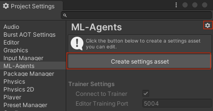
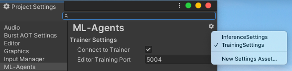

# ML-Agents Package Settings

ML-Agents Package Settings contains settings that apply to the whole project.
It allows you to configure ML-Agents-specific settings in the Editor.  These settings are available for use in both the Editor and Player.

You can find them at `Edit` > `Project Settings...` > `ML-Agents`. It lists out all the available settings and their default values.

## Create Custom Settings
In order to to use your own settings for your project, you'll need to create a settings asset.

You can do this by clicking the `Create Settings Asset` buttom or clicking the gear on the top right and select `New Settings Asset...`.
The asset file can be placed anywhere in the `Asset/` folder in your project.
After Creating the settings asset, you'll be able to modify the settings for your project and your settings will be saved in the asset.

## Multiple Custom Settings for Different Scenarios
You can create multiple settings assets in one project.

By clicking the gear on the top right you'll see all available settings listed in the drop-down menu to choose from.

This allows you to create different settings for different scenatios. For example, you can create two
separate settings for training and inference, and specify which one you want to use according to what you're currently running.

