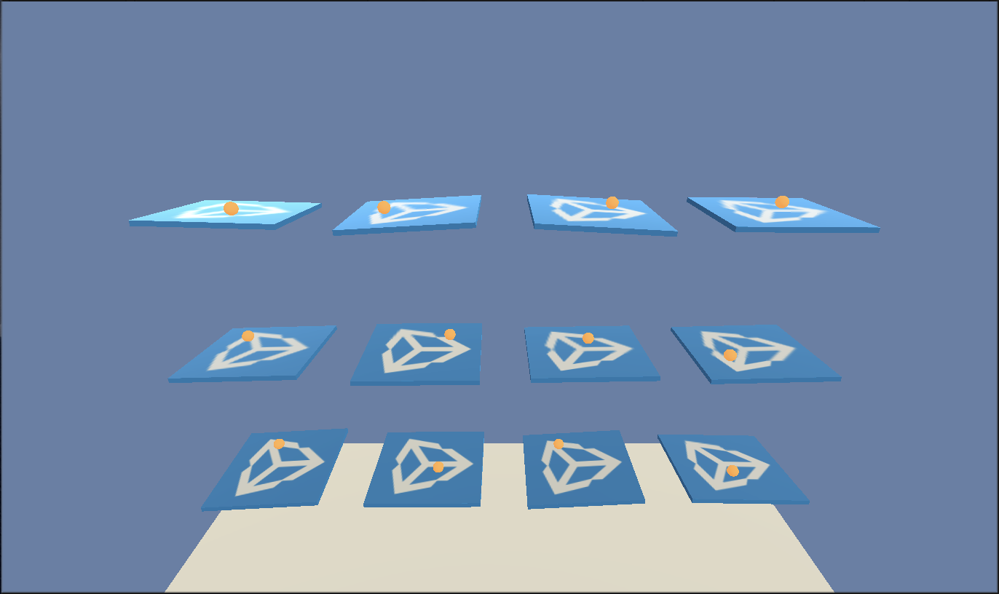
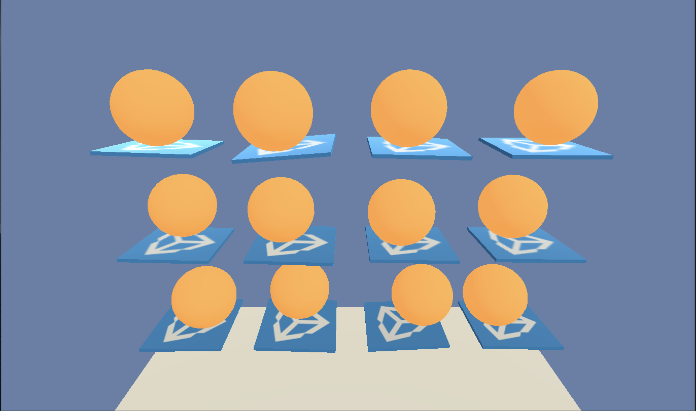

# Training With Environment Parameter Randomization

One of the challenges of training and testing agents on the same
environment is that the agents tend to overfit. The result is that the
agents are unable to generalize to any tweaks or variations in the environment.
This is analogous to a model being trained and tested on an identical dataset
in supervised learning. This becomes problematic in cases where environments
are instantiated with varying objects or properties.

To help agents robust and better generalizable to changes in the environment, the agent
can be trained over multiple variations of a given environment. We refer to this approach as **Environment Parameter Randomization**. For those familiar with Reinforcement Learning research, this approach is based on the concept of Domain Randomization (you can read more about it [here](https://arxiv.org/abs/1703.06907)). By using parameter randomization
during training, the agent can be better suited to adapt (with higher performance)
to future unseen variations of the environment.

_Example of variations of the 3D Ball environment._

Ball scale of 0.5          |  Ball scale of 4
:-------------------------:|:-------------------------:
  |  


To enable variations in the environments, we implemented `Environment Parameters`.
`Environment Parameters` are values in the `FloatPropertiesChannel` that can be read when setting
up the environment. We
also included different sampling methods and the ability to create new kinds of
sampling methods for each `Environment Parameter`. In the 3D ball environment example displayed
in the figure above, the environment parameters are `gravity`, `ball_mass` and `ball_scale`.


## How to Enable Environment Parameter Randomization

We first need to provide a way to modify the environment by supplying a set of `Environment Parameters`
and vary them over time. This provision can be done either deterministically or randomly.

This is done by assigning each `Environment Parameter` a `sampler-type`(such as a uniform sampler),
which determines how to sample an `Environment
Parameter`. If a `sampler-type` isn't provided for a
`Environment Parameter`, the parameter maintains the default value throughout the
training procedure, remaining unchanged. The samplers for all the `Environment Parameters`
are handled by a **Sampler Manager**, which also handles the generation of new
values for the environment parameters when needed.

To setup the Sampler Manager, we create a YAML file that specifies how we wish to
generate new samples for each `Environment Parameters`. In this file, we specify the samplers and the
`resampling-interval` (the number of simulation steps after which environment parameters are
resampled). Below is an example of a sampler file for the 3D ball environment.

```yaml
resampling-interval: 5000

mass:
    sampler-type: "uniform"
    min_value: 0.5
    max_value: 10

gravity:
    sampler-type: "multirange_uniform"
    intervals: [[7, 10], [15, 20]]

scale:
    sampler-type: "uniform"
    min_value: 0.75
    max_value: 3

```

Below is the explanation of the fields in the above example.

* `resampling-interval` - Specifies the number of steps for the agent to
train under a particular environment configuration before resetting the
environment with a new sample of `Environment Parameters`.

* `Environment Parameter` - Name of the `Environment Parameter` like `mass`, `gravity` and `scale`. This should match the name
specified in the `FloatPropertiesChannel` of the environment being trained. If a parameter specified in the file doesn't exist in the
environment, then this parameter will be ignored.  Within each `Environment Parameter`

    * `sampler-type` - Specify the sampler type to use for the `Environment Parameter`.
    This is a string that should exist in the `Sampler Factory` (explained
    below).

    * `sampler-type-sub-arguments` - Specify the sub-arguments depending on the `sampler-type`.
    In the example above, this would correspond to the `intervals`
    under the `sampler-type` `"multirange_uniform"` for the `Environment Parameter` called `gravity`.
    The key name should match the name of the corresponding argument in the sampler definition.
    (See below)

The Sampler Manager allocates a sampler type for each `Environment Parameter` by using the *Sampler Factory*,
which maintains a dictionary mapping of string keys to sampler objects. The available sampler types
to be used for each `Environment Parameter` is available in the Sampler Factory.

### Included Sampler Types

Below is a list of included `sampler-type` as part of the toolkit.

* `uniform` - Uniform sampler
    *   Uniformly samples a single float value between defined endpoints.
        The sub-arguments for this sampler to specify the interval
        endpoints are as below. The sampling is done in the range of
        [`min_value`, `max_value`).

    * **sub-arguments** - `min_value`, `max_value`

* `gaussian` - Gaussian sampler
    *   Samples a single float value from the distribution characterized by
        the mean and standard deviation. The sub-arguments to specify the
        gaussian distribution to use are as below.

    * **sub-arguments** - `mean`, `st_dev`

* `multirange_uniform` - Multirange uniform sampler
    *   Uniformly samples a single float value between the specified intervals.
        Samples by first performing a weight pick of an interval from the list
        of intervals (weighted based on interval width) and samples uniformly
        from the selected interval (half-closed interval, same as the uniform
        sampler). This sampler can take an arbitrary number of intervals in a
        list in the following format:
    [[`interval_1_min`, `interval_1_max`], [`interval_2_min`, `interval_2_max`], ...]

    * **sub-arguments** - `intervals`

The implementation of the samplers can be found at `ml-agents-envs/mlagents_envs/sampler_class.py`.

### Defining a New Sampler Type

If you want to define your own sampler type, you must first inherit the *Sampler*
base class (included in the `sampler_class` file) and preserve the interface.
Once the class for the required method is specified, it must be registered in the Sampler Factory.

This can be done by subscribing to the *register_sampler* method of the SamplerFactory. The command
is as follows:

`SamplerFactory.register_sampler(*custom_sampler_string_key*, *custom_sampler_object*)`

Once the Sampler Factory reflects the new register, the new sampler type can be used for sample any
`Environment Parameter`. For example, lets say a new sampler type was implemented as below and we register
the `CustomSampler` class with the string `custom-sampler` in the Sampler Factory.

```python
class CustomSampler(Sampler):

    def __init__(self, argA, argB, argC):
        self.possible_vals = [argA, argB, argC]

    def sample_all(self):
        return np.random.choice(self.possible_vals)
```

Now we need to specify the new sampler type in the sampler YAML file. For example, we use this new
sampler type for the `Environment Parameter` *mass*.

```yaml
mass:
    sampler-type: "custom-sampler"
    argB: 1
    argA: 2
    argC: 3
```

### Training with Environment Parameter Randomization

After the sampler YAML file is defined, we proceed by launching `mlagents-learn` and specify
our configured sampler file with the `--sampler` flag. For example, if we wanted to train the
3D ball agent with parameter randomization using `Environment Parameters` with `config/3dball_randomize.yaml`
sampling setup, we would run

```sh
mlagents-learn config/trainer_config.yaml --sampler=config/3dball_randomize.yaml
--run-id=3D-Ball-randomize
```

We can observe progress and metrics via Tensorboard.
