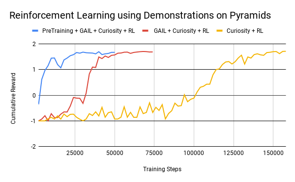

# Training with Imitation Learning

It is often more intuitive to simply demonstrate the behavior we want an agent
to perform, rather than attempting to have it learn via trial-and-error methods.
Consider our
[running example](ML-Agents-Overview.md#running-example-training-npc-behaviors)
of training a medic NPC. Instead of indirectly training a medic with the help
of a reward function, we can give the medic real world examples of observations
from the game and actions from a game controller to guide the medic's behavior.
Imitation Learning uses pairs of observations and actions from
a demonstration to learn a policy.

Imitation learning can also be used to help reinforcement learning. Especially in
environments with sparse (i.e., infrequent or rare) rewards, the agent may never see
the reward and thus not learn from it. Curiosity (which is available in the toolkit)
helps the agent explore, but in some cases
it is easier to show the agent how to achieve the reward. In these cases,
imitation learning combined with reinforcement learning can dramatically
reduce the time the agent takes to solve the environment.
For instance, on the [Pyramids environment](Learning-Environment-Examples.md#pyramids),
using 6 episodes of demonstrations can reduce training steps by more than 4 times.
See Behavioral Cloning + GAIL + Curiosity + RL below.

<p align="center">
  
</p>

The ML-Agents toolkit provides two features that enable your agent to learn from demonstrations.
In most scenarios, you can combine these two features.

* GAIL (Generative Adversarial Imitation Learning) uses an adversarial approach to
  reward your Agent for behaving similar to a set of demonstrations. To use GAIL, you can add the
  [GAIL reward signal](Reward-Signals.md#gail-reward-signal). GAIL can be
  used with or without environment rewards, and works well when there are a limited
  number of demonstrations.
* Behavioral Cloning (BC) trains the Agent's neural network to exactly mimic the actions
  shown in a set of demonstrations.
  The BC feature can be enabled on the [PPO](Training-PPO.md#optional-behavioral-cloning-using-demonstrations)
  or [SAC](Training-SAC.md#optional-behavioral-cloning-using-demonstrations) trainer. As BC cannot generalize
  past the examples shown in the demonstrations, BC tends to work best when there exists demonstrations
  for nearly all of the states that the agent can experience, or in conjunction with GAIL and/or an extrinsic reward.

### What to Use

If you want to help your agents learn (especially with environments that have sparse rewards)
using pre-recorded demonstrations, you can generally enable both GAIL and Behavioral Cloning
at low strengths in addition to having an extrinsic reward.
An example of this is provided for the Pyramids example environment under
 `PyramidsLearning` in `config/gail_config.yaml`.

If you want to train purely from demonstrations, GAIL and BC _without_ an
extrinsic reward signal is the preferred approach. An example of this is provided for the Crawler
example environment under `CrawlerStaticLearning` in `config/gail_config.yaml`.

## Recording Demonstrations

Demonstrations of agent behavior can be recorded from the Unity Editor,
and saved as assets. These demonstrations contain information on the
observations, actions, and rewards for a given agent during the recording session.
They can be managed in the Editor, as well as used for training with BC and GAIL.

In order to record demonstrations from an agent, add the `Demonstration Recorder`
component to a GameObject in the scene which contains an `Agent` component.
Once added, it is possible to name the demonstration that will be recorded
from the agent.

<p align="center">
  
</p>

When `Record` is checked, a demonstration will be created whenever the scene
is played from the Editor. Depending on the complexity of the task, anywhere
from a few minutes or a few hours of demonstration data may be necessary to
be useful for imitation learning. When you have recorded enough data, end
the Editor play session. A `.demo` file will be created in the
`Assets/Demonstrations` folder (by default). This file contains the demonstrations.
Clicking on the file will provide metadata about the demonstration in the
inspector.

<p align="center">
  
</p>

You can then specify the path to this file as the `demo_path` in your `trainer_config.yaml` file
when using BC or GAIL. For instance, for BC:

```
    behavioral_cloning:
        demo_path: <path_to_your_demo_file>
        ...
```
And for GAIL:
```
    reward_signals:
        gail:
            demo_path: <path_to_your_demo_file>
            ...
```