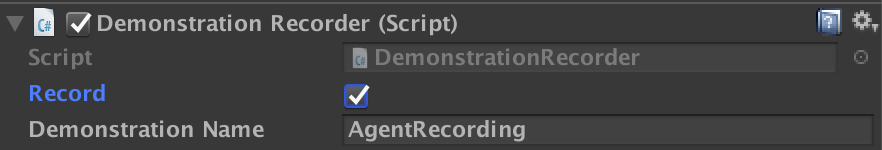
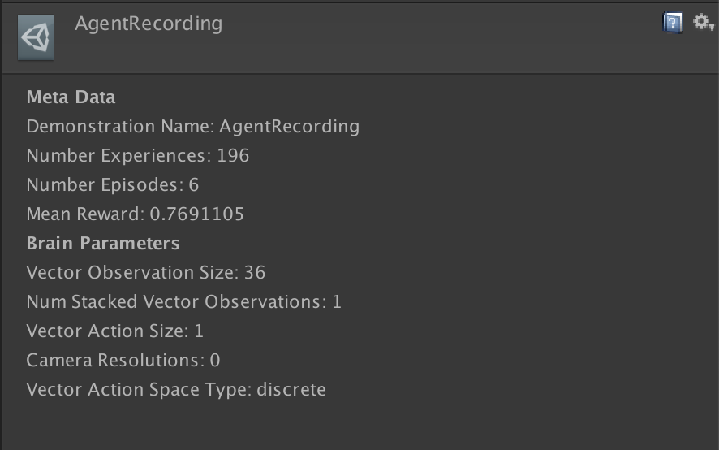

# Imitation Learning

It is often more intuitive to simply demonstrate the behavior we want an agent
to perform, rather than attempting to have it learn via trial-and-error methods.
Consider our
[running example](ML-Agents-Overview.md#running-example-training-npc-behaviors)
of training a medic NPC. Instead of indirectly training a medic with the help
of a reward function, we can give the medic real world examples of observations
from the game and actions from a game controller to guide the medic's behavior.
Imitation Learning uses pairs of observations and actions from
from a demonstration to learn a policy. [Video Link](https://youtu.be/kpb8ZkMBFYs).

## Recording Demonstrations

It is possible to record demonstrations of agent behavior from the Unity Editor, and save them as assets. These demonstrations contain information on the observations, actions, and rewards for a given agent during the recording session. They can be managed from the Editor, as well as used for training with Offline Behavioral Cloning (see below).

In order to record demonstrations from an agent, add the `Demonstration Recorder` component to a GameObject in the scene which contains an `Agent` component. Once added, it is possible to name the demonstration that will be recorded from the agent.

  

When `Record` is checked, a demonstration will be created whenever the scene is played from the Editor. Depending on the complexity of the task, anywhere from a few minutes or a few hours of demonstration data may be necessary to be useful for imitation learning. When you have recorded enough data, end the Editor play session, and a `.demo` file will be created in the `Assets/Demonstrations` folder. This file contains the demonstrations. Clicking on the file will provide metadata about the demonstration in the inspector.

  

 

## Training with Behavioral Cloning

There are a variety of possible imitation learning algorithms which can be used,
the simplest one of them is Behavioral Cloning. It works by collecting demonstrations from a teacher, and then simply uses them to directly learn a policy, in the
same way the supervised learning for image classification or other traditional
Machine Learning tasks work.

### Offline Training

With offline behavioral cloning, we can use demonstrations (`.demo` files) generated using the `Demonstration Recorder` as the dataset used to train a behavior.

1. Choose an agent you would like to learn to imitate some set of demonstrations. 
2. Record a set of demonstration using the `Demonstration Recorder` (see above). For illustrative purposes we will refer to this file as `AgentRecording.demo`. 
3. Build the scene, assigning the agent a Learning Brain, and set the Brain to Control in the Broadcast Hub. For more information on Brains, see [here](Learning-Environment-Design-Brains.md).
4. Open the `config/offline_bc_config.yaml` file. 
5. Modify the `demo_path` parameter in the file to reference the path to the demonstration file recorded in step 2. In our case this is: `./UnitySDK/Assets/Demonstrations/AgentRecording.demo`
6. Launch `mlagent-learn`, providing `./config/offline_bc_config.yaml` as the config parameter, and include the `--run-id` and `--train` as usual. Provide your environment as the `--env` parameter if it has been compiled as standalone, or omit to train in the editor.
7. (Optional) Observe training performance using Tensorboard.

This will use the demonstration file to train a neural network driven agent to directly imitate the actions provided in the demonstration. The environment will launch and be used for evaluating the agent's performance during training.

### Online Training

It is also possible to provide demonstrations in realtime during training, without pre-recording a demonstration file. The steps to do this are as follows:

1. First create two Brains, one which will be the "Teacher," and the other which
   will be the "Student." We will assume that the names of the Brain
   Assets are "Teacher" and "Student" respectively.
2. The "Teacher" Brain must be a **Player Brain**. You must properly 
   configure the inputs to map to the corresponding actions.
3. The "Student" Brain must be a **Learning Brain**.
4. The Brain Parameters of both the "Teacher" and "Student" Brains must be 
   compatible with the agent.
5. Drag both the "Teacher" and "Student" Brain into the Academy's `Broadcast Hub`
   and check the `Control` checkbox on the "Student" Brain. 
4. Link the Brains to the desired Agents (one Agent as the teacher and at least
   one Agent as a student).
5. In `config/online_bc_config.yaml`, add an entry for the "Student" Brain. Set
   the `trainer` parameter of this entry to `imitation`, and the
   `brain_to_imitate` parameter to the name of the teacher Brain: "Teacher".
   Additionally, set `batches_per_epoch`, which controls how much training to do
   each moment. Increase the `max_steps` option if you'd like to keep training
   the Agents for a longer period of time.
6. Launch the training process with `mlagents-learn config/online_bc_config.yaml
   --train --slow`, and press the :arrow_forward: button in Unity when the
   message _"Start training by pressing the Play button in the Unity Editor"_ is
   displayed on the screen
7. From the Unity window, control the Agent with the Teacher Brain by providing
   "teacher demonstrations" of the behavior you would like to see.
8. Watch as the Agent(s) with the student Brain attached begin to behave
   similarly to the demonstrations.
9. Once the Student Agents are exhibiting the desired behavior, end the training
   process with `CTL+C` from the command line.
10. Move the resulting `*.bytes` file into the `TFModels` subdirectory of the
    Assets folder (or a subdirectory within Assets of your choosing) , and use
    with `Learning` Brain.

**BC Teacher Helper**

We provide a convenience utility, `BC Teacher Helper` component that you can add
to the Teacher Agent.

  

This utility enables you to use keyboard shortcuts to do the following:

1. To start and stop recording experiences. This is useful in case you'd like to
   interact with the game _but not have the agents learn from these
   interactions_. The default command to toggle this is to press `R` on the
   keyboard.

2. Reset the training buffer. This enables you to instruct the agents to forget
   their buffer of recent experiences. This is useful if you'd like to get them
   to quickly learn a new behavior. The default command to reset the buffer is
   to press `C` on the keyboard.
