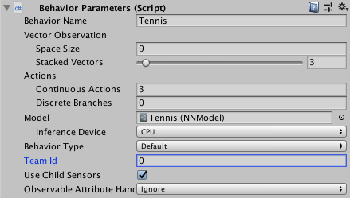

# Training with Self-Play

ML-Agents provides the functionality to train symmetric, adversarial games with [Self-Play](https://openai.com/blog/competitive-self-play/).
A symmetric game is one in which opposing agents are *equal* in form and function. In reinforcement learning,
this means both agents have the same observation and action spaces.
With self-play, an agent learns in adversarial games by competing against fixed, past versions of itself
to provide a more stable, stationary learning environment. This is compared
to competing against its current self in every episode, which is a constantly changing opponent.

Self-play can be used with our implementations of both [Proximal Policy Optimization (PPO)](Training-PPO.md) and [Soft Actor-Critc (SAC)](Training-SAC.md).
For more general information on training with ML-Agents, see [Training ML-Agents](Training-ML-Agents.md).
For more algorithm specific instruction, please see the documentation for [PPO](Training-PPO.md) or [SAC](Training-SAC.md).

Self-play is triggered by including the self-play hyperparameter hierarchy in the trainer configuration file.  Detailed description of the self-play hyperparameters are contained below. Furthermore, to distinguish opposing agents, set the team ID to different integer values in the behavior parameters script on the agent prefab.

See the trainer configuration and agent prefabs for our Tennis environment for an example.

## Best Practices Training with Self-Play

Training with self-play adds additional confounding factors to the usual
issues faced by reinforcement learning. In general, the tradeoff is between
the skill level and generality of the final policy and the stability of learning.
Training against a set of slowly or unchanging adversaries with low diversity
results in a more stable learning process than training against a set of quickly
changing adversaries with high diversity. With this context, this guide discusses the exposed self-play hyperparameters and intuitions for tuning them.

## Hyperparameters

### Reward Signals

We make the assumption that the final reward in a trajectory corresponds to the outcome of an episode.
A final reward of +1 indicates winning, -1 indicates losing and 0 indicates a draw.
The ELO calculation (discussed below) depends on this final reward being either +1, 0, -1.

The reward signal should still be used as described in the documentation for the other trainers and [reward signals.](Reward-Signals.md) However, we encourage users to be a bit more conservative when shaping reward functions due to the instability and non-stationarity of learning in adversarial games. Specifically, we encourage users to begin with the simplest possible reward function (+1 winning, -1 losing) and to allow for more iterations of training to compensate for the sparsity of reward.

### Save Steps

The `save_steps` parameter corresponds to the number of *trainer steps* between snapshots.  For example, if `save_steps`=10000 then a snapshot of the current policy will be saved every 10000 trainer steps. Note, trainer steps are counted per agent. For more information, please see the [migration doc](Migrating.md) after v0.13.

A larger value of `save_steps` will yield a set of opponents that cover a wider range of skill levels and possibly play styles since the policy receives more training. As a result, the agent trains against a wider variety of opponents. Learning a policy to defeat more diverse opponents is a harder problem and so may require more overall training steps but also may lead to more general and robust policy at the end of training. This value is also dependent on how intrinsically difficult the environment is for the agent.

Recommended Range : 10000-100000

### Swap Steps

The `swap_steps` parameter corresponds to the number of *trainer steps* between swapping the opponents policy with a different snapshot. As in the `save_steps` discussion, note that trainer steps are counted per agent. For more information, please see the [migration doc](Migrating.md) after v0.13.

A larger value of `swap_steps` means that an agent will play against the same fixed opponent for a longer number of training iterations. This results in a more stable training scenario, but leaves the agent open to the risk of overfitting it's behavior for this particular opponent. Thus, when a new opponent is swapped, the agent may lose more often than expected.

Recommended Range : 10000-100000

### Play against current self ratio

The `play_against_current_self_ratio` parameter corresponds to the probability
an agent will play against its ***current*** self. With probability
1 - `play_against_current_self_ratio`, the agent will play against a snapshot of itself
from a past iteration.

A larger value of `play_against_current_self_ratio` indicates that an agent will be playing against itself more often. Since the agent is updating it's policy, the opponent will be different from iteration to iteration.  This can lead to an unstable learning environment, but poses the agent with an [auto-curricula](https://openai.com/blog/emergent-tool-use/) of more increasingly challenging situations which may lead to a stronger final policy.

Recommended Range : 0.0 - 1.0

### Window

The `window` parameter corresponds to the size of the sliding window of past snapshots from which the agent's opponents are sampled.  For example, a `window` size of 5 will save the last 5 snapshots taken. Each time a new snapshot is taken, the oldest is discarded.

A larger value of `window` means that an agent's pool of opponents will contain a larger diversity of behaviors since it will contain policies from earlier in the training run. Like in the `save_steps` hyperparameter, the agent trains against a wider variety of opponents. Learning a policy to defeat more diverse opponents is a harder problem and so may require more overall training steps but also may lead to more general and robust policy at the end of training.

Recommended Range : 5 - 30

## Training Statistics

To view training statistics, use TensorBoard. For information on launching and
using TensorBoard, see
[here](./Getting-Started.md#observing-training-progress).

### ELO
In adversarial games, the cumulative environment reward may not be a meaningful metric by which to track learning progress.  This is because cumulative reward is entirely dependent on the skill of the opponent. An agent at a particular skill level will get more or less reward against a worse or better agent, respectively.

We provide an implementation of the ELO rating system, a method for calculating the relative skill level between two players from a given population in a zero-sum game. For more information on ELO, please see [the ELO wiki](https://en.wikipedia.org/wiki/Elo_rating_system).

In a proper training run, the ELO of the agent should steadily increase. The absolute value of the ELO is less important than the change in ELO over training iterations.
