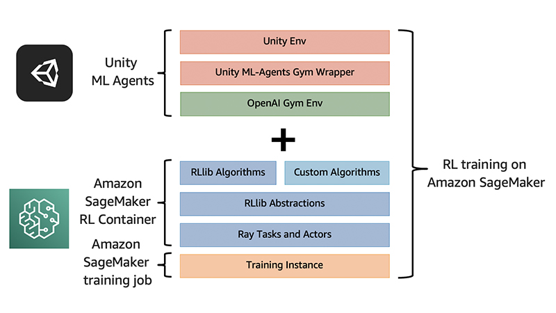

## Training on Amazon SageMaker RL

This page contains instructions for setting up a SageMaker RL Training job for training ML-Agents environments. For the notebook containing the complete code, see [Unity 3D Game with Amazon SageMaker RL](https://github.com/aws/amazon-sagemaker-examples/tree/master/reinforcement_learning/rl_unity_ray).

## Overview of architecture

SageMaker is a fully managed service that enables fast model development. It provides many built-in features to assist you with training, tuning, debugging, and model deployment. SageMaker RL builds on top of SageMaker, adding pre-built RL libraries and making it easy to integrate with different simulation environments. You can use built-in deep learning frameworks such as TensorFlow and PyTorch with various built-in RL algorithms from the [RLlib](https://docs.ray.io/en/latest/rllib.html) library to train RL policies. Infrastructures for training and inference are fully managed by SageMaker, so you can focus on RL formulation. SageMaker RL also provides a set of [Jupyter notebooks](https://github.com/aws/amazon-sagemaker-examples/tree/master/reinforcement_learning), demonstrating varieties of domain RL applications in robotics, operations research, finance, and more.
The following diagram illustrates our architecture.


## Configuring your environment

In this section, we walk you through the steps to set up your environment to launch SageMaker RL training jobs.

### Setting up your environments

To get started, we import the needed Python libraries and set up environments for permissions and configurations. The following code contains the steps to set up an [Amazon Simple Storage Service](http://aws.amazon.com/s3) (Amazon S3) bucket, define the training job prefix, specify the training job location, and create an [AWS Identity and Access Management](http://aws.amazon.com/iam) (IAM) role:

```
import sagemaker
import boto3

# set up the linkage and authentication to the S3 bucket
sage_session = sagemaker.session.Session()
s3_bucket = sage_session.default_bucket()
s3_output_path = 's3://{}/'.format(s3_bucket)
print("S3 bucket path: {}".format(s3_output_path))

# create a descriptive job name
job_name_prefix = 'rl-unity-ray'

# configure where training happens – local or SageMaker instance
local_mode = False

if local_mode:
    instance_type = 'local'
else:
    # If on SageMaker, pick the instance type
    instance_type = "ml.c5.2xlarge"

# create an IAM role
try:
    role = sagemaker.get_execution_role()
except:
    role = get_execution_role()

print("Using IAM role arn: {}".format(role))
```

### Building a Docker container

SageMaker uses Docker containers to run scripts, train algorithms, and deploy models. A [Docker container](https://www.docker.com/resources/what-container) is a standalone package of software that manages all the code and dependencies, and it includes everything needed to run an application. We start by building on top of a pre-built SageMaker Docker image that contains dependencies for Ray, then install the required core packages:

* `gym-unity` – Unity provides a wrapper to wrap Unity environment into a [gym](https://github.com/openai/gym) interface, an open-source library that gives you access to a set of classic RL environments
* `mlagents-envs` – Package that provides a Python API to allow direct interaction with the Unity game engine

For all pre-built SageMaker RL Docker images, see the [GitHub repo](https://github.com/aws/sagemaker-rl-container).

```
ARG CPU_OR_GPU
ARG AWS_REGION
# Specify a SageMaker RL Docker image
FROM 462105765813.dkr.ecr.${AWS_REGION}.amazonaws.com/sagemaker-rl-ray-container:ray-0.8.2-tf-${CPU_OR_GPU}-py36

WORKDIR /opt/ml

# Unity dependencies

RUN pip install --upgrade \
    pip \
    gym-unity \
    mlagents-envs

RUN pip install sagemaker-containers --upgrade

ENV PYTHONUNBUFFERED 1

############################################
# Test Installation
############################################
# Test to verify if all required dependencies installed successfully or not.
RUN python -c "import gym;import sagemaker_containers.cli.train;import ray; from sagemaker_containers.cli.train import main; from mlagents_envs.environment import UnityEnvironment; from mlagents_envs.registry import default_registry; from gym_unity.envs import UnityToGymWrapper"

# Make things a bit easier to debug
WORKDIR /opt/ml/code
```

### Preparing your Unity environment

1. In the Unity Editor, load a project containing an ML-Agents environment (you can use one of the example environments if you have not created your own but please make sure your environment only contains one single agent).

2. Open the Build Settings window (menu: File > Build Settings).
3. Select Linux as the Target Platform, and x86_64 as the target architecture.
4. Click Build to build the Unity environment executable.
5. Upload the executable file, dependency data files and library files to s3.

## Model training, evaluation, and deployment

In this section, we walk you through the steps to train, evaluate, and deploy models.

### Writing a training script

Before launching the SageMaker RL training job, we need to specify the configurations of the training process. It’s usually achieved in a single script outside the notebook. The training script defines the input (the Unity environment) and the algorithm for RL training. The following code shows what the script looks like:


```
import json
import os

import gym
import ray
from ray.tune import run_experiments
from ray.tune.registry import register_env

from sagemaker_rl.ray_launcher import SageMakerRayLauncher
from mlagents_envs.environment import UnityEnvironment
from mlagents_envs.exception import UnityWorkerInUseException
from mlagents_envs.registry import default_registry
from gym_unity.envs import UnityToGymWrapper

class UnityEnvWrapper(gym.Env):
    def __init__(self, env_config):
        self.worker_index = env_config.worker_index
        if 'SM_CHANNEL_TRAIN' in os.environ:
            env_name = os.environ['SM_CHANNEL_TRAIN'] +'/'+ env_config['env_name']
            os.chmod(env_name, 0o755)
            print("Changed environment binary into executable mode.")
            # Try connecting to the Unity3D game instance.
            while True:
                try:
                    unity_env = UnityEnvironment(
                                    env_name,
                                    no_graphics=True,
                                    worker_id=self.worker_index,
                                    additional_args=['-logFile', 'unity.log'])
                except UnityWorkerInUseException:
                    self.worker_index += 1
                else:
                    break
        else:
            env_name = env_config['env_name']
            while True:
                try:
                    unity_env = default_registry[env_name].make(
                        no_graphics=True,
                        worker_id=self.worker_index,
                        additional_args=['-logFile', 'unity.log'])
                except UnityWorkerInUseException:
                    self.worker_index += 1
                else:
                    break

        self.env = UnityToGymWrapper(unity_env)
        self.action_space = self.env.action_space
        self.observation_space = self.env.observation_space

    def reset(self):
        return self.env.reset()

    def step(self, action):
        return self.env.step(action)

class MyLauncher(SageMakerRayLauncher):

    def register_env_creator(self):
        register_env("unity_env", lambda config: UnityEnvWrapper(config))

    def get_experiment_config(self):
        return {
          "training": {
            "run": "PPO",
            "stop": {
              "timesteps_total": 10000,
            },
            "config": {
              "env": "unity_env",
              "gamma": 0.995,
              "kl_coeff": 1.0,
              "num_sgd_iter": 20,
              "lr": 0.0001,
              "sgd_minibatch_size": 100,
              "train_batch_size": 500,
              "monitor": True,  # Record videos.
              "model": {
                "free_log_std": True
              },
              "env_config":{
                "env_name": "Basic"
              },
              "num_workers": (self.num_cpus-1),
              "ignore_worker_failures": True,
            }
          }
        }

if __name__ == "__main__":
    MyLauncher().train_main()
```

The training script has two components:

* `UnityEnvWrapper` – The Unity environment is stored as a binary file. To load the environment, we need to use the Unity ML-Agents Python API. `UnityEnvironment` takes the name of the environment and returns an interactive environment object. We then wrap the object with `UnityToGymWrapper` and return an object that is trainable using Ray-RLLib and SageMaker RL.
* `MyLauncher` – This class inherits the `SageMakerRayLauncher` base class for SageMaker RL applications to use [Ray-RLLib](https://docs.ray.io/en/master/rllib.html). Inside the class, we register the environment to be recognized by Ray and specify the configurations we want during training. Example hyperparameters include the name of the environment, discount factor in cumulative rewards, learning rate of the model, and number of iterations to run the model. For a full list of commonly used hyperparameters, see [Common Parameters](https://docs.ray.io/en/latest/rllib-training.html#common-parameters).

### Training the model

After setting up the configuration and model customization, we’re ready to start the SageMaker RL training job. See the following code:


```
metric_definitions = RLEstimator.default_metric_definitions(RLToolkit.RAY)

estimator = RLEstimator(entry_point="train-unity.py",
                        source_dir='src',
                        dependencies=["common/sagemaker_rl"],
                        image_name=custom_image_name,
                        role=role,
                        train_instance_type=instance_type,
                        train_instance_count=1,
                        output_path=s3_output_path,
                        base_job_name=job_name_prefix,
                        metric_definitions=metric_definitions,
                        hyperparameters={
                # customize Ray parameters here
                        }
                    )
s3_binary_path = '<s3 path for your Unity files> e.g. s3://bucket/unity-data'
estimator.fit({'train': s3_binary_path}, wait=local_mode)
job_name = estimator.latest_training_job.job_name
print("Training job: %s" % job_name)
```

Inside the code, we specify a few parameters:

* `entry_point` – The path to the training script we wrote that specifies the training process
* `source_dir` – The path to the directory with other training source code dependencies aside from the entry point file
* `dependencies` – A list of paths to directories with additional libraries to be exported to the container

In addition, we state the container image name, training instance information, output path, and selected metrics. We are also allowed to customize any Ray-related parameters using the hyperparameters argument. We launch the SageMaker RL training job by calling `estimator.fit`, and start the model training process based on the specifications in the training script.
At a high level, the training job initiates a neural network and updates the network gradually towards the direction in which the agent collects higher reward. Through multiple trials, the agent eventually learns how to navigate to the high-rewarding location efficiently. SageMaker RL handles the entire process and allows you to view the training job status in the Training jobs page on the SageMaker console.

### Evaluating the model

When model training is complete, we can load the trained model to evaluate its performance. Similar to the setup in the training script, we wrap the Unity environment with a gym wrapper. We then create an agent by loading the trained model.
To evaluate the model, we run the trained agent multiple times against the environment with a fixed agent and target initializations, and add up the cumulative rewards the agent collects at each step for each episode.
Out of five episodes, the average episode reward is 0.92 with the maximum reward of 0.93 and minimum reward of 0.89, suggesting the trained model indeed performs well.

### Deploying the model

We can deploy the trained RL policy with just a few lines of code using the SageMaker model deployment API. You can pass an input and get out the optimal actions based on the policy. The input shape needs to match the observation input shape from the environment.
For the Basic environment, we deploy the model and pass an input to the predictor:

```
from sagemaker.tensorflow.model import TensorFlowModel

model = TensorFlowModel(model_data=estimator.model_data,
              framework_version='2.1.0',
              role=role)

predictor = model.deploy(initial_instance_count=1,
                         instance_type=instance_type)
input = {"inputs": {'observations': np.ones(shape=(1, 20)).tolist(),
                    'prev_action': [0, 0],
                    'is_training': False,
                    'prev_reward': -1,
                    'seq_lens': -1
                   }
        }
result = predictor.predict(input)print(result['outputs']['actions'])
```

The model predicts an indicator corresponding to moving left or right. The recommended direction of movement for the blue box agent always points towards the larger green ball.

## Cleaning up

When you’re finished running the model, call `predictor.delete_endpoint()` to delete the model deployment endpoint to avoid incurring future charges.

## (Optional) Customizing training algorithms, models, and environments

In addition to the preceding use case, we encourage you to explore the customization capabilities this solution supports.
In the preceding code example, we specify [Proximal Policy Optimization](https://openai.com/blog/openai-baselines-ppo/) (PPO) to be the training algorithm. PPO is a popular RL algorithm that performs comparably to state-of-the-art approaches but is much simpler to implement and tune. Depending on your use case, you can choose the most-fitted algorithm for training by either selecting from a list of comprehensive algorithms already implemented in RLLib or building a custom algorithm from scratch.
By default, RLLib applies a pre-defined [convolutional neural network](https://github.com/ray-project/ray/blob/master/rllib/models/tf/visionnet.py) or [fully connected neural network](https://github.com/ray-project/ray/blob/master/rllib/models/tf/fcnet.py). However, you can create a custom model for training and testing. Following the [examples](https://github.com/ray-project/ray/blob/master/rllib/examples/custom_env.py) from RLLib, you can register the custom model by calling `ModelCatalog.register_custom_model`, then refer to the newly registered model using the `custom_model` argument.
In our code example, we invoke a predefined Unity environment called Basic, but you can experiment with other [pre-built Unity environments](https://github.com/Unity-Technologies/ml-agents/blob/master/docs/Learning-Environment-Examples.md). However, as of this writing, our solution only supports a single-agent environment. When new environments are built, register it by calling `register_env` and refer to the environment with the env parameter.
