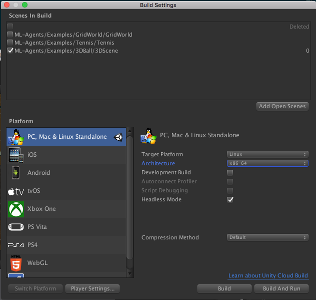

# Using Docker For ML-Agents (Deprecated)

Note: We no longer use this guide ourselves and so it may not work correctly. We've decided to
 keep it up just in case it is helpful to you.

We currently offer a solution for Windows and Mac users who would like to do
training or inference using Docker. This option may be appealing to those who
would like to avoid installing Python and TensorFlow themselves. The current
setup forces both TensorFlow and Unity to _only_ rely on the CPU for
computations. Consequently, our Docker simulation does not use a GPU and uses
[`Xvfb`](https://en.wikipedia.org/wiki/Xvfb) to do visual rendering. `Xvfb` is a
utility that enables `ML-Agents` (or any other application) to do rendering
virtually i.e. it does not assume that the machine running `ML-Agents` has a GPU
or a display attached to it. This means that rich environments which involve
agents using camera-based visual observations might be slower.

## Requirements

- [Docker](https://www.docker.com)
- Unity _Linux Build Support_ Component. Make sure to select the _Linux
Build Support_ component when installing Unity.

<p align="center">
  
</p>

## Setup

- [Download](https://unity3d.com/get-unity/download) the Unity Installer and add
  the _Linux Build Support_ Component

- [Download](https://www.docker.com/community-edition#/download) and install
  Docker if you don't have it setup on your machine.

- Since Docker runs a container in an environment that is isolated from the host
  machine, a mounted directory in your host machine is used to share data, e.g.
  the trainer configuration file, Unity executable, curriculum files and
  TensorFlow graph. For convenience, we created an empty `unity-volume`
  directory at the root of the repository for this purpose, but feel free to use
  any other directory. The remainder of this guide assumes that the
  `unity-volume` directory is the one used.

## Usage

Using Docker for ML-Agents involves three steps: building the Unity environment
with specific flags, building a Docker container and, finally, running the
container. If you are not familiar with building a Unity environment for
ML-Agents, please read through our [Getting Started with the 3D Balance Ball
Example](Getting-Started.md) guide first.

### Build the Environment (Optional)

_If you want to used the Editor to perform training, you can skip this step._

Since Docker typically runs a container sharing a (linux) kernel with the host
machine, the Unity environment **has** to be built for the **linux platform**.
When building a Unity environment, please select the following options from the
the Build Settings window:

- Set the _Target Platform_ to `Linux`
- Set the _Architecture_ to `x86_64`
- If the environment does not contain visual observations, you can select the
  `headless` option here.

Then click `Build`, pick an environment name (e.g. `3DBall`) and set the output
directory to `unity-volume`. After building, ensure that the file
`<environment-name>.x86_64` and subdirectory `<environment-name>_Data/` are
created under `unity-volume`.



### Build the Docker Container

First, make sure the Docker engine is running on your machine. Then build the
Docker container by calling the following command at the top-level of the
repository:

```sh
docker build -t <image-name> .
```

Replace `<image-name>` with a name for the Docker image, e.g.
`balance.ball.v0.1`.

### Run the Docker Container

Run the Docker container by calling the following command at the top-level of
the repository:

```sh
docker run -it --name <container-name> \
           --mount type=bind,source="$(pwd)"/unity-volume,target=/unity-volume \
           -p 5005:5005 \
           -p 6006:6006 \
           <image-name>:latest \
           <trainer-config-file> \
           --env=<environment-name> \
           --train \
           --run-id=<run-id>
```

Notes on argument values:

- `<container-name>` is used to identify the container (in case you want to
  interrupt and terminate it). This is optional and Docker will generate a
  random name if this is not set. _Note that this must be unique for every run
  of a Docker image._
- `<image-name>` references the image name used when building the container.
- `<environment-name>` __(Optional)__: If you are training with a linux
  executable, this is the name of the executable. If you are training in the
  Editor, do not pass a `<environment-name>` argument and press the
  :arrow_forward: button in Unity when the message _"Start training by pressing
  the Play button in the Unity Editor"_ is displayed on the screen.
- `source`: Reference to the path in your host OS where you will store the Unity
  executable.
- `target`: Tells Docker to mount the `source` path as a disk with this name.
- `trainer-config-file`, `train`, `run-id`: ML-Agents arguments passed to
  `mlagents-learn`. `trainer-config-file` is the filename of the trainer config
  file, `train` trains the algorithm, and `run-id` is used to tag each
  experiment with a unique identifier. We recommend placing the trainer-config
  file inside `unity-volume` so that the container has access to the file.

To train with a `3DBall` environment executable, the command would be:

```sh
docker run -it --name 3DBallContainer.first.trial \
           --mount type=bind,source="$(pwd)"/unity-volume,target=/unity-volume \
           -p 5005:5005 \
           -p 6006:6006 \
           balance.ball.v0.1:latest 3DBall \
           /unity-volume/trainer_config.yaml \
           --env=/unity-volume/3DBall \
           --train \
           --run-id=3dball_first_trial
```

For more detail on Docker mounts, check out
[these](https://docs.docker.com/storage/bind-mounts/) docs from Docker.

**NOTE** If you are training using docker for environments that use visual observations, you may need to increase the default memory that Docker allocates for the container. For example, see [here](https://docs.docker.com/docker-for-mac/#advanced) for instructions for Docker for Mac.

### Running Tensorboard

You can run Tensorboard to monitor your training instance on http://localhost:6006:

```sh
docker exec -it <container-name> tensorboard --logdir=/unity-volume/summaries --host=0.0.0.0
```

With our previous 3DBall example, this command would look like this:
```sh
docker exec -it 3DBallContainer.first.trial tensorboard --logdir=/unity-volume/summaries --host=0.0.0.0
```

For more details on Tensorboard, check out the documentation about [Using Tensorboard](Using-Tensorboard.md).

### Stopping Container and Saving State

If you are satisfied with the training progress, you can stop the Docker
container while saving state by either using `Ctrl+C` or `⌘+C` (Mac) or by using
the following command:

```sh
docker kill --signal=SIGINT <container-name>
```

`<container-name>` is the name of the container specified in the earlier `docker
run` command. If you didn't specify one, you can find the randomly generated
identifier by running `docker container ls`.
