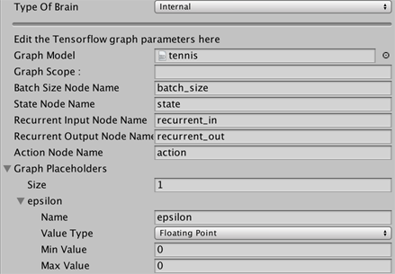

# Using TensorFlowSharp in Unity (Experimental)

The ML-Agents toolkit allows you to use pre-trained [TensorFlow graphs](https://www.tensorflow.org/programmers_guide/graphs) inside your Unity games. This support is possible thanks to [the TensorFlowSharp project](https://github.com/migueldeicaza/TensorFlowSharp). The primary purpose for this support is to use the TensorFlow models produced by the ML-Agents toolkit's own training programs, but a side benefit is that you can use any TensorFlow model.

_Notice: This feature is still experimental. While it is possible to embed trained models into Unity games, Unity Technologies does not officially support this use-case for production games at this time. As such, no guarantees are provided regarding the quality of experience. If you encounter issues regarding battery life, or general performance (especially on mobile), please let us know._

## Supported devices :

 * Linux 64 bits
 * Mac OS X 64 bits
 * Windows 64 bits
 * iOS (Requires additional steps)
 * Android

## Requirements

* Unity 2017.1 or above
* Unity TensorFlow Plugin ([Download here](https://s3.amazonaws.com/unity-ml-agents/0.4/TFSharpPlugin.unitypackage))

# Using TensorFlowSharp with ML-Agents

Go to `Edit` -> `Player Settings` and add `ENABLE_TENSORFLOW` to the `Scripting Define Symbols` for each type of device you want to use (**`PC, Mac and Linux Standalone`**, **`iOS`** or **`Android`**).

Set the Brain you used for training to `Internal`. Drag `your_name_graph.bytes` into Unity and then drag it into The `Graph Model` field in the Brain. 

## Using your own trained graphs

The TensorFlow data graphs produced by the ML-Agents training programs work without any additional settings.

In order to use a TensorFlow data graph in Unity, make sure the nodes of your graph have appropriate names. You can assign names to nodes in TensorFlow :

```python
variable= tf.identity(variable, name="variable_name")
```

We recommend using the following naming conventions:
 * Name the batch size input placeholder `batch_size`
 * Name the input vector observation placeholder `state`
 * Name the output node `action`
 * Name the recurrent vector (memory) input placeholder `recurrent_in` (if any)
 * Name the recurrent vector (memory) output node `recurrent_out` (if any)
 * Name the observations placeholders input placeholders `visual_observation_i` where `i` is the index of the observation (starting at 0)

You can have additional placeholders for float or integers but they must be placed in placeholders of dimension 1 and size 1. (Be sure to name them.)

It is important that the inputs and outputs of the graph are exactly the ones you receive and return when training your model with an `External` brain. This means you cannot have any operations such as reshaping outside of the graph.
The object you get by calling `step` or `reset` has fields `vector_observations`, `visual_observations` and `memories` which must correspond to the placeholders of your graph. Similarly, the arguments `action` and `memory` you pass to `step` must correspond to the output nodes of your graph.

While training your Agent using the Python API, you can save your graph at any point of the training. Note that the argument `output_node_names` must be the name of the tensor your graph outputs (separated by a coma if using multiple outputs). In this case, it will be either `action` or `action,recurrent_out` if you have recurrent outputs.

```python
from tensorflow.python.tools import freeze_graph

freeze_graph.freeze_graph(input_graph = model_path +'/raw_graph_def.pb',
              input_binary = True,
              input_checkpoint = last_checkpoint,
              output_node_names = "action",
              output_graph = model_path +'/your_name_graph.bytes' ,
              clear_devices = True, initializer_nodes = "",input_saver = "",
              restore_op_name = "save/restore_all", filename_tensor_name = "save/Const:0")
```

Your model will be saved with the name `your_name_graph.bytes` and will contain both the graph and associated weights. Note that you must save your graph as a .bytes file so Unity can load it.

In the Unity Editor, you must specify the names of the nodes used by your graph in the **Internal** brain Inspector window. If you used a scope when defining your graph, specify it in the `Graph Scope` field. 



See [Internal Brain](Learning-Environment-Design-External-Internal-Brains.md#internal-brain) for more information about using Internal Brains.

If you followed these instructions well, the agents in your environment that use this brain will use your fully trained network to make decisions.

# iOS additional instructions for building

* Once you build the project for iOS in the editor, open the .xcodeproj file within the project folder using Xcode.
* Set up your ios account following the [iOS Account setup page](https://docs.unity3d.com/Manual/iphone-accountsetup.html). 
* In **Build Settings** > **Linking** > **Other Linker Flags**:
  * Double click on the flag list to expand the list
  * Add `-force_load`
  * Drag the library `libtensorflow-core.a` from the **Project Navigator** on the left under `Libraries/ML-Agents/Plugins/iOS` into the flag list, after `-force_load`.

# Using TensorFlowSharp without ML-Agents

Beyond controlling an in-game agent, you can also use TensorFlowSharp for more general computation. The following instructions describe how to generally embed TensorFlow models without using the ML-Agents framework.

You must have a TensorFlow graph, such as `your_name_graph.bytes`, made using TensorFlow's `freeze_graph.py`. The process to create such graph is explained in the [Using your own trained graphs](#using-your-own-trained-graphs) section.

## Inside of Unity

To load and use a TensorFlow data graph in Unity:

1. Put the file, `your_name_graph.bytes`, into Resources.

2. At the top off your C# script, add the line:

```csharp
using TensorFlow;
```

3. If you will be building for android, you must add this block at the start of your code :

```csharp
#if UNITY_ANDROID
TensorFlowSharp.Android.NativeBinding.Init();
#endif
```

4. Load your graph as a text asset into a variable, such as `graphModel`:

```csharp
TextAsset graphModel = Resources.Load (your_name_graph) as TextAsset;
```

5. You then must instantiate the graph in Unity by adding the code :

```csharp
graph = new TFGraph ();
graph.Import (graphModel.bytes);
session = new TFSession (graph);
```

6. Assign the input tensors for the graph. For example, the following code assigns a one dimensional input tensor of size 2:

```csharp
var runner = session.GetRunner ();
runner.AddInput (graph ["input_placeholder_name"] [0], new float[]{ placeholder_value1, placeholder_value2 });
```

You must provide all required inputs to the graph. Supply one input per TensorFlow placeholder.

7. To calculate and access the output of your graph, run the following code.

```csharp
runner.Fetch (graph["output_placeholder_name"][0]);
float[,] recurrent_tensor = runner.Run () [0].GetValue () as float[,];
```

Note that this example assumes the output array is a two-dimensional tensor of floats. Cast to a long array if your outputs are integers.
