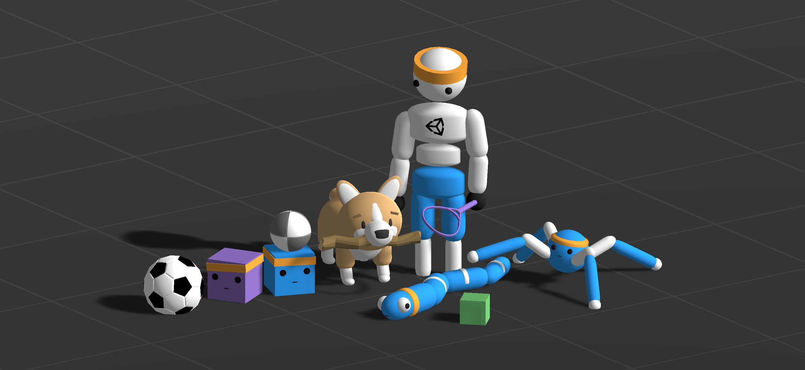

# Unity ML-Agents Toolkit (Beta) v0.9

**Unity Machine Learning Agents Toolkit** (ML-Agents) 은 지능형 에이전트를 학습시키기 위한
환경을 제공하여 게임 또는 시뮬레이션을 만들 수 있게 해주는 오픈소스 유니티 플러그인 입니다. 사용하기 쉬운
파이썬 API를 통해 강화학습, 모방학습, 신경진화 또는 다른 기계학습 방법론을 사용하여 에이전트들을 학습시킬 수 있습니다.
우리는 또한 게임 개발자와 개발에 대해 취미를 가지신 분들이 2D, 3D 그리고 VR/AR 게임들에 사용할 지능형 에이전트를
쉽게 훈련시킬 수 있도록하는 최신 알고리즘 구현체를 ([텐서플로우]([https://www.tensorflow.org/](https://www.tensorflow.org/)) 기반)을 제공합니다. 학습된 에이전트들은
NPC의 행동 제어(다중 에이전트, 적대적 에이전트 등), 게임 빌드 테스트 자동화, 그리고 출시 전 게임 설계 검증 등을 포함한 다양한 목적을 위해 사용될 수 있습니다.
ML-Agents toolkit은 유니티의 풍부한 환경에서 인공지능 에이전트 개발을 위한 중심 플랫폼을 제공함으로써 더욱 광범위한 연구와 게임 개발이 진행되도록 하며 이에 따라 게임 개발자들과 AI 연구원들 모두에게 도움을 줍니다.

## 특징

* 파이썬을 통한 유니티 환경 제어
* 10가지 이상의 유니티 환경 샘플
* 여러 환경 구성 및 학습 시나리오 제공
* 심층 강화 학습을 사용하여 기억력이 향상된 에이전트 학습
* 쉽게 정의 가능한 커리큘럼 학습 시나리오
* 지도 학습을 위한 에이전트 행동 브로드캐스팅
* 모방 학습 지원 기본 제공
* 온 디맨드 의사 결정을 통한 유연한 에이전트 제어
* 환경 속 네트워크 출력의 시각화
* [도커(Docker)]([https://www.docker.com/](https://www.docker.com/))를 통한 설정 단순화
* [gym]([https://gym.openai.com/](https://gym.openai.com/))과 같은 학습 환경
* 유니티 인터페이스 엔진 활용
* 유니티 환경 인스턴스를 동시에 사용하는 학습

## 문서화

* 설치와 사용법 외에 더 많은 정보는 [설명서 홈](docs/Readme.md)을 참고해주십시오.
* 만약 유니티 AI 플랫폼에 관한 토론에 관심있는 연구원이라면 유니티와 ML-Agents Toolkit에 관한 [논문](https://arxiv.org/abs/1809.02627)을 참고해 주십시오. 또한 이 논문을 인용하는 것에 관한 사항은 아래의 인용 부분을 참조하십시오.
* 만약 이전 버전의 ML-Agents toolkit을 사용하고 있다면 [이전 버전 마이그레이션 가이드](docs/Migrating.md)를 확인해주십시오.

## 추가 리소스

블로그에 ML-Agents와 관련된 시리즈의 게시물을 게시하였습니다(영어).

* 강화 학습 개념 개요 ([multi-armed bandit](https://blogs.unity3d.com/kr/2017/06/26/unity-ai-themed-blog-entries/) 과 [Q-learning](https://blogs.unity3d.com/kr/2017/08/22/unity-ai-reinforcement-learning-with-q-learning/))
* [실제 게임에서 Machine Learning 에이전트 사용하기: 초보자 가이드](https://blogs.unity3d.com/kr/2017/12/11/using-machine-learning-agents-in-a-real-game-a-beginners-guide/)
* [첫번째 ML-Agents 챌린지](https://connect.unity.com/challenges/ml-agents-1)의 수상자 관련 [포스트](https://blogs.unity3d.com/kr/2018/02/28/introducing-the-winners-of-the-first-ml-agents-challenge/)
* 안전한 도시 설계를 위한 유니티 사용 방법 개요 관련 [포스트](https://blogs.unity3d.com/kr/2018/01/23/designing-safer-cities-through-simulations/)

유니티에서 제공하는 문서 뿐만 아니라 관련된 기사들이 있습니다:

* [유니티 AI - 유니티의 3D 인공지능](https://www.youtube.com/watch?v=bqsfkGbBU6k)
* [머신러닝을 배우는 게임 개발자](https://mikecann.co.uk/machine-learning/a-game-developer-learns-machine-learning-intent/)
* [인텔 아키텍쳐 전용 Unity Technologies ML-Agents 둘러보기](https://software.intel.com/en-us/articles/explore-unity-technologies-ml-agents-exclusively-on-intel-architecture)

## 커뮤니티 그리고 피드백

ML-Agents toolkit은 오픈소스 프로젝트이며 컨트리뷰션을 환영합니다. 만약 컨트리뷰션을 원하시는 경우
[컨트리뷰션 가이드라인](CONTRIBUTING.md)과 [행동 규칙](CODE_OF_CONDUCT.md)을 검토해주십시오.

만약 ML-Agents toolkit을 사용하며 문제가 생긴다면, 가능한 많은 세부 사항을 포함하여 [이슈 제출](https://github.com/Unity-Technologies/ml-agents/issues)을 해주십시오.

여러분의 의견은 저희에게 매우 중요합니다. Unity ML-Agents Toolkit에 관련된 여러분의 의견을 통해서 저희는 계속해서
발전하고 성장할 수 있습니다. 단 몇 분만 사용하여 [저희에게 알려주세요](https://github.com/Unity-Technologies/ml-agents/issues/1454).

다른 의견과 피드백은 ML-Agents 팀과 직접 연락부탁드립니다. (ml-agents@unity3d.com)

## 라이센스

[Apache License 2.0](LICENSE)

## 인용

만약 Unity 또는 the ML-Agents Toolkit을 사용하여 연구를 수행할 경우 다음 논문을 참고 자료로 인용하여 주시길 바랍니다:

Juliani, A., Berges, V., Vckay, E., Gao, Y., Henry, H., Mattar, M., Lange, D. (2018). Unity: A General Platform for Intelligent Agents. *arXiv preprint arXiv:1809.02627.* https://github.com/Unity-Technologies/ml-agents.

## 한글 번역

유니티 ML-Agents 관련 문서의 한글 번역은 [장현준(Hyeonjun Jang)][https://github.com/JangHyeonJun],  [민규식 (Kyushik Min)]([https://github.com/Kyushik](https://github.com/Kyushik))에 의해 진행되었습니다. 내용상 오류나 오탈자가 있는 경우 각 문서의 번역을 진행한 사람의 이메일을 통해 연락주시면 감사드리겠습니다.

장현준: totok682@naver.com

민규식:  kyushikmin@gmail.com