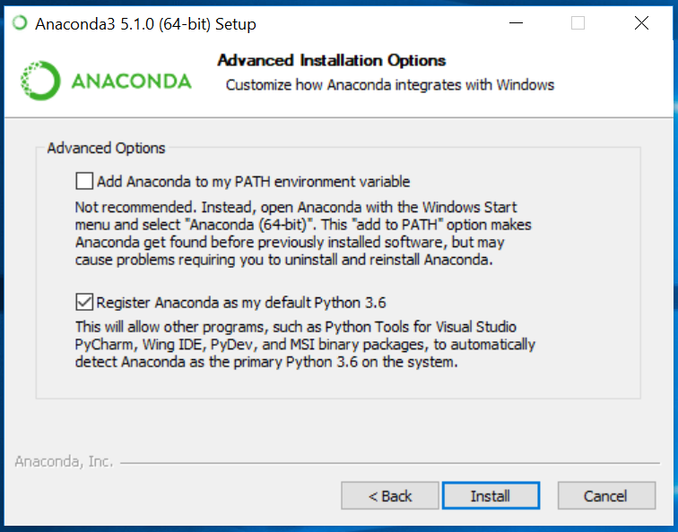
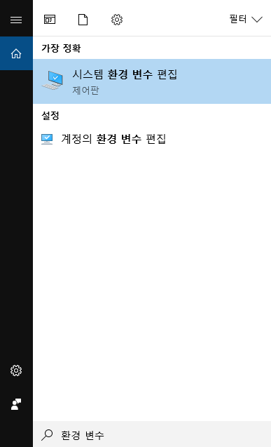
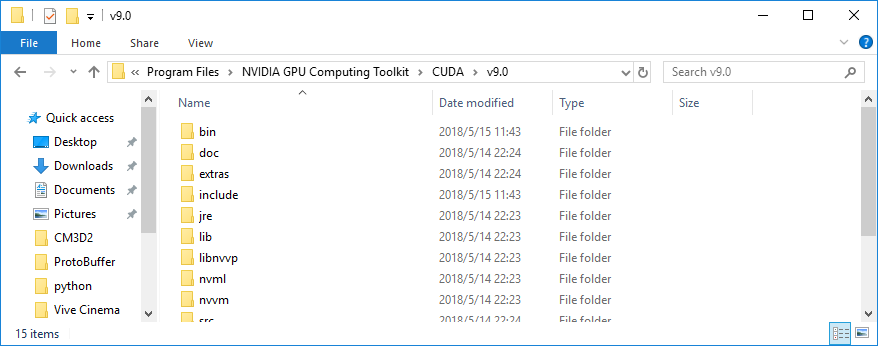
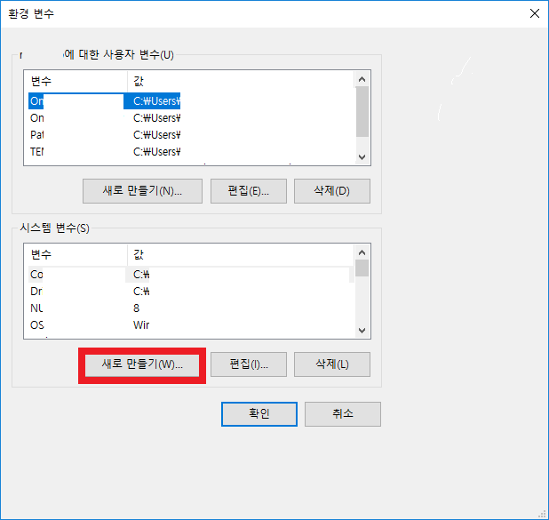
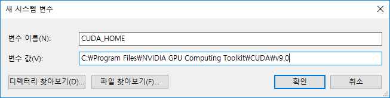
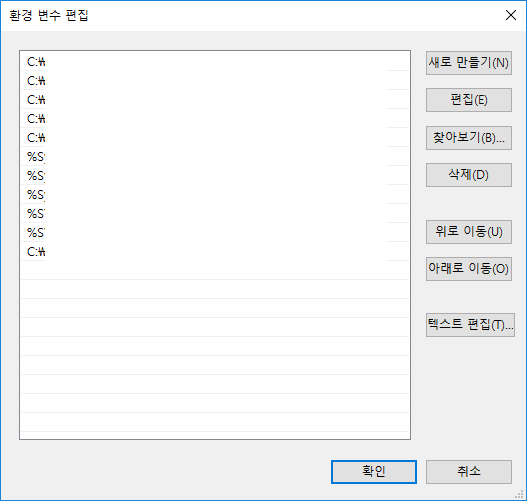

# Windows 사용자를 위한 ML-Agents Toolkit 설치 방법

ML-Agents toolkit은 Windows 10을 지원합니다. 다른 버전의 Windows 으로도 ML-Agents toolkit은
사용할 수 있지만 검증되지 않았습니다. 또한, ML-Agents toolkit은 Windows VM(Bootcamp 또는 병렬 처리
환경 같은)의 사용 또한 검증되지 않았습니다 .

ML-Agents toolkit을 사용하기 위해, 아래에 설명된것 처럼 Python과 요구되는 Python 패키지를 설치해야 합니다.
이 가이드는 또한 GPU 기반 학습(숙련자를 위한)에 대한 설정 방법을 다룹니다.
현재, ML-Agents toolkit를 위해 GPU 기반 학습은 필요하지 않으나 향후 버전 또는 특정 사항에 필요할 수 있습니다.

## 단계 1: Anaconda를 통한 Python 설치

Windows 버전의 Anaconda를 [다운로드](https://www.anaconda.com/download/#windows)하고 설치하십시오.
Anaconda를 사용함으로써, 다른 배포 버전의 Python을 분리된 환경에서 관리할 수 있습니다.
Python 2를 더이상 지원하지 않기 때문에 Python 3.5 또는 3.6가 필요합니다. 이 가이드에서 우리는
Python 3.6 버전과 Anaconda 5.1 버전을 사용할 것입니다.
([64-bit](https://repo.continuum.io/archive/Anaconda3-5.1.0-Windows-x86_64.exe)
또는 [32-bit](https://repo.continuum.io/archive/Anaconda3-5.1.0-Windows-x86.exe)
링크).

<p align="center">
  
</p>

디폴트 _advanced installation options_을 선택하는 것을 추천하지만 상황에 따라 적절한 옵션을 선택하십시오.

<p align="center">
  
</p>

설치 후에 반드시 __Anaconda Navigator__ 를 열어 설정을 완료해야 합니다.
Windows 탐색 창에서, _anaconda navigator_ 를 타이핑하여 Anaconda Navigator 를 열 수 있습니다.

환경 변수가 생성되어있지 않다면 `conda` 명령어를 타이핑했을 때
"conda is not recognized as internal or external command" 라는 에러가 나올 것입니다.
이를 해결하기 위해 정확한 환경 변수 설정이 필요합니다.

탐색 창에서 `환경 변수`를 타이핑 하여 (윈도우 키를 누르거나 왼쪽 아래 윈도우 버튼을 통해 열 수 있습니다).
 __시스템 환경 변수 편집__ 옵션을 불러옵니다.

<p align="center">
  
</p>

이 옵션에서 __환경 변수__ 버튼을 클릭하고. 아래 __시스템 변수__에서 "Path" 변수를 더블 클릭하고 __새로 만들기__를 클릭하여 다음 새 path를 추가하십시오.

```console
%UserProfile%\Anaconda3\Scripts
%UserProfile%\Anaconda3\Scripts\conda.exe
%UserProfile%\Anaconda3
%UserProfile%\Anaconda3\python.exe
```

## 단계 2: 새로운 Conda 환경 설정 및 활성화

ML-Agents toolkit과 함께 사용할 새로운 [Conda 환경](https://conda.io/docs/)을 만들 것입니다.
이 작업은 설치한 모든 패키지가 이 환경에만 국한된다는 것을 의미합니다. 이는 다른 환경이나 다른 파이썬 설치에
영향을 끼치지 않습니다. ML-Agents를 실행할 때에는 항상 Conda 환경을 활성화 시켜야 합니다.

새로운 Conda 환경을 만들기 위해, 새로운 Anaconda 프롬프트(탐색 창에서 _Anaconda Prompt_를 클릭)를 열고 다음
명령어를 타이핑 하십시오:

```sh
conda create -n ml-agents python=3.6
```

새 패키지를 설치하기 위해 메세지가 나올 경우 `y`를 타이핑하고 엔터를 누르십시오 _(인터넷이 연결되어있는지 확인하십시오)_.
이 요구되는 패키지들을 반드시 설치해야 합니다. 새로운 Conda 환경에서 Python 3.6 버전이 사용되며 ml-agents가 호출됩니다.

<p align="center">
  
</p>

앞서 만든 환경을 이용하기 위해 반드시 활성화를 해야합니다. _(향후에 같은 명령어 통해 환경을 재사용할 수 있습니다)_.
같은 Anaconda 프롬프트에서 다음 명령어를 타이핑 하십시오:

```sh
activate ml-agents
```

활성화 후에 `(ml-agents)`라는 글자가 마지막 줄 앞에 나타나는 것을 볼 수 있습니다.

다음으로, `tensorflow`를 설치합니다. 파이썬 패키지를 설치하기 위해 사용하는 `pip`라는 패키지 관리 시스템를 사용하여 설치할 수 있습니다.
최신 버전의 TensorFlow는 작동하지 않을 수 있으므로, 설치 버전이 1.7.1인지 확인해야 합니다. 같은 Anaconda 프롬프트 창에서
다음 명령어를 타이핑 하십시오._(인터넷이 연결되어 있는지 확인하여 주십시오)_:

```sh
pip install tensorflow==1.7.1
```

## 단계 3: 필수 파이썬 패키지 설치

ML-Agents toolkit은 많은 파이썬 패키지에 종속적입니다. `pip`를 사용하여 이 파이썬 종속성들을 설치하십시오.

ML-Agents Toolkit 깃허브 저장소가 로컬 컴퓨터에 복제되어있지 않았다면 복제하십시오. Git을 ([다운로드](https://git-scm.com/download/win))하고
실행시킨 후 다음 명령어를 Anaconda 프롬프트창에 입력하여 진행할 수 있습니다. _(만약 새 프롬프트 창이 열려있다면 `activate ml-agents`를 타이핑하여
ml-agents Conda 환경이 활성화 되어있는지 확인하십시오)_:

```sh
git clone https://github.com/Unity-Technologies/ml-agents.git
```

만약 Git을 사용하고 싶지 않다면 언제든 [링크](https://github.com/Unity-Technologies/ml-agents/archive/master.zip)에서 모든 파일을 다운로드 할 수 있습니다.

`UnitySDK` 하위 디렉토리에는 프로젝트에 추가할 유니티 애셋이 포함되어 있습니다. 또한 시작하는데 도움이 되는 많은 [예제 환경](Learning-Environment-Examples.md)들이 있습니다.

`ml-agents` 하위 디렉토리에는 유니티 환경과 함게 사용하는 심층 강화학습 트레이너 파이썬 패키지가 포함되어 있습니다.

`ml-agents-envs` 하위 디렉토리에는 `ml-agents` 패키지에 종속되는 유니티의 인터페이스를 위한 파이썬 API가 포함되어 있습니다.

`gym-unity` 하위 디렉토리에는 OpenAI Gym의 인터페이스를 위한 패키지가 포함되어 있습니다.

`mlagents-learn`을 실행할 때 트레이너의 환경 설정 파일이 이 디렉토리 안에 필요하므로, 파일이 다운로드 된 디렉토리의 위치를 기억하십시오.
인터넷이 연결되었는지 확인하고 Anaconda 프롬프트에서 다음 명령어를 타이핑 하십시오t:

```console
pip install mlagents
```

ML-Agents toolkit을 실행할 때 필요한 모든 파이썬 패키지의 설치를 완료할 것입니다.

Windows에서 가끔 pip를 사용하여 특정 파이썬 패키지를 설치할 때 패키지의 캐쉬를 읽는 것이 막힐 때가 있습니다.
다음을 통해 문제를 해결해 볼 수 있습니다:

```console
pip install mlagents --no-cache-dir
```

`--no-cache-dir`는 pip에서 캐쉬를 비활성화 한다는 뜻입니다.


### 개발을 위한 설치

만약 `ml-agents` 또는 `ml-agents-envs`를 수정하고 싶다면, PyPi가 아닌 복제된 저장소로 부터 패키지를 설치해야 합니다.
이를 위해, `ml-agents` 와 `ml-agents-envs` 를 각각 설치해야 합니다.

예제에서 파일은 `C:\Downloads`에 위치해 있습니다. 파일을 복제하거나 다운로드한 후
Anaconda 프롬프트에서 ml-agents 디렉토리 내의 ml-agents 하위 디렉토리로 변경하십시오:

```console
cd C:\Downloads\ml-agents
```

저장소의 메인 디렉토리에서 다음을 실행하십시오:

```console
cd ml-agents-envs
pip install -e .
cd ..
cd ml-agents
pip install -e .
```

`-e` 플래그를 사용하여 pip를 실행 하면 파이썬 파일을 직접 변경할 수 있고 `mlagents-learn`를 실행할 때 반영됩니다.
`mlagents` 패키지가 `mlagents_envs`에 의존적이고, 다른 순서로 설치하면 PyPi로 부터 `mlagents_envs` 를 설치할 수 있기 때문에
이 순서대로 패키지를 설치하는 것은 중요합니다.

## (옵션) Step 4: ML-Agents Toolkit를 사용한 GPU 학습

ML-Agents toolkit를 위해 GPU는 필요하지 않으며 학습 중에 PPO 알고리즘 속도를 크게 높이지 못합니다(하지만 향후에 GPU가 이점을 줄 수 있습니다).
이 가이드는 GPU를 사용해 학습을 하고 싶은 고급 사용자를 위한 가이드 입니다. 또한 GPU가 CUDA와 호환되는지 확인해야 합니다.
[여기](https://developer.nvidia.com/cuda-gpus) Nvidia 페이지에서 확인해 주십시오.

현재 ML-Agents toolkit 는 CUDA 9.0 버전과 cuDNN 7.0.5 버전이 지원됩니다.

### Nvidia CUDA toolkit 설치

Nvidia 아카이브에서 CUDA 툴킷(toolkit) 9.0을 [다운로드](https://developer.nvidia.com/cuda-toolkit-archive)하고 설치하십시오.
ML-Agents toolkit을 실행시키기 위한 CUDA 툴킷은 GPU 가속 라이브러리,
디버깅-최적화 도구, C/C++(비주얼 스튜디오 2017) 컴파일러, 런타임 라이브러리를 포함합니다.
이 가이드에서는 [9.0.176](https://developer.nvidia.com/compute/cuda/9.0/Prod/network_installers/cuda_9.0.176_win10_network-exe))버전을 사용합니다.

설치하기 전, __실행 중인 유니티 또는 비주얼 스튜디오를 종료했는지__ 확인하여 주십시오.

인스톨러를 실행하고 Express 옵션을 선택하십시오. CUDA 툴킷을 설치할 디렉토리에 유의해 주십시오. 이 가이드에서는,
`C:\Program Files\NVIDIA GPU Computing Toolkit\CUDA\v9.0` 경로에 설치합니다.

### Nvidia cuDNN 라이브러리 설치

Nvidia에서 cuDNN 라이브러리를 [다운로드](https://developer.nvidia.com/cudnn)하고 설치하십시오.
cuDNN은 심층 신경망을 위한 기본이 되는 GPU 가속 라이브러리. 다운로드 전에 Nvidia Developer Program에 가입해야할 것입니다(무료).

<p align="center">
  
</p>

가입하고 cuDNN [다운로드 페이지](https://developer.nvidia.com/cudnn)로 돌아가십시오.
짧은 설문조사에 응답해야 할 수도 있습니다. When you get to the list
cuDNN 릴리즈 리스트에서 __단계 1에서 설치한 CUDA 툴킷에 맞는 버전을 다운로드하고 있는지 확인하십시오.__ 이 가이드에서는,
CUDA 툴킷 9.0 버전을 위해 7.0.5 버전을 사용합니다
([다운로드 링크](https://developer.nvidia.com/compute/machine-learning/cudnn/secure/v7.0.5/prod/9.0_20171129/cudnn-9.0-windows10-x64-v7)).

cuDNN 파일을 다운로드 한 후에, CUDA 툴킷 디렉토리안에 파일을 추출(압축 해제)해야 합니다.
cuDNN zip 파일 안에는 세가지 폴더 `bin`, `include`, 그리고 `lib`가 있습니다.

<p align="center">
  
</p>

이 세가지 폴더를 CUDA 툴킷 디렉토리안에 복사하십시오.
CUDA 툴킷 디렉토리는 `C:\Program Files\NVIDIA GPU Computing Toolkit\CUDA\v9.0`에 위치해 있습니다.

<p align="center">
  
</p>

### 환경 변수 설정

1개의 환경 변수와 2개의 경로 변수를 추가해야 합니다.

환경 변수를 설정하기 위해, 탐색 창에서 `환경 변수`를 타이핑 하여 (윈도우 키를 누르거나 왼쪽 아래 윈도우 버튼을 통해 열 수 있습니다).
 __시스템 환경 변수 편집__ 옵션을 불러옵니다.

<p align="center">
  
</p>

이 옵션에서 __환경 변수__ 버튼을 클릭하고 시스템 변수의 __새로 만들기__를 클릭하십시오 _(사용자 변수가 아닌 아래의 __시스템 변수__인지 확인하십시오).

<p align="center">
  
</p>

__변수 이름__을 `CUDA_HOME`으로 설정하고 변수 값에는 CUDA 툴킷 디렉토리 경로를 입력해 주십시오.
이 가이드에서 디렉토리 경로는 `C:\Program Files\NVIDIA GPU Computing Toolkit\CUDA\v9.0` 입니다. 확인 버튼을 눌러주십시오.

<p align="center">
  
</p>

2개의 경로 변수 설정을 위해 __환경 변수__ 창 그리고 아래 두번째 박스의 __시스템 변수__안에서,
`Path` 변수를 찾아 클릭하고 __편집__버튼을 누르십시오. 리스트에 2개의 디렉토리를 추가할 것입니다. 두 디렉토리는 다음과 같습니다:

```console
C:\Program Files\NVIDIA GPU Computing Toolkit\CUDA\v9.0\lib\x64
C:\Program Files\NVIDIA GPU Computing Toolkit\CUDA\v9.0\extras\CUPTI\libx64
```

연관 디렉토리 위치가 설치된 디렉토리 경로인지 확인하십시오. _대소문자에 유의하십시오_.

<p align="center">
    
</p>

### TensorFlow GPU 설치

다음, `pip`를 사용하여 1.7.1. 버전 `tensorflow-gpu`를 설치하십시오 . ml-agents Conda 환경을 활성화 시킨 Anaconda 프롬프트에서
CPU용 TensorFlow 삭제하고 GPU용 TensorFlow를 설치하기 위해 다음 명령어를 타이핑 하십시오 _(인터넷이 연결되어 있는지 확인하십시오)_:

```sh
pip uninstall tensorflow
pip install tensorflow-gpu==1.7.1
```

마지막으로, 모든 것이 제대로 설치되어 있고, Tensorflow에서 GPU를 인식하고 있는지 테스트해야합니다.
같은 Anaconda 프롬프트에서 Python을 호출하여 엽니다:

```sh
python
```

그리고 다음 명령어를 타이핑 하십시오:

```python
import tensorflow as tf

sess = tf.Session(config=tf.ConfigProto(log_device_placement=True))
```

다음과 비슷한 문장을 볼 수 있을 것입니다:

```console
Found device 0 with properties ...
```

## Acknowledgments

이 가이드를 만들기 위해 사용된 초안을 작성한
[Jason Weimann](https://unity3d.college/2017/10/25/machine-learning-in-unity3d-setting-up-the-environment-tensorflow-for-agentml-on-windows-10/)
과
[Nitish S. Mutha](http://blog.nitishmutha.com/tensorflow/2017/01/22/TensorFlow-with-gpu-for-windows.html)
에게 감사드립니다.

## 한글 번역

해당 문서의 한글 번역은 [장현준 (Hyeonjun Jang)]([https://github.com/janghyeonjun](https://github.com/janghyeonjun))에 의해 진행되었습니다. 내용상 오류나 오탈자가 있는 경우 totok682@naver.com 으로 연락주시면 감사드리겠습니다.
