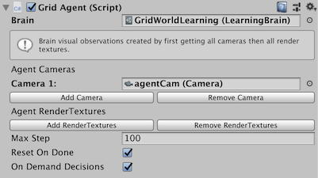
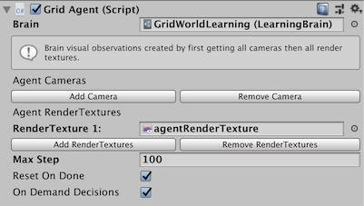
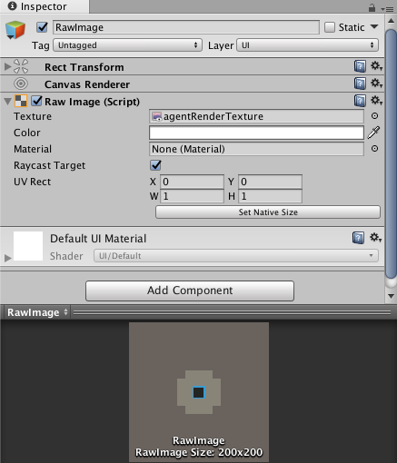
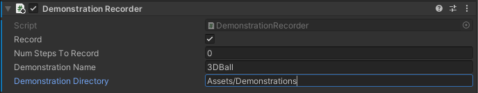

# 에이전트

**목차:**

- [Decisions](#decisions)
- [Observations and Sensors](#observations-and-sensors)
  - [Generating Observations](#generating-observations)
    - [Agent.CollectObservations()](#agentcollectobservations)
    - [Observable Fields and Properties](#observable-fields-and-properties)
    - [ISensor interface and SensorComponents](#isensor-interface-and-sensorcomponents)
  - [Vector Observations](#vector-observations)
    - [One-hot encoding categorical information](#one-hot-encoding-categorical-information)
    - [Normalization](#normalization)
    - [Stacking](#stacking)
    - [Vector Observation Summary & Best Practices](#vector-observation-summary--best-practices)
  - [Visual Observations](#visual-observations)
    - [Visual Observation Summary & Best Practices](#visual-observation-summary--best-practices)
  - [Raycast Observations](#raycast-observations)
    - [RayCast Observation Summary & Best Practices](#raycast-observation-summary--best-practices)
  - [Variable Length Observations](#variable-length-observations)
    - [Variable Length Observation Summary & Best Practices](#variable-length-observation-summary--best-practices)
  - [Goal Signal](#goal-signal)
    - [Goal Signal Summary & Best Practices](#goal-signal-summary--best-practices)
- [Actions and Actuators](#actions-and-actuators)
  - [Continuous Actions](#continuous-actions)
  - [Discrete Actions](#discrete-actions)
    - [Masking Discrete Actions](#masking-discrete-actions)
  - [Actions Summary & Best Practices](#actions-summary--best-practices)
- [Rewards](#rewards)
  - [Examples](#examples)
  - [Rewards Summary & Best Practices](#rewards-summary--best-practices)
- [Agent Properties](#agent-properties)
- [Destroying an Agent](#destroying-an-agent)
- [Defining Multi-agent Scenarios](#defining-multi-agent-scenarios)
  - [Teams for Adversarial Scenarios](#teams-for-adversarial-scenarios)
  - [Groups for Cooperative Scenarios](#groups-for-cooperative-scenarios)
- [Recording Demonstrations](#recording-demonstrations)

에이전트는 환경을 관측하고 이를 통해, 최적의 행동을 결정하고 시행합니다.
에이전트는 유니티 에디터 내에서 `Agent` 클래스를 상속 받음으로써 생성할 수 있습니다. 에이전트를 만들 때 가장 중요한 것은 에이전트의 관측과 보상 함수를 적절하게 설정함으로써 문제를 해결할 수 있도록 하는 것입니다.

에이전트는 관측 후 정책을 업데이트하고, 어떤 행동을 할 지 결정 후 행동합니다. 에이전트 코드는 꼭 액션(Onactionreceived 함수)를 재정의(Override)해야합니다. 예를 들어, [강화학습을 활용하여 에이전트를 학습하기 위해 (train an agent using reinforcement learning)](Learning-Environment-Design.md), 에이전트가 각 방향으로 움직이고, 행동을 할 때 마다 최적의 정책을 찾기 위한 보상을 계산해야 합니다.
`Policy` 정책 클래스는 에이전트 자체의 의사 결정 논리(Logic)를 추상화합니다. 따라서 다양한 에이전트에 동일한 정책을 사용할 수 있습니다. 정책이 결정을 결정하는 것은 에이전트와 연결된 `Behavior Parameters`에 의존합니다.

에이전트 오브젝트의 `Behavior Type`을 `Heuristic Only`로 설정할 경우, 에이전트는 휴리스틱 메소드를 사용합니다. 따라서 키보드와 마우스 같은 입력 시스템을 활용해서 에이전트를 직접 조종하고, 구현한 나만의 환경이 의도한 대로 작동하는지 검증할 수 있습니다.

만약 에이전트에 `Model` 파일이 있을 경우, 행동을 택하기 위한 에이전트의 정책은 학습된 뉴럴 네트워크(neural network)의 정책을 따릅니다.

에이전트를 생성할 때, 기존에 `Monobehaviour (Default)`로 상속된 클래스를 `Agent`를 상속하도록 변경해주어야 합니다.

- `Agent.OnEpisodeBegin()` — 에피소드가 시작할 때 또는 시뮬레이션이 시작될 때 호출 됩니다 (예시 : `Agnet.Endepisode()`) `Agent.CollectObservations(VectorSensor sensor)` — 에이전트가 결정을 요청하는 매 스텝마다 호출됩니다. 에이전트가 환경을 관측하는 하나의 방법입니다.  상세한 내용은 다음의 문서를 참고해주세요. [Generating Observations](#generating-observations)
- `Agent.OnActionReceived()` — 에이전트가 행동을 하도록 요청될 때 마다 호출됩니다. `Agent.Addreward()`를 활용하여 행동을 할 때 마다 가점 또는 감점을 줄 수 있습니다.
- `Agent.Heuristic()` - 에이전트 Behavior Parameters의 `Behavior Type`이 `Heuristic Only`로 설정되어 있을 때, 에이전트의 액션은 `Heuristic()` 방법을 사용합니다.
 __주의__: `Heuristic()` 메소드에서 새로운 실수 배열을 생성할 경우 원래 행동 배열에 사용이 불가능합니다.

구체적인 예시로서 3D_BALL 에이전트 클래스는 다음과 같이 구현됩니다.

- `Agent.OnEpisodeBegin()` — 에이전트 큐브와 공을 초기위치로 초기화합니다.
- `Agent.CollectObservations(VectorSensor sensor)` — 에이전트 큐브의 위치, 공의 속도, 상대 위치 (거리) 정보를 추가합니다. 해당 예시에서 `CollectObservations()`는 `VectorSensor.AddObservation()` 를 호출하기 때문에 에이전트 Behavior Parameter의 `Space Size`는 8입니다.
- `Agent.OnActionReceived()` — 매 스텝마다 에이전트 큐브의 회전 각도가 변화합니다. 이 예시에서는 에이전트가 행동을 할 때 마다 (공이 떨어지지 않을 경우) 가점을 받고 공이 떨어질 경우 감점을 받고 에피소드는 초기화됩니다.
- `Agent.Heuristic()` - 키보드 입력으로 에이전트를 조종할 수 있습니다.

## Decisions

에이전트가 `Agent.RequesetDecision()`을 호출 즉, 결정을 요청할 때마다 관측 - 결정 - 행동 - 보상 사이클은 반복됩니다. 만약 일정 주기로 에이전트가 결정을 요청하고 싶다면 에이전트 오브젝트에 `Decision Requester` 컴포넌트를 추가할 수 있습니다.

일정한 주기로 결정을 요청하는 방법은 일반적으로 물리 기반에 시뮬레이션에서 가장 적절한 방법입니다. 예를 들어서 로봇 시뮬레이션에서는 정교하게 조인트에 가해지는 토크를 조절해야 합니다. 반면에 특정 게임 및 시뮬레이션에서는 이벤트가 특정 이벤트가 발생할 때 마다 결정을 요청하는 경우가 있습니다.

## Observations and Sensors

에이전트가 학습하기 위해서, 관측은 에이전트가 에피소드를 클리어하기 위한 모든 정보를 수집해야 합니다. 충분하고 관련된 정보 없이는 에이전트의 학습 효율이 떨어지거나 학습하지 못할 것 입니다.
 에이전트에게 어떠한 정보가 필요한지 접근하는 합리적인 방법은 해당 문제를 사람이 풀기 위해 어떠한 정보가 필요한지 예상하거나, 해결 방법을 분석하는 것입니다.

### Generating Observations
ML-Agents는 에이전트가 관측을 할 수 있도록 여러 방법을 제공합니다.
  1.  `Agent.CollectObservations()` 메소드를 재정의 하고 관측은 제공된 `VectorSensor`로 넘깁니다.
  2. 에이전트의 Fields 그리고 Properties에 `[Observable]`  특성을 추가합니다.
  3. `ISensor`를 만들기 위해, `SensorCoponent`를 에이전트에 추가하여 `ISensor` 인터페이스를 구현합니다.

#### Agent.CollectObservations()
`Agent.CollectObservations()`은 수치적이고 비시각적인 환경에 가장 적합한 방법입니다. 정책 (Policy) 클래스는 각 에이전트의 `CollectObservations(VectorSensor sensor)`을 호출합니다. 이 기능을 구현하기 위해서는 벡터 관측을 추가함으로써 `VectorSensor.AddObservation`를 호출해야합니다.

`VectorSensor.AddObservation` 메소드는 일반적인 유형의 데이터를 추가하기 위한 여러 오버로드를 제공합니다. 이에 따라서 정수 그리고 논리형을 바로 관측 벡터에 추가할 수 있습니다. 유니티에서 흔히 사용하는 데이터 타입인 `Vector 2`, `Vector 3`, 그리고 `Quaternion` 또한 가능합니다.

다양한 상태 관측 기능의 예시로, [example environments](Learning-Environment-Examples.md) 문서를 참고해주시길 바랍니다. 예를 들어서
3DBall 예제는 아래와 같이 플랫폼의 회전, 공의 상대 거리, 그리고 속도를 상태 관측으로 사용합니다.

```csharp
public GameObject ball;

public override void CollectObservations(VectorSensor sensor)
{
    // Orientation of the cube (2 floats)
    sensor.AddObservation(gameObject.transform.rotation.z);
    sensor.AddObservation(gameObject.transform.rotation.x);
    // Relative position of the ball to the cube (3 floats)
    sensor.AddObservation(ball.transform.position - gameObject.transform.position);
    // Velocity of the ball (3 floats)
    sensor.AddObservation(m_BallRb.velocity);
    // 8 floats total
}
```

3DBall 에이전트가 속도를 관측하지 못하게 할 수 있습니다.
학습이 진행됨에 따라서 에이전트는 균형을 잡는 법을 배우겠지만, 성능은 눈에 띄게 나빠지는 것을 확인할 수 있습니다.

 `VectorSensor.AddObservation()`으로 전달되는 관측은 항상 같은 수, 같은 순서로 정렬된 요소(elements)를 포함해야 합니다. 만약 관측된 숫자가 다를 경우 호출을 사용하여 특정 관측치에 0을 지정하거나, 고정된 서브셋(Subset)에 대한 에이전트의 관측을 제한할 수 있습니다. 예를 들어서 환경에 있는 모든 적을 관측하는 것이 아닌 가장 가까운 5개의 적만을 관측할 수 있습니다.

추가적으로, 에이전트 `Behavior Parameters`를 구성할 때, **Vector Observations > Space Size**의 크기를 `CollectObservations()`와 동일하게 설정해야 합니다.

#### Observable Fields and Properties
에이전트 클래스에 관련된 관측을 필드 또는 속성으로 정의함으로써 관측할 수 있습니다. 예시는 다음과 같습니다. 3DBallHardAgent의 경우 에이전트에 observed 속성을 추가함으로써 관측을 추가할 수 있습니다.

```csharp
using Unity.MLAgents.Sensors.Reflection;

public class Ball3DHardAgent : Agent {

    [Observable(numStackedObservations: 9)]
    Vector3 PositionDelta
    {
        get
        {
            return ball.transform.position - gameObject.transform.position;
        }
    }
}
```
`ObservableAttribute` 은 기본적인 타입인 floats, ints, bools 뿐만 아니라 `Vectro2`, `Vector3`, `Vector4`, `Quaternion` 그리고 열거를 지원합니다.

`ObservableAttribute`은 에이전트 `Behavior Parameters`에 있는 `Observable Attribute Handling`에 의해 제어됩니다. 가능한 값은 다음과 같습니다.

 * **Ignore** (default) - 에이전트에 있는 모든 ObservableAttributes는 무시됩니다. 만약 에이전트에 ObservableAttributes이 없다면 초기화 시간이 빨라집니다.

 * **Exclude Inherited** - 선언된 클래스에 있는 멤버만 검토됩니다. 상속된 멤버는 무시되고 성능과 유연성을 조절합니다.

 * **Examine All** 클래스에 있는 멤버들만 검토됩니다. 이로 인해 시작 시간이 늘어날 수 있습니다.

일반적으로 "Exclude Inherited"로도 충분하지만 에이전트가 Observable 멤버를 가진 다른 에이전트를 상속할 경우 "Examine All"을 사용해야 합니다.

내부적으로, ObservableAttribute는 리플렉션(reflection)을 사용하여 어떠한 에이전트의 멤버가 ObservableAttribute을 갖고 있는지 결정합니다. 또한 리플렉션(reflection)을 사용하여 필드에 접근하거나 런타임시 속성을 호출합니다. 이는 CollectObservation 또는 Isensor를 사용하는 것보다 느릴 수 있지만, 퍼포먼스에 큰 영향을 미치지는 않습니다.

**주의**: `[Observable]`필드 또는 특성은 사용되기 전에 계산됨으로 에이전트에 추가할 때 `Behavior Parameters`의 상태 공간을 조정하지 않아도 됩니다.

#### ISensor interface and SensorComponents
`ISensor` 인터페이스는 일반적으로 고급 사용자를 대상으로 합니다.
`Write()` 방법은 일반적으로 관측을 생성하는데 사용하지만 관측의 모양을 반환하는 등의 다른 방법도 구현해야 합니다.

`Sensor Component` 추상 클래스는 런타임 시 실제 `ISensor`를 생성하기 위해 사용됩니다. 해당 컴보넌트는 에이전트 오브젝트 또는 에이전트의 하위 오브젝트에 연결해야 합니다.

API에는 몇 가지 제공되는 SensorComponents가 있습니다.

- `CameraSensorComponent` -  `Camera`에서 이미지를 관측으로 사용합니다.
- `RenderTextureSensorComponent` - `RenderTexture`를 관측으로 사용합니다.
- `RayPerceptionSensorComponent` - raycasts의 정보를 관측으로 사용합니다.
- `Match3SensorComponent` - [Match-3 game](Integrations-Match3.md)의 보드를 관측으로 사용합니다.
- `GridSensorComponent` - 그리드 모양의 상자 세트를 관측으로 사용합니다.

**주의**: `sensorComponents`를 사용할 때 에이전트 `Behavior Parameter`내의 상태 공간을 조정할 필요는 없습니다.

사용자에게는 추상적이지만 내부적으로, `Agent.CollectObservations`와 `[Observable]` 특성은 관측을 기록하기 위해 ISensors를 사용합니다.

### Vector Observations

`Agent.CollectObservations()` 그리고 `ObservableAttribute`는 실수 목록의 벡터 관측을 생성합니다. `ISensor`는 다차원적인 실수 배열인 벡터 관측과 이미지 관측 모두를 생성할 수 있습니다.

다음은 벡터 관찰을 다룰 때 고려해야 할 몇 가지 추가 사항입니다.

#### One-hot encoding categorical information

열거 타입은 _one-hot_ 스타일로 인코딩되어야 합니다. 즉, 열거의 각 요소에 대해 피쳐 벡터에 요소를 추가합니다. 관찰된 부재를 나타내는 요소를 1로 설정하고 나머지는 0으로 설정합니다. 예를 들어 열거가 검, 방해, 활을 포함하고 에이전트가 활을 관측했을 경우 0, 0, 1 요소가 피쳐 벡터에 추가됩니다.  구현은 다음의 코드를 참고할 수 있습니다.

```csharp
enum ItemType { Sword, Shield, Bow, LastItem }
public override void CollectObservations(VectorSensor sensor)
{
    for (int ci = 0; ci < (int)ItemType.LastItem; ci++)
    {
        sensor.AddObservation((int)currentItem == ci ? 1.0f : 0.0f);
    }
}
```

`VectorSensor`는 두 가지 인자 함수로써 `AddOneHotObservation()`을 _one-hot_ 스타일의 관측으로 제공합니다. 다음의 예제는 이전 예제와 동일합니다.

```csharp
enum ItemType { Sword, Shield, Bow, LastItem }
const int NUM_ITEM_TYPES = (int)ItemType.LastItem;

public override void CollectObservations(VectorSensor sensor)
{
    // The first argument is the selection index; the second is the
    // number of possibilities
    sensor.AddOneHotObservation((int)currentItem, NUM_ITEM_TYPES);
}
```

`ObservableAttribute` 열거형을 지원합니다. 이 경우 `LastItem` 는 필요하지 않습니다.
```csharp
enum ItemType { Sword, Shield, Bow }

public class HeroAgent : Agent
{
    [Observable]
    ItemType m_CurrentItem;
}
```

#### Normalization

최고의 학습을 위해, 특정 벡터 구간을 [-1, +1] 또는 [0, 1]로 정규화 하는 것이 좋습니다. 값을 정규화 할 때, PPO 뉴럴 네트워크는 보상의 수렴 속도를 증가시킬 수 있습니다. 이러한 값으로 정규화를 하는 것은 필수적이지는 않지만, 뉴럴 네트워크를 사용할 때 고려할만 합니다. 관측 컨포넌트의 범위 변동이 클수록, 학습에 영향을 미칠 가능성이 높아집니다.

[0, 1] 의 값으로 정규화 할 때, 다음의 공식을 사용할 수 있습니다.

```csharp
normalizedValue = (currentValue - minValue)/(maxValue - minValue)
```

:warning:벡터의 경우 위의 공식을 각 성분 (x,y 그리고 z)에 적용해야 합니다. 이는 유니티 에디터 상의 `Vector3.normalized` 또는 `Vector3.Normalize()` 와 같지 않습니다.

회전과 각도 또한 정규화할 수 있습니다. 각도의 경우 0에서 360도 까지, 다음의 공식을 따를 수 있습니다.

```csharp
Quaternion rotation = transform.rotation;
Vector3 normalized = rotation.eulerAngles / 180.0f - Vector3.one;  // [-1,1]
Vector3 normalized = rotation.eulerAngles / 360.0f;  // [0,1]
```
각도의 경우 [0,360] 범위를 초과할 수 있습니다. 각도를 줄이거나 또는 값이 중요할 경우, 정규화 범위의 최대 값을 증가시킬 수 있습니다.

#### Stacking

누적 (Stacking)이란 더 큰 관측의 일부로 이전 단계의 관찰을 반복하는 것을 말합니다. 예를 들어 4개의 스텝에서 다음과 같은 관측을 한 에이전트를 고려하겠습니다.
```
step 1: [0.1]
step 2: [0.2]
step 3: [0.3]
step 4: [0.4]
```

만약 stack size를 3으로 설정할 경우, 에이전트는 다음과 같이 관측합니다.

```csharp
step 1: [0.1, 0.0, 0.0]
step 2: [0.2, 0.1, 0.0]
step 3: [0.3, 0.2, 0.1]
step 4: [0.4, 0.3, 0.2]
```
(step 1에서 이전 관측이 없음으로 padding 되어 0.0 으로 표기됩니다)
이 방법은 복잡성 또는 RNN을 추가하지 않고 에이전트에 제한된 "메모리"를 주는 간단한 방법입니다.

관측을 생성할 때 누적(stacking)을 사용할 수 있는 여러 방법입니다.
* 에이전트 `Behavior Parameters`에서 Stacked Vectors" 값을 1보다 크게 설정합니다.
* ObservableAttribute, `numStackedObservations` 파라미터를 다음 예시와 같이 설정합니다. e.g. `[Observable(numStackedObservations: 2)]`.
* `ISensor` 에서, `StackingSensor` (=`ISensor`)로 래핑(Wrapping)합니다. 일반적으로 이 방법은 `SensorComponent`의 `CreateSensor()` 방법에서 사용할 수 있습니다.

#### Vector Observation Summary & Best Practices

- 벡터 관측은 에이전트가 최적 결정을 내리기 위한 모든 관련된 정보면서 이상적으로 극단적(extraneous)이지 않은 정보를 포함해야 합니다.
- 벡터 관측을 기억하거나 비교하는 경우 RNN 또는 `Behavior Parameter`에 있는 `Stacked Vector`를 사용해야 합니다.
- 검, 방패, 활과 같이 카테고리화 된 변수는 One-Hot 으로 인코드 되어야 합니다. (예시 `3` -> `0, 0, 1`). 이러한 방법은 `VectorSensor`에 `AddOneHotObservation()`을 호출 하거나 `[Observable]`을 enum filed 또는 Agent에 사용해서 할 수 있습니다.
- 일반적으로, 모든 입력 값은 [0~1] 또는 [-1~1] 사이의 값으로 정규화 해야 합니다. 예를 들어서 에이전트의 `x` 포지션 정보는   `VectorSensor.AddObservation(transform.position.x);` 보다 다음과 같이 작성하는 것이 좋습니다.
  `VectorSensor.AddObservation(transform.position.x / maxValue);`
- 관련 GameObjects의 위치 정보는 가능한 상대 좌표로 인코딩해야 합니다. 이것은 에이전트의 위치와 관련된 경우가 많습니다.

### Visual Observations

에이전트에 `CameraSensor` 또는 `RenderTextureSensor` 컴포넌트를 추가해서 시각적 관측을 추가할 수 있습니다. 이렇게 추가된 이미지 정보는 3D 텐서로 변형되어 에이전트 정책의 CNN 뉴럴 네트워크 모델에 입력됩니다.
CNNs에 대한 내용은 다음을 참고해주시길 바랍니다. [this guide](http://cs231n.github.io/convolutional-networks/).
이를 통해 에이전트는 관측 이미지의 공간 규칙성을 학습할 수 있습니다. 에이전트가 시각적 관측과 벡터 관측을 동시에 사용할 수 있습니다.

시각적 관측을 사용하는 에이전트는 숫자로 표현하기 힘든 임의의 복잡한 상태를 관측할 수 있습니다. 하지만 일반적으로 학습 속도가 느리고 효율적이지 않습니다. 그리고 때때로 벡터 관측과 비교했을 때 학습에 성공적이지 않을 수 있습니다.  이와 같이 시간적 관측은 벡터 또는 ray-cast 센서로 관측을 정의하기 힘들 경우 사용하는 것이 좋습니다.

에이전트에 시각적 관측을 수가하기 위해, `camera sensor` 또는 `RenderTextures Sensor` 컴포넌트를 에이전트에 추가해주시길 바랍니다.
이 후 추가하고자 하는 Camera 또는 Render Texture를 필드에 드래그해주시길 바랍니다. 하나 이상의 Camera 또는 Render Texture 그리고 둘을 같이 사용할 수 있습니다. 각각의 시각적 관측에서, 가로와 세로 이미지 (in pixels)를 설정하고 관측의 색상과 흑백 여부를 설정할 수 있습니다.



또는



같은 정책을 사용하는 에이전트는 동일한 개수의 시각적 관측을 사용하고 동일한 해상도 그리고 흑백 여부를 설정해야 합니다. 추가적으로 에이전트의 센서 컴포넌트는 고유한 이름을 설정해서 결정적으로 분류할 수 있게 해야 합니다.
(에이전트 마다 이름은 고유해야 하지만 다수의 에이전트는 동일한 이름의 센서 컴포넌트를 사용할 수 있습니다)

시각적 관측 또한 누적(stacking)을 지원합니다. `Observation Stacks` 값을 1보다 크게 설정할 경우 사용할 수 있습니다.

`RenderTexture` 시각적 관측을 사용할 때, 디버깅을 위한 간단한 기능은 `Canvas`를 추가하고 `Raw Image`와 텍스쳐 세트를 에이전트에 추가해 게임 스크린에 에이전트 관측을 렌더링하는 것입니다.



 [GridWorld environment](Learning-Environment-Examples.md#gridworld) 환경은 RenderTexture를 디버깅 그리고 관측으로 사용하는 예제 환경입니다.
RenderTexture를 업데이트 하기 위해, Camera는 매 결정 단계마다 Camera 렌더링을 요구해야 합니다. 하지만 Camera를 관찰로 직접 사용하는 경우 에이전트는 이러한 과정을 자동으로 수행합니다.


#### Visual Observation Summary & Best Practices

- 시각적 관측을 수집하기 위해, `CameraSensor` 또는 `RenderTextureSensor`컴포넌트를 에이전트 오브젝트에 추가해주시길 바랍니다.
- 시각적 관측은 일반적으로 벡터 관측으로는 충분하지 않을 경우 사용해야 합니다.
- 이미지 크기는 의사 결정에 필요한 세부사항을 잃지 않고 가능한 작게 유지해야 합니다.
- 색상 정보가 필요하지 않은 경우 이미지는 흑백으로 사용해야 합니다.

### Raycast Observations

Raycasts는 에이전트에 관측을 제공하는 또 다른 방법입니다. 이는 `RayPerceptionSensorComponent3D` (또는
`RayPerceptionSensorComponent2D`) 컴포넌트를 에이전트 오브젝트에 추가함으로써 사용할 수 있습니다.

관측하는 동안, 몇몇의 광선 (또는 설정에 따라 구) 는 물리 세계에 투사되고, 부딪힌 오브젝트가 생성되는 벡터 관측을 결정합니다.


센서 컴포넌트는 몇가지 셋팅을 갖고 있습니다:

- _Detectable Tags_ 에이전트가 구분하는 오브젝트 유형에 대응하는 문자열의 목록입니다. 예를 들어서, WallJump 환경에서 "wall", "goal", 그리고 "block"을 감지해야하는 오브젝트의 목록으로 설정하였습니다.
- _Rays Per Direction_ 투사할 광선의 개수를 결정합니다. 하나의 ray는 정면 방향으로 투사됩니다. 그리고 이 값이 커질 경우 광선은 측면으로 투사됩니다.
- _Max Ray Degrees_ 바깥 쪽 광선의 각도입니다. 90도는 에이전트의 좌측과 우측에 해당됩니다.
- _Sphere Cast Radius_ 투사될 구의 크기를 결정합니다. 만약 0으로 설정할 경우 구가 아닌 광선이 사용됩니다. 복잡한 환경에서는 구 형태보다는 광선의 형태가 보다 효율적입니다.
- _Ray Length_ 광선의 길이입니다.
- _Ray Layer Mask_ 광선을 투사할 때 특정한 타입의 오브젝트를 무시하기 위해 사용합니다.[LayerMask](https://docs.unity3d.com/ScriptReference/LayerMask.html)
- _Observation Stacks_ 이전 투시 결과를 누적(Stacking)할 때 사용합니다. `Behavior Parameters`에 있는 "Stacked Vectors" 와는 다른 설정입니다.
- _Start Vertical Offset_ (3D only) 광선 시작 점의 수직 오프셋입니다.
- _End Vertical Offset_ (3D only) 광선 종료 점의 수직 오프셋입니다.

위에 있는 예시 이미지에서, 에이전트는 2개의 `RayPerceptionSensorComponent3D`를 갖고 있습니다.
두 센서는 모두 3방향의 센서와 90도의 각도를 사용합니다. 둘 중 하나의 센서는 수직 오프셋을 사용해서 에이전트는 점프를 해서 오브젝트를 넘을지 넘지 않을 지 구별할 수 있습니다.

관측에 생성되는 전체 크기는 다음과 같습니다.

```
(Observation Stacks) * (1 + 2 * Rays Per Direction) * (Num Detectable Tags + 2)
```

따라서 사용하는 데이터의 크기를 줄이기 위해 광선과 태그의 개수는 가능한 작게 설정되어야 합니다. 이는 `Behavior Parameter`에 정의 된 상태 공간(state size) 과는 다른 개념입니다. 따라서 위의 공식을 사용해서 상태 공간(state size)를 계산할 필요는 없습니다.

#### RayCast Observation Summary & Best Practices

- 사용을 위해 `RayPerceptionSensorComponent3D` 또는 `RayPerceptionSensorComponent2D` 컴포넌트를 에이전트 오브젝트에 추가해주시길 바랍니다.
- 이 방법은 전달 해야하는 이미지 정보가 없고 관련된 공간 정보가 있을 때 효율적으로 사용할 수 있습니다.
- 학습의 안정성과 에이전트의 성능을 위해 가능한 적은 광선과 태그를 사용하여 학습을 진행하시길 바랍니다.

### Grid Observations
Grid 기반의 관측은 이미지 관측의 2D 공간 표현 이점과 RayCast 관측의 유용성을 합친 방법입니다. 센서는 그리드 모양의 상자를 사용하고 에이전트 주위에 Top-Down 2D 뷰를 제공합니다. 이 방법은 에이전트 오브젝트에 `GridSensorComponent`를 추가함으로써 사용이 가능합니다.

관측 동안, 센서는 각 셀의 검측 가능한 오브젝트의 존재를 탐지하고 One-Hot 표현으로 인코딩 합니다. 각 셀에서 수집된 정보는 3D 텐서 관찰로 형성되고 시각적 관측과 같이 에이전트 정책의 CNN 뉴럴 네트워크 모델로 입력됩니다.


센서 컴포넌트는 다음의 셋팅을 포함합니다:
- _Cell Scale_ 그리드에 있는 셀의 크기.
- _Grid Size_ 그리드의 양쪽에 있는 셀 수.
- _Agent Game Object_ 그리드 센서를 포함하는 에이전트입니다. 에이전트가 자기 자신을 감지하지 못하도록, 에이전트와 동일한 태그를 가진 개체를 명확하게 하기 위해 사용됩니다.
- _Rotate With Agent_ 그리드가 에이전트와 함께 회전하는지 여부 입니다.
- _Detectable Tags_ 에이전트가 측정할 오브젝트 문자열의 목록입니다.
- _Collider Mask_ [LayerMask](https://docs.unity3d.com/ScriptReference/LayerMask.html) 을 사용해서 특정 타입의 오브젝트를 탐지하지 않고 무시할 수 있습니다.
- _Initial Collider Buffer Size_  각 셀의 비할당 물리 호출에 사용되는 콜라이더 버퍼의 초기 사이즈입니다.
- _Max Collider Buffer Size_ 각 셀의 비할당 물리 호출에 사용되는 콜라이더 버퍼의 최대 사이즈입니다.

각각의 그리드 셀로 탐지된 물체는 One-Hot 인코딩을 사용합니다.

생성된 관측의 크기는 다음과 같습니다.

```
GridSize.x * GridSize.z * Num Detectable Tags
```

따라서 탐지가능한 태그와 그리드의 크기는 데이터의 크기를 줄이기 위해 최대한 작게 설정해야 합니다. 이를 통해 관찰의 세분화와 교육 속도 간의 균형을 맞출 수 있습니다.

그리드 센서가 탐지하는 관측에 보다 다양성을 추가하기 위해, `GridSensorComponent`와 기본 `GridSensorBase` 도 탐지된 개체에서 커스텀한 관측을 수집하기 위해 재정의 하는 기능도 제공합니다. 자세한 내용은 다음의 문서를 참고해주시길 바랍니다.
[extending grid Sensors](https://github.com/Unity-Technologies/ml-agents/blob/release_19_docs/com.unity.ml-agents.extensions/Documentation~/CustomGridSensors.md)

__Note__: `GridSensor`는 2D가 아닌 3D 환경에서만 작동합니다.

#### Grid Observation Summary & Best Practices

- `GridSensorComponent` 컴포넌트를 추가합니다.
- 이 관측 방법은 2D 표현에서 가장 잘 포착할 수 있는 비시각적 공간 정보가 있을 때 가장 적합합니다.
- 학습의 안정성 및 에이전트의 성능을 위해 가능한 작은 그리드 크기와 태그를 사용합니다.
-  `GridSensor` 를 2D 환경에 사용하지 않습니다.

### Variable Length Observations

에이전트는 `BufferSensor`를 활용하여 다양한 수의 게임 오브젝트로 부터 관측을 수집할 수 있습니다. 이를 위해서 에이전트에 `BufferSensorComponent`를 추가해주시길 바랍니다.
`BufferSensor`는 많은 적과 발사체와 같은 오브젝트에 집중해야 하는 경우 효율적으로 사용할 수 있습니다. 트레이너 측면에서는 어텐션 모듈을 이용해 `BufferSensor`를 처리합니다. [여기](https://arxiv.org/abs/1706.03762)에서 보다 상세한 정보를 얻을 수 있습니다.

다양한 길이의 관측을 이용하는 것은 학습 그리고 추론 측면에서 플랫(flat)한 벡터 관측 보다 느립니다. 하지만 어텐션 메커니즘은 [Sorter](Learning-Environment-Examples.md#sorter)환경과 같이 비교 추론을 필요로 하는 문제를 해결할 수 있도록 도와줍니다.


네트워크의 구조는 관측의 형태를 알아야 하기 때문에 `BufferSensor`를 사용하는 경우에도 최대 독립체(entities)의 개수를 설정해주어야 합니다.  만약 최대 개수보다 적은 독립체과 관측 될 경우, 관측은 0으로 패딩되고 이러한 값들은 무시될 것 입니다. 어텐션 레이어는 엔티티의 순서에 따라 달라지지 않기 때문에 `BufferSensor`로 입력하기 전에 정렬할 필요가 없습니다.

`BufferSensorComponent`는 2가지 인수를 갖고 있습니다:
 - `Observation Size` : 각 독립체에 표시되는 수 입니다. 이 숫자는 고정되어 있으며 모든 독립체는 독일한 표시 수를 가져야 합니다. 예를 들어 `BufferSensor`에 넣을 독립체가 위치와 속도 정보를 가지고 있다면 관측의 크기는 6이여야 합니다.
 - `Maximum Number of Entities` : `BufferSensor`가 수집할 수 있는 독립체의 최대 수 입니다.

`BufferSensorComponent`에 독립체 관찰을 추가하려면, Agents.CollectObservation()에 관측의 크기 인자와 함께 `BufferSensorComponent.AppendObservation()` 를 추가해야 합니다.

__Note__: 최근에, `BufferSensor`로 입력되는 관측은 정규화되지 않습니다. 따라서 관측을 -1 그리고 1 사이로 정규화 하시길 바랍니다.

#### Variable Length Observation Summary & Best Practices
 - `BufferSensorComponent` 컴포넌트를 추가합니다.
 - Agent.CollectObservations() 함수내에서 `BufferSensorComponent.AppendObservation()`  를 호출하고 독립체의 관측을 `BufferSensor`에 추가합니다.
 - 독립체 관측을 `BufferSensor`에 입력하기 전에 정규화 합니다.

### Goal Signal

에이전트가 "목표 신호"로 취급되는 관찰 결과를 수집할 수 있습니다. 목표 신호는 에이전트 정책을 조건화 하기 위해 사용합니다. 예를 들어서 목표가 바뀔 경우 정책도 변경될 것 입니다. 모든 관측은 정책에 어느정도 영향을 줍니다. 그러나 목표 신호를 구체화함으로써, 이 조건을 에이전트에게 더 중요하게 만들 수 있습니다. 이 기능은 에이전트가 다른 문제의 학습 내용을 재사용하여 더 잘 일반화 할 수 있도록 학습하기 때문에 유사한 다른 문제의 해결 방법을 배우는 설정에서 사용할 수 있습니다.

유니티에서, `VectorSensorComponet` 또는 `CameraSensorComponent`를 에이전트에 추가하고 `Goal Signal`을 `Observation Type`으로 설정함으로써`VectorSensor` 또는 `CameraSensor`를 목표로 구체화 할 수 있습니다.

트레이너 측면에서, 정책을 조건화 할 수 있는 두 가지 방법이 있습니다. 이 설정은 [conditioning_type parameter](Training-Configuration-File.md#common-trainer-configurations)에 의해 결정됩니다.
만약 `hyper` (기본 값)으로 설정할 경우 [HyperNetwork](https://arxiv.org/pdf/1609.09106.pdf)는 목표 관찰을 입력으로 사용하여 정책의 가중치 일부를 생성하는데 사용됩니다. HyperNetwork를 사용하려면 많은 계산을 필요함으로 이를 완화하기 위해서 가능한 적은 Hidden Unit을 사용하는 것이 좋습니다. 만약 목표 신호를 `none` 으로 설정할 경우 일반적인 관측으로 고려됩니다. 목표 신호를 사용하는 예시로 [GridWorld example](Learning-Environment-Examples.md#gridworld) 를 참고하시길 바랍니다.

#### Goal Signal Summary & Best Practices
 - `VectorSensorComponent` 또는 `CameraSensorComponent`를 에이전트에 추가하고 Observation Type을 Goal로 설정합니다.
 - 하이퍼 파라미터 (.yaml) 파일에 conditioining_type을 설정합니다.
 - HyperNetwork를 사용할 때 hidden unit의 개수를 최대한 적게 설정합니다.

## Actions and Actuators

행동은 에이전트가 수행하는 정책의 지시입니다. Academy가 IActionReciever를 호출할 때 액션은 ActionBuffers 파라미터로서 IActionReceiver(에이전트 또는 IActuator)에 전달됩니다. **연속적인** 그리고 **이산적인** 행동이 지원됩니다.

정책 및 학습 알고리즘 모두 행동 값 자체의 의미에 대해 아무것도 알지 못합니다. 학습 알고리즘은 단순히 행동 목록에 있는 다른 값을 시도하고 누적된 보상에 대한 결과를 관찰합니다. 따라서 오직 `OnActionReceived()` 함수에서만 에이전트의 행동이 정의됩니다.

예를 들어서, 에이전트를 2차원으로 이동할 수 있도록 디자인 했을 때, 연속적인 행동, 이산적인 행동 또는 두 행동을 동시에 사용할 수 있습니다. 연속적인 행동을 사용할 경우, 행동 크기를 2개 (각 차원당 1개)로 설정하면, 에이전트 정책은 두 개의 소수 값을 출력합니다.
이산적인 행동에서 에이전트의 행동을 정의 할 경우, 2가지 예시가 있습니다.
첫째, 크기가 4인 1개의 브랜치를 작성하여 반환되는 0~3의 각각의 수를 각 이동 방향에 맞춰서 사용하거나, 크기가 2인 브랜치를 2개 생성하여 수직 그리고 수평 방향의 이동을 정의할 수 있습니다.

연속적인 행동과 이산적인 행동을 조합하여 사용하는 것 또한 가능합니다. 예를 들어 수평 이동의 경우 연속적인 행동을 수직 이동의 경우 이산적인 행동을 사용할 수 있습니다.

에이전트의 행동을 프로그래밍할 때 `Heuristic` 방법을 사용하여 의도하는 방향으로 구현이 되었는지 테스트할 수 있습니다.

### Continuous Actions

에이전트의 정책이 **연속적인** 행동을 갖고 있을 경우, 배열에 포함된 개별 값은 사용자가 해당 값에 부여한 모든 의미를 가집니다. 예를 들어 배열 내의 요소를 에이전트의 속도로 할당할 경우 학습은 에이전트가 속도를 제어하도록 학습합니다.

[3DBall example](Learning-Environment-Examples.md#3dball-3d-balance-ball) 환경은 2개의 연속적인 행동을 사용합니다.


These control values are applied as rotation to the cube:

```csharp
    public override void OnActionReceived(ActionBuffers actionBuffers)
    {
        var actionZ = 2f * Mathf.Clamp(actionBuffers.ContinuousActions[0], -1f, 1f);
        var actionX = 2f * Mathf.Clamp(actionBuffers.ContinuousActions[1], -1f, 1f);

        gameObject.transform.Rotate(new Vector3(0, 0, 1), actionZ);
        gameObject.transform.Rotate(new Vector3(1, 0, 0), actionX);
    }
```

기본적으로 제공되는 PPO 알고리즘은 `ActionBuffers.ContinuousActions` 값을 자동으로 [-1, 1] 범위로 클램핑(Clamping) 합니다. 서드 파티 알고리즘을 사용할 경우에는 직접 클램핑(Clamping) 하는 것이 좋습니다.

### Discrete Actions

에이전트의 정책이 **이산적인** 행동을 사용할 경우,  `Branches`는  각 정수 배열로, 각 값은 각 Branch에 가능한 개수와 일치합니다.
예를 들어 평면 내에서 이동하고 점프는 에이전트를 원하는 경우 에이전트의 행동을 2개의 브랜치 (이동용, 점프용)으로 정의 할 수 있습니다. 이 때 에이전트는 이동과 점프를 동시에 할 수 있습니다.

아래의 코드는 첫 번째 브랜치의 크기를 5로 (정지, 좌측 이동, 우측 이동, 전진, 후진) 그리고 두번째 브랜치를 (정지, 점프)로 구현하였습니다.

```csharp
// Get the action index for movement
int movement = actionBuffers.DiscreteActions[0];
// Get the action index for jumping
int jump = actionBuffers.DiscreteActions[1];

// Look up the index in the movement action list:
if (movement == 1) { directionX = -1; }
if (movement == 2) { directionX = 1; }
if (movement == 3) { directionZ = -1; }
if (movement == 4) { directionZ = 1; }
// Look up the index in the jump action list:
if (jump == 1 && IsGrounded()) { directionY = 1; }

// Apply the action results to move the Agent
gameObject.GetComponent<Rigidbody>().AddForce(
    new Vector3(
        directionX * 40f, directionY * 300f, directionZ * 40f));
```

#### Masking Discrete Actions

이산적인 행동을 사용할 때 다음 단계에서 특정 행동을 할 수 없도록 설정할 수 있습니다. 에이전트가 뉴럴 네트워크에 의해 제어될 때 에이전트는 특정한 행동을 할 수 없습니다. 에이전트가 `Heuristic` 으로 제어 될 때도 특정 행동을 마스킹할 수 있습니다. 행동을 제한하기 위해서 Virtual 방법의 `Agent.WriteDiscreteActionMask()`를 재정의 하고, 제공되는 `IDiscreteActionMask`에 `SetActionEnabled()`를 호출합니다.

```csharp
public override void WriteDiscreteActionMask(IDiscreteActionMask actionMask)
{
    actionMask.SetActionEnabled(branch, actionIndex, isEnabled);
}
```

예를 들어서, 총 2개의 브랜치를 가진 에이전트가 있습니다. 첫째 브랜치의 크기는 4로 다음과 같은 4가지의 행동이 가능합니다 (정지, 점프, 사격, 무기 교체)
이 때 다음과 같은 코드로 에이전트는 점프 그리고 사격 행동을 제한(Masking)할 수 있습니다.

```csharp
actionMask.SetActionEnabled(0, 1, false);
actionMask.SetActionEnabled(0, 2, false);
```

참고:

- `SetActionEnabled`를 여러번 호출해서 여러 브랜치에 마스킹을 할 수 있습니다.
- 각각의 스텝에서, 기본적으로 행동의 상태는 초기화 되고 활성화됩니다.
- 브랜치에 있는 모든 행동을 마스킹할 수 없습니다.
- 연속적인 행동의 경우 마스킹 할 수 없습니다.


### IActuator interface and ActuatorComponents
Actuator API를 이용하면 에이전트 및 컴포넌트에서 동작을 추상활 할 수 있습니다 (ISensor API와 유사) `IActuator` 인터페이스와 `Agent` 클래스는 모두 `IActionReceiver` 인터페이스를 구현하여 현재의 `Agent.OnActionReceived`와의 하위 호환성을 확보합니다. 즉, 'IActuator' API를 사용할 때까지 코드를 변경할 필요가 없습니다.

`Isensor` 인터페이스와 마찬가지로 `IActuator` 인터페이스는 고급 사용자자를 대상으로 합니다.

Actuator Component 추상 클래스는 실행 시 실제 'IActuator'를 만들기 위해 사용됩니다.  에이전트와 동일한 게임오브젝트 또는 하위 오브젝트에 연결해야 합니다. 런타임에 예상되지 않은 할당을 방지하기 위해  `Agent.Initialize` 중 Actuator 및 모든 데이터 구조는 초기화 됩니다.

`IActuator` 구현과 관련된 예제로 `Basic` 예제 환경을 확인할 수 있습니다.
**참고**: `IActuator`와 `ActuatorComponents`를 사용할 때 `Behavior Parameters`를 조정할 필요는 없습니다.

사용자에게는 추상적이지만 내부적으로, `Agent.OnActionRecevied`는 에이전트에 행동을 전송하기 위해`IActuator`를 사용합니다.


### Actions Summary & Best Practices

- 에이전트는 `이산적인(Discrete)` 그리고/또는 `연속적인(Continuous)` 행동을 할 수 있습니다.
- 이산적인 행동(Discrete Actions)은 여러 행동 가지(Branches)를 포함할 수 있습니다. 그리고 마스크(mask)을 통해 특정한 행동을 택하지 않도록 설정할 수 있습니다.
- 일반적으로, 가능한 행동의 개수가 적을수록 학습의 난이도가 감소합니다.
- 연속적인 행동과 이산적인 행동의 크기를 크지않게 알맞게 설정해주시길 바랍니다. 크기가 일치하지 않을 경우 추론시 모델의 성능이 하락(간섭)할 수 있습니다.
- 에이전트가 연속적인 행동을 할 경우 `Mathf.clip`을 활용해서 [-1, 1] 사이의 값으로 클립(clip) 해주시길 바랍니다. PPO 알고리즘을 사용할 경우 이러한 클립을 자동으로 진행합니다.

## 보상

강화학습에서, 보상은 에이전트가 의도한 행동을 했는지, 아닌지에 대한 신호입니다.  PPO 알고리즘은 시간에 따라 에이전트가 보상을 가장 많이 받는 행동을 최적화하면서 작동합니다.
보상 함수의 설계가 좋을 수록, 에이전트는 더 빨리 학습하게 됩니다.

**주의:** 보상은 시연(Inference) 또는 모방(Imitation) 학습의 경우 사용되지 않습니다.

간단한 보상함수를 구현하신 후 필요에 따라서 조금씩 추가하시는 것을 추천드립니다. 일반적으로 행동에 따른 보상 보다 결과에 따른 보상 메커니즘을 추천드립니다. Heurisitc 방법으로 직접 컨트롤 함으로써 구현된 보상함수를 테스트할 수 있습니다.

`AddReward()`와 `SetReward()`를 호출해서 에이전트에 보상을 할당할 수 있습니다. 각 결정에 따라 받는 보상은 -1과 1 사이여야 합니다. 에이전트가 새로운 결정을 받으면 `reward` 값은 0으로 초기화 됩니다. 단일 결정에 여러 `AddReward`가 호출될 경우 이전 결정이 얼마나 좋았는지, 평가하기 위해 보상은 합산됩니다. `SetReward`는 이전 결정 이 후 에이전트에 주어진 모든 보상을 덮어씁니다.

### Examples

유니티 ML-Agents [example environments](Learning-Environment-Examples.md)의 `OnActionReceived()` 함수 활용을 참고하여, 어떻게 보상을 할당하는지 확인할 수 있습니다.

[GridWorld example](Learning-Environment-Examples.md#gridworld)에 있는 Grid 에이전트는 매우 간단한 보상 함수를 사용합니다.

```csharp
Collider[] hitObjects = Physics.OverlapBox(trueAgent.transform.position,
                                           new Vector3(0.3f, 0.3f, 0.3f));
if (hitObjects.Where(col => col.gameObject.tag == "goal").ToArray().Length == 1)
{
    AddReward(1.0f);
    EndEpisode();
}
else if (hitObjects.Where(col => col.gameObject.tag == "pit").ToArray().Length == 1)
{
    AddReward(-1f);
    EndEpisode();
}
```
목적지에 도달할 경우 에이전트는 양의 보상을 받고, pit(의도하지 않은 공간) 에 떨어질 경우 음의 보상을 받습니다. 이 외에는 보상을 받지 못합니다. 이러한 보상함수는 _sparse_ 보상 환경의 예시로 즉, 에이전트는 학습을 위해 많은 탐험을 해야합니다.

대조적으로, [Area example](Learning-Environment-Examples.md#push-block) 에 있는 Area 에이전트는 매 스텝마다 작은 음의 보상 (-0.005)을 받습니다. 보상을 최대화 하기 위해서, 에이전트는 가능한 빨리 목적지에 도착해야 합니다.

```csharp
AddReward( -0.005f);
MoveAgent(act);

if (gameObject.transform.position.y < 0.0f ||
    Mathf.Abs(gameObject.transform.position.x - area.transform.position.x) > 8f ||
    Mathf.Abs(gameObject.transform.position.z + 5 - area.transform.position.z) > 8)
{
    AddReward(-1f);
    EndEpisode();
}
```

에이전트는 환경의 밖(Playing Surface)으로 떨어질 경우 큰 음의 보상을 받습니다.

[3DBall](Learning-Environment-Examples.md#3dball-3d-balance-ball) 예제에 있는 3DBall 에이전트도 비슷한 보상함수를 사용합니다. 하지만 행동을 할 때 마다 음의 보상을 주는 것이 아닌 양의 보상을 수여합니다. 에이전트는 공을 머리위에 오래 유지함으로써 보상을 최대화할 수 있습니다.

```csharp

SetReward(0.1f);

// When ball falls mark Agent as finished and give a negative penalty
if ((ball.transform.position.y - gameObject.transform.position.y) < -2f ||
    Mathf.Abs(ball.transform.position.x - gameObject.transform.position.x) > 3f ||
    Mathf.Abs(ball.transform.position.z - gameObject.transform.position.z) > 3f)
{
    SetReward(-1f);
    EndEpisode();

}
```

3DBall 에이전트는 공을 머리 위에서 떨어트릴 경우 음의 보상을 받습니다.
환경을 초기화 해야하는 특정 조건을 만족했을 때  `EndEpsiode()` 함수를 호출해서 환경을 초기화 하는 것을 권장드립니다. 이는 `Max Step`과는 독립적으로 사용됩니다.

### Rewards Summary & Best Practices

-  각각의 보상을 축적하기 위해`AddReward()`를 사용할 수 있습니다. `SetReward()` 함수를 호출 할 경우 이전 보상은 초기화됩니다.
- 학습의 안정성을 위해 전형적으로 에이전트가 수령하는 보상의 절대값은 1.0 보다 크면 안됩니다.
- 음의 보상 보다 양의 보상을 부여하는 것이 에이전트 학습 측면에서 효과적입니다. 너무 많은 음의 보상은 에이전트가 학습을 하지 못하는 결과를 낳을 수 있습니다. 이동 문제에서 전진을 위한 작은 양의 보상 (+0.1)이 사용됩니다.
- 에이전트가 문제를 빠르게 해결하기를 원한다면, 매 스텝마다 -0.05의 감점을 주는 것이 도움이 될 수 있습니다. 이 경우 문제를 해결했을 때 `EndEpisode`를 호출해야 합니다.

## Agent Properties


- `Behavior Parameters` - 에이전트가 받을 정책을 지시하는 파라미터
  - `Behavior Name` - Behavior 식별자. 같은 이름의 Behavior Name을 사용할 경우 같은 정책을 학습합니다.
  - `Vector Observation`
    - `Space Size` - 에이전트 벡터 관측의 길이입니다.
    - `Stacked Vectors` - 이전 벡터 관측의 수, 누적되어서 의사결정 (Decision Making)을 위해 사용됩니다. 결과적으로 정책에 전달되는 벡터 관찰의 크기는 다음과 같이 계산됩니다. _Space Size_ x _Stacked Vectors_.
  - `Actions`
    - `Continuous Actions` - 에이전트가 수행할 수 있는 연속적 행동의 수 입니다.
    - `Discrete Branches` - 여러 개의 정수를 동시에 정의하는 정수의 배열입니다. `Discrete Branches` 배열에 있는 값은 각각의 행동 가지(action Branch)에서 가능한 Discrete Branches 수와 대응해야 합니다.
  - `Model` - 학습 후 얻어진 onnx 모델 입니다. 추론을 위해 사용합니다.
  - `Inference Device` - 모델을 추론 할 때 사용할 장치입니다. CPU와 GPU 중 선택할 수 있습니다.
  - `Behavior Type` - 에이전트가 학습을 진행할 것 인지, 추론을 진행할 것 인지 아니면 직접 플레이(Heuristic)을 할 것인지 설정할 수 있습니다.
    - `Default` - 파이썬 트레이너와 연결되어 있을 경우 학습을 진행하고 그렇지 않을 경우 추론을 합니다.
    - `Heuristic Only` - `Heuristic()` 방법을 사용하여 에이전트를 직접 조종할 수 있습니다.
    - `Inference Only` - 에이전트는 추론을 진행합니다.
  - `Team ID` - Self-play를 의해 팀 아이디를 정의합니다.
  - `Use Child Sensors` - 에이전트 오브젝트 하위(자식) 오브젝트에 있는 센서 컴포넌트를 사용할지 결정합니다. 이 옵션을 사용하지 않을 경우 하위(자식) 오브젝트에 센서가 있더라도 사용하지 않습니다.
- `Max Step` - 에이전트 별 최대 스텝 수입니다. 이 값에 도달할 경우 에이전트는 초기화 됩니다.

## Destroying an Agent

학습이 진행되는 중에 에이전트 오브젝트를 파괴할 수 있습니다. 하지만 환경이 초기화 될 때 리스폰을 통해서 적어도 1개의 에이전트는 학습을 진행하도록 해주시길 바랍니다.

## Defining Multi-agent Scenarios

### Teams for Adversarial Scenarios
셀프-플레이는 하이퍼 파라미터를 수정함으로써 진행할 수 있습니다. 상세한 내용은 다음 문서를 참고해주시길 바랍니다.
 [trainer configuration](Training-ML-Agents.md#training-configurations). 상대편 에이전트를 설정하기 위해 팀 아이디 (Team ID)를 다른 정수 값으로 설정해주시기 바랍니다.

<p align="center">
  
</p>

**팀 아이디는 0이거나 0보다 큰 정수여야 합니다.**

대칭형 게임에서는 모든 에이전트(상대팀에서도)가 같은 정책을 공유하기 때문에, 에이전트는 Behavior Parameter에서 동일한 `Behavior Name` 을 사용해야 합니다. 비대칭 게임에서는 에이전트는 다른 `Behavior Name`과 팀 아이디를 사용해야 합니다.

### Groups for Cooperative Scenarios

ML-Agents의 협동형 학습은 `Simple MultiAgent Group` 인스턴스를 만들어서 활성화할 수 있습니다.
모든 에이전트는 `SimpleMultiAgentGroup`에 추가되어야 하고, 같은 Behavior Name 과 Behavior Parameters를 가져야 합니다. `SimpleMultiAgentGroup`와 `AddGroupReward`, `SetGroupReward()`, `EndGroupEpisode()`, `GroupEpisodeInterrupted()`  를 사용함으로써 소수의 에이전트가 희생하더라도 협동하여 공동의 목표를 이룰 수 있습니다.

```csharp
// Create a Multi Agent Group in Start() or Initialize()
m_AgentGroup = new SimpleMultiAgentGroup();

// Register agents in group at the beginning of an episode
for (var agent in AgentList)
{
  m_AgentGroup.RegisterAgent(agent);
}

// if the team scores a goal
m_AgentGroup.AddGroupReward(rewardForGoal);

// If the goal is reached and the episode is over
m_AgentGroup.EndGroupEpisode();
ResetScene();

// If time ran out and we need to interrupt the episode
m_AgentGroup.GroupEpisodeInterrupted();
ResetScene();
```

멀티 에이전트 그룹은 협동형 환경의 학습을 위해 제작된 MA-POCA 알고리즘(Trainer)를 사용해야 합니다.
이를 위해 다음의 문서를 참고해주시길 바랍니다. [training configurations](Training-Configuration-File.md)
MA-POCA 알고리즘을 사용할 때 씬에서 비활성화되었거나 제거된 에이전트도 그룹 단위의 보상을 받습니다.

멀티 에이전트 그룹이 어떻게 사용되는지 보기 위해, 다음의 환경을 참고해주세요. [Cooperative Push Block](Learning-Environment-Examples.md#cooperative-push-block), [Dungeon Escape](Learning-Environment-Examples.md#dungeon-escape)

**참고**: 협동형 환경에서 그룹은 다음의 조건에 맞게 설정해야 합니다. 에이전트가 협동하는 경우 같은 그룹에 에이전트를 추가해야합니다. 반면에 에이전트간 서로 경쟁을 하는 경우 에이전트는 다른 팀 아이디 (Tead IDs)를 사용해야 합니다. 만약 씬에서 하나의 환경에 2개의 다른 팀이 있을 경우, 각 팀별로 1개씩 2개의 그룹이 있어야 하며 각 팀에는 다른 그룹을 할당해야 합니다. 만약 학습 속도를 높이기 위해, 씬에서 학습 환경이 여러번 복제되었을 경우 각 환경마다 2개의 그룹과 2개의 고유한 팀 ID가 있어야 합니다. 이와 같이 그룹과 팀 ID가 모두 설정되어 있는 환경에서 MA-POCA 알고리즘와 셀프-플레이(self-play)는 학습을 위해 같이 사용될 수 있습니다. 아래를 참고해보면 2개의 에이전트가 각가의 팀에 그리고 팀끼리 경기하는 2개의 경기장이 있는 것을 확인할 수 있습니다.
모든 파란 에이전트는 같은 팀 아이디를 공유하고 (주황 에이전트와는 다른), 에이전트와 연결되는 4개의 그룹 매니저가 있습니다.

<p align="center">
  
</p>

Please see the [SoccerTwos](Learning-Environment-Examples.md#soccer-twos) environment for an example.

#### Cooperative Behaviors Notes and Best Practices
* 에이전트는 한번에 하나의 MultiAgentGroup에 등록할 수 있습니다. 만약 다른 그룹으로 재할당 하고 싶다면, 먼저 기존 그룹에서 등록을 취소해야 합니다.

* 같은 그룹에 있지만 서로 다른 Behavior Name을 사용하는 경우는 지원하지 않습니다.

* 그룹 내 에이전트는 에이전트 스크립트의 `Max Steps`을 0으로 설정해야 합니다. 대신 MultiAgent Group을 사용하여 전체 에피소드의 종료 스텝을 설정합니다.

* `EndGroupEpisode` 그리고 `GroupEpisodeInterrupted` 동일하게 에피소드를 종료합니다. 하지만 학습에는 조금 다른 영향을 미칩니다. 에피소드가 클리어 됐을 때 `EndGroupEpisode`를 호출하고 에피소드가 종료되지 않았지만 충분히 학습을 진행한 경우 `GroupEpisodeInterrupted`를 호출 할 수 있습니다.

* `EndEpisode()`는 에이전트를 초기화 하는 `OnEpisodeBegin()` 호출합니다. 따라서 에이전트가 게임에서 문제를 해결했거나, 제거되었거나, 죽었을 경우 `EndEpisode()`를 호출하지 말아주시길 바랍니다. 대신에 다음 에피소드의 시작에서 에이전트를 비활성화-활성화 해주시길 바랍니다.

* 씬에 있는 에이전트가 비활성화 후 활성화 될 경우, MultiAgentGroup에 다시 등록 해야합니다.
* If an agent that was disabled in a scene needs to be re-enabled, it must be re-registered to the MultiAgentGroup.

* `AddGroupReward()` 와 `agent.AddReward()`는 다릅니다. 그룹 보상은 개별 보상과는 별개로, 에이전트가 공동의 목표를 이루도록 유도합니다.

* 멀티 에이전트 그룹을 사용할 경우에도 `Agent.AddReward()'를 사용할 수 있습니다. 하지만 이 경우 활성화 되어있고, 그룹 단위가 아닌 각각의 에이전트만 보상을 받을 수 있습니다.

* 멀티 에이전트 그룹을 사용하는 환경은 PPO와 SAC 알고리즘을 사용할 수 있지만, 그룹 보상 없고 협동적으로 움직이지 않습니다.

## Recording Demonstrations

에이전트의 데모 (Demo)를 녹화하려면, `Demonstration Recorder` 컴포넌트를 씬에 있는 에이전트 오브젝트에 추가해야 합니다. 컴포넌트를 추가한 후 녹화되는 Demo 파일의 이름을 명명할 수 있습니다.

<p align="center">
  
</p>

`Record` 레코드를 체크하면, 데모 (Demonstration)은 에디터 - 씬에서 플레이를 누를 때마다 생성됩니다. 문제의 복잡성에 따라서, 모방학습은 수 분의 데이터 또는 몇 시간의 데모 데이터가 필요할 수 있습니다. `Num Steps To Record` 을 사용하면 녹화할 정확한 스텝 수를 지정할 수 있습니다. 이 값을 0으로 설정할 경우, 직접 종료하지 않는 이상 녹화가 진행되고 플레이가 종료될 경우 `Assets/Demonstrations` 폴더 (기본 값) 에 `.demo` 파일이 생성될 것 입니다. 해당 파일을 클릭해보면 인스펙터에서 메타 데이터(meta data)를 확인할 수 있습니다.

<p align="center">
  
</p>

데모 파일이 저장되는 파일의 경로를 수정하려면 다음의 문서를 참고해주시길 바랍니다.
[training configurations](Training-Configuration-File.md#behavioral-cloning).

## 한글 번역

해당 문서의 한글 번역은 박우진 (Woojin Park)에 의해 진행되었습니다. 내용상 오류나 오탈자가 있는 경우 [woojin.park@unity3d.com](mailto:woojin.park@unity3d.com) 또는 [pnltoen@gmail.com](mailto:pnltoen@naver.com)으로 연락주시면 감사드리겠습니다.
