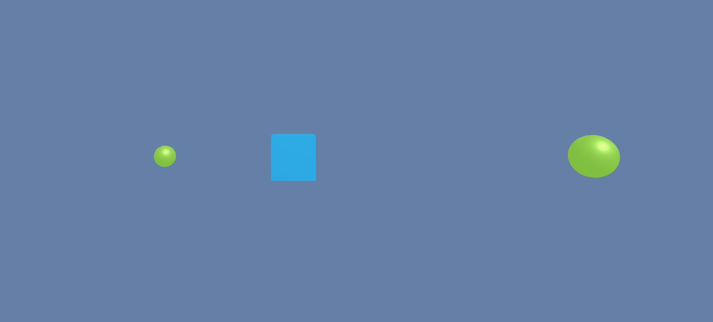
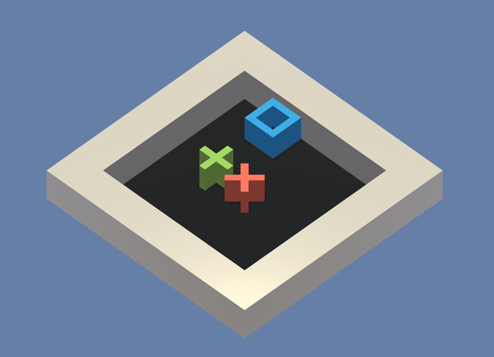
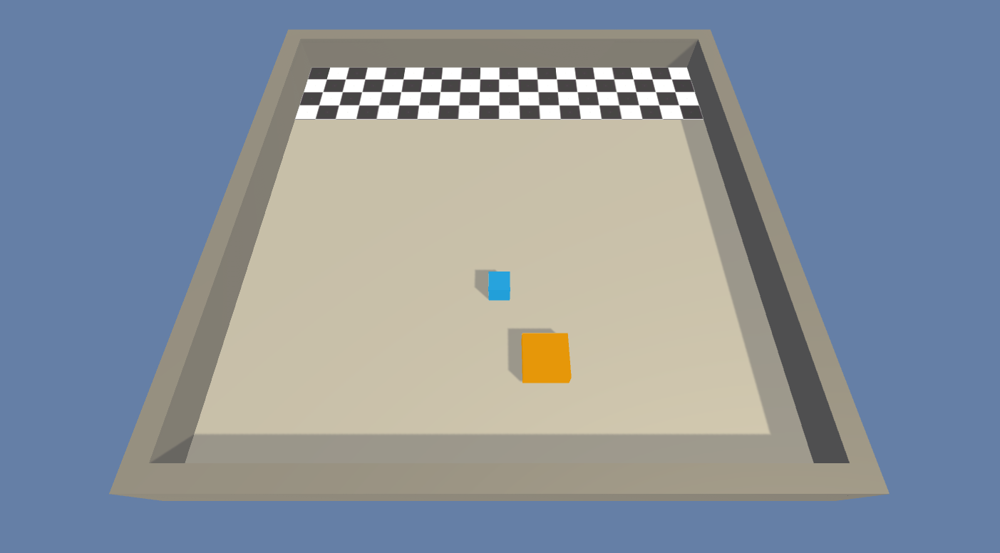
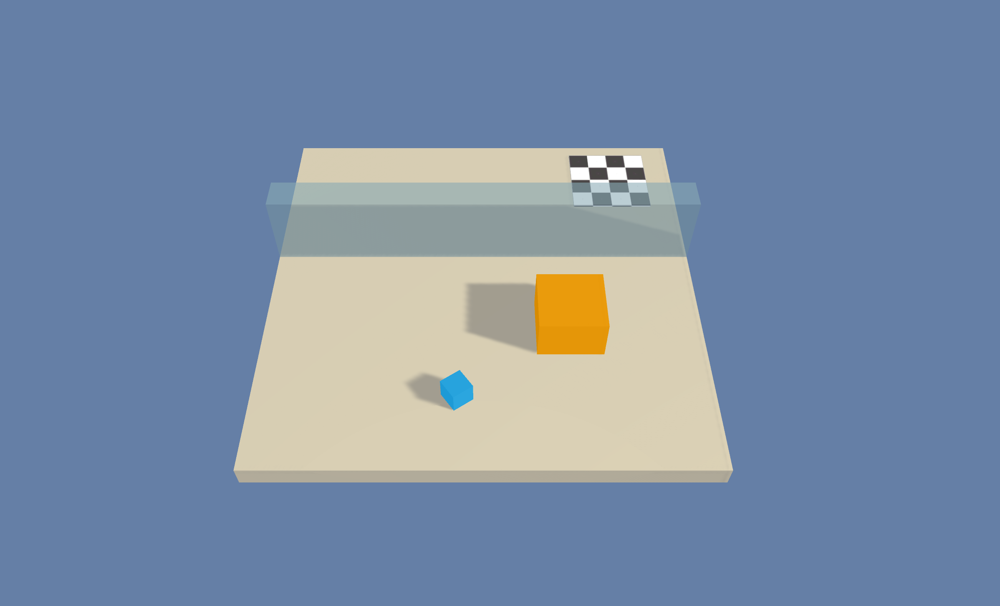
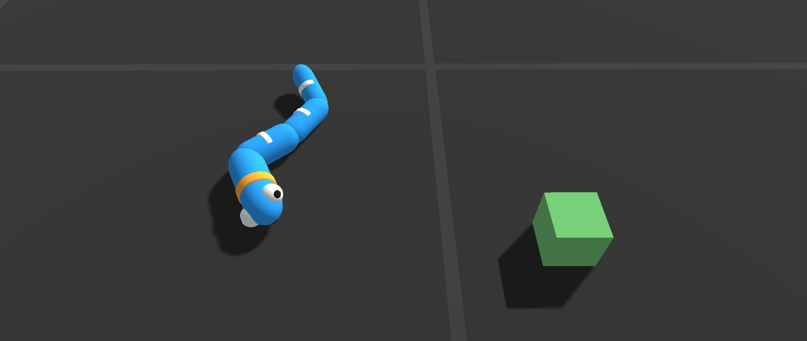
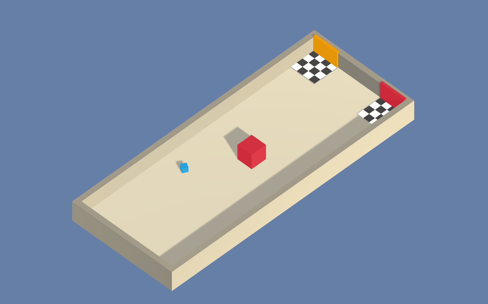
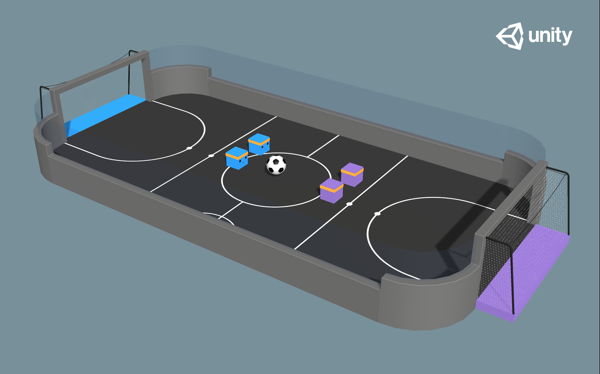
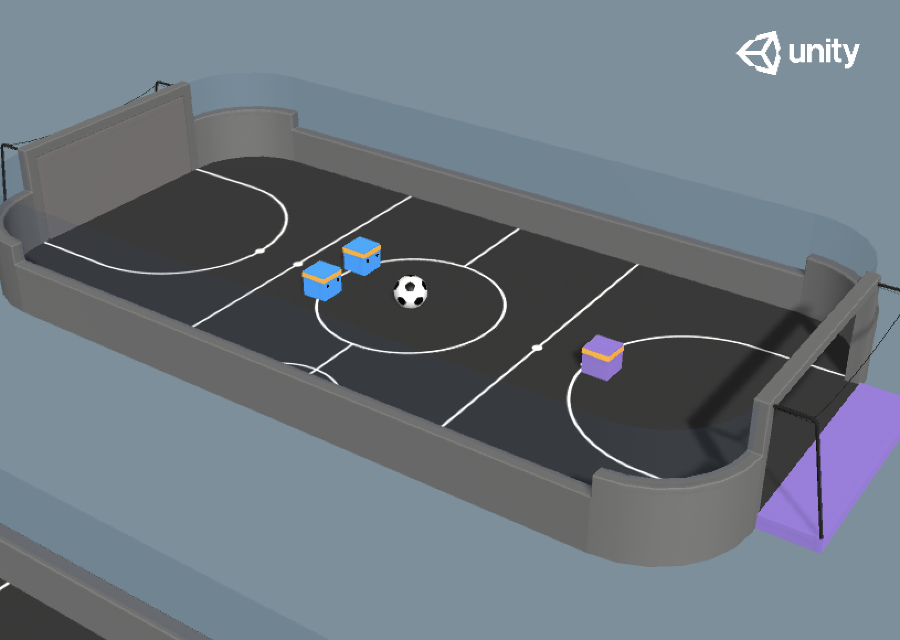
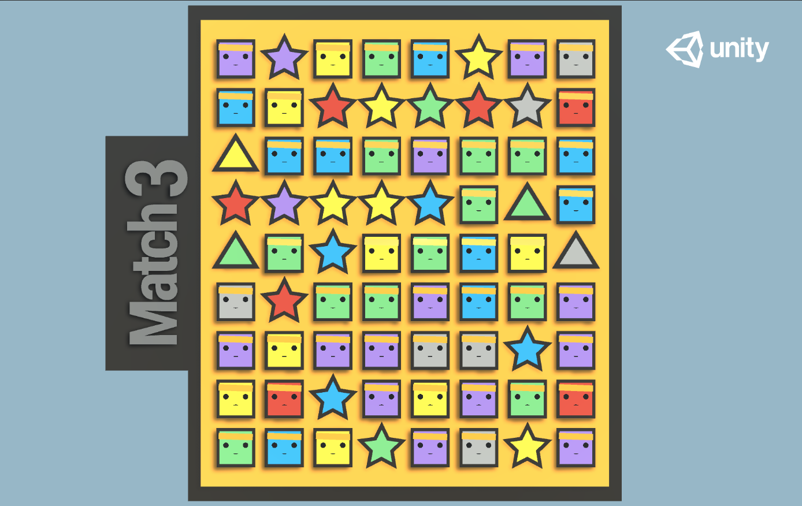


# 학습 환경 예제

유니티 ML-Agents Toolkit은 Toolkit의 다양한 기능을 확인할 수 있는 많은 예제 환경 세트가 포함되어 있습니다.
이러한 예제 환경은 새로운 환경 제작을 위한 템플릿 또는 새로운 머신러닝 알고리즘을 테스트할 수 있습니다.

예제 환경은 `Project/Assets/ML-Agents/Examples` 경로에서 찾을 수 있습니다. 각 예제환경에 대한 세부 내용은 아래에 요약되어 있습니다.

유니티 ML-Agents Toolkit은 사전 훈련(pre-trained)된 모델(onnx)과 사용자가 직접 학습할 수 있도록 하이퍼 파라미터 설정 파일(yaml)을 제공합니다 (단, _Optional_ 제외)

이 문서는 예제 환경의 내용만 포함합니다. 환경 제작에 관련된 문서 링크는 다음과 같습니다.
[Making a New Learning Environment](Learning-Environment-Create-New.md) page.
만약 공식적인 ML-Agents 예제 환경에 기여하고 싶다면, 다음 문서를 참고해주시길 바랍니다.
[contribution guidelines](../com.unity.ml-agents/CONTRIBUTING.md) page.

## Basic

- 구성: 보상을 받기 위해 에이전트는 왼쪽 또는 오른쪽으로만 이동할 수 있는 선형 이동 문제입니다.
- 목표: 보상을 가장 많이 받는 상태로 이동합니다.
- 에이전트: 하나의 에이전트가 존재합니다.
- 보상 함수:
  - -0.01 스텝마다 감점
  - +0.1 작은 공 위치에 도착할 때 (Suboptimal)
  - +1.0 큰 공 위치에 도착할 때 (Optimal)
- Behavior Parameters:
  - 벡터 관측 : 1
  - Actions: 이산적 행동 1 - 분기(Branch) 3개 (좌측 이동, 정지, 우측 이동)
  - 관측 : 없음
- Float Properties: 없음
- Benchmark Mean Reward: 0.93

## 3DBall: 3D Balance Ball

- 구성: 에이전트가 머리 위의 공의 중심을 잡는 밸런스-볼 문제입니다.
- 목표: 에이전트는 머리 위의 공의 중심을 가능한 한 오래 잡아야 합니다.
- 에이전트: 같은 Behavior Parameters를 사용하는 같은 종류의 12개의 에이전트가 존재합니다.
- 보상 함수:
  - +0.1 공을 떨어트리지 않을 때
  - -1.0 공을 떨어트릴 때
- Behavior Parameters:
  - 벡터 관측: 8 (에이전트의 회전, 공과 에이전트 사이의 거리, 공의 속도)
  - 벡터 관측(Hard Version): 5 (에이전트의 회전, 공의 위치)
  - 행동: 연속적 행동 2 - X축 회전, Z축 회전
  - 벡터 관측: `Visual3DBall` scene의 경우 상단 정면 기준 3인칭 시점 사용
- Float Properties: 3 (3DBall, 3DBallHard, Visual3DBall)
  - 축척: 공의 축척을 3차원으로 지정합니다. (동일 비율 사용)
    - 기본값: 1
    - 권장 최솟값: 0.2
    - 권장 최댓값: 5
  - gravity: 중력의 크기
    - 기본값: 9.81
    - 권장 최솟값: 4
    - 권장 최댓값: 105
  - mass: 공의 질량 지정
    - 기본값: 1
    - 권장 최솟값: 0.1
    - 권장 최댓값: 20
- Benchmark Mean Reward: 100

## GridWorld

- 구성: 그리드 월드 문제의 다중 목표 버전입니다. 씬에는 에이전트, 목표, 장애물이 포함되어 있습니다.
- 목표: 에이전트는 장애물을 피하면서 목표지점까지 도달해야 합니다.
- 에이전트: 같은 Behavior Parameters를 사용하는 9개의 에이전트가 존재합니다.
- 보상 함수:
  - -0.01 스텝마다 감점
  - +1.0 의도한 목적지에 도착할 때 (episode ends).
  - -1.0 의도하지 않은 목적지에 도착할 때 (episode ends).
- Behavior Parameters:
  - 벡터 관측: 없음
  - 행동: 이산적 행동 1 - 분기(Branch) 5개 (기본 방향 이동 (Cardinal), 정지)
    [action masking](Learning-Environment-Design-Agents.md#masking-discrete-actions)
    은 기본 설정되어 있습니다. (이 옵션은 `trueAgent` 게임 오브젝트 내 `Mask Actions` 체크박스로 설정할 수 있습니다) 내장된 학습 모델은 `action masking` 옵션이 설정된 상태로 학습되었습니다.
  - 시각적 관측: 그리드월드의 Top-Down View
  - Goal Signal : 어떤 색이 올바른 목표인지에 일치하는 One-Hot 벡터
- Float Properties: 3, 환경 크기, 녹색 목표 지점의 개수, 붉은색 목표 지점의 개수
- Benchmark Mean Reward: 0.8

## Push Block

- 구성: 에이전트가 블록을 푸쉬할 수 있는 플랫폼 환경입니다.
- 목표: 에이전트는 블록을 목적지까지 밀어 넣어야 합니다.
- 에이전트: 하나의 에이전트가 존재합니다.
- 보상 함수:
  - -0.0025 스텝마다 감점.
  - +1.0 의도한 영역에 블록을 밀어 넣을 때.
- Behavior Parameters:
  - 벡터 관측: (연속적인) 70, 3개의 태그를 감지할 수 있는 Ray Perception Sensor를 사용합니다.
  - 행동: 이산적 행동 1 - 분기 7개 (시계방향 회전, 반시계방향 회전, 기본 방향 이동, 정지)
- Float Properties: 4
  - 블록 크기: x축 그리고 y축에 따른 블록의 크기
    - 기본값: 2
    - 권장 최솟값: 0.5
    - 권장 최댓값: 4
  - 동적 마찰 : 블록이 움직이는 동안 바닥면이 갖는 동적 마찰 계수
    - 기본값: 0
    - 권장 최솟값: 0
    - 권장 최댓값: 1
  - 정적 마찰: 정지한 물체가 갖는 정적 마찰 계수
    - 기본값: 0
    - 권장 최솟값: 0
    - 권장 최댓값: 1
  - 블록 항력: 블록에 작용하는 공기 저항
    - 기본값: 0.5
    - 권장 최솟값: 0
    - 권장 최댓값: 2000
- Benchmark Mean Reward: 4.5

## Wall Jump

- 구성: 에이전트가 벽을 뛰어넘을 수 있는 플랫폼 환경입니다.
- 목표: 에이전트는 벽의 높이에 따라 블록을 사용하거나, 사용하지 않고 최대한 빠르게 목표에 도달해야 합니다.
- 에이전트: 2개의 학습 모델을 사용하는 하나의 에이전트는 벽의 높이에 따라 적절한 학습 모델을 선택합니다. (벽의 높이가 높을 때 BigWallJump.onnx, 낮을 때 SmallWallJump.onnx)
-  보상 함수:
  - -0.0005 스텝마다 감점.
  - +1.0 목적지에 도착할 때.
  - -1.0 에이전트가 플랫폼에서 떨어질 때.
- Behavior Parameters:
  - 벡터 관측: 74, 4개의 태그를 감지할 수 있는 Ray Perception Sensor를 사용합니다.
  - 더하여 에이전트의 점프 여부를 확인하기 위해 에이전트의 절대 좌표를 사용합니다.
  - 행동: 이산적 행동 4
    - 직선 이동 (3 가능한 행동: 전진, 후진, 정지)
    - 회전 (3 가능한 행동: 좌회전, 우회전, 정지)
    - 측면(Side) 이동 (3 가능한 행동: 좌 이동, 우 이동, 정지)
    - 점프 (2 가능한 행동: 점프, 정지)
  - 시각적 관측: 없음
- Float Properties: 4
- Benchmark Mean Reward (Big & Small Wall): 0.8

## Crawler

- 구성: 4개의 팔과 4개의 팔뚝을 가진 생물(Creature)입니다.
- 목표: 에이전트는 넘어지지 않고 목표 방향을 따라 목표 지점으로 움직여야 합니다.
- 에이전트: 같은 Behavior Parameters를 사용하는 10개의 에이전트가 존재합니다.
- 보상 함수 (독립적인):
  - 본체의 속도가 목표 속도와 일치할 때, 일치하는 정도에 따라 +(0~1)
  - 머리의 방향이 목표 방향과 일치할 때, 일치하는 정도에 따라 +(0~1)
- Behavior Parameters:
  - 수치 관측: 172 (팔의 위치, 회전, 속도, 각속도 본체)
  - 행동: 20 연속적 행동, 조인트(Joint)의 목표 회전 속도와 일치하도록 행동합니다.
  - 시각적 관측: 없음
- Float Properties: 0
- Benchmark Mean Reward: 3000

## Worm

- 구성: 머리와 3개의 몸체를 갖는 웜(Worm)입니다.
- 목표: 에이전트는 목표 방향을 따라 목표 지점으로 움직여야 합니다.
- 에이전트: 같은 Behavior Parameters를 사용하는 10개의 에이전트가 존재합니다.
- 보상함수 (독립적인):
  - 본체의 속도가 목표 속도와 일치할 때, 일치하는 정도에 따라 +(0~1)
  - 머리의 방향이 목표 방향과 일치할 때, 일치하는 정도에 따라 +(0~1)
- Behavior Parameters:
  - 벡터 관측: 64 (팔의 위치, 회전, 속도, 각속도 및 본체의 각속도)
  - 행동: 9 연속적 행동, 조인트(Joint)의 목표 회전 속도와 일치하도록 행동합니다.
  - 시각적 관측: 없음
- Float Properties: 0
- Benchmark Mean Reward: 800

## Food Collector

- 구성: 에이전트가 음식을 모으기 위해 경쟁하는 멀티-에이전트 환경입니다.
- 목표: 에이전트는 붉은색 음식을 피하면서 가능한 많은 녹색 음식을 수집해야 합니다.
- 에이전트: 같은 Behavior Parameters를 사용하는 5개의 에이전트가 존재합니다.
- 보상 함수 (독립적인)
  - +1 녹색 음식을 수집할 때
  - -1 붉은색 음식을 수집할 때
- Behavior Parameters:
  - 벡터 관측: 53 (에이전트의 속도, 에이전트의 동면(frozen) 여부, 6개의 태그를 감지할 수 있는 Grid 센서(40x40) 입니다.
  - Actions:
    - 3 직선 운동, 측면(Side) 운동, 회전 운동과 해당하는 연속적 행동입니다.
    - 1 이산적 행동 - 분기 2개 (레이저 발사, 정지)
  - 시각적 관측 (선택적): `VisualFoodCollector` 씬에서 각각의 에이전트는 1인칭 카메라와 동면(frozen)을 나타내는 벡터 관측을 추가로 사용합니다. 이 씬은 벡터 관측과 시각적 관측을 같이 사용하며 동면(frozen) 벡터 플래그가 없을 때에는 학습에 실패할 것입니다.
- Float Properties: 2
  - 레이저 길이: 에이전트가 사용하는 레이저의 길이
    - 기본값: 1
    - 권장 최솟값: 0.2
    - 권장 최댓값: 7
  - 에이전트의 크기: 에이전트의 축척을 3차원으로 지정합니다. (동일 비율 사용)
    - 기본값: 1
    - 권장 최솟값: 0.5
    - 권장 최댓값: 5
- Benchmark Mean Reward: 10

## Hallway

- 구성: 에이전트는 방에서 블록의 모양을 기억하고, 해당 지점으로 나아갑니다.
- 목표: 방 안에 있는 같은 모양의 블록으로 나아갑니다.
- Agents: 한 개의 에이전트가 존재합니다.
- 보상 함수:
  - +1 의도한 위치에 도착할 때
  - -0.1 의도하지 않은 위치에 도착할 때
  - -0.0003 스텝마다 감점 `-1f / MaxStep`
- Behavior Parameters:
  - 벡터 관측 크기: 30, 3개의 태그를 감지할 수 있는 Ray Perception Sensor를 사용합니다.
  - 행동: 1 이산적 행동, 분기(Branch) 4개 (전진, 후진, 좌회전, 우회전)
- Float Properties: 0
- Benchmark Mean Reward: 0.7
  - 하이퍼 파라미터 튜닝을 할 때  `config/ppo/Hallway.yaml` reward signal에 `curiosity` 를 추가함으로써 호기심 탐색 모듈(Module)을 사용할 수 있습니다.

## Soccer Twos

- 구성: 4명의 에이전트가 2대2로 축구경기를 하는 환경입니다.
- 목표: 상대가 득점하지 못하도록 막으면서 득점을 해야 합니다.
- Agents: 환경마다 서로 각기 다른 팀인 2개의 에이전트가 존재합니다.
- 보상 함수 (의존적인):
  - (1 -  `시간 패널티 (진행 에피소드의 길이)`) 게임이 진행되면 fixedupdate 함수의 호출 주기에 맞춰서 `시간 패널티 (진행 에피소드의 길이)`가 증가합니다. (시간 패널티 계산식 : 1/`MaxStep`) 시간 패널티는 에피소드가 종료되고 시작되면 초기화됩니다.
  - -1 실점할 때.
- Behavior Parameters:
  - 벡터 관측 크기: 336,  에이전트 정면 그리고  후면에 있는 6개의 태그 오브젝트를 감지하기 위해 각각 11개 그리고 3개의 Ray Perception Sensor를 사용합니다.
  - 행동: 3 이산적 행동 - 분기 - 전진, 후진, 측면 이동, 회전
  - 시각적 관측: 없음
- Float Properties: 2
  - 공의 축척:  공의 축척을 3차원으로 지정합니다 (동일 비율 사용)
    - 기본값: 7.5
    - 권장 최솟값: 4
    - 권장 최댓값: 10
  - 중력: 중력의 크기
    - 기본값: 9.81
    - 권장 최솟값: 6
    - 권장 최댓값: 20

## Strikers Vs. Goalie

- 구성: 두 명의 에이전트가 2대1로 축구를 플레이하는 환경입니다.
- 목표:
  - 스트라이커: 상대편의 골문 안으로 공을 넣습니다.
  - 골키퍼: 공이 골대에 들어오지 못하도록 합니다.
- 에이전트: 환경마다 2개의 에이전트가 서로 경쟁하는 팀이 존재합니다.
  Behavior Parameters : 스트라이커, 골키퍼.
- 스트라이커 에이전트 보상 함수 (의존적인):
  - +1 득점할 때.
  - -0.001 스텝마다 감점.
- 골키퍼 에이전트 보상 함수 (의존적인):
  - -1 실점할 때.
  - 0.001 스텝마다 가점.
- Behavior Parameters:
  - 스트라이커 벡터 관측 크기: 294, 에이전트 정면 그리고 후면에 있는 5개의 태그 오브젝트를 감지하기 위해 각각 11개 그리고 3개의 Ray Perception Sensor를 사용합니다.
  - 스트라이커 행동: 3 이산적 행동 - 분기(Branch) 3 (전진, 후진, 측면 이동, 회전)
  - 골키퍼 벡터 관측 공간 : 738, 360도로 5개의 태그를 감지할 수 있도록 2개의 Ray Cast Sensor를 사용합니다. (Stacked Raycasts : 3)
  - 골키퍼 행동: 3 이산적 행동 - 분기(Branch) 3 (전진, 후진, 측면 이동, 회전)
  - 시각적 관측: 없음
- Float Properties: 2
  - 공의 축척: 공의 축척을 3차원으로 지정합니다. (동일 비율 사용)
    - 기본값: 7.5
    - 권장 최솟값: 4
    - 권장 최댓값: 10
  - 중력: 중력의 크기
    - 기본값: 9.81
    - 권장 최솟값: 6
    - 권장 최댓값: 20

## Walker

- 구성: 26개의 자유도(머리, 허벅지, 정강이, 발, 팔, 팔뚝, 손)를 가진 물리 기반 휴머노이드 에이전트입니다.
- 목표: 에이전트는 넘어지지 않고, 목표 방향으로 몸을 움직여야 합니다.
- 에이전트: 같은 Behavior Parameters를 사용하는 10개의 에이전트가 존재합니다.
- 보상 함수 (독립적인):
  - 본체의 속도가 목표 속도와 일치할 때, 일치하는 정도에 따라 +(0~1)
  - 머리의 방향이 목표 방향과 일치할 때, 일치하는 정도에 따라 +(0~1)
- Behavior Parameters:
  - 벡터 관측: 243 (목표 방향에 따른 에이전트 팔의 위치, 회전, 속도, 각속도)
  - 행동: 39 연속적 행동, 조인트(Joint)의 목표 회전 속도와 강도에 일치하도록 행동합니다.
  - 시각적 관측: 없음
- Float Properties: 4
  - 중력: 중력의 크기
    - 기본값: 9.81
  - 엉덩이(Hip) 질량: Walker의 엉덩이(Hip) 컴포넌트의 질량
    - 기본값: 8
    - 권장 최솟값: 7
    - 권장 최댓값: 28
  - 가슴(Chest) 질량: Walker의 가슴(Chest) 컴포넌트의 질량
    - 기본값: 8
    - 권장 최솟값: 3
    - 권장 최댓값: 20
  - 척추(Spine) 질량: Walker의 척추(Spine) 컴포넌트의 질량
    - 기본값: 8
    - 권장 최솟값: 3
    - 권장 최댓값: 20
- Benchmark Mean Reward : 2500

## Pyramids

- 구성: 에이전트는 버튼을 누른 후 생성된 피라미드에 다가가서 넘어뜨려 피라미드 꼭대기에 있는 금을 수집합니다.
- 목표: 생성된 피라미드의 꼭대기에 있는 황금 벽돌로 이동합니다.
- 에이전트: 한개의 에이전트가 존재합니다.
- 에이전트 보상 함수 (독립적인):
  - +2 황금 벽돌로 이동할 때.
  - -0.001 스텝마다 감점.
- Behavior Parameters:
  - 벡터 관측: 148, 4개의 태그를 감지할 수 있는 Ray Perception Sensor를 사용합니다.
  - 행동: 1 이산적 행동 - 분기(Branch) 4개, 회전, 전진, 후진 운동에 해당합니다.
- Float Properties: 없음
- Benchmark Mean Reward: 1.75

## Match 3

- 구성: 간단한 Match-3 게임 환경입니다.
- 목표: Match-3 게임의 점수를 최대화합니다.
- 에이전트: 상호 독립적인 여러 에이전트가 존재합니다.
- 보상 함수 (독립적인):
  - 0.01 각각의 피스가 클리어 될 때, 특별한 피스일 때 2~3배 가점
- Behavior Parameters:
  - 관측 : 없음
  - 관찰 및 동작은 각각 센서와 액추에이터로 정의됩니다.
- Float Properties: 0
- Benchmark Mean Reward:
  - 시각적 관측 : 39.5
  - 벡터 관측 : 38.5
  - 간단한 Heuristic : 34.2
  - 탐욕적인 Heuristic : 37.0

## Sorter

 - 구성: 원형의 공간에 있는 에이전트는 1~20사이의 수가 적힌 타일을 오름차순으로 방문해야 합니다.
 - 목표: 모든 타일을 오름차순으로 방문해야 합니다.
 - 에이전트: 하나의 에이전트가 존재합니다.
 - 보상 함수:
  - -0.0002 스텝마다 감점
  - +1 적절한 타일에 도착할 때.
  - -1 부적절한 타일에 도착할 때.
 - BehaviorParameters:
  - 벡터 관측 : 4 (위치 및 이동 방향)
  - 가변 관측 길이 : 각각의 타일은 1부터 20까지 수 중 하나의 값을 가지고 있습니다.
  - 각각의 타일에는 22개의 값이 있고, 초기 20개 타일은 One-Hot 인코딩 방식입니다. 이 외 21, 22번째 관측은 타일의 상대위치를 나타냅니다.
  - 행동: 3 이산적 행동 - 분기(Branch) 3 (전진, 후진, 측면 이동, 회전)
  - Float Properties: 1
    - 타일의 개수: 타일의 최대 개수
      - 기본값: 2
      - 권장 최솟값: 1
      - 권장 최댓값: 20
  - Benchmark Mean Reward: 타일의 개수에 따라 다릅니다.

## Cooperative Push Block

- 구성:
- Push Block 환경과 유사하지만, 협동 환경입니다. 하나의 에이전트가 푸쉬할 수 있는 작은 블록과 달리 중간 그리고 큰 블록일 때 에이전트간 협동을 통해 푸쉬할 수 있습니다.
- 목표: 모든 블록을 골대에 넣습니다.
- 에이전트: 환경마다 단일 팀으로 3개의 에이전트가 존재합니다.
- 보상 함수:
  - -0.0001 스텝마다 그룸 감점
  - +1, +2, or +3 블록을 푸쉬할 때마다 크기에 따른 그룹 가점,
- Behavior Parameters:
  - 관측 크기:  6개의 태그 오브젝트를 감지하기 위해 그리드 센서를 사용합니다.
  - 행동: 1 이산적 행동 - 분기(Branch) 7개 (시계방향 회전, 반시계 방향 회전, 기본 방향 이동, 정지)
- Float Properties: 0
- Benchmark Mean Reward: 11 (그룹 보상)

## Dungeon Escape

- 구성: 드래곤을 잡고 열쇠를 얻어 던전을 탈출하기 위해, 하나의 에이전트는 희생해야 합니다. 어떠한 에이전트도 희생하지 않을 때 드래곤은 도망가고 에피소드는 초기화됩니다.
- 목표: 드래곤을 잡고 문을 열어 탈출합니다.
- 에이전트: 같은 팀인 3개의 에이전트와 정해진 패턴대로 움직이는 드래곤이 존재합니다.
- 보상 함수:
  - +1 그룹 보상, 문을 열고 던전을 탈출할 때
- Behavior Parameters:
  - 관측 크기: 에이전트 정면에 있는 6개의 태그 오브젝트를 감지하기 위해 Ray Perception Sensor를 사용합니다.
  - 에이전트가 키를 가졌는지 나타내기 위해 단일 벡터를 사용합니다.
  - 행동: 1 이산적 행동 - 분기(Branch) 7개 (시계방향 회전, 반시계 방향 회전, 기본 방향 이동, 정지)
- Float Properties: 없음
- Benchmark Mean Reward: 1.0 (그룹 보상)

## 한글 번역

해당 문서의 한글 번역은 박우진 (Woojin Park)에 의해 진행되었습니다. 내용상 오류나 오탈자가 있는 경우 [woojin.park@unity3d.com](mailto:woojin.park@unity3d.com) 또는 [pnltoen@gmail.com](mailto:pnltoen@naver.com)으로 연락주시면 감사드리겠습니다.
