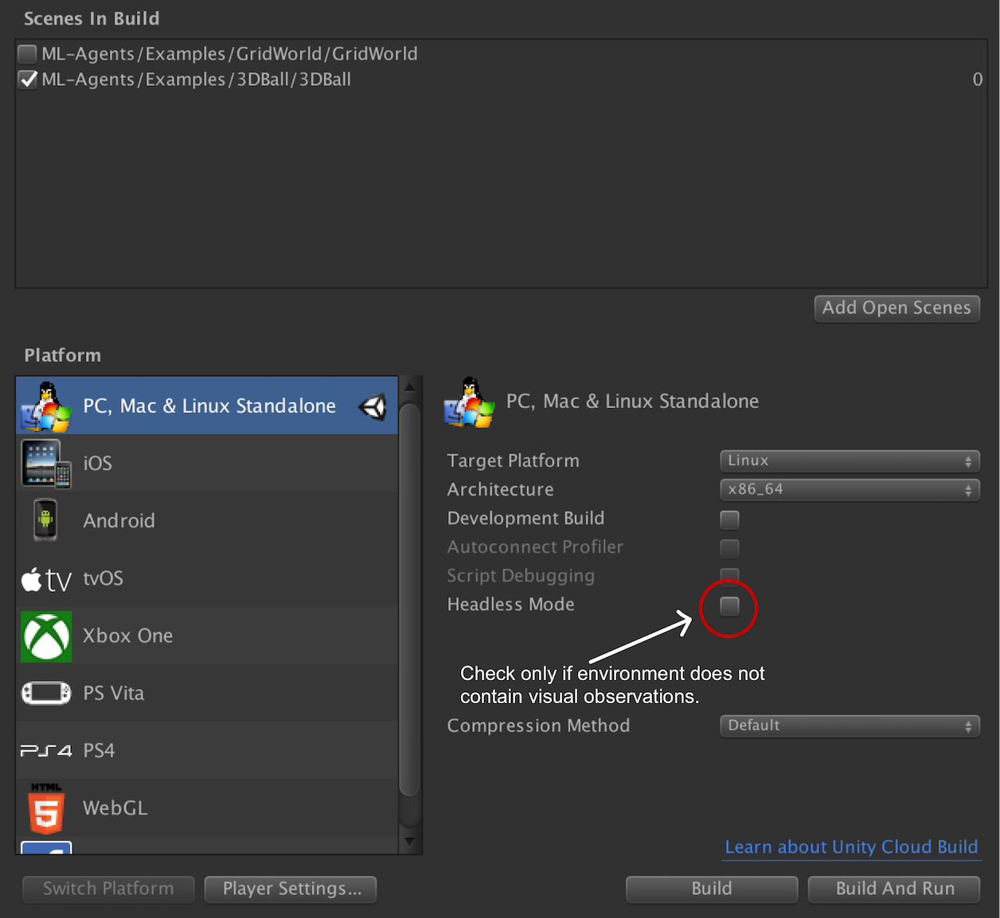

# ML-Agents 용 도커 사용법

도커를 사용해 추론과 학습을 하고자하는 Windows와 Mac 사용자를 위한 솔루션을 제공합니다.
이것은 Python과 TensorFlow 설치를 피하고자 하는 분에게 매력적인 옵션이 될 것입니다. 현재 설정은 TensorFlow와 Unity가 _CPU를 통해서만_
계산하도록 합니다. 따라서 도커 시뮬레이션은 GPU를 사용하지 않고 시각적 렌더링을 위해 [`Xvfb`](https://en.wikipedia.org/wiki/Xvfb)를 사용합니다.
`Xvfb`는 `ML-Agents`(또는 다른 응용 프로그램)가 가상으로 렌더링을 할 수 있게하는 유틸리티 입니다. 즉, `ML-Agents`를 실행하는 기계가 GPU를 가지고 있거나
디스플레이를 가지고 있다고 가정하지 않습니다. 이것은 카메라 기반의 시각적 관찰 요소가 포함된 환경은 더욱 느려질 수도 있음을 의미합니다.

## 요구사항

- 유니티 _Linux Build Support_ 컴포넌트
- [도커](https://www.docker.com)

## 설치

- 유니티 인스톨러를 [다운로드](https://unity3d.com/kr/get-unity/download)하고 _Linux Build Support_ 컴포넌트를 추가하십시오.

- 도커가 설치되어 있지 않다면 [다운로드](https://www.docker.com/community-edition#/download)하고 설치 하십시오.

- 호스트 시스템과 분리된 환경에서 도커를 실행하기 때문에, 호스트 시스템안에 마운트된 디렉토리는 트레이너 환경 설정 파일, 
  유니티 실행 파일, 커리큘럼 파일과 TensorFlow 그래프와 같은 데이터를 공유하기위해 사용됩니다.
  이를 위해, 편의상 비어있는 `unity-volume` 디렉토리를 저장소의 루트에 만들었으나, 다른 디렉토리의 사용은 자유롭게 할 수 있습니다. 
  이 가이드의 나머지 부분에서는 `unity-volume` 디렉토리가 사용된다고 가정하고 진행됩니다.

## 사용법

ML-Agents 용 도커 사용에는 세 단계가 포함됩니다.: 특정 플래그를 사용하여 유니티 환경 구축, 도커 콘테이너 구축
마지막으로, 컨테이너 실행. 만약 ML-Agents 용 유니티 환경 구축에 익숙하지 않다면, [3D 밸런스 볼 예제와 함께 시작하기](Getting-Started-with-Balance-Ball.md) 가이드를 먼저 읽으십시오.

### 환경 구축 (옵션)

_학습을 위해 에디터 사용을 원한다면 이 단계를 건너뛸 수 있습니다._

도커는 일반적으로 호스트 시스템과 (리눅스) 커널을 Since Docker typically runs a container sharing a (linux) kernel with the host
machine, the Unity environment **has** to be built for the **linux platform**.
When building a Unity environment, please select the following options from the
the Build Settings window:

- Set the _Target Platform_ to `Linux`
- Set the _Architecture_ to `x86_64`
- If the environment does not contain visual observations, you can select the
  `headless` option here.

Then click `Build`, pick an environment name (e.g. `3DBall`) and set the output
directory to `unity-volume`. After building, ensure that the file
`<environment-name>.x86_64` and subdirectory `<environment-name>_Data/` are
created under `unity-volume`.



### Build the Docker Container

First, make sure the Docker engine is running on your machine. Then build the
Docker container by calling the following command at the top-level of the
repository:

```sh
docker build -t <image-name> .
```

Replace `<image-name>` with a name for the Docker image, e.g.
`balance.ball.v0.1`.

### Run the Docker Container

Run the Docker container by calling the following command at the top-level of
the repository:

```sh
docker run --name <container-name> \
           --mount type=bind,source="$(pwd)"/unity-volume,target=/unity-volume \
           -p 5005:5005 \
           <image-name>:latest \
           --docker-target-name=unity-volume \
           <trainer-config-file> \
           --env=<environment-name> \
           --train \
           --run-id=<run-id>
```

Notes on argument values:

- `<container-name>` is used to identify the container (in case you want to
  interrupt and terminate it). This is optional and Docker will generate a
  random name if this is not set. _Note that this must be unique for every run
  of a Docker image._
- `<image-name>` references the image name used when building the container.
- `<environment-name>` __(Optional)__: If you are training with a linux
  executable, this is the name of the executable. If you are training in the
  Editor, do not pass a `<environment-name>` argument and press the
  :arrow_forward: button in Unity when the message _"Start training by pressing
  the Play button in the Unity Editor"_ is displayed on the screen.
- `source`: Reference to the path in your host OS where you will store the Unity
  executable.
- `target`: Tells Docker to mount the `source` path as a disk with this name.
- `docker-target-name`: Tells the ML-Agents Python package what the name of the
  disk where it can read the Unity executable and store the graph. **This should
  therefore be identical to `target`.**
- `trainer-config-file`, `train`, `run-id`: ML-Agents arguments passed to
  `mlagents-learn`. `trainer-config-file` is the filename of the trainer config
  file, `train` trains the algorithm, and `run-id` is used to tag each
  experiment with a unique identifier. We recommend placing the trainer-config
  file inside `unity-volume` so that the container has access to the file.

To train with a `3DBall` environment executable, the command would be:

```sh
docker run --name 3DBallContainer.first.trial \
           --mount type=bind,source="$(pwd)"/unity-volume,target=/unity-volume \
           -p 5005:5005 \
           balance.ball.v0.1:latest 3DBall \
           --docker-target-name=unity-volume \
           trainer_config.yaml \
           --env=3DBall
           --train \
           --run-id=3dball_first_trial
```

For more detail on Docker mounts, check out
[these](https://docs.docker.com/storage/bind-mounts/) docs from Docker.

**NOTE** If you are training using docker for environments that use visual observations, you may need to increase the default memory that Docker allocates for the container. For example, see [here](https://docs.docker.com/docker-for-mac/#advanced) for instructions for Docker for Mac.

### Stopping Container and Saving State

If you are satisfied with the training progress, you can stop the Docker
container while saving state by either using `Ctrl+C` or `⌘+C` (Mac) or by using
the following command:

```sh
docker kill --signal=SIGINT <container-name>
```

`<container-name>` is the name of the container specified in the earlier `docker
run` command. If you didn't specify one, you can find the randomly generated
identifier by running `docker container ls`.
