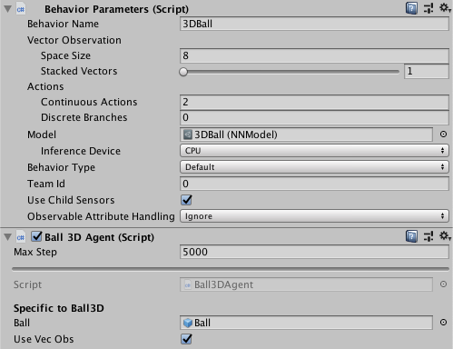

# 시작 가이드

이 가이드에서는 Unity에서 [예제 환경](https://github.com/minu-dev/ml-agents/blob/develop/docs/Learning-Environment-Examples.md) 중 하나를 열고, 에이전트를 훈련하고, 훈련된 모델을 Unity 환경에 임베딩하는 종단간 기계학습 과정을 설명합니다. 해당 튜토리얼을 완수하고 나면, 예제 환경의 모델을 훈련할
수 있을 것입니다. [Unity Engine](https://unity3d.com/unity)에 익숙하지 않다면, [Background: Unity](https://github.com/minu-dev/ml-agents/blob/develop/docs/Background-Unity.md) 페이지의 유용한 조언들을 참조하십시오. 또한, 기계 학습에 익숙하지 않은 경우 [Background: Machine Learning](https://github.com/minu-dev/ml-agents/blob/develop/docs/Background-Machine-Learning.md) 페이지에서 간략한 개요와 유용한 조언들을 참조하십시오.


이 가이드에서는 여러 에이전트 큐브와 공이 포함된 **3D Balance Ball** 환경을 사용합니다. 각 에이전트 큐브는 수평 또는 수직으로 회전하여 공이 떨어지지 않도록 합니다. 이 환경에서, **에이전트** 큐브는 균형을 맞추어 공을 떨어뜨리지 않는다면 긍정적인 보수를 받고, 공을 떨어뜨린다면 부정적인 보수를 받습니다. 훈련 프로세스의 목표는 에이전트 큐브들이 머리 위에서 공의 균형을 잡는 법을 배우도록 하는 것입니다.

시작해 봅시다!

## 설치

아직 설치하지 않으셨다면, 해당 [설치 지침](https://github.com/Unity-Technologies/ml-agents/blob/develop/localized_docs/KR/docs/Installation.md)을 따라주세요.
그런 다음에, 모든 예제 환경이 포함된 Unity 프로젝트를 여십시오:

1. 메뉴에서 `Window → Package Manager`로 이동하여 Package Manager 창을 엽니다.
2. ML-Agents 패키지로 이동하고 클릭합니다.
3. `3D Ball` 샘플을 찾아 `Import`를 클릭합니다.
4. **프로젝트** 창에서 `Assets/ML-Agents/Examples/3DBall/Scenes` 폴더를 열고 `3DBall` Scene 파일을 엽니다.

## Unity 환경 이해하기

에이전트는 _환경_ 을 관찰하고 상호 작용하는 자율 행위자 (Autonomous Actor) 입니다. Unity의 맥락에서, 환경이란 하나 이상의 에이전트 객체와, 에이전트가 상호 작용하는 다른 엔티티들을 포함하는 Scene입니다.


**참고:** Unity에서 한 Scene의 모든 기본 객체는 _GameObject_ 입니다. GameObject란 본질적으로 행동, 그래픽, 물리학 등을 포함한 모든 것들을 위한 컨테이너입니다. GameObject를 구성하는 요소들을 보려면 Scene 창에서 GameObject를 선택하고 Inspector 창을 엽니다. Inspector는 GameObject의 모든 구성 요소를 표시합니다.

_3D Balance Ball_ Scene 을 여시면 하나가 아닌 여러 개의 에이전트 큐브가 있는 것을 확인하실 수 있습니다. Scene의 각 에이전트 큐브들을 독립 에이전트이지만, 모두 동일한 동작을 공유합니다. 3D Balance Ball은 12개의 에이전트가 모두 병렬로 훈련에 기여하므로, 훈련 속도를 높이기 위해 해당 작업을 수행합니다.

### 에이전트

에이전트는 환경에서 작업을 관찰하고 수행하는 행위자입니다. 3D Balance Ball 환경에서, 에이전트 구성 요소는 12개의 "에이전트" GameObject들에 배치됩니다. 기본 에이전트 개체에는 동작에 영향을 미치는 몇 가지 속성이 있습니다.

- **동작 파라미터** — 모든 에이전트는 동작이 있어야 합니다. 동작은 에이전트가 어떻게 결정을 내릴 지를 결정합니다.
- **최대 단계 수** — 에이전트의 에피소드가 끝나기 전에 발생할 수 있는 시뮬레이션 단계 수를 정의합니다. 3D Balance Ball에서 에이전트는 5000 단계 후에 다시 시작됩니다.

#### 행동 파라미터 : 벡터 관측 공간

결정을 내리기 전에, 에이전트는 월드에서의 상태에 대한 관찰을 수집합니다. 벡터 관찰은 에이전트가 결정을 내리는 데에 필요한 관련 정보를 포함하는 부동 소수점 숫자의 벡터입니다.

3D Balance ball 예제의 동작 파라미터는 `공간 크기` 8을 사용합니다. 즉, 에이전트의 관측치를 포함하는 피쳐 벡터에는, 에이전트 큐브의 회전 값 `x`와 `z` 성분과, 공의 상대적 위치값 `x`, `y`, `z`, 그리고 상대적 속도 값 `x`, `y`, `z` 으로 총 8개의 요소가 포함됩니다.

#### 행동 파라미터 : 작업

에이전트는 작업의 형태로 지시를 받습니다. ML-Agents Toolkit은 작업을 연속형과 이산형의 두 가지 유형으로 분류합니다. 3D Balance Ball 예제는 연속적으로 변할 수 있는 부동 소수점 숫자의 벡터인 연속 동작을 사용하도록 프로그래밍 되어있습니다. 구체적으로 말하자면 2의 `공간 크기`를 사용하여 `x` 와 `z` 의 회전량을 조절하고, 머리 위의 공이 균형을 잡도록 합니다.

## 사전 교육된 모델 실행하기

우리는 에이전트를 위한 사전 훈련된 모델 (`.onnx` 파일) 을 포함시키고, [Unity 추론 엔진](https://github.com/Unity-Technologies/ml-agents/blob/develop/docs/Unity-Inference-Engine.md)을 사용하여 이러한 모델을 Unity 내에서 실행합니다. 이 섹션에서는 3D Ball 예제를 위한 사전 교육된 모델을 사용합니다.

1. **프로젝트** 창에서, `Assets/ML-Agents/Examples/3DBall/Prefabs`폴더로 이동합니다. `3DBall`을 확장하고, `Agent` 프리팹을 클릭합니다. **인스펙터** 창에서 `Agent`프리팹을 볼 수 있을 것입니다.

   **참고:** `3DBall` Scene의 플랫폼은 `3DBall` 프리팹을 사용하여 생성되었습니다. 12개의 플랫폼을 모두 개별적으로 업데이트하는 대신에 `3DBall` 프리팹을 업데이트 할 수 있습니다.

   

1. **인스펙터** 창에 나타난 `Agent` 프리팹의 `Behavior Parameters (Script)`컴포넌트의 `Model` 속성에, **프로젝트)) 창의 `Assets/ML-Agents/Examples/3DBall/TFModels`폴더에 있는 **3DBall** 모델을 드래그-드롭 합니다.

   

1. **하이어라키** 창의 각 `3DBall` 아래에 있는 각각의 `Agent`에는 이제 `동작 파라미터`의 `Model`로써 **3DBall**을 포함합니다.  
**참고:** Scene 하이어라키의 검색 표시줄을 사용하여 한 장면에서 여러 객체들을 한 번에 선택하고 수정할 수 있습니다.
1. 이 모델에 사용할 **Infenece Device**를 `CPU`로 설정합니다.
1. Unity Editor 에서 **재생** 버튼을 클릭하면 플랫폼이 사전 교육된 모델을 사용하여 공의 균형을 잡으려는 것을 볼 수 있습니다.

## 강화 학습을 통해 새로운 모델 교육하기

이 환경에서는 에이전트를 위한 사전 훈련된 모델을 제공하지만, 사용자가 직접 만든 환경에서 새 모델 파일을 생성하기 위해선 교육 에이전트가 처음부터 필요합니다. 이 섹션에서는 ML-Agents 파이썬 패키지의 일부인 강화 학습 알고리즘을 사용하여 이와 같은 상황을 해결하는 방법을 시연할 것입니다. 이를 위해 훈련과 추론 단계를 모두 구성 하는 데에 사용되는, 인수를 수용하는 편리한 명령어인 mlagents-learn` 명령어를 제공합니다.

### 환경 훈련하기

1. 명령 프롬프트 (Windows) 또는 터미널 (macOS) 창을 엽니다.
1. `ml-agents`저장소를 복제한 폴더로 이동합니다.  
**참고:** 기본 [설치 과정](https://github.com/Unity-Technologies/ml-agents/blob/develop/localized_docs/KR/docs/Installation.md)을 따랐다면, 모든 디렉토리에서 `mlagents-learn`을 실행할 수 있어야 합니다.
1. `mlagents-learn config/ppo/3DBall.yaml --run-id=first3DBallRun` 명령어를 실행합니다.
	- `config/ppo/3DBall.yaml`은 기본 교육 구성 파일의 경로입니다.  
   `config/ppo` 폴더에는 3DBall을 포함한 모든 예제 환경에 대한 교육 구성 파일이 포함되어 있습니다.
	- `run-id`는 이 교육 세션의 고유한 이름입니다.
1. 화면에 _”Start training by pressing the Play button in the Unity Editor”_ 라는 메시지가 뜨면, Unity에서 **재생** 버튼을 눌러 Editor에서 교육을 시작할 수 있습니다.

`mlagents-learn`이 제대로 실행되었고, 훈련을 시작한다면, 다음과 같은 것을 볼 수 있을 것입니다.

```console
INFO:mlagents_envs:
'Ball3DAcademy' started successfully!
Unity Academy name: Ball3DAcademy

INFO:mlagents_envs:Connected new brain:
Unity brain name: 3DBallLearning
        Number of Visual Observations (per agent): 0
        Vector Observation space size (per agent): 8
        Number of stacked Vector Observation: 1
INFO:mlagents_envs:Hyperparameters for the PPO Trainer of brain 3DBallLearning:
        batch_size:          64
        beta:                0.001
        buffer_size:         12000
        epsilon:             0.2
        gamma:               0.995
        hidden_units:        128
        lambd:               0.99
        learning_rate:       0.0003
        max_steps:           5.0e4
        normalize:           True
        num_epoch:           3
        num_layers:          2
        time_horizon:        1000
        sequence_length:     64
        summary_freq:        1000
        use_recurrent:       False
        memory_size:         256
        use_curiosity:       False
        curiosity_strength:  0.01
        curiosity_enc_size:  128
        output_path: ./results/first3DBallRun/3DBallLearning
INFO:mlagents.trainers: first3DBallRun: 3DBallLearning: Step: 1000. Mean Reward: 1.242. Std of Reward: 0.746. Training.
INFO:mlagents.trainers: first3DBallRun: 3DBallLearning: Step: 2000. Mean Reward: 1.319. Std of Reward: 0.693. Training.
INFO:mlagents.trainers: first3DBallRun: 3DBallLearning: Step: 3000. Mean Reward: 1.804. Std of Reward: 1.056. Training.
INFO:mlagents.trainers: first3DBallRun: 3DBallLearning: Step: 4000. Mean Reward: 2.151. Std of Reward: 1.432. Training.
INFO:mlagents.trainers: first3DBallRun: 3DBallLearning: Step: 5000. Mean Reward: 3.175. Std of Reward: 2.250. Training.
INFO:mlagents.trainers: first3DBallRun: 3DBallLearning: Step: 6000. Mean Reward: 4.898. Std of Reward: 4.019. Training.
INFO:mlagents.trainers: first3DBallRun: 3DBallLearning: Step: 7000. Mean Reward: 6.716. Std of Reward: 5.125. Training.
INFO:mlagents.trainers: first3DBallRun: 3DBallLearning: Step: 8000. Mean Reward: 12.124. Std of Reward: 11.929. Training.
INFO:mlagents.trainers: first3DBallRun: 3DBallLearning: Step: 9000. Mean Reward: 18.151. Std of Reward: 16.871. Training.
INFO:mlagents.trainers: first3DBallRun: 3DBallLearning: Step: 10000. Mean Reward: 27.284. Std of Reward: 28.667. Training.
```

훈련이 진행된에 따라서 화면에 표시되는 `평균 보상` 값이 어떻게 증가하는지 주목하세요. 이는 훈련이 성공하고 있다는 긍정적인 신호입니다.

**참고:** Editor 대신 실행 파일을 사용하여 교육할 수 있습니다. 이러한 방법을 원한다면 [실행 파일 사용](https://github.com/Unity-Technologies/ml-agents/blob/develop/docs/Learning-Environment-Executable.md)의 지침을 따르세요.

### 교육 진행 상황 관찰하기

이전 섹션에서 설명한 방법인 `mlagents-learn`을 사용하여 훈련을 시작하면 `ml-agents` 디렉토리에는 `results` 디렉토리가 생길 것입니다. 다음 명령을 사용하여 TensorBoard를 통해 교육 과정을 보다 자세히 관찰할 수 있습니다.

```sh
tensorboard --logdir results
```

그런 다음 브라우저에서 `localhost:6006`으로 이동하여 아래와 같은 TensorBaord 요약 통계를 확인하세요. 이 섹션의 목적을 위해 주목해야할 가장 중요한 통계는 `Environment/Cumulative Reward`이며, 이는 훈련을 통해 증가해야 하고, 결국 에이전트가 축적할 수 있는 최대 보상인 `100`에 가깝게 수렴되어야 합니다.


## Unity 환경에 모델 임베딩하기

교육 프로세스가 완료되고, 모델 (`Saved Model` 메시지로 표시됨) 을 저장하면, Unity 프로젝트에 모델을 추가하고 호환되는 에이전트 (모델을 생성한 에이전트) 와 함께 사용할 수 있습니다. ** 참고:** `Saved Model`이라는 메시지가 나타나면 Unity 창만을 닫지는 마세요. 창이 닫힐 때까지 교육 괴정을 기다리거나, 명령 프롬프트 (혹은 터미널) 에서 `Ctrl+C`를 누르십시오. 창을 수동으로 닫게 되면 훈련된 모델이 포함된 `.onnx`파일이 ml-agents 폴더로 내보내지지 않습니다.

`Ctrl+C`를 사용하여 교육을 조기에 종료했을 때, 교육을 재개하고 싶다면, 동일한 명령을 다시 실행하고 `—resume`플래그를 추가하세요.

```sh
mlagents-learn config/ppo/3DBall.yaml --run-id=first3DBallRun --resume
```

훈련된 모델은 `results/<run-identifier>/<behavior_name>.onnx` where `<behavior_name>`에 있습니다. 여기서 `<behavior_name>`은 모델에 해당하는 에이전트의 `Behavior Name`의 이름입니다. 이 파일은 모델의 최신 체크포인트입니다. 이제 아래의 단계를 수행하며 이 교육 모델을 에이전트에 포함시킬 수 있습니다. 이 단계는 [위](#사전-교육된-모델-실행하기)에서 설명한 단계와 비슷합니다.

1. 모델 파일을 `Project/Assets/ML-Agents/Examples/3DBall/TFModels/`로 옮기세요.
1. Unity Editor 를 열고, 위에서 설명한 대로 **3DBall** Scene을 선택합니다.
1. **3DBall** 프리팹 에이전트 객체를 선택합니다. 
1. Editor의 프로젝트 창에서 `<behavior_name>.onnx` 파일을 인스펙터 창의 **Ball3DAgent**의 플레이스 홀더로 드래그-드롭 합니다.
1. **재생** 버튼을 누릅니다.
