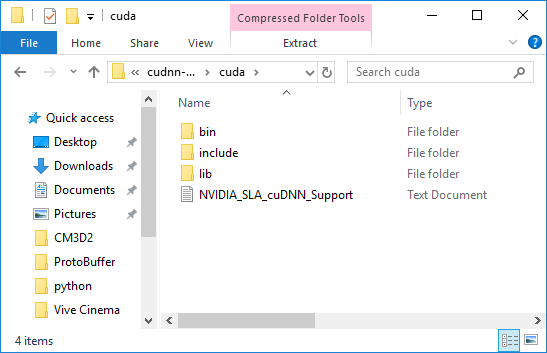

# Windows ����ڸ� ���� ML-Agents Toolkit ��ġ ���

ML-Agents toolkit�� Windows 10�� �����մϴ�. �ٸ� ������ Windows ���ε� ML-Agents toolkit��
����� �� ������ �������� �ʾҽ��ϴ�. ����, ML-Agents toolkit�� Windows VM(Bootcamp �Ǵ� ���� ó��
ȯ�� ����)�� ��� ���� �������� �ʾҽ��ϴ� .

ML-Agents toolkit�� ����ϱ� ����, �Ʒ��� ����Ȱ� ó�� Python�� �䱸�Ǵ� Python ��Ű���� ��ġ�ؾ� �մϴ�.
�� ���̵�� ���� GPU ��� �н�(�����ڸ� ����)�� ���� ���� ����� �ٷ�ϴ�.
����, ML-Agents toolkit�� ���� GPU ��� �н��� �ʿ����� ������ ���� ���� �Ǵ� Ư�� ���׿� �ʿ��� �� �ֽ��ϴ�.

## �ܰ� 1: Anaconda�� ���� Python ��ġ

Windows ������ Anaconda�� [�ٿ�ε�](https://www.anaconda.com/download/#windows)�ϰ� ��ġ�Ͻʽÿ�.
Anaconda�� ��������ν�, �ٸ� ���� ������ Python�� �и��� ȯ�濡�� ������ �� �ֽ��ϴ�.
Python 2�� ���̻� �������� �ʱ� ������ Python 3.10�� �ʿ��մϴ�. �� ���̵忡�� �츮��
Python 3.10.12 ������ Anaconda 5.1 ������ ����� ���Դϴ�.
([64-bit](https://repo.continuum.io/archive/Anaconda3-5.1.0-Windows-x86_64.exe)
�Ǵ� [32-bit](https://repo.continuum.io/archive/Anaconda3-5.1.0-Windows-x86.exe)
��ũ).

<p align="center">
  
</p>

����Ʈ _advanced installation options_�� �����ϴ� ���� ��õ������ ��Ȳ�� ���� ������ �ɼ��� �����Ͻʽÿ�.

<p align="center">
  
</p>

��ġ �Ŀ� �ݵ�� __Anaconda Navigator__ �� ���� ������ �Ϸ��ؾ� �մϴ�.
Windows Ž�� â����, _anaconda navigator_ �� Ÿ�����Ͽ� Anaconda Navigator �� �� �� �ֽ��ϴ�.

ȯ�� ������ �����Ǿ����� �ʴٸ� `conda` ��ɾ Ÿ�������� ��
"conda is not recognized as internal or external command" ��� ������ ���� ���Դϴ�.
�̸� �ذ��ϱ� ���� ��Ȯ�� ȯ�� ���� ������ �ʿ��մϴ�.

Ž�� â���� `ȯ�� ����`�� Ÿ���� �Ͽ� (������ Ű�� �����ų� ���� �Ʒ� ������ ��ư�� ���� �� �� �ֽ��ϴ�).
 __�ý��� ȯ�� ���� ����__ �ɼ��� �ҷ��ɴϴ�.

<p align="center">
  
</p>

�� �ɼǿ��� __ȯ�� ����__ ��ư�� Ŭ���ϰ�. �Ʒ� __�ý��� ����__���� "Path" ������ ���� Ŭ���ϰ� __���� �����__�� Ŭ���Ͽ� ���� �� path�� �߰��Ͻʽÿ�.

```console
%UserProfile%\Anaconda3\Scripts
%UserProfile%\Anaconda3\Scripts\conda.exe
%UserProfile%\Anaconda3
%UserProfile%\Anaconda3\python.exe
```

## �ܰ� 2: ���ο� Conda ȯ�� ���� �� Ȱ��ȭ

ML-Agents toolkit�� �Բ� ����� ���ο� [Conda ȯ��](https://conda.io/docs/)�� ���� ���Դϴ�.
�� �۾��� ��ġ�� ��� ��Ű���� �� ȯ�濡�� ���ѵȴٴ� ���� �ǹ��մϴ�. �̴� �ٸ� ȯ���̳� �ٸ� ���̽� ��ġ��
������ ��ġ�� �ʽ��ϴ�. ML-Agents�� ������ ������ �׻� Conda ȯ���� Ȱ��ȭ ���Ѿ� �մϴ�.

���ο� Conda ȯ���� ����� ����, ���ο� Anaconda ������Ʈ(Ž�� â���� _Anaconda Prompt_�� Ŭ��)�� ���� ����
��ɾ Ÿ���� �Ͻʽÿ�:

```sh
conda create -n ml-agents python=3.10.12
```

�� ��Ű���� ��ġ�ϱ� ���� �޼����� ���� ��� `y`�� Ÿ�����ϰ� ���͸� �����ʽÿ� _(���ͳ��� ����Ǿ��ִ��� Ȯ���Ͻʽÿ�)_.
�� �䱸�Ǵ� ��Ű������ �ݵ�� ��ġ�ؾ� �մϴ�. ���ο� Conda ȯ�濡�� Python 3.10.12 ������ ���Ǹ� ml-agents�� ȣ��˴ϴ�.

<p align="center">
  
</p>

�ռ� ���� ȯ���� �̿��ϱ� ���� �ݵ�� Ȱ��ȭ�� �ؾ��մϴ�. _(���Ŀ� ���� ��ɾ� ���� ȯ���� ������ �� �ֽ��ϴ�)_.
���� Anaconda ������Ʈ���� ���� ��ɾ Ÿ���� �Ͻʽÿ�:

```sh
activate ml-agents
```

Ȱ��ȭ �Ŀ� `(ml-agents)`��� ���ڰ� ������ �� �տ� ��Ÿ���� ���� �� �� �ֽ��ϴ�.

��������, `tensorflow`�� ��ġ�մϴ�. ���̽� ��Ű���� ��ġ�ϱ� ���� ����ϴ� `pip`��� ��Ű�� ���� �ý��۸� ����Ͽ� ��ġ�� �� �ֽ��ϴ�.
�ֽ� ������ TensorFlow�� �۵����� ���� �� �����Ƿ�, ��ġ ������ 1.7.1���� Ȯ���ؾ� �մϴ�. ���� Anaconda ������Ʈ â����
���� ��ɾ Ÿ���� �Ͻʽÿ�._(���ͳ��� ����Ǿ� �ִ��� Ȯ���Ͽ� �ֽʽÿ�)_:

```sh
pip install tensorflow==1.7.1
```

## �ܰ� 3: �ʼ� ���̽� ��Ű�� ��ġ

ML-Agents toolkit�� ���� ���̽� ��Ű���� �������Դϴ�. `pip`�� ����Ͽ� �� ���̽� ���Ӽ����� ��ġ�Ͻʽÿ�.

ML-Agents Toolkit ����� ����Ұ� ���� ��ǻ�Ϳ� �����Ǿ����� �ʾҴٸ� �����Ͻʽÿ�. Git�� ([�ٿ�ε�](https://git-scm.com/download/win))�ϰ�
�����Ų �� ���� ��ɾ Anaconda ������Ʈâ�� �Է��Ͽ� ������ �� �ֽ��ϴ�. _(���� �� ������Ʈ â�� �����ִٸ� `activate ml-agents`�� Ÿ�����Ͽ�
ml-agents Conda ȯ���� Ȱ��ȭ �Ǿ��ִ��� Ȯ���Ͻʽÿ�)_:

```sh
git clone https://github.com/Unity-Technologies/ml-agents.git
```

���� Git�� ����ϰ� ���� �ʴٸ� ������ [��ũ](https://github.com/Unity-Technologies/ml-agents/archive/main.zip)���� ��� ������ �ٿ�ε� �� �� �ֽ��ϴ�.

`UnitySDK` ���� ���丮���� ������Ʈ�� �߰��� ����Ƽ �ּ��� ���ԵǾ� �ֽ��ϴ�. ���� �����ϴµ� ������ �Ǵ� ���� [���� ȯ��](Learning-Environment-Examples.md)���� �ֽ��ϴ�.

`ml-agents` ���� ���丮���� ����Ƽ ȯ��� �԰� ����ϴ� ���� ��ȭ�н� Ʈ���̳� ���̽� ��Ű���� ���ԵǾ� �ֽ��ϴ�.

`ml-agents-envs` ���� ���丮���� `ml-agents` ��Ű���� ���ӵǴ� ����Ƽ�� �������̽��� ���� ���̽� API�� ���ԵǾ� �ֽ��ϴ�.

`gym-unity` ���� ���丮���� OpenAI Gym�� �������̽��� ���� ��Ű���� ���ԵǾ� �ֽ��ϴ�.

`mlagents-learn`�� ������ �� Ʈ���̳��� ȯ�� ���� ������ �� ���丮 �ȿ� �ʿ��ϹǷ�, ������ �ٿ�ε� �� ���丮�� ��ġ�� ����Ͻʽÿ�.
���ͳ��� ����Ǿ����� Ȯ���ϰ� Anaconda ������Ʈ���� ���� ��ɾ Ÿ���� �Ͻʽÿ�t:

```console
pip install mlagents
```

ML-Agents toolkit�� ������ �� �ʿ��� ��� ���̽� ��Ű���� ��ġ�� �Ϸ��� ���Դϴ�.

Windows���� ���� pip�� ����Ͽ� Ư�� ���̽� ��Ű���� ��ġ�� �� ��Ű���� ij���� �д� ���� ���� ���� �ֽ��ϴ�.
������ ���� ������ �ذ��� �� �� �ֽ��ϴ�:

```console
pip install mlagents --no-cache-dir
```

`--no-cache-dir`�� pip���� ij���� ��Ȱ��ȭ �Ѵٴ� ���Դϴ�.


### ������ ���� ��ġ

���� `ml-agents` �Ǵ� `ml-agents-envs`�� �����ϰ� �ʹٸ�, PyPi�� �ƴ� ������ ����ҷ� ���� ��Ű���� ��ġ�ؾ� �մϴ�.
�̸� ����, `ml-agents` �� `ml-agents-envs` �� ���� ��ġ�ؾ� �մϴ�.

�������� ������ `C:\Downloads`�� ��ġ�� �ֽ��ϴ�. ������ �����ϰų� �ٿ�ε��� ��
Anaconda ������Ʈ���� ml-agents ���丮 ���� ml-agents ���� ���丮�� �����Ͻʽÿ�:

```console
cd C:\Downloads\ml-agents
```

������� ���� ���丮���� ������ �����Ͻʽÿ�:

```console
cd ml-agents-envs
pip install -e .
cd ..
cd ml-agents
pip install -e .
```

`-e` �÷��׸� ����Ͽ� pip�� ���� �ϸ� ���̽� ������ ���� ������ �� �ְ� `mlagents-learn`�� ������ �� �ݿ��˴ϴ�.
`mlagents` ��Ű���� `mlagents_envs`�� �������̰�, �ٸ� ������ ��ġ�ϸ� PyPi�� ���� `mlagents_envs` �� ��ġ�� �� �ֱ� ������
�� ������� ��Ű���� ��ġ�ϴ� ���� �߿��մϴ�.

## (�ɼ�) Step 4: ML-Agents Toolkit�� ����� GPU �н�

ML-Agents toolkit�� ���� GPU�� �ʿ����� ������ �н� �߿� PPO �˰��� �ӵ��� ũ�� ������ ���մϴ�(������ ���Ŀ� GPU�� ������ �� �� �ֽ��ϴ�).
�� ���̵�� GPU�� ����� �н��� �ϰ� ���� ��� ����ڸ� ���� ���̵� �Դϴ�. ���� GPU�� CUDA�� ȣȯ�Ǵ��� Ȯ���ؾ� �մϴ�.
[����](https://developer.nvidia.com/cuda-gpus) Nvidia ���������� Ȯ���� �ֽʽÿ�.

���� ML-Agents toolkit �� CUDA 9.0 ������ cuDNN 7.0.5 ������ �����˴ϴ�.

### Nvidia CUDA toolkit ��ġ

Nvidia ��ī�̺꿡�� CUDA ��Ŷ(toolkit) 9.0�� [�ٿ�ε�](https://developer.nvidia.com/cuda-toolkit-archive)�ϰ� ��ġ�Ͻʽÿ�.
ML-Agents toolkit�� �����Ű�� ���� CUDA ��Ŷ�� GPU ���� ���̺귯��,
�����-����ȭ ����, C/C++(���־� ��Ʃ��� 2017) �����Ϸ�, ��Ÿ�� ���̺귯���� �����մϴ�.
�� ���̵忡���� [9.0.176](https://developer.nvidia.com/compute/cuda/9.0/Prod/network_installers/cuda_9.0.176_win10_network-exe))������ ����մϴ�.

��ġ�ϱ� ��, __���� ���� ����Ƽ �Ǵ� ���־� ��Ʃ����� �����ߴ���__ Ȯ���Ͽ� �ֽʽÿ�.

�ν��緯�� �����ϰ� Express �ɼ��� �����Ͻʽÿ�. CUDA ��Ŷ�� ��ġ�� ���丮�� ������ �ֽʽÿ�. �� ���̵忡����,
`C:\Program Files\NVIDIA GPU Computing Toolkit\CUDA\v9.0` ��ο� ��ġ�մϴ�.

### Nvidia cuDNN ���̺귯�� ��ġ

Nvidia���� cuDNN ���̺귯���� [�ٿ�ε�](https://developer.nvidia.com/cudnn)�ϰ� ��ġ�Ͻʽÿ�.
cuDNN�� ���� �Ű���� ���� �⺻�� �Ǵ� GPU ���� ���̺귯��. �ٿ�ε� ���� Nvidia Developer Program�� �����ؾ��� ���Դϴ�(����).

<p align="center">
  
</p>

�����ϰ� cuDNN [�ٿ�ε� ������](https://developer.nvidia.com/cudnn)�� ���ư��ʽÿ�.
ª�� �������翡 �����ؾ� �� ���� �ֽ��ϴ�. When you get to the list
cuDNN ������ ����Ʈ���� __�ܰ� 1���� ��ġ�� CUDA ��Ŷ�� �´� ������ �ٿ�ε��ϰ� �ִ��� Ȯ���Ͻʽÿ�.__ �� ���̵忡����,
CUDA ��Ŷ 9.0 ������ ���� 7.0.5 ������ ����մϴ�
([�ٿ�ε� ��ũ](https://developer.nvidia.com/compute/machine-learning/cudnn/secure/v7.0.5/prod/9.0_20171129/cudnn-9.0-windows10-x64-v7)).

cuDNN ������ �ٿ�ε� �� �Ŀ�, CUDA ��Ŷ ���丮�ȿ� ������ ����(���� ����)�ؾ� �մϴ�.
cuDNN zip ���� �ȿ��� ������ ���� `bin`, `include`, �׸��� `lib`�� �ֽ��ϴ�.

<p align="center">
  
</p>

�� ������ ������ CUDA ��Ŷ ���丮�ȿ� �����Ͻʽÿ�.
CUDA ��Ŷ ���丮�� `C:\Program Files\NVIDIA GPU Computing Toolkit\CUDA\v9.0`�� ��ġ�� �ֽ��ϴ�.

<p align="center">
  
</p>

### ȯ�� ���� ����

1���� ȯ�� ������ 2���� ��� ������ �߰��ؾ� �մϴ�.

ȯ�� ������ �����ϱ� ����, Ž�� â���� `ȯ�� ����`�� Ÿ���� �Ͽ� (������ Ű�� �����ų� ���� �Ʒ� ������ ��ư�� ���� �� �� �ֽ��ϴ�).
 __�ý��� ȯ�� ���� ����__ �ɼ��� �ҷ��ɴϴ�.

<p align="center">
  
</p>

�� �ɼǿ��� __ȯ�� ����__ ��ư�� Ŭ���ϰ� �ý��� ������ __���� �����__�� Ŭ���Ͻʽÿ� _(����� ������ �ƴ� �Ʒ��� __�ý��� ����__���� Ȯ���Ͻʽÿ�).

<p align="center">
  
</p>

__���� �̸�__�� `CUDA_HOME`���� �����ϰ� ���� ������ CUDA ��Ŷ ���丮 ��θ� �Է��� �ֽʽÿ�.
�� ���̵忡�� ���丮 ��δ� `C:\Program Files\NVIDIA GPU Computing Toolkit\CUDA\v9.0` �Դϴ�. Ȯ�� ��ư�� �����ֽʽÿ�.

<p align="center">
  
</p>

2���� ��� ���� ������ ���� __ȯ�� ����__ â �׸��� �Ʒ� �ι�° �ڽ��� __�ý��� ����__�ȿ���,
`Path` ������ ã�� Ŭ���ϰ� __����__��ư�� �����ʽÿ�. ����Ʈ�� 2���� ���丮�� �߰��� ���Դϴ�. �� ���丮�� ������ �����ϴ�:

```console
C:\Program Files\NVIDIA GPU Computing Toolkit\CUDA\v9.0\lib\x64
C:\Program Files\NVIDIA GPU Computing Toolkit\CUDA\v9.0\extras\CUPTI\libx64
```

���� ���丮 ��ġ�� ��ġ�� ���丮 ������� Ȯ���Ͻʽÿ�. _��ҹ��ڿ� �����Ͻʽÿ�_.

<p align="center">
    
</p>

### TensorFlow GPU ��ġ

����, `pip`�� ����Ͽ� 1.7.1. ���� `tensorflow-gpu`�� ��ġ�Ͻʽÿ� . ml-agents Conda ȯ���� Ȱ��ȭ ��Ų Anaconda ������Ʈ����
CPU�� TensorFlow �����ϰ� GPU�� TensorFlow�� ��ġ�ϱ� ���� ���� ��ɾ Ÿ���� �Ͻʽÿ� _(���ͳ��� ����Ǿ� �ִ��� Ȯ���Ͻʽÿ�)_:

```sh
pip uninstall tensorflow
pip install tensorflow-gpu==1.7.1
```

����������, ��� ���� ����� ��ġ�Ǿ� �ְ�, Tensorflow���� GPU�� �ν��ϰ� �ִ��� �׽�Ʈ�ؾ��մϴ�.
���� Anaconda ������Ʈ���� Python�� ȣ���Ͽ� ���ϴ�:

```sh
python
```

�׸��� ���� ��ɾ Ÿ���� �Ͻʽÿ�:

```python
import tensorflow as tf

sess = tf.Session(config=tf.ConfigProto(log_device_placement=True))
```

������ ����� ������ �� �� ���� ���Դϴ�:

```console
Found device 0 with properties ...
```

## Acknowledgments

�� ���̵带 ����� ���� ���� �ʾ��� �ۼ���
[Jason Weimann](https://unity3d.college/2017/10/25/machine-learning-in-unity3d-setting-up-the-environment-tensorflow-for-agentml-on-windows-10/)
��
[Nitish S. Mutha](http://blog.nitishmutha.com/tensorflow/2017/01/22/TensorFlow-with-gpu-for-windows.html)
���� ����帳�ϴ�.

## �ѱ� ����

�ش� ������ �ѱ� ������ [������ (Hyeonjun Jang)]([https://github.com/janghyeonjun](https://github.com/janghyeonjun))�� ���� ����Ǿ����ϴ�. ����� ������ ��Ż�ڰ� �ִ� ��� totok682@naver.com ���� �����ֽø� ����帮�ڽ��ϴ�.
