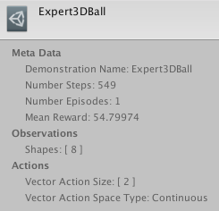

# 모방학습을 통한 에이전트 학습

에이전트가 시행착오를 통해 스스로 학습하는 것보다 단순히 에이전트가 수행하기를 원하는 행동을 우리가 알려주는 것이 더 직관적일 수 있습니다. 위생병 NPC를 학습하기 위한 [실행 예시](ML-Agents-Overview.md#running-example-training-npc-behaviors) 문서 내용에 대해 생각해보겠습니다. 보상 함수를 이용하여 위생병의 행동을 간접적으로 학습하는 것이 아니라 게임에서 얻어진 관측 (observation)과 게임 컨트롤러를 통해 얻어진 행동들 (actions)의 실제 데이터를 통해 위생병의 행동을 결정하도록 학습합니다. 모방학습 (Imitation Learning)은 실제 플레이를 통해 얻어진 관측과 행동 데이터 쌍을 이용하여 에이전트의 정책을 학습합니다. [비디오 링크](https://youtu.be/kpb8ZkMBFYs).

## 시범 (Demonstration) 데이터 기록

유니티 에디터를 이용하여 에이전트의 플레이를 기록하고 에셋으로 저장하는 것이 가능합니다. 이런 플레이 데이터에는 기록을 진행하는 동안의 관측, 행동 그리고 보상 정보가 포함됩니다. 이것들은 데이터를 통해 관리가 가능하며 Behavioral Cloning과 같은 오프라인 학습에 사용될 수 있습니다. (아래 내용 참고)

에이전트의 플레이 데이터를 기록하기 위해서는 씬(Scene)에서 `Agent` 컴포넌트를 포함하고 있는 GameObject에 `Demonstration Recorder` 컴포넌트를 추가해주어야 합니다. 일단 추가되고나면 에이전트로부터 플레이 데이터를 기록할 수 있게 됩니다.

  

`Record`가 체크되는 경우 씬이 실행되면 데이터가 생성됩니다. 환경의 난이도에 따라 모방학습에 사용하기 위해 몇분에서 몇시간 정도 플레이 데이터를 수집해야합니다. 충분한 데이터가 기록되었으면 유니티 상에서 게임의 실행을 정지합니다. 그렇게 하면 `.demo` 파일이 `Assets/Demonstations` 폴더 내부에 생성됩니다. 이 파일에는 에이전트의 플레이 데이터가 저장되어 있습니다. 이 파일을 클릭하면 인스펙터 상에 데모 파일에 대한 정보를 아래와 같이 알려줍니다.

  

## Behavioral Cloning을 통한 학습

모방학습을 위한 다양한 알고리즘이 존재하며 모방학습 알고리즘 중 가장 간단한 알고리즘이 Behavioral Cloning 입니다. 이 알고리즘은 마치 이미지 분류를 위한 지도학습 (Supervised Learning)이나 기타 고전적인 머신러닝 기법들처럼 전문가의 플레이로부터 수집된 데이터를 직접적으로 모방하도록 정책 (Policy)을 학습합니다.

### 오프라인 학습

오프라인 Behavioral Cloning에서 우리는 에이전트의 행동을 학습하기 위해 `Demonstration Recorder`를 통해 생성된 `demo` 파일을 데이터 셋으로 이용합니다.

1. 전문가의 플레이 데이터를 모방하도록 학습하는 에이전트 선택
2. `Demonstration Recorder`를 이용하여 전문가의 플레이를 기록합니다. (위의 내용 참고)
   앞으로 설명을 위해 이 기록된 파일의 이름을 `AgentRecording.demo`라고 하겠습니다.
3. 씬을 빌드하고 에이전트에게 러닝 브레인 (Learning Brain)을 할당합니다. 그리고 아카데미의 Broadcast Hub에서 이 브레인의 Control을 체크해줍니다. 브레인에 대한 정보가 필요하시면 다음의 [문서](Learning-Environment-Design-Brains.md)를 참고해주세요.
4.  `config/offline_bc_config.yaml` 파일을 열어줍니다.
5. `demo_path` 파라미터를 스텝 2에서 기록한 데모 파일의 경로로 수정해줍니다. 이번 예시의 경우 설정된 경로는 다음과 같습니다:  `./UnitySDK/Assets/Demonstrations/AgentRecording.demo`
6. `./config/offline_bc_config.yaml` 을 설정 파라미터로 하는 mlagent-learn을 실행하며 `--run-id` 와 `--train` 을 입력합니다. 빌드된 환경이 standalone으로 컴파일되었거나 에디터에서 train이 생략된 경우 `--env` 파라미터에 빌드된 환경의 경로를 기입해주세요.
   ​
7. (선택적) 텐서 보드를 활용하여 학습 성능을 확인해보세요!.

위 방법은 데모 파일을 이용하여 에이전트가 직접적으로 전문가의 행동을 따라하도록 인공신경망을 학습하는 기법입니다. 환경은 학습이 진행되는 동안 에이전트의 성능을 평가하기 위해 실행되며 사용될 것입니다.

### 온라인 학습

미리 생성된 데모 파일 없이 학습이 진행되는 동안 실시간으로 전문가의 플레이 데이터를 제공하며 에이전트를 학습하는 것도 간으합니다. 이 방법은 다음의 단계를 따라 진행됩니다:
without pre-recording a demonstration file. The steps to do this are as follows:

1. 먼저 두개의 브레인들을 생성합니다. 하나는 "선생님"이 될 것이고 하나는 "학생"이 될 것입니다. 이번 예시에서는 두개의 브레인 에셋의 이름을 각각 "Teacher"와 "Student"로 설정할 것입니다.
2. "Teacher" 브레인은 반드시 **플레이어 브레인 (Player Brain)**이어야 합니다.
3. "Student" 브레인은 반드시 **러닝 브레인 (Learning Brain)**이어야 합니다.
4. "Teacher" 브레인과 "Student" 브레인의 파라미터는 에이전트에서 설정한대로 동일하게 설정되어야 합니다.
5. "Teacher" 브레인과 "Student" 브레인을 아카데미의 `Broadcast Hub`에 추가하고 "Student" 브레인의 `Control` 체크박스에 체크를 해줍니다.
6. 브레인들을 원하는 에이전트들에게 연결해줍니다. (하나의 에이전트는 선생님으로 설정되어야 하며 적어도 하나의 에이전트는 학생으로 설정되어야 합니다).
7. `config/online_bc_config.yaml` 파일에서, "Student" 브레인에 대한 항목을 추가해야합니다.  `trainer` 파라미터를 `online_bc`로 설정하고 `brain_to_imitate` 파라미터를 선생님 에이전트의 브레인 이름인 "Teacher"로 설정합니다. 추가적으로 각 순간마다 얼마나 많은 학습을 진행할지 결정하는 `batches_per_epoch`를 설정합니다. 에이전트를 더 오랜 기간동안 학습하고 싶은 경우  `max_steps` 값을 증가시켜주세요.
8. `mlagents-learn config/online_bc_config.yaml
   ​--train —slow`를 통해 학습과정을 실행하고 화면에 _"Start training by pressing the Play button in the Unity Editor"_ 라는 메세지가 출력되면 유니티의 :arrow_forward: 버튼을 눌러주세요
9. 유니티 윈도우 상에서 선생님 브레인을 가진 에이전트를 제어하면서 원하는대로 플레이 데이터를 생성합니다.
10. 학생 브레인을 가진 에이전트(들)을 살펴보면 선생님 브레인을 가진 에이전트의 플레이와 유사하게 행동하기 시작합니다.
11. 학생 에이전트들이 원하는대로 행동하게 되면 커멘드 라인에서 `CTL+C`를 눌러서 학습을 중단하십시오.
12. 생성된 `*.nn` 파일을 Assets 폴더의 하위 폴더인 `TFModels`  폴더로 이동시키고 이 파일을  `러닝` 브레인에 사용하세요.

**BC Teacher Helper**

더 편리한 사용을 위해서, `BC Teacher Helper` 컴포넌트를 선생님 에이전트에 사용할 수 있습니다.

  

이것을 사용하면 다음과 같은 키보드 단축키를 사용할 수 있습니다:

1. 기록을 시작하거나 중단할 수 있습니다. 이것은 에이전트를 통해 게임을 플레이하되 에이전트가 학습은 되지 않도록 사용할 때 유용합니다. 이것에 대한 기본적인 실행은 키보드의  `R`  버튼을 누르면 됩니다.
2. 트레이닝 버퍼를 리셋합니다. 이 명령을 통해 에이전트가 최근의 경험에 대한 버퍼를 비우도록 설정합니다. 이것은 에이전트가 빠르게 새로운 행동을 배우게 하고싶을때 사용하면 유용합니다. 버퍼를 리셋하기 위한 기본 명령은 키보드의  `C` 버튼을 누르면 됩니다.

## 한글 번역

해당 문서의 한글 번역은 [민규식 (Kyushik Min)]([https://github.com/Kyushik](https://github.com/Kyushik))에 의해 진행되었습니다. 내용상 오류나 오탈자가 있는 경우 kyushikmin@gmail.com 으로 연락주시면 감사드리겠습니다.
