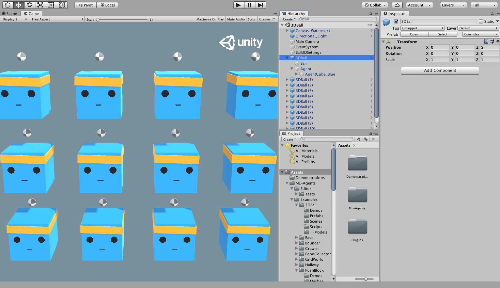

# Başlangıç Rehberi

Bu rehber, Unity'de [örnek ortamlarımızdan](https://github.com/Unity-Technologies/ml-agents/blob/release_8_docs/docs/Learning-Environment-Examples.md) birini açma, içinde bir Agent 'i eğitme ve eğitilmiş modeli Unity ortamına yerleştirme sürecini baştan sona anlatır. Bu rehberi bitirdikten sonra örnek ortamlardan herhangi birini kullanabilecek hale geleceksiniz. [Unity Engine](https://unity.com/products) 'e aşina değilseniz, [Background: Unity](https://unity.com/products) sayfasına bakarak yararlı noktaları öğrenebilirsiniz. Ek olarak, makine öğrenimine aşina değilseniz, kısa bir genel bakış ve ipuçları için [Background: Machine Learning](https://github.com/Unity-Technologies/ml-agents/blob/release_8_docs/docs/Background-Machine-Learning.md) sayfamızı görüntüleyin.


Bu rehber için, biz bir dizi `agent(temsilci)` küpleri ve topları içeren **3D Balance Ball** ortamını kullanacağız (hepsi birbirinin kopyası). Her ajan(agent - temsilci) küpü yatay ve dikey olarak dönerek topun düşmesini önlemeye çalışır. Bu Unity ortamında, ajan **Agent** küp her adımında topu dengelediğinde ödül kazanacaktır. Bir temsilci`(agent)` ayrıca, topu düşürdüğü için olumsuz bir ödülle cezalandırılır. Eğitim sürecinin amacı, temsilcilerin topu kafalarında dengelemeyi öğrenmelerini sağlamaktır. Ödül - ceza mekanizmasıyla yapay zekayı eğitmeyi amaçlıyoruz.

Hadi başlayalım!

## Kurulum

Henüz yapmadıysanız, [kurulum talimatlarını](Installation.md) izleyin. Daha sonra Unity ortamlarını içeren `Project` klasörünü açın:

1. Unity Hub'ı başlatın.
1. Projects iletişim kutusunda, pencerenin üst kısmındaki `Add` seçeneğini seçin.
1. Açılan dosya diyalog penceresini kullanarak indirdiğiniz ML-Agents Toolkit içindeki `Project` klasörünü bulun ve `Open`'a tıklayın. Açılması için güncelleme isterse, projeyi güncelleyin.
1. Unity içerisinde **Project** penceresinde
   `Assets/ML-Agents/Examples/3DBall/Scenes` dosyasını bulun ve  `3DBall` sahne dosyasını açın.

## Unity Ortamlarını Anlamak

Bir ajan`(agent)`, çevreyi gözlemleyen ve onunla etkileşime giren özerk bir aktördür. Unity bağlamında, ortam, bir veya daha fazla Ajan nesnesini ve tabii ki bir ajanın etkileşimde bulunduğu diğer varlıkları içeren bir sahnedir.



**Note:** Unity'de, bir sahnedeki her şeyin temel nesnesi _GameObject_'tir. GameObject, temelde davranışlar, grafikler, fizik vb. dahil diğer her şey için bir kapsayıcıdır. Bir GameObject'i oluşturan bileşenleri görmek için, Sahne penceresinde GameObject'i seçin ve Inspector penceresini açın. Inspector penceresi, GameObject üzerindeki her bileşeni gösterir.

3D Balance Ball sahnesini açtıktan sonra fark edebileceğiniz ilk şey, bir değil, birkaç ajan küpü içermesidir. Sahnedeki her ajan küpü bağımsız bir ajandır, ancak hepsi aynı davranışı paylaşır. On iki temsilcinin tümü eğitime paralel olarak katkıda bulunduğundan, 3D Balance Ball eğitimini bu şekilde hızlandırabilirsiniz.

### Agent

Temsilci`(agent - ajan)`, ortamı gözlemleyen ve çevreyi harekete geçiren aktördür. 3B Balance Ball sahne ortamında, Agent bileşenleri on iki `Agent` GameObject'e yerleştirilir. Temel Agent nesnesinin davranışını etkileyen birkaç özelliği vardır:

- **Behavior Parameters** — Her Agent'in bir Behavior(Davranış Modeli) olmalıdır. Davranış`(Behavior)` ajanın nasıl karar vereceğini belirler.
- **Max Step** — Agent'ın bölümü bitirmeden önce kaç simülasyon adımı gerçekleştireceğini belirler. 3D Balance Ball'da, bir Ajan 5000 adımdan sonra yeniden başlatılır.

#### Davranış Parametreleri(Behavior Parameters): Vektör Gözlem Uzayı(Vector Observation Space)

Bir karar vermeden önce, bir temsilci dünyadaki durumu hakkındaki gözlemini toplar. Vektör gözlemi, ajanın karar vermesi için ilgili bilgileri içeren kayan nokta sayılarının bir vektörüdür.

3D Balance Ball örneğinin davranış(behavior) parametreleri, 8 Uzay Boyutu`(Space Size)` kullanır.
Bu, Ajanın gözlemlerini içeren özellik vektörünün sekiz öğe içerdiği anlamına gelir: agent küpün dönüşünün `x` ve `z` bileşenleri ve topun göreceli konumu ve hızının `x`, `y` ve `z` bileşenleri.

#### Davranış parametreleri : Vektör Eylem Alanı - (Behavior Parameters: Vector Action Space)

Bir Ajana çeşitli değerler dizisi şeklinde talimatlar verilir.
ML-Agent Toolkit, eylemleri iki türe sınıflandırır: sürekli ve ayrık(continuous and discrete). 3D Balance Ball örneği, sürekli olarak değişebilen bir sayı vektörü olan sürekli eylem alanını kullanmak üzere programlanmıştır. Daha spesifik olarak, topu kafasında dengede tutmak için kendisine uygulanacak `x` ve `z` dönüşlerinin miktarını kontrol etmek için 2 Uzay Boyutu`(Space Size)` kullanılabilir.

## Önceden eğitilmiş modeli çalıştırma

Ajanlarımız (`.nn` dosyaları) için önceden eğitilmiş modeller ortamımıza ekliyoruz  ve bu modelleri Unity içinde çalıştırmak için [Sentis]([Sentis](Unity-Inference-Engine.md)'i kullanıyoruz. Bu bölümde, 3D Ball örneği için önceden eğitilmiş modeli bir sinir ağı kullanacağız.

1. **Project** penceresinde `Assets/ML-Agents/Examples/3DBall/Prefabs` klasörüne gidin. `3DBall`'ın içerisini genişletin ve `Agent` hazır yapısına tıklayın. `Agent` hazır yapısını **Inspector** penceresinde görmelisiniz.

   **Not**: `3DBall` sahnesindeki platformlar, `3DBall` prefab kullanılarak oluşturuldu. 12 platformu tek tek güncellemek yerine, `3DBall` prefabını değiştirerek diğer platformların da yapısını güncelleyebilirsiniz.

   

1. **Project** penceresinde, `Assets/ML-Agents/Examples/3DBall/TFModels`'te bulunan `3DBall` sinir ağı modelini(`.nn` uzantılı dosya), **Agent** GameObject **Inspector** penceresindeki `Behavior Parameters (Script)` bileşeni altındaki `Model` özelliğine sürükleyin.

   

1. **Hierarchy** pencerelerindeki her bir `3DBall` altındaki her Agent'ın artık `Behavior Parameters`'inde `Model` olarak `3DBall`'ı içerdiğini fark etmelisiniz. Prefab'daki modeli değiştirdiğimizde bütün nesneleri etkiledik.
   **Not** : Sahne **Hierarchy**'deki arama çubuğunu kullanarak bir sahnedeki birden fazla oyun nesnesini aynı anda seçerek değiştirebilirsiniz.
1. **Inference Device**'yi bu model için `CPU` olarak kullanılacak şekilde ayarlayın.
1. Unity editöründeki **Oynat(Play)** düğmesine tıklayın ve platformların önceden eğitilmiş modeli kullanarak topları dengelediğini göreceksiniz.

## Pekiştirmeli(Reinforcement) Öğrenme ile yeni bir model eğitmek

Bu ortamdaki aracılar için önceden eğitilmiş `.nn` dosyaları sağlasak da, kendi oluşturduğunuz herhangi bir ortamda yeni bir model dosyası oluşturmak için sıfırdan eğitim aracıları gerekir. Bu bölümde, bunu başarmak için ML-Agents Python paketinin parçası olan pekiştirmeli öğrenme algoritmalarının nasıl kullanılacağını göstereceğiz. Hem eğitim hem de çıkarım aşamalarını yapılandırmak için kullanılan argümanları kabul eden uygun bir `mlagents-learn` komutu sağladık.

### Ortamı eğitmek

1. Bir komut veya terminal penceresi açın.
1. Terminalde `ml-agent` deposunu klonladığınız klasöre gidin. **Not**: [Varsayılan kurulumu](Installation.md) izlediyseniz, `mlagents-learn`'ü herhangi bir dizinden çalıştırabilmelisiniz.
1. `mlagents-learn config/ppo/3DBall.yaml --run-id=first3DBallRun` komutunu çalıştırın.
   - `config/ppo/3DBall.yaml` sağladığımız varsayılan eğitimin konfigürasyon dosyasıdır. `config/ppo` klasörü, 3DBall dahil tüm örnek ortamlarımız için eğitim yapılandırma dosyalarını içerir.
   - `run-id` bu eğitime özel benzersiz bir addır.
1. Ekranda _"Start training by pressing the Play button in the Unity Editor"_ mesajı görüntülendiğinde, editör'de eğitime başlamak için Unity'deki **Play(Oynat)** düğmesine basabilirsiniz.

`mlagents-learn` doğru şekilde çalışırsa ve eğitime başlarsa, şuna benzer bir şey görmelisiniz:

```console
INFO:mlagents_envs:
'Ball3DAcademy' started successfully!
Unity Academy name: Ball3DAcademy

INFO:mlagents_envs:Connected new brain:
Unity brain name: 3DBallLearning
        Number of Visual Observations (per agent): 0
        Vector Observation space size (per agent): 8
        Number of stacked Vector Observation: 1
        Vector Action space type: continuous
        Vector Action space size (per agent): [2]
        Vector Action descriptions: ,
INFO:mlagents_envs:Hyperparameters for the PPO Trainer of brain 3DBallLearning:
        batch_size:          64
        beta:                0.001
        buffer_size:         12000
        epsilon:             0.2
        gamma:               0.995
        hidden_units:        128
        lambd:               0.99
        learning_rate:       0.0003
        max_steps:           5.0e4
        normalize:           True
        num_epoch:           3
        num_layers:          2
        time_horizon:        1000
        sequence_length:     64
        summary_freq:        1000
        use_recurrent:       False
        memory_size:         256
        use_curiosity:       False
        curiosity_strength:  0.01
        curiosity_enc_size:  128
        output_path: ./results/first3DBallRun/3DBallLearning
INFO:mlagents.trainers: first3DBallRun: 3DBallLearning: Step: 1000. Mean Reward: 1.242. Std of Reward: 0.746. Training.
INFO:mlagents.trainers: first3DBallRun: 3DBallLearning: Step: 2000. Mean Reward: 1.319. Std of Reward: 0.693. Training.
INFO:mlagents.trainers: first3DBallRun: 3DBallLearning: Step: 3000. Mean Reward: 1.804. Std of Reward: 1.056. Training.
INFO:mlagents.trainers: first3DBallRun: 3DBallLearning: Step: 4000. Mean Reward: 2.151. Std of Reward: 1.432. Training.
INFO:mlagents.trainers: first3DBallRun: 3DBallLearning: Step: 5000. Mean Reward: 3.175. Std of Reward: 2.250. Training.
INFO:mlagents.trainers: first3DBallRun: 3DBallLearning: Step: 6000. Mean Reward: 4.898. Std of Reward: 4.019. Training.
INFO:mlagents.trainers: first3DBallRun: 3DBallLearning: Step: 7000. Mean Reward: 6.716. Std of Reward: 5.125. Training.
INFO:mlagents.trainers: first3DBallRun: 3DBallLearning: Step: 8000. Mean Reward: 12.124. Std of Reward: 11.929. Training.
INFO:mlagents.trainers: first3DBallRun: 3DBallLearning: Step: 9000. Mean Reward: 18.151. Std of Reward: 16.871. Training.
INFO:mlagents.trainers: first3DBallRun: 3DBallLearning: Step: 10000. Mean Reward: 27.284. Std of Reward: 28.667. Training.
```

Eğitim ilerledikçe ekrana yazdırılan `Mean Reward` değerinin nasıl arttığına dikkat edin. Bu, eğitimin başarılı olduğunun olumlu bir işaretidir.

**Not**: Editör yerine yürütülebilir bir dosya kullanarak eğitim yapabilirsiniz. Bunu yapmak için, [Using an Executable](Learning-Environment-Executable.md) bölümündeki talimatları izleyin.

### Eğitim İlerlemesini Gözlemlemek

`mlagents-learn` kullanarak eğitime başladığınızda, önceki bölümde anlatıldığı şekilde `ml-agent` dizini bir `results` dizini içerecektir. Eğitim sürecini daha detaylı gözlemlemek için TensorBoard'u kullanabilirsiniz. Komut satırından şunu çalıştırın:

```sh
tensorboard --logdir results
```

Ardından, aşağıda gösterildiği gibi TensorBoard özet istatistiklerini görüntülemek için tarayıcınızda `localhost:6006` adresine gidin. Bu bölümün amaçları doğrultusunda, en önemli istatistik, eğitim boyunca artması gereken ve sonunda temsilcinin toplayabileceği maksimum ödül olan `100`'e yaklaşan `Environment/Cumulative` ödülüdür.


## Modeli Unity Ortamına yerleştirme

Eğitim süreci tamamlandığında ve eğitim süreci modeli (`Saved Model` mesajı ile gösterilir) kaydedildikten sonra, onu Unity projesine ekleyebilir ve uyumlu Agents'lar ile (modeli oluşturan ajanlar) kullanabilirsiniz. **Not:**
`Saved Model` mesajı görünmeden Unity penceresini kapatmayın. Eğitim sürecinin pencereyi kapatmasını bekleyin veya komut satırı isteminde **<kbd>Ctrl</kbd> + <kbd>C</kbd>** tuşlarına basın. Pencereyi manuel olarak kapatırsanız, eğitimli modeli içeren `.nn` dosyası `ml-agents` klasörüne aktarılmaz.

`Ctrl + C` kullanarak eğitimden erken çıkarsanız ve eğitime tekrar kaldığı yerden devam etmek isterseniz, aynı komutu yeniden çalıştırın ve aşağıdaki gibi `--resume` işaretini ekleyin:

```sh
mlagents-learn config/ppo/3DBall.yaml --run-id=first3DBallRun --resume
```

Eğitimli modeliniz `results/<run-identifier>/<behavior_name>.nn` konumunda olacaktır; burada `<behavior_name>`, modele karşılık gelen aracıların Davranış Adının`(Behavior Name)` adıdır. Bu dosya, modelinizin en son kontrol noktasına karşılık gelir. Artık bu eğitimli modeli, yukarıda açıklanan adımlara benzer şekilde aşağıdaki adımları izleyerek Ajanlarınıza`(Agents)` yerleştirebilirsiniz.

1. Model dosyanızı `Project/Assets/ML-Agents/Examples/3DBall/TFModels/` içine taşıyın.
1. Unity Editor'ü açın ve yukarıda açıklandığı gibi **3DBall** sahnesini seçin.
1. **3DBall** prefab Agents nesnesini seçin.
1. `<behavior_name(davranış_adı)>.nn` dosyasını editörün Proje penceresinden **Ball3DAgent** inspector penceresindeki **Model** yer tutucusuna sürükleyin.
1. Editörün üst kısmındaki **Oynat** düğmesine basın.

## Sonraki adımlar
<!--
- For more information on the ML-Agents Toolkit, in addition to helpful
  background, check out the [ML-Agents Toolkit Overview](ML-Agents-Overview.md)
  page. -->
- Kendi Öğrenme Ortamınızı oluşturmaya yönelik "Merhaba Dünya" tanıtımı için [Making a New Learning Environment](https://github.com/Unity-Technologies/ml-agents/blob/release_8_docs/docs/Learning-Environment-Create-New.md) sayfasına göz atın.
<!--
- For an overview on the more complex example environments that are provided in
  this toolkit, check out the
  [Example Environments](Learning-Environment-Examples.md) page.
- For more information on the various training options available, check out the
  [Training ML-Agents](Training-ML-Agents.md) page.
-->
