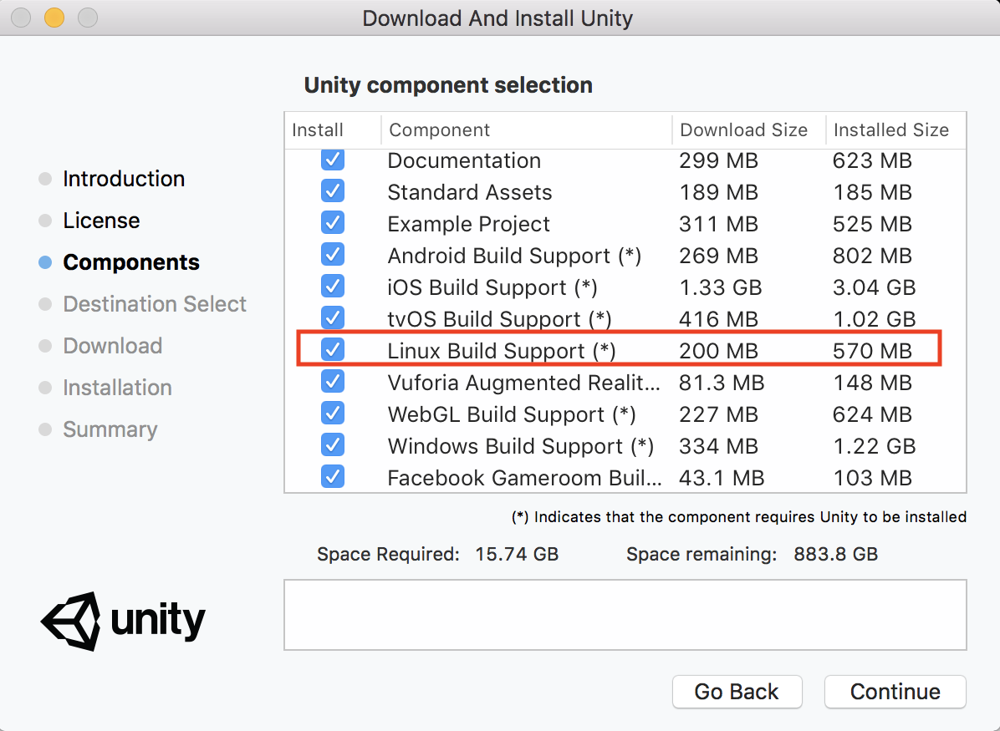

# 安装和设置

为了安装和使用 ML-Agents，您需要安装 Unity，克隆这个代码仓库，
并安装 Python 以及其他所依赖的库。下面的每个小节
都会概述每个步骤，此外还会介绍尚在测试阶段的 Docker 的配置方法。

## 安装 **Unity 2017.1** 或更高版本

[下载](https://store.unity.com/download) 并安装 Unity。如果您想
使用我们的 Docker 设置（稍后介绍），请确保在安装 Unity 时选择
_Linux Build Support_ 组件。

    

## 克隆 ml-agents 代码仓库

安装完成后，您需要克隆 ML-Agents GitHub 代码仓库。

    git clone git@github.com:Unity-Technologies/ml-agents.git

此代码仓库中的 `unity-environment` 目录包含了要添加到项目中的
Unity Assets。`python` 目录包含训练代码。
这两个目录都位于代码仓库的根目录。

## 安装 Python（以及依赖项）

为了使用 ML-Agents，您需要安装 Python 3 以及
[要求文件](../python/requirements.txt)中列出的依赖项。
一些主要的依赖项包括：
- [TensorFlow](/docs/Background-TensorFlow.md)
- [Jupyter](/docs/Background-Jupyter.md)

### Windows 用户

如果您是刚接触 Python 和 TensorFlow 的 Windows 用户，请遵循[此指南](/docs/Installation-Anaconda-Windows.md)来设置 Python 环境。

### Mac 和 Unix 用户

如果您的 Python 环境不包括 `pip3`，请参阅这些
[说明](https://packaging.python.org/guides/installing-using-linux-tools/#installing-pip-setuptools-wheel-with-linux-package-managers)
以了解其安装方法。

要安装依赖项，请进入代码仓库的 `python` 子目录，
然后从命令行中运行：

    pip3 install .

## 基于 Docker 的安装（测试阶段）

如果您想使用 Docker for ML-Agents，请按照
[该指南](/docs/Using-Docker.md)进行操作。

## Unity 包

您可以通过 Unity 包的形式下载TensorFlowSharp 插件 ([AWS S3链接](https://s3.amazonaws.com/unity-ml-agents/0.5/TFSharpPlugin.unitypackage)，[百度盘链接](https://pan.baidu.com/s/1s0mJN8lvuxTcYbs2kL2FqA))

## 帮助

如果您在安装 ML-Agents 时遇到任何问题，请
[提交问题](https://github.com/Unity-Technologies/ml-agents/issues)，并在提交时
提供有关操作系统、Python 版本和相关错误消息（如可能）的
信息。
